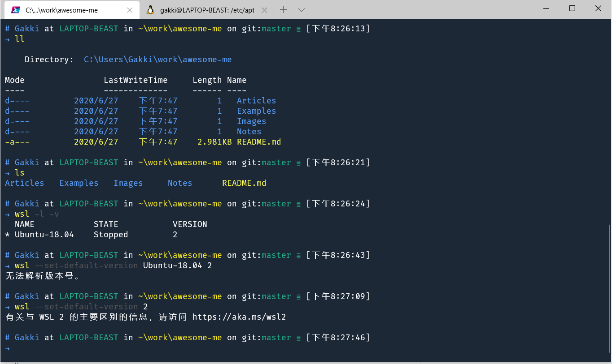
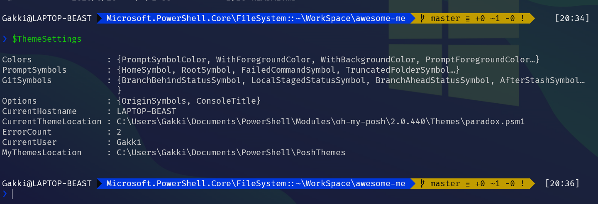
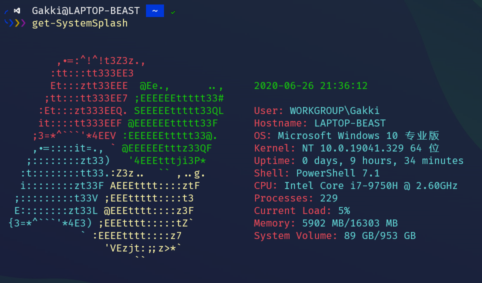
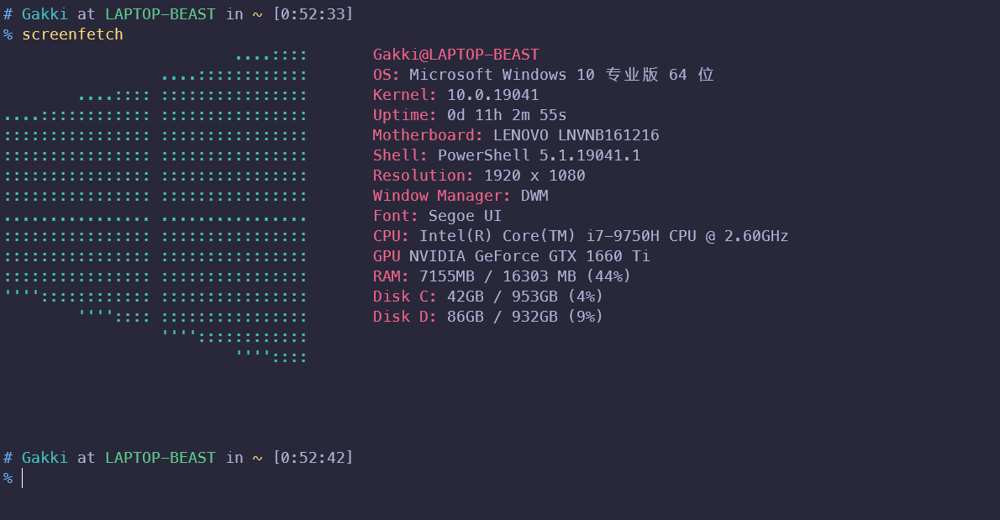

## Windows Terminal

### 添加右键菜单

Github 上面有 powershell 脚本可以用管理员身份运行该脚本 + 某些参数以实现一键配置右键菜单。

[原版 Github 仓库](https://github.com/lextm/windowsterminal-shell/)

[修改后的脚本仓库](https://github.com/LittleNewton/windows_terminal_here)

建议下载修改后的脚本仓库，然后在管理员模式的 powershell 里运行：

```sh
.\install.ps1 mini # 在你下载的脚本仓库目录下运行，类似 C:\...\windows_terminal_here>
```

### 配置 Windows Terminal

在 Windows Terminal 的下拉菜单中，选择 Settings（或使用快捷键 `Ctrl + ,`），会使用你系统默认的文本编辑器打开 Windows Terminal 的配置文件，按住 `Alt` 键，再选择 Settings，会打开 Windows Terminal 的默认配置文件。

配置文件可将 [GUID](https://www.uuidgenerator.net/)（在线生成） 用作唯一标识符。 若要将某个配置文件设置为默认配置文件（打开 Windows Terminal 默认启动），则需要 defaultProfile 全局设置的 GUID。

图标可以在 [icons8](https://icons8.com/icons/set/ubuntu)、[iconfont](https://www.iconfont.cn/) 等网站上进行搜索，96px 的尺寸适合 Windows Terminal

了解更多，请参阅[官方文档](https://docs.microsoft.com/zh-cn/windows/terminal/customize-settings/profile-settings)。

我的部分配置：

```js
{
    "guid": "{574e775e-4f2a-5b96-ac1e-a2962a402336}",
    "hidden": false,
    "name": "PowerShell",
    // 写上 -nologo，否则 powershll 会有一段话输出，很难看！
    "commandline": "C:/Program Files/PowerShell/7-preview/pwsh.exe",
    "source": "Windows.Terminal.PowershellCore",
    // 字体，默认 "Cascadia Mono"
    "fontFace": "FuraCode NF",
    // 字体大小
    "fontSize": 11,
    // 字体粗细，默认值： "normal"
    // "fontWeight": "normal",
    // 默认值： "8, 8, 8, 8"
    "padding": "5, 5, 20, 25",
    // 设置为 true，在键入时，窗口将滚动到命令输入行。设置为 false，在开始键入时，窗口不会滚动，默认值：true。
    // "snapOnInput": true,
    // 设置在窗口显示的内容上方可以回滚的行数，默认值：9001。
    // "historySize": 8888,
    // 背景颜色
    // "background": "#013456",
    // 素材路径的语法格式为 ms-appdata: ///roaming/{图片名}
    // 真实路径：C:\Users\{用户名}\AppData\Local\Packages\Microsoft.WindowsTerminal_8wekyb3d8bbwe\RoamingState\dark.png
    // "backgroundImage": "ms-appdata:///roaming/dark.png",
    // 设置背景图片伸缩模式为「按比例放大」
    // "backgroundImageStretchMode": "uniformToFill",
    // 设置背景图片透明度为 0.6
    // "backgroundImageOpacity": 0.6,
    // 背景会添加 Windows Fluent 设计风格的亚克力着色
    // 在系统个性化 => 颜色 => 透明效果，关了的情况下不生效。
    // 光标颜色，如果设置了 colorScheme，将替代配色方案中设置的 cursorColor
    // "cursorColor": "#013456"
    // "useAcrylic": true,
    // 定义了亚克力效果的透明度
    // "acrylicOpacity": 0.8,
    // 配色方案
    "colorScheme": "Galaxy"
},
 {
    "guid": "{3526449b-4a2c-4d8d-8b01-1a3476d1e9aa}",
    "name": "TencentCloud (remote)",
    "commandline": "powershell.exe ssh cvm",
    "hidden": false,
    // 选项卡和下拉菜单中显示的图标
    "icon": "ms-appdata:///roaming/ubuntu.png",
    // "background": "#013456",
    "acrylicOpacity": 0.8,
    "fontFace": "JetBrains Mono",
    "fontSize": 11,
    "colorScheme": "Atom"
}
```

> 关于配色方案

Github 上这个仓库 [atomcorp/themes](https://github.com/atomcorp/themes) 提供了解决方案

1. 在 https://atomcorp.github.io/themes/ 预览并复制喜欢的主题（Get theme 按钮）
2. 打开 Windows Terminal settings 复制到 "schemes" 下，然后配置即可。

我的配色方案

```json
"schemes":[
    {
        "name": "Galaxy",
        "black": "#000000",
        "red": "#f9555f",
        "green": "#21b089",
        "yellow": "#fef02a",
        "blue": "#589df6",
        "purple": "#944d95",
        "cyan": "#1f9ee7",
        "white": "#bbbbbb",
        "brightBlack": "#555555",
        "brightRed": "#fa8c8f",
        "brightGreen": "#35bb9a",
        "brightYellow": "#ffff55",
        "brightBlue": "#589df6",
        "brightPurple": "#e75699",
        "brightCyan": "#3979bc",
        "brightWhite": "#ffffff",
        "background": "#1d2837",
        "foreground": "#ffffff"
    }
]
```

我的终端：



## Powershell

### 安装 Powershell Core

开源，还是开源。在 https://github.com/PowerShell/PowerShell/releases 这个 GitHub 链接里，有目前 Powershell 的最新版，从 release 里选个最新的 preview 版本安装。经过测试，这些预览版都相当稳定。

> TIPS：在我的电脑上，preview4 版本中出现如下情况 "--version" 会被显示成 " -version"
>
> 在 vscode 测试，没有问题，奇怪，不懂，猜测是 Windows 字符编码问题 😳，头疼！！！
>
> 😭😭😭 oh shit，没想到是字体的锅！！！我真是傻逼 🤯🤯🤯


### 安装 Powershell 插件

#### 准备工作

首先需要注意的是，oh-my-posh 主题使用了一些非 Powerline 字体不支持的字符，因此如果你使用默认的等宽字体（比如 Consolas），在显示过程中就会出现乱码、字符显示不全的现象。

Powerline 字体在 GitHub 开源，我们可以在这里：[powerline/fonts](https://github.com/powerline/fonts) 下载支持相关字符的字体。

#### 安装 Powershell 模块

输入命令：

```sh
# 1. 安装 PSReadline 包，该插件可以让命令行很好用，类似 zsh
Install-Module -Name PSReadLine -AllowPrerelease -Force -Verbose

# 2. 安装 posh-git 包，让你的 git 更好用
Install-Module posh-git -Scope CurrentUser -Verbose

# 3. 安装 oh-my-posh 包，让你的命令行更酷炫、优雅
Install-Module oh-my-posh -Scope CurrentUser -Verbose
```

后面两个包的来源不受系统信任，不用管它，如果让你选择是否信任，直接输入 Y 即可。

在 powershell 中输入：

```sh
code $Profile # 生成的 PowerShell 的用户配置文件在 C:\Users\<用户名>\Documents\WindowsPowerShell\Microsoft.PowerShell_profile.ps1 中
```

这个 Profile 配置文件与 .zshrc / .bashrc 文件一样，都是控制启动前参数的，接下来定制的过程，就修改这个文件来配置即可。

输入下面这一长串代码：

```sh
#------------------------------- Import Modules BEGIN -------------------------------

# 引入 posh-git
Import-Module posh-git

# 引入 oh-my-posh
Import-Module oh-my-posh

# 设置 PowerShell 主题
Set-Theme Paradox

#------------------------------- Import Modules END -------------------------------
```

保存并关闭重启，完美。

#### 定制自己的主题

命令行输入：

```sh
$ThemeSettings # take a look at your oh-my-posh's profile
```



从 `CurrentThemeLocation` 可以看出主题的目录位置，在该目录下新建一个 xxxx.psm1，之后按照其他主题的写法进行修改就可以了，具体写法查看 [oh-my-posh](https://github.com/JanDeDobbeleer/oh-my-posh#themes) 这个库。使用 `Set-Theme xxxx` 这个命令来让你的自定义主题生效。

Github 上比较好看的一个自定义主题：[spencerwooo/dotfiles](https://github.com/spencerwooo/dotfiles)，自定义主题中涉及到一些 Powerline 字体不支持的字符，需要在这里 [ryanoasis/nerd-fonts](https://github.com/ryanoasis/nerd-fonts) 下载 Nerd Fonts 来正常使用。

输入命令 `theme` 可查看所有主题。

#### 美化 ls 输出

命令行输入：

```sh
Install-Module -AllowClobber Get-ChildItemColor
```

编辑 \$profile：

```sh
#------------------------------- Import Modules BEGIN -------------------------------

# 美化 ls 输出
Import-Module Get-ChildItemColor

#------------------------------- Import Modules END ---------------------------------

#-------------------------------   Set Alias BEGIN    -------------------------------

If (-Not (Test-Path Variable:PSise)) {
    # Only run this in the console and not in the ISE

    Import-Module Get-ChildItemColor

    Set-Alias ll Get-ChildItem -option AllScope
    Set-Alias ls Get-ChildItemColorFormatWide -option AllScope
}

#-------------------------------   Set Alias END    ---------------------------------
```

#### Screenfetch

Linux 装机以后必晒图之一就是 screenfetch 了，想不到在 Windows 下也有这种东西。

因为 [windows-screenfetch](https://github.com/JulianChow94/Windows-screenFetch) 这个模块在 powershell core 有 bug （有命名冲突 ：Get-Uptime），所以从 github 搜到了其他的类似模块 [SystemSplash](https://github.com/mmillar-bolis/SystemSplash)

输入命令：

```sh
Install-Module -Name SystemSplash -Repository PSGallery -Scope CurrentUser
```




配置别名

```sh
function screenSystem {Get-SystemSplash -graph}
Set-Alias sf Get-SystemSplash
Set-Alias sfg screenSystem
```

windows powershell（系统自带 5.1）执行以下命令安装 screenfetch（此版本无 bug）：

```sh
Install-Module windows-screenfetch -Scope CurrentUser # 经测试当前版本在 powershell core 下有 bug
```

安装好以后直接输入 `Screenfetch` 就可以看到效果了，十分炫酷。



## 参考

- [Windows Terminal 微软官方文档](https://docs.microsoft.com/zh-cn/windows/terminal/)
- [Windows Terminal 完美配置 PowerShell 7.1](https://zhuanlan.zhihu.com/p/137595941)
- [新生代 Windows 终端：Windows Terminal 的全面自定义](https://sspai.com/post/59380)
- [5 个 PowerShell 主题，让你的 Windows 终端更好看](https://sspai.com/post/52907)
- [好看是第一生产力](https://github.com/spencerwooo/dotfiles)
