# 打造完美的、纯净的 Windows 开发环境

## 目录

- [重装系统](#重装系统)
- [代理](#代理)
- [开发环境](#开发环境)

## 重装系统

### 制作 U 盘启动盘

准备大于等于 8G 的空白 U 盘，去 [微软官方](https://www.microsoft.com/zh-cn/software-download/windows10) 下载制作工具，
点击 exe 文件，根据提示无脑下一步即可。

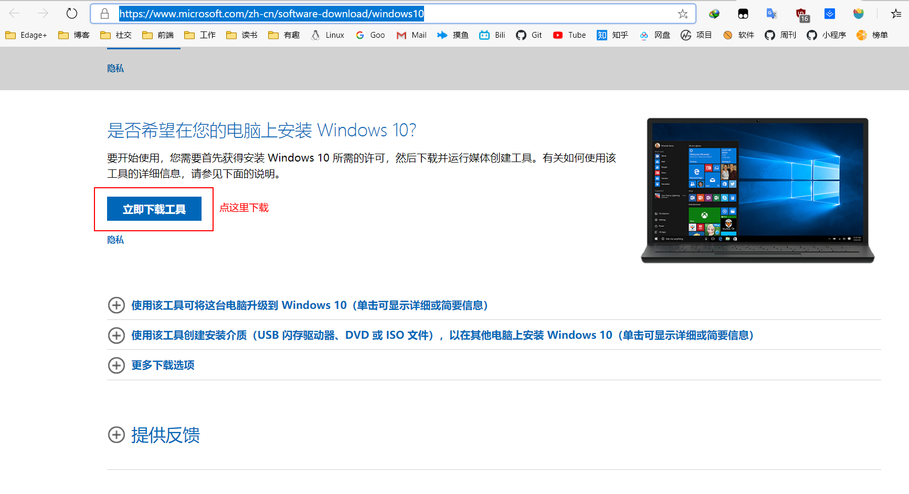

制作工具 **MediaCreationTool<版本号>**

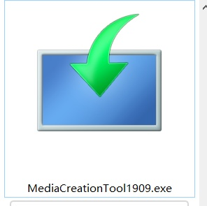

### 通过 U 盘启动电脑

1. 电脑不能启动： 插入制作好的 win10 安装 U 盘，开机狂按 F12 修改 BIOS 为 U 盘启动即可（不同品牌启动项快捷键不同，此处为联想笔记本）。

2. 电脑能启动：插入制作好的 win10 安装 U 盘，win + i 打开 windows 设置 ---> 更新和安全 ---> 恢复 ---> 高级启动 ---> 高级选项 ---> 点击 UEFI 固件设置即可。

   

3. 不出意外，win10 就会进入一个安装界面，无脑下一步。

   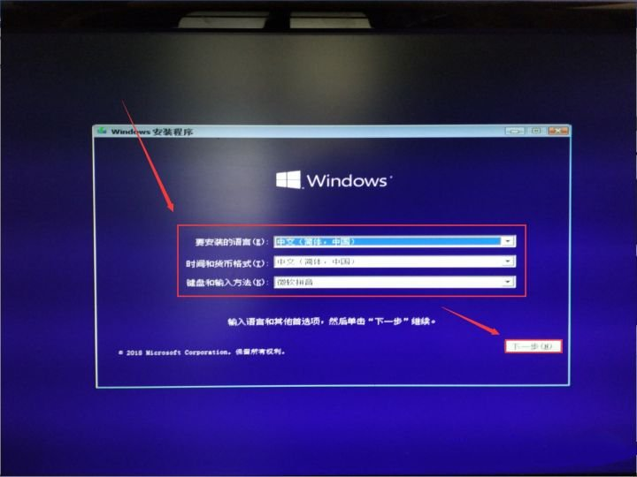

4. 为了安装一个纯净的系统，此处选择 **自定义：“仅安装 window”**

   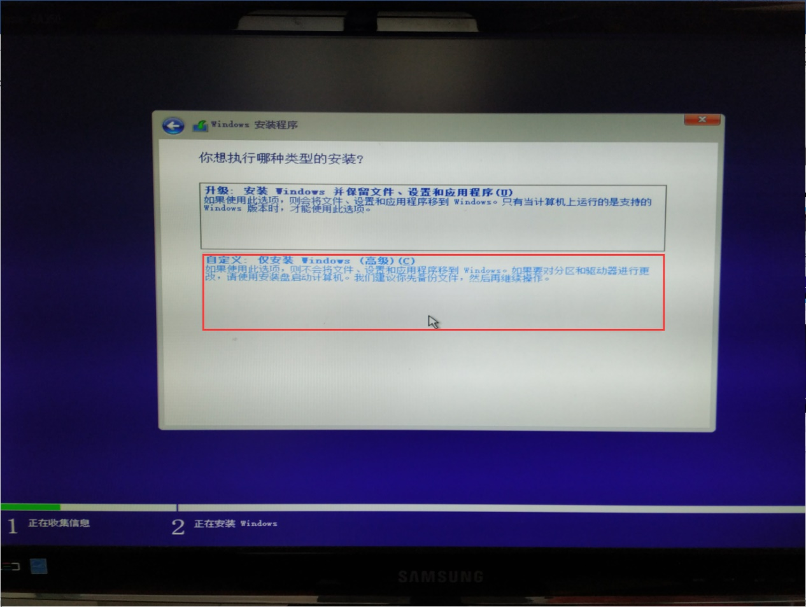

5. 删除系统盘（系统分区所在的驱动器）的所有分区，如图所示为：驱动器 0 ，此时驱动器 0 为一整块未分配分区，开始新建硬盘分区，系统会自动重新分区。

   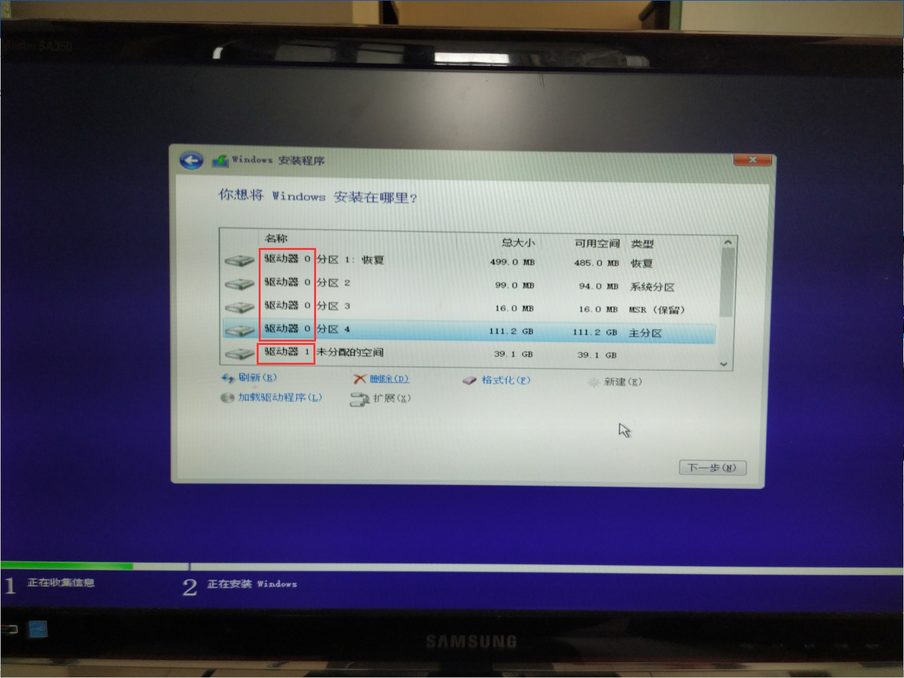

6. 看到这个界面，接下来就没有困难了，无脑下一步，即可完成重装。

   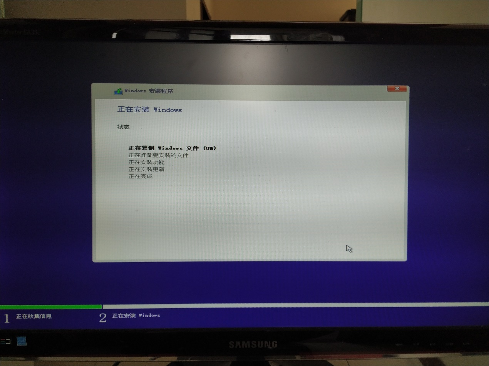

### 驱动安装

微软商店下载 [lenovo vantage](https://www.microsoft.com/zh-cn/p/lenovo-vantage/9wzdncrfj4mv) 安装即可。

## 代理

机场：[苏媚云](http://smyun-a.xyz)

订阅：[订阅转换](https://acl4ssr.netlify.app/)

工具：[clash_for_windows_pkg](https://github.com/Fndroid/clash_for_windows_pkg/releases)

### windows 终端

- `[CMD]` 中用 `set http_proxy` 设置

- `[Git Bash]` 中用 `export http_proxy` 设置

- `[PowerShell]` 中用 `$Env:http_proxy` 设置

- `curl google.com` 验证，如果返回如下，代理设置成功。

  ```html
  <HTML><HEAD><meta http-equiv="content-type" content="text/html;charset=utf-8">
  <TITLE>301 Moved</TITLE></HEAD><BODY>
  <H1>301 Moved</H1>
  The document has moved
  <A HREF="http://www.google.com/">here</A>.
  </BODY></HTML
  ```

- 检测 IP ：

  ```sh
  # 国外
  curl ipinfo.io

  # 国内
  curl cip.cc
  ```

- PowerShell 可以通过配置 \$profile 初始化启动代理

  ```sh
  #-----------  Set Proxy BEGIN  ---------------------

  # 配置 http 代理
  $Env:http_proxy="http://127.0.0.1:7890"

  # 配置 https 代理
  $Env:https_proxy="http://127.0.0.1:7890"

  # 配置 socks5 代理
  # $Env:all_proxy="socks5://127.0.0.1:7891"

  #------------ Set Proxy END ------------------------
  ```

### wsl

1. powershell 输入 `ipconfig` 或 在 clash 客户端均可获取到主机 IP

   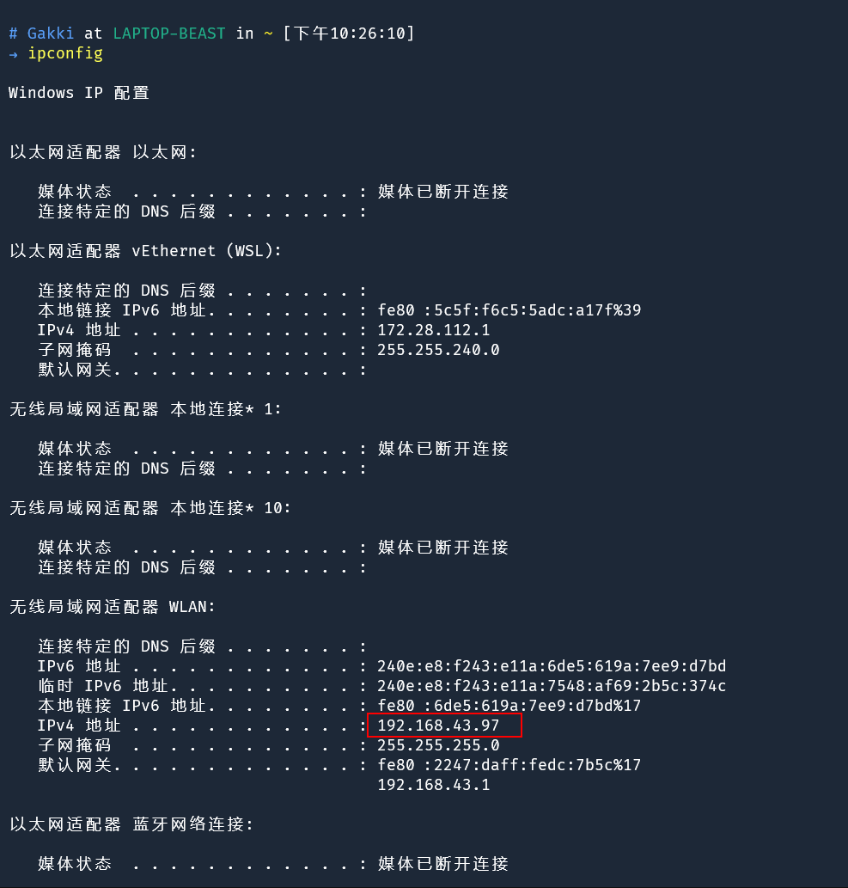

2. clash 客户端勾选上 Allow LAN

   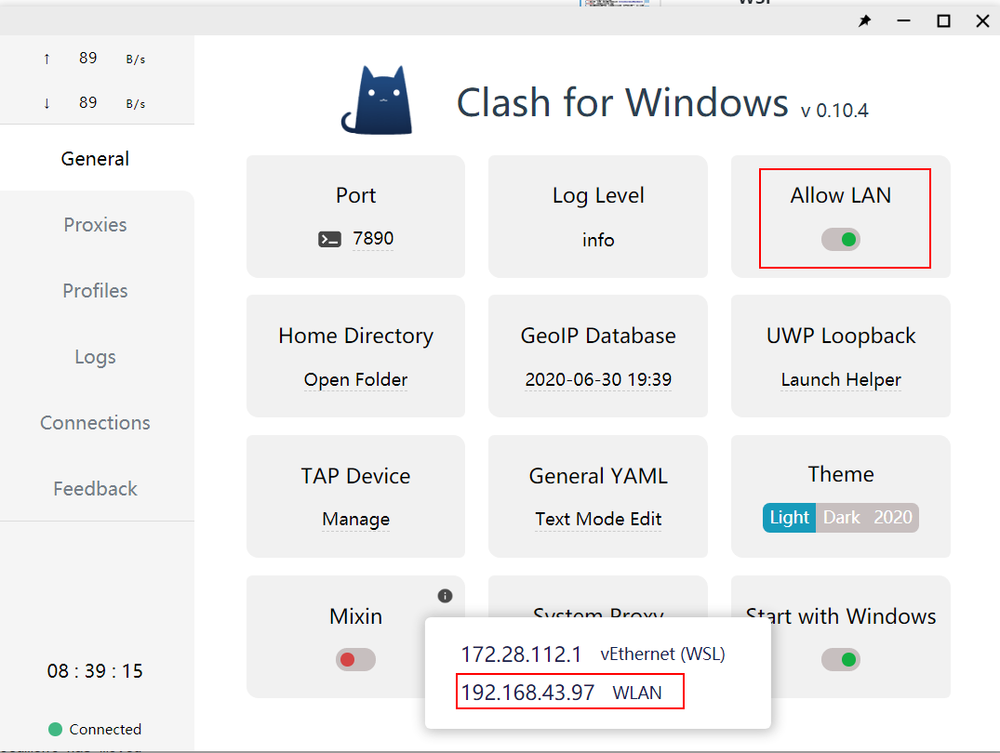

3. 通过 alias（别名）加入 ~/.zshrc 中，方便快速输入。在 ~/.zshrc 中添加如下内容：

   ```sh
   # 墙外
   alias gfw='export http_proxy="http://192.168.43.97:7890";export https_proxy="http://192.168.43.97:7890";'
   # 墙内
   alias ungfw="unset http_proxy https_proxy"
   # 测试 IP
   alias myip="curl ipinfo.io"
   ```

   然后执行 source ~/.zshrc 加载配置文件。

## 开发环境

### lua

#### windows

1. [下载安装](http://joedf.ahkscript.org/LuaBuilds/)
2. 配置环境变量

   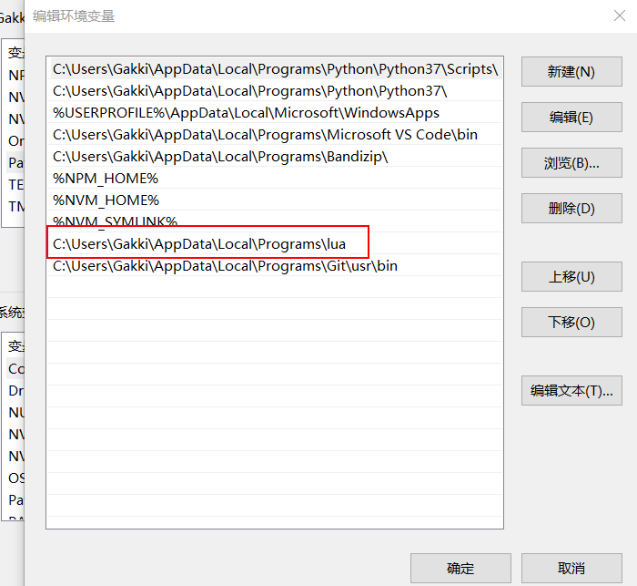

   把存放 Lua 文件夹的路径写入如下位置即可。

3. powershell 输入 `lua` 输出如下即成功。

   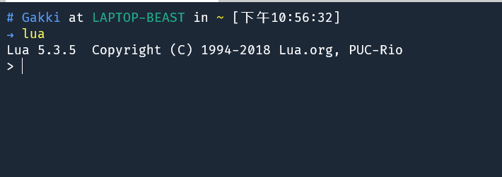

### wsl

在 Ubuntu 系统上使用以下命令编译安装 Lua：

安装依赖库：

```sh
sudo apt install build-essential # 安装 gcc 和 make
sudo apt install libreadline-dev
```

然后依次执行：

```sh
curl -R -O http://www.lua.org/ftp/lua-5.3.5.tar.gz
tar zxf lua-5.3.5.tar.gz
cd lua-5.3.5
sudo make linux test
sudo make linux install
```

### powershell

#### [z.lua](https://github.com/skywind3000/z.lua)

快速路径切换工具（类似 [z.sh](https://github.com/rupa/z) / autojump / fasd），兼容 Windows 和所有 Posix Shell 以及 Fish Shell，同时包含了众多改进。

前面安装 lua 环境就是为了这个工具。

首先下载该项目

```sh
git clone https://github.com/skywind3000/z.lua.git
```

然后编辑 `$profile`，安装了 vscode 使用 `code $profile` 打开文件添加语句如下。

```sh
# 添加快速路径切换工具
# 这里的 C:/Users/Gakki/z.lua/z.lua 就是刚才下载的项目路径
iex ($(lua C:/Users/Gakki/z.lua/z.lua --init powershell) -join "`n")
```

[Examples](https://github.com/skywind3000/z.lua/blob/master/README.cn.md)

```sh
z foo       # 跳转到包含 foo 并且权重（Frecent）最高的路径
z foo bar   # 跳转到同时包含 foo 和 bar 并且权重最高的路径
z -r foo    # 跳转到包含 foo 并且访问次数最高的路径
z -t foo    # 跳转到包含 foo 并且最近访问过的路径
z -l foo    # 不跳转，只是列出所有匹配 foo 的路径
z -c foo    # 跳转到包含 foo 并且是当前路径的子路径的权重最高的路径
z -e foo    # 不跳转，只是打印出匹配 foo 并且权重最高的路径
z -i foo    # 进入交互式选择模式，让你自己挑选去哪里（多个结果的话）
z -I foo    # 进入交互式选择模式，但是使用 fzf 来选择
z -b foo    # 跳转到父目录中名称以 foo 开头的那一级
```

#### [PSReadLine](https://github.com/PowerShell/PSReadLine)

设置类似于 Bash 的菜单选择功能

在 \$profile 文件增加一行

```sh
Set-PSReadlineKeyHandler -Key Tab -Function MenuComplete
```

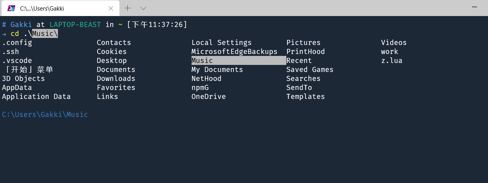

设置类似于 `zsh-autosuggestions` 基于输入历史的自动命令提示

在 \$profile 文件增加

```sh
Set-PSReadLineOption -HistorySearchCursorMovesToEnd
Set-PSReadLineKeyHandler -Key UpArrow -Function HistorySearchBackward
Set-PSReadLineKeyHandler -Key DownArrow -Function HistorySearchForward
```

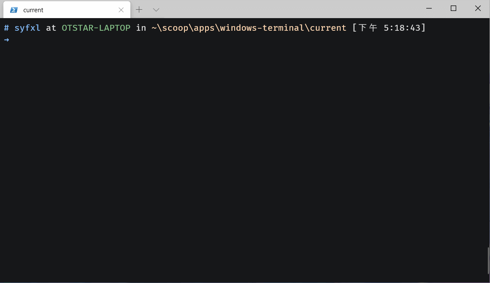

更完整的配置可参照[官方样例](https://github.com/PowerShell/PSReadLine/blob/master/PSReadLine/SamplePSReadLineProfile.ps1)

#### Git Bash 工具包

因为 Git 的 usr\bin 下所有 GNU 工具都是 exe 可执行文件，所以 Powershell 完全可以直接运行这些工具。要在 Powershell 下使用这个工具，只需要将 Git 的 usr\bin 目录添加到 PATH 中即可。

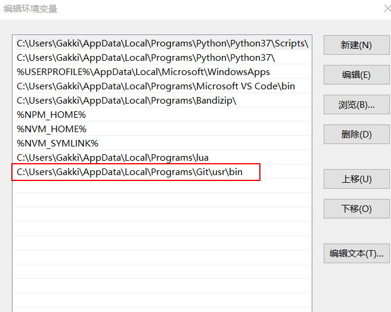

Powershell 自带的命令别名会把 GNU 的同名工具命令覆盖。

利用 Get-Alias 命令就可以查看 Powershell 中设置的·命令别名，这样我们就可以很方便的找出冲突的命令，并取消对应的命令别名。

找出冲突的别名后就可以用 Remove-Item alias:\<command> 删除命令别名了，比如我删除了以下的命令别名：

```sh
Remove-Item alias:\rm
Remove-Item alias:\cp
```

### zsh

#### 安装、配置

查看当前发行版可以使用的 shell

```sh
cat /etc/shells
```

查看当前 shell

```sh
echo $SHELL
```

切换 shell

```sh
chsh -s /bin/bash
```

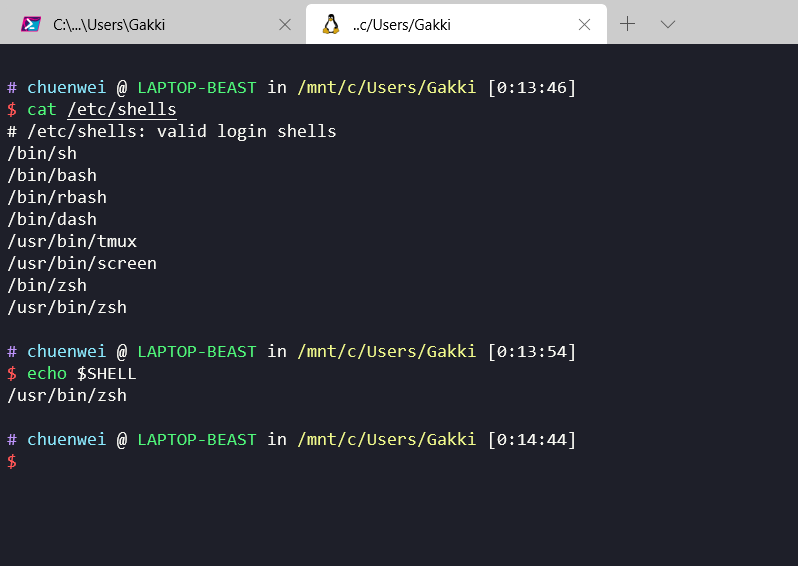

安装 zsh

```sh
sudo apt install zsh
```

下载安装 oh-my-zsh

运行命令下载安装

```sh
sh -c "$(curl -fsSL https://raw.github.com/ohmyzsh/ohmyzsh/master/tools/install.sh)"
```

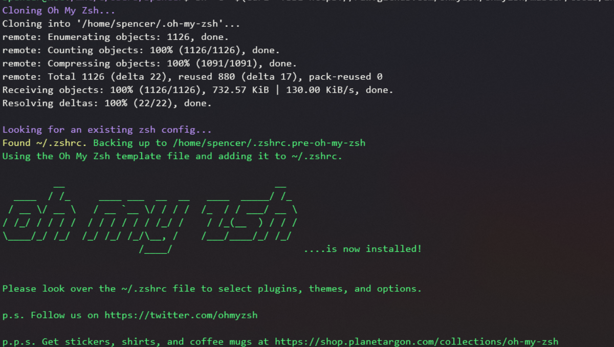

#### 插件、主题

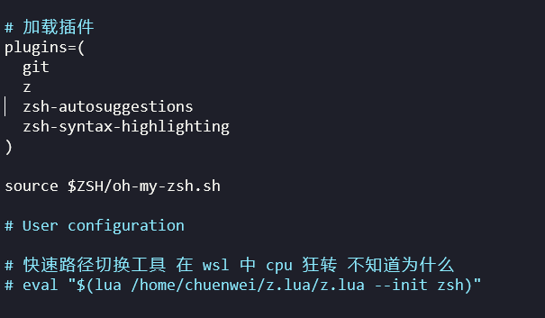

- [zsh-autosuggestions](https://github.com/zsh-users/zsh-autosuggestions)：为 zsh 提供基于输入历史的自动命令提示

  ```sh
  git clone https://github.com/zsh-users/zsh-autosuggestions ${ZSH_CUSTOM:-~/.oh-my-zsh/custom}/plugins/zsh-autosuggestions
  ```

- [zsh-syntax-highlighting](https://github.com/zsh-users/zsh-syntax-highlighting)：为 zsh 命令提供色彩高亮

  ```sh
  git clone https://github.com/zsh-users/zsh-syntax-highlighting.git ${ZSH_CUSTOM:-~/.oh-my-zsh/custom}/plugins/zsh-syntax-highlighting
  ```

- [z](https://github.com/rupa/z)：快速跳转不同的目录、路径、文件夹，oh-my-zsh 内置。

- [z.lua](https://github.com/skywind3000/z.lua)：快速路径切换工具，在我的 wsl 2 中 cpu 会狂转，遂放弃，纯净的 linux 系统可以一试。

- [powerlevel10k](https://github.com/romkatv/powerlevel10k#oh-my-zsh)：A fast reimplementation of Powerlevel9k ZSH theme，花里胡哨的现在也不喜欢了。

#### 解决 ls 命令背景色问题

[DrvFs 文件权限问题](https://printempw.github.io/wsl-guide/#6-6-DrvFs-%E6%96%87%E4%BB%B6%E6%9D%83%E9%99%90%E9%97%AE%E9%A2%98)。

不对文件系统的权限进行修改

可以在 .zshrc 最尾部添加如下代码

```sh
# Change ls colours
LS_COLORS="ow=01;36;40" && export LS_COLORS

# make cd use the ls colours
zstyle ':completion:*' list-colors "${(@s.:.)LS_COLORS}"
autoload -Uz compinit
compinit
```

加载设置：source ~/.zshrc

现在觉得没啥必要。

## 参考

- https://www.zhihu.com/question/54059979/answer/618694754
- https://dowww.spencerwoo.com/dev/1-preparations/1-0-intro.html
- https://blog.ixk.me/say-goodbye-to-the-ugly-and-hard-to-use-windows-terminal-and-build-a-good-powershell.html
