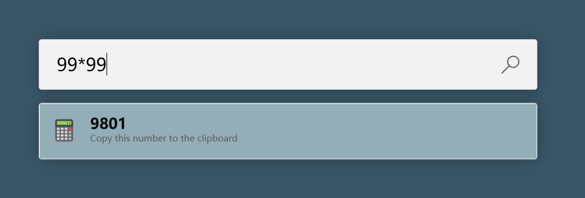
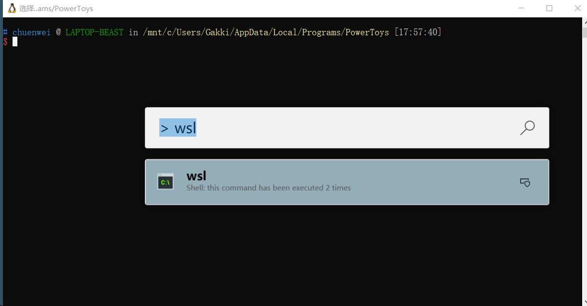
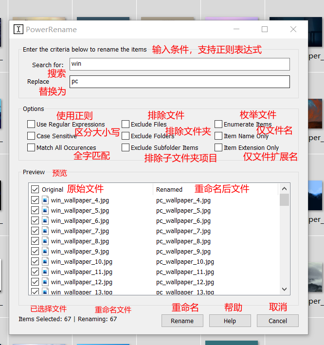
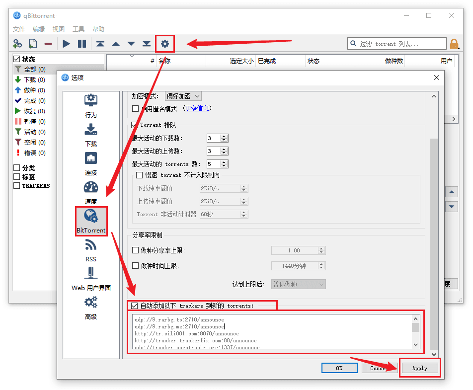

# 我的 Windows 工具清单

## 日常

### [WOX](https://github.com/Wox-launcher/Wox)：快速启动

### [PowerToys](https://github.com/microsoft/PowerToys/releases)：系统增强工具

#### 功能简介

##### PowerToys Run：快速启动

快速启动器，类似于第三方应用中的 [WOX](http://www.wox.one/) ，能够快速定位软件、文件或是文件夹并迅速打开。

> 操作技巧

`Alt + Space` 的操作唤出 PowerToys Run 的面板

被选中（深色标出）的选项右侧会出现数个选项，对不同类型的选项有不同的操作。

- 应用程序可以选择以管理员方式打开，快捷键 `Ctrl + Shift + Enter`
- 文件或文件夹则可以复制所在的路径，快捷键 `Ctrl + C`
- 文件还可以选择打开文件所在位置，快捷键 `Ctrl + Shift + E`

通过直接输入公式来通过 Windows 自带的计算器进行计算操作。经过测试，可以使用如 abs，sqrt 等等。



另外还能够通过 `>` 来执行一些命令。



##### Image Resizer：图片尺寸调整

在 PowerToys 打开 Enable Image Resizer 之后，在文件资源管理器中右键单击一个或选定多个图像文件，然后从右键菜单中选择「重设图片大小」。


- 关于尺寸，用户可以添加新的预设大小。可以配置为填充，适合或拉伸。用于调整大小的单位也可以设置为厘米、英寸、百分比和像素。
- 关于编码，用户可以更改回滚编码器(当不能保存为原始格式时使用的编码器)并修改 PNG、JPEG 和 TIFF 的设置。
- 关于文件，用户可以修改调整大小后的图像文件名的格式，也可以选择保留原来最后修改日期的调整后的图像。

##### PowerRename：文件重命名



下面对该界面的选项或设置做详细介绍。

|          选项           |                                                                       介绍                                                                       |
| :---------------------: | :----------------------------------------------------------------------------------------------------------------------------------------------: |
|       Search for        |                                                       要在文件名称中匹配的文本或正则表达式                                                       |
|      Replace with       |                                                   要替换与搜索文本匹配的文件名称中的实例的文本                                                   |
| Use Regular Expressions |         勾选此项，搜索字段将被解释为正则表达式，「替换为」 字段还可以包含正则表达式变量，如果没有选中，搜索字段将被用作替换字段中的文本          |
|     Case Sensitive      |                                                             默认情况下，不区分大小写                                                             |
|  Match All Occurrences  | 勾选此项，搜索字段中所有匹配的文本将被更改为「替换为」字段的文本。否则，将只替换项目中搜索文本的第一个实例（从左到右），例如： win_win -> pc_win |
|      Exclude Files      |                                                         文件将不被包括在本次重命名操作中                                                         |
|     Exclude Folders     |                                                          文件夹将不被包括在重命名操作中                                                          |
| Exclude Subfolder Items |                                    文件夹中的项将不包括在重命名操作中，默认情况下，所有子文件夹项也将被重命名                                    |
|     Enumerate Items     |                                       在操作中修改的文件名后追加一个数字后缀。例如：foo.jpg -> foo (1).jpg                                       |
|     Item Name Only      |                                    该操作只修改文件名部分（而不修改文件扩展名）。例如：txt.txt -> NewName.txt                                    |
|   Item Extension Only   |                                  该操作只修改文件扩展名部分（而不是文件名）。例如：txt.txt -> txt.NewExtension                                   |

##### Shortcut Guide：系统快捷键指南

按住键盘上的 Windows 键大约 1 秒钟（默认设置为 900 毫秒），会出现一个显示和 Windows 快捷键相关的叠加层展示使用 Windows 键的常见键盘快捷键。

#### Keyboard Manager：键盘映射

这是一款非常简单却又非常实用的小工具，能够将一个按键映射为另一个按键，或者将一组快捷键映射为另一组。我没具体使用过，不清楚。

### [Clash for Windows](https://github.com/Fndroid/clash_for_windows_pkg/releases)：科学上网

### Edge & Chrome：浏览器

#### 插件（可通用）

**uBlock Origin**：一款高效的网络请求过滤工具，占用极低的内存和 CPU。日常上网必须，屏蔽各种广告。

**Google 翻译**：浏览网页时可轻松查看翻译版本。由 Google 翻译小组提供，我一般用来翻译整个页面，平时会在扩展选项里把 **不显示图标和弹出式翻译** 勾选上，不用于划词翻译，因为有更好的。

**沙拉查词-聚合词典划词翻译**：Saladict 沙拉查词是一款专业划词翻译扩展，为交叉阅读而生。大量权威词典涵盖中英日韩法德西语，支持复杂的划词操作、网页翻译、生词本与 PDF 浏览。
我一般用来翻译页面上的单词或长句。

**IDM Integration Module**：IDM 浏览器集成插件，将浏览器下载链接使用 IDM 多线程下载

**图片助手(ImageAssistant) 批量图片下载器**：一款用于嗅探、分析网页图片并提供批量下载等功能及在线收藏、检索、分享服务的浏览器扩展程序。偶尔用一下吧

**掘金**：为程序员、设计师、产品经理每日发现优质内容。

**FeHelper(前端助手)**：JSON 自动格式化、手动格式化，支持排序、解码、下载等，更多功能可在配置页按需安装！

**Tampermonkey**：油猴脚本，使用自定义网站脚本的插件，可以使用各种 user.js 脚本，相当于小型的插件管理器，下面是我常用的脚本，其他用途的脚本请自行探索 [Greasy Fork](https://greasyfork.org/zh-CN)、[Sleazy Fork](https://sleazyfork.org/zh-CN)、[OpenUserJS](https://openuserjs.org/)

- [Userscript+](https://greasyfork.org/zh-CN/scripts/24508-userscript-show-site-all-userjs)：显示当前网站所有可用的 UserJS 脚本
- [My Novel Reader](https://greasyfork.org/zh-CN/scripts/292-my-novel-reader)：小说阅读脚本，统一阅读样式，内容去广告、修正拼音字、段落整理，自动下一页小说阅读脚本
- [Bilibili Evolved](https://github.com/the1812/Bilibili-Evolved)：强大的哔哩哔哩增强脚本：下载视频, 音乐, 封面, 弹幕 / 简化直播间, 评论区, 首页 / 自定义顶栏, 删除广告, 夜间模式 / 触屏设备支持
- [豆瓣资源下载大师](https://greasyfork.org/zh-CN/scripts/329484-%E8%B1%86%E7%93%A3%E8%B5%84%E6%BA%90%E4%B8%8B%E8%BD%BD%E5%A4%A7%E5%B8%88-1%E7%A7%92%E6%90%9E%E5%AE%9A%E8%B1%86%E7%93%A3%E7%94%B5%E5%BD%B1-%E9%9F%B3%E4%B9%90-%E5%9B%BE%E4%B9%A6%E4%B8%8B%E8%BD%BD/feedback)：1 秒搞定豆瓣电影 | 音乐 | 图书下载
- [网盘助手](https://greasyfork.org/zh-CN/scripts/378301-%E7%BD%91%E7%9B%98%E5%8A%A9%E6%89%8B)：插件主要功能有：[1] 百度网盘、腾讯微云、蓝奏云、天翼云盘万能钥匙 [2] 百度网盘生成并展示下载链接 [3] 百度网盘分享时自定义提取码

### Bandizip：压缩/解压缩

### Everything：文件快速搜索

### Snipaste & ShareX：截图/贴图

### ScreenToGif：录制 GIF 动态图

### QuickLook：文件管理器预览增强

### PotPlayer：视频播放器

#### 常用快捷键

> 可以在 选项 -> 基本 -> 快捷键 中调整

|                 功能                  |            快捷键            |
| :-----------------------------------: | :--------------------------: |
|               播放/暂停               |             空格             |
|                 音量                  |   鼠标滚轮，上 / 下方向键    |
|              前进 / 后退              |        左 / 右方向键         |
|              全屏 / 还原              |            Enter             |
|                 倍速                  | C - 加速，X - 减速，Z - 复位 |
|              上 / 下一帧              |            D / F             |
| 截图并保存，存储位置可在 选项 -> 存档 |        设置 Ctrl + E         |
|            视频、GIF 录制             |           Alt + C            |

- 26 个直播平台的直播源：[real-url](https://github.com/wbt5/real-url)
- 直播源相关资源汇总：[Tvlist-awesome-m3u-m3u8](https://github.com/billy21/Tvlist-awesome-m3u-m3u8)

### qBittorrent：BT 下载

勾选下图红框内的选项 并复制所有 Tracker 后粘贴到下方输入框中，然后点击 [Apply] 保存。(如下图所示)



全网热门 [BitTorrent Tracker](https://github.com/XIU2/TrackersListCollection) 列表！

- 精选列表：https://trackerslist.com/best.txt

- 完整列表：https://trackerslist.com/all.txt

### Dism++：Windows 的一个集中式的系统管理工具

官网：[Dism++ | 全新的 Windows 实用工具](https://www.chuyu.me/zh-Hans/Document.html)

### LockHunter：解除文件占用

### Geek Uninstaller：软件卸载

### QQ：国内不得不用的流氓 IM

### 微信：同上

### 百度网盘：国内事实上的垄断网盘

### Acrobat DC：Adobe 家的 PDF 解决方案

### Typora：Markdown 软件，界面简洁

### Telegram：国外跨平台的即时通信软件

### GoogleDrive：文件自动同步、共享、备份

### 网易云 & Listen1：在线音乐

### Mcool：本地无损音乐

### Rufus：USB 启动盘制作工具

### Wise Registry Cleaner：注册表清理

### Lenovo Vantage：硬件设置、硬件检测、联想官方驱动和固件更新

## 开发

### VS Code

#### 插件

- [Settings Sync](https://marketplace.visualstudio.com/items?itemName=Shan.code-settings-sync)：VS Code 多设备设置同步
- Todo Tree
- ES7 React/Redux/GraphQL/React-Native snippets
- EsLint
- Prettier - Code formatter
- Code Runner
- [any-rule](https://github.com/any86/any-rule)：正则大全
- Markdown All in one
- Markdown Checkboxes
- Markdown Emoji
- Markdown Preview Github Styling
- Rainbow Fart
- :emojisense:
- Code Spell Checker
- EditorConfig for VS Code
- Remote - WSL

#### 设置

```js
{
	// "window.menuBarVisibility": "toggle",
	"workbench.colorTheme": "Default Light+",
	"editor.fontFamily": "FuraCode NF, Sarasa Term SC Regular, JetBrains Mono, Cascadia Code, Consolas, Courier New, monospace",
	"editor.fontLigatures": true,
	"editor.lineHeight": 22,
	"editor.fontSize": 13,
	"editor.letterSpacing": 0,
	"editor.tabSize": 2,
	"explorer.confirmDelete": false,
	"explorer.confirmDragAndDrop": false,
	"editor.cursorSmoothCaretAnimation": false,
	"editor.formatOnPaste": true,
	"editor.formatOnSave": true,
	"editor.minimap.renderCharacters": false,
	"editor.quickSuggestions": {
		"strings": true,
		"comments": true,
		"other": true
	},
	"editor.snippetSuggestions": "top",
	"terminal.integrated.fontSize": 13,
	"terminal.integrated.shell.windows": "C:\\Program Files\\PowerShell\\7-preview\\pwsh.exe",
	"javascript.updateImportsOnFileMove.enabled": "always",
	"typescript.updateImportsOnFileMove.enabled": "always",
	"git.autofetch": true,
	"files.exclude": {
		"**/node_modules": true
	},
	"sync.gist": "0d641c59c28fbec155a5829b96a5cabe",
	// 插件 prettier
	"prettier.jsxSingleQuote": true,
	"prettier.semi": false,
	"prettier.singleQuote": true,
	"prettier.useTabs": true,
	"[markdown]": {
		"editor.defaultFormatter": "esbenp.prettier-vscode"
	},
	"[jsonc]": {
		"editor.defaultFormatter": "esbenp.prettier-vscode"
	},
	// 插件 :emojisense:
	"emojisense.languages": {
		"markdown": true,
		"javascript": true,
		"javascriptreact": true,
		"typescript": true,
		"typescriptreact": true,
		"vue": true
	},
	// 插件 markdown all in one
	"markdown.extension.toc.plaintext": true,
	// 插件 code runner
	"code-runner.executorMap": {
		"typescript": "npx ts-node"
	},
	// 插件 colorize
	"colorize.languages": [
		"css",
		"less",
		"scss",
		"xml",
		"html",
		"svg",
		"javascript",
		"javascriptreact",
		"typescript",
		"typescriptreact",
		"vue"
	]
}
```
