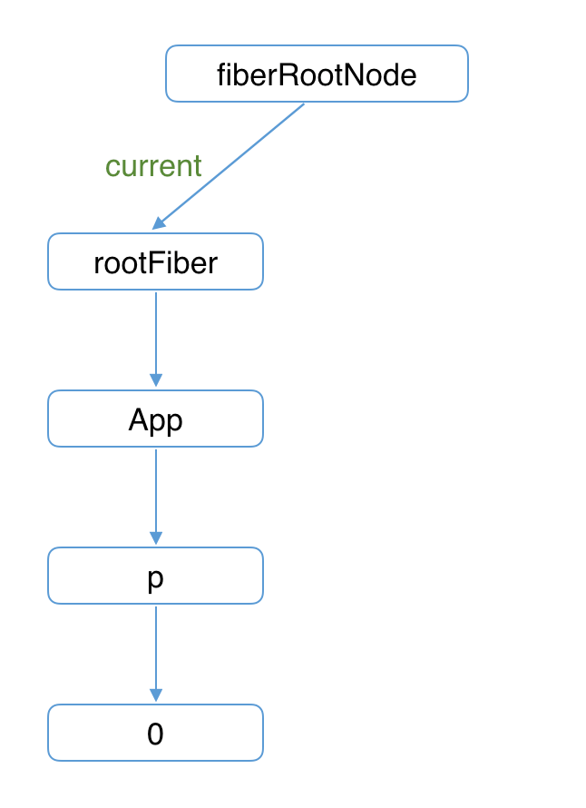
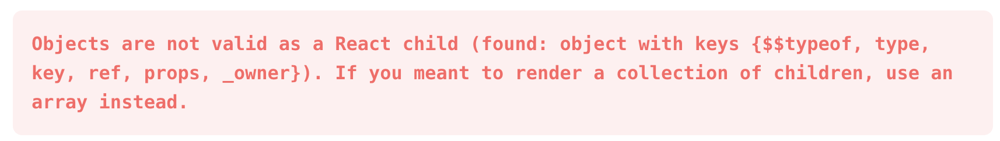

# 关于 React 的一切（一）<!-- omit in toc -->

- [vue 和 react 的区别](#vue-和-react-的区别)
- [React 更新粒度](#react-更新粒度)
- [batchedUpdates](#batchedupdates)
  - [setState 是同步还是异步的？](#setstate-是同步还是异步的)
- [双缓存 Fiber 树](#双缓存-fiber-树)
  - [mount 时](#mount-时)
    - [render](#render)
    - [commit](#commit)
  - [update 时](#update-时)
    - [render](#render-1)
    - [commit](#commit-1)
- [React 组件 render 需要满足的条件](#react-组件-render-需要满足的条件)
  - [bailout 需要满足的条件](#bailout-需要满足的条件)
  - [关于 oldProps === newProps](#关于-oldprops--newprops)
  - [bailout 优化](#bailout-优化)
  - [Demo 分析](#demo-分析)
- [context](#context)
  - [老 ContextAPI](#老-contextapi)
  - [新 Context API 的实现](#新-context-api-的实现)
- [关于 ref 的一切](#关于-ref-的一切)
  - [为什么 string 类型的 ref prop 将会被废弃？](#为什么-string-类型的-ref-prop-将会被废弃)
  - [React.createRef](#reactcreateref)
  - [useRef](#useref)
  - [function ref](#function-ref)
  - [function 类型的 ref prop 会在什么时机被调用？](#function-类型的-ref-prop-会在什么时机被调用)
  - [useImperativeHandle](#useimperativehandle)
    - [不使用 useImperativeHandle](#不使用-useimperativehandle)
    - [使用 useImperativeHandle](#使用-useimperativehandle)
- [关于 useEffect 的一切](#关于-useeffect-的一切)
- [Polyfill](#polyfill)
- [升级 Concurrent Mode 的难点（批处理）](#升级-concurrent-mode-的难点批处理)
- [错误使用 Hooks](#错误使用-hooks)
  - [peerDependencies](#peerdependencies)
  - [resolutions](#resolutions)
  - [webpack](#webpack)
  - [深入源码](#深入源码)
  - [真相大白](#真相大白)
- [PureComponent](#purecomponent)
  - [Record 和 Tuple](#record-和-tuple)
  - [更容易使用的 useMemo](#更容易使用的-usememo)
  - [更加符合心智的 useEffect](#更加符合心智的-useeffect)
  - [简单不易出错的 memo 机制](#简单不易出错的-memo-机制)
  - [更容易书写 key](#更容易书写-key)
- [memo](#memo)
- [React 合成事件](#react-合成事件)
  - [react 16](#react-16)
  - [react 17](#react-17)
- [Suspense 和 lazy](#suspense-和-lazy)
- [componentWillXXX 为什么 UNSAFE](#componentwillxxx-为什么-unsafe)
- [Fragment](#fragment)
- [Profiler](#profiler)
- [cloneElement](#cloneelement)
- [isValidElement](#isvalidelement)
- [React.children.map()](#reactchildrenmap)
- [优先级](#优先级)

## vue 和 react 的区别

> 如果你有真正开发过 mvvm 框架，你会发现在开发响应式框架的过程中，你甚至可以用一个全局变量来标识当前更新的 vdom，最后以一个 micro task 来包裹当前批次的 commit 即可。这也是 vue 的 batch update 所做的事情。而开发一个需要调度的框架则完全不一样，你需要对每一次更新都记录在案，用以在某个高优先级更新介入的情况下重新执行更新。这意味着每个 vdom 的更新都在你的掌握范围之内，它变得无比的灵活且可控。

> Vue 使用模版语法，可以在编译时对确定的模版作出优化。而 React 纯 JS 写法太过灵活，使他在编译时优化方面先天不足。

## React 更新粒度

我们可以用一个公式描述 React：

```sh
UI = f(state)
```

视图（UI）可以表示为状态（state）通过某个函数（f）的映射。

其中：

- UI 是反映页面的 DOM 树
- f 是 React 的内部运行流程
- state 是状态的集合

从公式可以看出，每次调用 `this.setState`，整个 `React` 应用会执行一遍更新流程，将状态映射为视图。

只不过恰巧在映射过程中，这个组件的 `state` 改变，所以组件对应的视图会映射为新的视图。

最终表现为：视图其他部分不变，该组件视图更新。

## batchedUpdates

### setState 是同步还是异步的？

```js
import { Component } from 'react'

export default class State extends Component {
  state = {
    num: 0
  }

  updateNum = () => {
    ReactDOM.flushSync(() => {
      // 同步，最高优先级
      this.setState({ number: this.state.number + 1 }, () => {
        alert(`flushSync = ${this.state.number}`)
      })
    })

    ReactDOM.unstable_batchedUpdates(() => {
      // 低优先级，不会和高优先级合并取最后一个值
      this.setState(
        state => ({ number: state.number + 1 }),
        () => {
          alert(`unstable_batchedUpdates = ${this.state.number}`)
        }
      )
    })
    console.log('before setState', this.state.num)
    this.setState({ num: this.state.num + 1 })
    // js 中没有什么是闭包解决不了的，缓存值就用闭包
    this.setState({ num: this.state.num + 1 })
    this.setState({ num: this.state.num + 1 })
    console.log('after setState', this.state.num)
  }

  render() {
    console.log('render class', this.state.num)
    return (
      <div>
        <h1 onClick={this.updateNum}>{this.state.num}</h1>
      </div>
    )
  }
}
```

简单讲一下，在老版 `React` 中，事件回调会被包裹在 `batchedUpdates` 函数中执行。

代码类似如下：

```js
function batchedUpdates(fn) {
  let prevContext = context
  context |= batchedContext
  try {
    // fn 就是指 合成事件 调用的函数即
    fn()
  } finally {
    context = prevContext
  }
}
```

被包裹的事件回调 `fn` 通过全局变量 `context` 就能获取当前是否处于 `batchedContext` 的上下文环境。

如果处于该环境就执行一些批处理操作。

而是否用 `setTimeout` 包裹 `this.setState` 影响的，就是在执行 `this.setState` 时全局变量 `context` 是否包含 `batchedContext`。

在新版 `React` 中，`batchedUpdates` 已经被 `lane` 优先级模型替代，不会再有 `batchedContext` 的限制。

> 从 **事件环** 角度，来理解就是，老版 react 是整个更新都是递归同步更新的，setTimeout 宏任务，此时 `context === null`，所以不存在同步还是异步，只是一种更新策略，react 在加入中断执行后，组件更新会中断，setTimeout 会可能比某些组件先执行，还有优先级概念，同步优先级高

## 双缓存 Fiber 树

> 在内存中构建并直接替换的技术叫做双缓存 (opens new window)。

在 React 中最多会同时存在两棵 Fiber 树。当前屏幕上显示内容对应的 Fiber 树称为 current Fiber 树，正在内存中构建的 Fiber 树称为 workInProgress Fiber 树。

current Fiber 树中的 Fiber 节点被称为 current fiber，workInProgress Fiber 树中的 Fiber 节点被称为 workInProgress fiber，他们通过 alternate 属性连接。

React 使用“双缓存”来完成 Fiber 树的构建与替换——对应着 DOM 树的创建与更新。

```js
currentFiber.alternate === workInProgressFiber
workInProgressFiber.alternate === currentFiber
```

首次执行 ReactDOM.render 会创建 fiberRootNode（源码中叫 fiberRoot）和 rootFiber。其中 fiberRootNode 是整个应用的根节点，rootFiber 是 `<App/>` 所在组件树的根节点。

> 之所以要区分 fiberRootNode 与 rootFiber，是因为在应用中我们可以多次调用 ReactDOM.render 渲染不同的组件树，他们会拥有不同的 rootFiber。但是整个应用的根节点只有一个，那就是 fiberRootNode。

### mount 时

#### render

当前页面 DOM：


内存构建 DOM：


#### commit



### update 时

#### render


#### commit


## React 组件 render 需要满足的条件

`React` 创建 `Fiber` 树时，每个组件对应的 `fiber` 都是通过如下两个逻辑之一创建的：

- **render**：即调用 `render` 函数，根据返回的 `JSX` 创建新的 `fiber`

- **bailout**：即满足一定条件时，`React` 判断该组件在更新前后没有发生变化，则**复用**该组件在上一次更新的 `fiber` 作为本次更新的 `fiber`

> 可以看到，当命中 `bailout` 逻辑时，是不会调用 `render` 函数的

### bailout 需要满足的条件

什么情况下会进入 `bailout` 逻辑？当同时满足如下 `4` 个条件时：

1. `oldProps === newProps`
2. `context` 没有变化，即 `context` 的 `value` 没有变化。
3. `workInProgress.type === current.type` 更新前后 `fiber.type` 是否变化，比如 `div` 是否变为 `p`
4. `!includesSomeLane(renderLanes, updateLanes)` 即当前 `fiber` 上是否存在更新，如果存在那么更新的优先级是否和本次整棵 `fiber` 树调度的优先级一致？说人话就是，当前组件是否触发更新（通过调用 setState）

### 关于 oldProps === newProps

注意这里是全等比较。

我们知道组件 `render` 会返回 `JSX`，`JSX` 是 `React.createElement` 的语法糖。

所以 `render` 的返回结果实际上是 `React.createElement` 的执行结果，即一个包含 `props` 属性的对象。

> 即使本次更新与上次更新 `props` 中每一项参数都没有变化，但是本次更新是 `React.createElement` 的执行结果，是一个全新的 `props` 引用，所以 `oldProps !== newProps`

所以 `React` 未进行优化的心智模型可以简化成，**父组件渲染，子组件必然渲染**

如果我们使用了 `PureComponent` 或 `Memo`，那么在判断是进入 `render` 还是 `bailout` 时，不会判断 `oldProps` 与 `newProps` 是否全等，而是会对 `props` 内每个属性进行浅比较。

### bailout 优化

> React 每次更新都会重新生成一棵 Fiber 树，性能不会差么？

**React 性能确实不算很棒**。但如你所见，Fiber 树生成过程中并不是所有组件都会 render，有些满足优化条件的组件会走 bailout 逻辑。

bailout 的优化还不止如此。如果一棵 fiber 子树所有节点都没有更新，即使所有子孙 fiber 都走 bailout 逻辑，还是有遍历的成本。

所以，在 bailout 中，会检查该 fiber 的所有子孙 fiber 是否满足条件 4（该检查时间复杂度 O(1)）。

如果所有子孙 fiber 本次都没有更新需要执行，则 bailout 会直接返回 null。整棵子树都被跳过。

不会 bailout 也不会 render，就像不存在一样。对应的 DOM 不会产生任何变化。

### Demo 分析

```jsx
function Son() {
  console.log('child render!')
  return <div>Son</div>
}

function Parent(props) {
  const [count, setCount] = React.useState(0)

  return (
    <div
      onClick={() => {
        setCount(count + 1)
      }}>
      count:{count}
      {props.children}
    </div>
  )
}

function App() {
  return (
    <Parent>
      <Son />
    </Parent>
  )
}

ReactDOM.render(<App />, document.querySelector('#root'))
```

`Demo` 中 `Child` 进入 `bailout` 逻辑，一定是同时满足以上 `4` 个条件。我们一个个来看。

条件 2，`Demo` 中没有用到 `context`，满足。

条件 3，更新前后 `type` 都为 `Child` 对应的函数组件，满足。

条件 4，`Child` 本身无法触发更新，满足。

所以，重点是条件 1。让我们详细来看下。

本次更新开始时，`Fiber` 树存在如下 2 个 `fiber`：

```js
FiberRootNode
|
RootFiber
|
```

其中 `FiberRootNode` 是整个应用的根节点，`RootFiber` 是调用 `ReactDOM.render` 创建的 `fiber`。

首先，`RootFiber` 会进入 `bailout` 的逻辑，所以返回的 `App fiber` 和更新前是一致的。

```js
FiberRootNode
|
RootFiber
|
App fiber
```

由于 `App fiber` 是 `RootFiber` 走 `bailout` 逻辑返回的，所以对于 `App fiber`，`oldProps === newProps`。并且 `bailout` 剩下 3 个条件也满足。

所以 `App fiber` 也会走 `bailout` 逻辑，返回 `Parent fiber`。

```js
FiberRootNode
|
RootFiber
|
App fiber
|
Parent fiber
```

由于更新是 `Parent fiber` 触发的，所以他不满足条件 4，会走 `render` 的逻辑。

接下来是关键

如果 `render` 返回的 `Child` 是如下形式：

```jsx
<Child />
```

会编译为

```js
React.createElement(Child, null)
```

执行后返回 `JSX`。

由于 `props` 的引用改变，`oldProps !== newProps`。会走 `render` 逻辑。

但是在 `Demo` 中 `Child` 是如下形式：

```js
{
  props.children
}
```

其中，`props.children` 是 `Child` 对应的 `JSX`，而这里的 `props` 是 `App fiber` 走 `bailout` 逻辑后返回的。

所以 `Child` 对应的 `JSX` 与上次更新时一致，`JSX` 中保存的 `props` 也就一致，满足条件 1。

可以看到，`Child` 满足 `bailout` 的所有条件，所以不会 `render`。

## context

### 老 ContextAPI

我们先看被废弃的老 ContextAPI 的实现。

Fiber 树的生成过程是通过遍历实现的可中断递归，所以分为递和归 2 个阶段。

Context 对应数据会保存在栈中。

在递阶段，Context 不断入栈。所以 Concumer 可以通过 Context 栈向上找到对应的 context value。

在归阶段，Context 不断出栈。

那么老 ContextAPI 为什么被废弃呢？因为他没法和 shouldComponentUpdate 或 Memo 等性能优化手段配合。

shouldComponentUpdate 的实现
要探究更深层的原因，我们需要了解 shouldComponentUpdate 的原理，后文简称其为 SCU。

使用 SCU 是为了减少不必要的 render，换句话说：让本该 render 的组件走 bailout 逻辑。

刚才我们介绍了 bailout 需要满足的条件。那么 SCU 是作用于这 4 个条件的哪个呢？

显然是第一条：oldProps === newProps

当使用 shouldComponentUpdate，这个组件 bailout 的条件会产生变化：

-- oldProps === newProps

++ SCU === false

同理，使用 PureComponenet 和 React.memo 时，bailout 的条件也会产生变化：

-- oldProps === newProps

++ 浅比较 oldProps 与 newsProps 相等

回到老 ContextAPI。

当这些性能优化手段：

使组件命中 bailout 逻辑
同时如果组件的子树都满足 bailout 的条件 4
那么该 fiber 子树不会再继续遍历生成。

换言之，不会再经历 Context 的入栈、出栈。

这种情况下，即使 context value 变化，子孙组件也没法检测到。

### 新 Context API 的实现

当通过：

```js
ctx = React.createContext()
```

创建 context 实例后，需要使用 Provider 提供 value，使用 Consumer 或 useContext 订阅 value。

如：

```js
ctx = React.createContext()

const NumProvider = ({ children }) => {
  const [num, add] = useState(0)

  return (
    <Ctx.Provider value={num}>
      <button onClick={() => add(num + 1)}>add</button>
      {children}
    </Ctx.Provider>
  )
}
```

使用：

```js
const Child = () => {
  const { num } = useContext(Ctx)
  return <p>{num}</p>
}
```

当遍历组件生成对应 fiber 时，遍历到 Ctx.Provider 组件，Ctx.Provider 内部会判断 context value 是否变化。

如果 context value 变化，Ctx.Provider 内部会执行一次向下深度优先遍历子树的操作，寻找与该 Provider 配套的 Consumer。

在上文的例子中会最终找到 useContext(Ctx)的 Child 组件对应的 fiber，并为该 fiber 触发一次更新。

注意这里的实现非常巧妙：

一般更新是由组件调用触发更新的方法产生。比如上文的 NumProvider 组件，点击 button 调用 add 会触发一次更新。

触发更新的本质是为了让组件创建对应 fiber 时不满足 bailout 条件 4：

```js
!includesSomeLane(renderLanes, updateLanes) ？
```

从而进入 render 逻辑。

在这里，Ctx.Provider 中 context value 变化，Ctx.Provider 向下找到消费 context value 的组件 Child，为其 fiber 触发一次更新。

则 Child 对应 fiber 就不满足条件 4。

这就解决了老 ContextAPI 的问题：

由于 Child 对应 fiber 不满足条件 4，所以从 Ctx.Provider 到 Child，这棵子树没法满足：

!! 子树中所有子孙节点都满足条件 4
所以即使遍历中途有组件进入 bailout 逻辑，也不会返回 null，即不会无视这棵子树的遍历。

最终遍历进行到 Child，由于其不满足条件 4，会进入 render 逻辑，调用组件对应函数。

```js
const Child = () => {
  const { num } = useContext(Ctx)
  return <p>{num}</p>
}
```

在函数调用中会调用 useContext 从 Context 栈中找到对应更新后的 context value 并返回。

React 性能一大关键在于：减少不必要的 render。

从上文我们看到，本质就是让组件满足 4 个条件，从而进入 bailout 逻辑。

而 ContextAPI 本质是让 Consumer 组件不满足条件 4。

我们也知道了，React 虽然每次都会遍历整棵树，但会有 bailout 的优化逻辑，不是所有组件都会 render。

极端情况下，甚至某些子树会被跳过遍历（bailout 返回 null）

## 关于 ref 的一切

### 为什么 string 类型的 ref prop 将会被废弃？

`string` 类型 `ref prop` 最主要的两个问题是：

1. 由于是 `string` 的写法，无法直接获得 `this` 的指向。

所以，React 需要持续追踪当前 `render` 的组件。这会让 `React` 在性能上变慢。

1. 当使用 `render props` 的开发模式，获得 `ref` 的组件实例可能与预期不同。
<!-- 类似于上面情况 render 情况 -->

```js
class App extends React.Component {
  renderRow = index => {
    // ref会绑定到 DataTable 组件实例，而不是App组件实例上
    return <input ref={'input-' + index} />

    // 如果使用function类型ref，则不会有这个问题
    // return <input ref={input => this['input-' + index] = input} />;
  }

  render() {
    return <DataTable data={this.props.data} renderRow={this.renderRow} />
  }
}
```

### React.createRef

我们直接看 `React.createRef` 的源码：

```js
function createRef(): RefObject {
  const refObject = {
    current: null
  }
  return refObject
}
```

可见，`ref` 对象就是仅仅是包含 `current` 属性的普通对象。

### useRef

对于 mount 与 update，useRef 分别对应两个函数。

```js
function mountRef<T>(initialValue: T): {| current: T |} {
  // 获取当前 useRef hook
  const hook = mountWorkInProgressHook()
  // 创建 ref
  const ref = { current: initialValue }
  hook.memoizedState = ref
  return ref
}

function updateRef<T>(initialValue: T): {| current: T |} {
  // 获取当前 useRef hook
  const hook = updateWorkInProgressHook()
  // 返回保存的数据
  return hook.memoizedState
}
```

可以看到，ref 对象确实仅仅是包含 current 属性的对象。

> React.createRef 与 useRef 的返回值一个被缓存，一个没被缓存

> 创建 useRef 时候，会创建一个原始对象，只要函数组件不被销毁，原始对象就会一直存在，那么我们可以利用这个特性，来通过 useRef 保存一些数据。

那么我们可以利用这个特性，来通过 useRef 保存一些数据。

```jsx
const DemoUseRef = () => {
  const dom = useRef(null)
  const handleSubmit = () => {
    /*  <div >表单组件</div>  dom 节点 */
    console.log(dom.current)
  }
  return (
    <div>
      {/* ref 标记当前dom节点 */}
      <div ref={dom}>表单组件</div>
      <button onClick={() => handleSubmit()}>提交</button>
    </div>
  )
}
```

### function ref

除了 `{current: any}` 类型外，ref 还能作为 function。

作为 function 时，仅仅是在不同生命周期阶段被调用的回调函数。

```js
// function
<input ref={input => (this.input = input)} />
```

### function 类型的 ref prop 会在什么时机被调用？

在 React 中，HostComponent、ClassComponent、ForwardRef 可以赋值 ref 属性。

```js
// HostComponent
<div ref={domRef}></div>
// ClassComponent
<App ref={cpnRef} />
// 对于ForwardRef，secondArg为传递下去的ref
const children = forwardRef(
  (props, secondArg) => {
    //render逻辑...
  }
)
```

React 的渲染包含两个阶段：

- render 阶段：为需要更新的组件对应 fiber 打上标签（effectTag）

- commit 阶段：执行 effectTag 对应更新操作

对于 HostComponent、ClassComponent 如果包含 ref 操作，那么也会赋值相应的 effectTag。

同其他 effectTag 对应操作的执行一样，ref 的更新也是发生在 commit 阶段。

所以，ref 的生命周期可以分为两个大阶段：

- render 阶段为含有 ref 属性的 Component 对应 fiber 添加 Ref effectTag

- commit 阶段为包含 Ref effectTag 的 fiber 执行对应操作

对于赋值了 ref 属性的 HostComponent 与 ClassComponent，他会依次经历：

在 render 阶段赋值 Ref effectTag

如果 ref 变化，在 commit 阶段会先删除之前的 ref。

接下来，会进入 ref 的更新流程。

所以，对于内联函数的 ref：

```js
<div ref={dom => (this.dom = dom)}></div>
```

由于每次 render ref 都对应一个全新的内联函数，所以在 commit 阶段会先执行 commitDetachRef 删除再执行 commitAttachRef 更新。

即内联函数会被调用两次，第一次传参 dom 的值为 null，第二次为更新的 DOM。

```js
function commitDetachRef(current: Fiber) {
  const currentRef = current.ref
  if (currentRef !== null) {
    if (typeof currentRef === 'function') {
      // function类型ref，调用他，传参为null
      currentRef(null)
    } else {
      // 对象类型ref，current赋值为null
      currentRef.current = null
    }
  }
}

function commitAttachRef(finishedWork: Fiber) {
  // finishedWork为含有Ref effectTag的fiber
  const ref = finishedWork.ref

  // 含有ref prop，这里是作为数据结构
  if (ref !== null) {
    // 获取ref属性对应的Component实例
    const instance = finishedWork.stateNode
    let instanceToUse
    switch (finishedWork.tag) {
      case HostComponent:
        // 对于HostComponent，实例为对应DOM节点
        instanceToUse = getPublicInstance(instance)
        break
      default:
        // 其他类型实例为fiber.stateNode
        instanceToUse = instance
    }

    // 赋值ref
    if (typeof ref === 'function') {
      ref(instanceToUse)
    } else {
      ref.current = instanceToUse
    }
  }
}
```

> 可以看到，function 与 `{current: any}` 类型的 ref 的生命周期并没有什么不同，只是一种会被调用，一种会被赋值。

### useImperativeHandle

useImperativeHandle 可以让你在使用 ref 时自定义暴露给父组件的实例值。在大多数情况下，应当避免使用 ref 这样的命令式代码。useImperativeHandle 应当与 forwardRef 一起使用。

#### 不使用 useImperativeHandle

- 通过 forwardRef 可以将 ref 转发给子组件
- 子组件拿到父组件创建的 ref, 绑定到自己的某一个元素中

```jsx
import { useRef, forwardRef } from 'react'

// forwardRef可以将ref转发给子组件
const JMInput = forwardRef((props, ref) => {
  return <input type='text' ref={ref} />
})

export default function ForwardDemo() {
  // forward用于获取函数式组件DOM元素
  const inputRef = useRef()
  const getFocus = () => {
    inputRef.current.focus()
  }

  return (
    <div>
      <button onClick={getFocus}>聚焦</button>
      <JMInput ref={inputRef} />
    </div>
  )
}
```

forwardRef 的做法本身没有什么问题, 但是我们是将子组件的 DOM 直接暴露给了父组件:

- 直接暴露给父组件带来的问题是某些情况的不可控
- 父组件可以拿到 DOM 后进行任意的操作
- 我们只是希望父组件可以操作的 focus，其他并不希望它随意操作其他方法

#### 使用 useImperativeHandle

```js
// useImperativeHandle(ref, createHandle, [deps])

import { useRef, forwardRef, useImperativeHandle } from 'react'

const JMInput = forwardRef((props, ref) => {
  const inputRef = useRef()
  // 作用: 减少父组件获取的DOM元素属性,只暴露给父组件需要用到的DOM方法
  // 参数1: 父组件传递的ref属性
  // 参数2: 返回一个对象,父组件通过ref.current调用对象中方法
  useImperativeHandle(ref, () => ({
    focus: () => {
      // 包了一层
      inputRef.current.focus()
    }
  }))
  return <input type='text' ref={inputRef} />
})

export default function ImperativeHandleDemo() {
  // useImperativeHandle 主要作用:用于减少父组件中通过forward+useRef获取子组件DOM元素暴露的属性过多
  // 为什么使用: 因为使用forward+useRef获取子函数式组件DOM时,获取到的dom属性暴露的太多了
  // 解决: 使用uesImperativeHandle解决,在子函数式组件中定义父组件需要进行DOM操作,减少获取DOM暴露的属性过多
  const inputRef = useRef()

  return (
    <div>
      <button onClick={() => inputRef.current.focus()}>聚焦</button>
      <JMInput ref={inputRef} />
    </div>
  )
}
```

## 关于 useEffect 的一切

## Polyfill

React 的 render 函数可接受的返回值类型包括：

- string，比如 `return 'I am kasong';`
- number，比如 `return 123;`
- array，比如 `return [<p>ka</p>, <p>song</p>];`

其中`[]`会被处理为 `React.Fragment`

- `object`，比如 `return <p>ka song</p>;`



这里的报错信息是说：你某个组件返回了一个非法值。因为这个值是 `object` 类型，但是他不是一个 `JSX` 对象。

想要复现这个问题也很简单，比如如下代码：

```js
function App() {
  reutrn {};
}
```

返回值是个 `object`，但非 `JSX` 对象。

v16.14 之前版本的 React 中 JSX 对象会被编译为 React.createElement。

此版本之后 createElement 被从 React 包中拆分出来，独立在 react/jsx-runtime 中。

编译工作则由@babel/plugin-transform-react-jsx 插件完成。

也就是说，编译后包的执行顺序是：

```sh
jsx-runtime -> core-js -> React -> ReactDOM
```

在低端 Android 机上会出现 `Symbol Polyfill` 失效情况，`React` 元素依靠 `symbol` 来标识

> 移动业务上使用一般是把 `react&reactDOM external` 出来，并且在最前面单独引入 `map&set` 的 `polyfill`

## 升级 Concurrent Mode 的难点（批处理）

当前社区大量 React 生态库的逻辑都是基于如下 React 运行流程：

```js
状态更新-- > render-- > 视图渲染
```

如果 React 的运行流程变为：

```js
状态更新 --> render（可暂停） --> 视图渲染
```

或

```js
状态更新 --> render（中断）--> 重新状态更新 --> render（可暂停） --> 视图渲染
```

会发生什么？

会发生一种被称为 tearing 的现象，我们来举个例子：

假设我们有一个变量 externalSource，初始值为 1。

1000ms 后 externalSource 会变为 2。

```js
let externalSource = 1

setTimeout(() => {
  externalSource = 2
}, 1000)
```

我们有个组件 A，他渲染的 DOM 依赖于 externalSource 的值：

```js
function A() {
  return <p>{externalSource}</p>
}
```

在当前版本的 React 中，在我们的应用中组件树的不同地方使用 A 组件，会出现某些地方的 DOM 是`<p>1</p>`，某些地方是`<p>2</p>`么？

答案是：不会。

因为当前 React 的如下运行流程是同步的：

```js
状态更新-- > render-- > 视图渲染
```

使 externalSource 变为 2 的 setTimeout 会在这个流程对应的 task（宏认为）执行完后再执行。

但是当切换到 Concurrent Mode：

```js
状态更新 --> render（可暂停） --> 视图渲染
```

当 render 暂停时，浏览器获得 JS 线程控制权，就会执行使 externalSource 变为 2 的 setTimeout。

<!-- 我的理解批处理同一组件多次调用更新概念和 setState 批量更新不同 -->

这样可能不同的 A 组件渲染出的 p 标签内的数字不一样。

这种由于 React 运行流程变化，导致依赖外部资源时，状态与视图不一致的现象，就是 tearing。

这里改变 externalSource 的外力，可能来自于各种 task(IO、setTimeout...)

当前有个解决外部资源状态同步的提案 [useMutableSource](https://github.com/reactjs/rfcs/blob/master/text/0147-use-mutable-source.md)

这个库 [will-this-react-global-state-work-in-concurrent-mode](https://github.com/dai-shi/will-this-react-global-state-work-in-concurrent-mode) 测试了主流状态管理库是否会导致 tearing

## 错误使用 Hooks

React 运行时报错：

> "Invalid hook call. Hooks can only be called inside of the body of a function component. This could happen for one of the following reasons...

从 React 文档了解到，这是由于「错误使用 Hooks 造成的」。

官网给出的可能的错误原因有 3 种：

1. React 和 ReactDOM 版本不匹配
   需要 v16.8 以上版本的 ReactDOM 才支持 Hooks。

2. 打破了 Hooks 的规则
   Hooks 只能在函数组件或自定义 Hooks 顶层调用。

3. 重复的 React
   载录自 React 文档：

> 为了使 Hook 正常工作，你应用代码中的 react 依赖以及 react-dom 的 package 内部使用的 react 依赖，必须解析为同一个模块。

> 如果这些 react 依赖解析为两个不同的导出对象，你就会看到本警告。这可能发生在你意外地引入了两个 react 的 package 副本。

### peerDependencies

最好的做法是将这两个依赖作为 peerDependencies，即将其作为外部依赖。

这样，当我们引入「组件库」时，「组件库」会使用我们项目中的 react 与 react-dom，而不是自己安装一份。

### resolutions

resolutions 允许你复写一个在项目 node_modules 中被嵌套引用的包的版本。

在我们项目的 package.json 中作出如下修改：

```js
// 项目 package.json
{
// ...
"resolutions": {
"react": "17.0.2",
"react-dom": "17.0.2"
},
// ...
}
```

这样，项目中用到的这两个依赖都会使用 resolutions 中指定的版本。

不管是「组件库」还是我们的项目代码中的 react 与 react-dom，都会指向同一个文件。

### webpack

第三种解决方案：

在 webpack.config.js 中配置 resolve.alias 属性为

```js
{
  react: path.resolve('./node_modules/react')
}
```

来保证项目本地启动时统一使用项目自身安装的 react 模块，而非第三方组件中的 react 模块。

### 深入源码

当我们在一个 Hooks 内部调用其他 Hooks 时会报开篇提到的错误。

比如如下代码就会报错：

```js
function App() {
  useEffect(() => {
    const a = useRef()
  }, [])

  // ...
}
```

Hooks 只是函数，他如何感知到自己在另一个 Hooks 内部执行？

就如上例子，useRef 如何感知到自己在 useEffect 的回调函数中执行？

同理，DEV 环境，当一个 Hooks 在执行时，`ReactCurrentDispatcher.current` 会指向引用 —— `InvalidNestedHooksDispatcherOnUpdateInDEV`。

在这种情况下再调用的 Hooks，比如如下 useRef：

```js
var InvalidNestedHooksDispatcherOnUpdateInDEV = {
  // ...
  useRef: function (initialValue) {
    currentHookNameInDev = 'useRef'
    warnInvalidHookAccess()
    updateHookTypesDev()
    return updateRef()
  }
  // ...
}
```

内部都会执行 warnInvalidHookAccess 报错，提示自己在别的 Hooks 内执行了。

> 说人话就是 hooks 通过链表链接，内部有一个指针，指向执行环境，hooks 嵌套执行了，指针就要发生变化，就会报错，如果链式执行，同一执行环境不会改变，大概是这样

### 真相大白

- 由于「组件库」使用 dependencies 而不是 peerDependencies，导致「组件库」中引用的 react 与 reactDOM 是「组件库」目录 node_modules 下的文件。
- 项目中使用的 react 与 reactDOM 是项目目录 node_modules 下的文件。
- 「组件库」中 react 与项目目录中 react 在运行时分别初始化 ReactCurrentDispatcher
- 这两个 ReactCurrentDispatcher 分别依赖对应目录的 reactDOM
- 我们在项目中执行项目目录下 reactDOM 的 ReactDOM.render 方法，他会随着程序运行改变项目目录中 react 包下的 ReactCurrentDispatcher.current 的指向
- 「组件库」中的 ReactCurrentDispatcher.current 始终是 null
- 当调用「组件库」中的 Hooks 时，由于 ReactCurrentDispatcher.current 始终是 null 导致报错

## PureComponent

```js
// 先判断 obj 本身是否满足我们熟悉的合法对象概念
// 再判断 obj 的构造函数是不是 Object

function isPlainObject(obj) {
  if (typeof obj !== 'object' || obj === null) return false

  let proto = obj
  while (Object.getPrototypeOf(proto) !== null) {
    proto = Object.getPrototypeOf(proto)
  }

  // proto === Object.prototype

  return Object.getPrototypeOf(obj) === proto
}

// return undefined
export function shallEqual(o1, o2) {
  if (isPlainObject(o1) && isPlainObject(o2)) {
    if (Object.is(o1, o2)) {
      return true
    } else {
      if (Object.keys(o1).length === Object.keys(o2).length) {
        for (const [k, v] of Object.entries(o1)) {
          if (!o2.hasOwnProperty(k) || o2[k] !== v) {
            return false
          }
        }
        // 必须等循环结束
        return true
      } else {
        return false
      }
    }
  } else {
    return false
  }
}
```

```js
import { Component } from 'react'
import { shallEqual } from './utils/shallEqual'

export class Pure extends Component {
  state = {
    data: { name: 'chu', age: 28 }
  }
  handleClick = () => {
    const { data } = this.state
    data.age++
    this.setState({ data })
  }
  shouldComponentUpdate(nextProps, nextStates) {
    // this.setState 内部只是把 {...old, ...new} 做了一层浅拷贝
    // 由于 state 对象是两层对象 {data: { name: 'chu', age: 28 }}
    // 第二层还是存在相同的引用所以会让浅比较返回 true，所以 pure 会不渲染
    // 所以 react 需要不可变数据每次都告诉组件数据变了
    return !shallEqual(this.state, nextStates)
  }
  render() {
    const { data } = this.state
    return (
      <div>
        <div> 你的姓名是：{data.name} </div>
        <div> 年龄：{data.age}</div>
        <button onClick={this.handleClick}> age++ </button>
      </div>
    )
  }
}

export default Pure
```

> 其实 Immutable 不是 React 的任何一部分，更不是核心。React 唯一需要的是知道 state 何时改变了，但 React 无法监控深层次的 state 对象变化。那如何避免程序员不小心改变了深层次的对象但 React 不知道呢？训练程序员使用 Immutable，使得程序员不能修改对象，只能创建新对象，这样就能保证 React 一定能监控到变化。

### Record 和 Tuple

- Record ：不可变的哈希表
- Tuple ：不可变的数组

这两者，除了不可变外，另一个重要的特性是，他们是按值比较的，也就是说，带有相同内容的 Record 和 Tuple 在进行严格比较(===)时 ，会被认为是同一个对象，而非像 object 一样，按引用比较。

[使用 Record 和 Tuple](https://github.com/bloomberg/record-tuple-polyfill)

```js
// 声明
const record = #{
  a: 1,
  b: 2
}

const tuple = #[1, 2]

// 复用

const record = #{
  a: 1,
  b: 2
}

const anotherRecord = #{
  ...record,
  c: 3
}

const tuple = #[1, 2]

const anotherTuple = #[...tuple, 3]

// 解构

const { bar } = #{ foo: 1, bar: 2 }
// bar => 2

const [head] = #[1, 2]
// head => 2

// 根据值比较特性利用 Set 去重

const foo = new Set(#[#{ id: 1 }, #{ id: 1 }, #{ id: 2 }])
// foo => Set(2) { #{id: 1}, #{id: 2} }
```

可以看到 Record 和 Tuple 用起来非常像 object 和 Array ，然而不同于他们的是， Record 和 Tuple 存储的类型是被严格限制的， Record 和 Tuple 只能存放基础数据类型以及 Record 和 Tuple ，不支持函数或其他引用类型。

如果你尝试这么做 const foo = #{ bar: () => {} }; 你会得到一段报错 "TypeError: cannot use a function as a value in a record" 告诉你，函数不能作为 Record 的值，对于 Tuple 同理。

### 更容易使用的 useMemo

当我们想要优化性能的时候，我们会尝试将引用类型或需要大量计算的值使用 useMemo 进行存储，防止重复计算带来的损耗，以及新的引用类型产生的时候，打破 React 对不可变数据的约定，进而导致无效的重渲染。

但是 useMemo 的问题在于，一旦你构建的值并非基于基本类型的话，就必须将依赖的值同样记忆化，这种传染的性质导致很多的重复工作，究其原因在于，基础类型是 值比较 的，而引用类型则比较的是内存地址。

```js
// ---- version1
const input = { id: props.id, content: props.content };
const data = expensiveEffect(input);
// 为了优化这段代码，我们需要
// ---- version2
const input = { id: props.id, content: props.content };
const data = useMemo(() => expensiveEffect(input), [input]);
// 不行，每次渲染 input 依旧会重新生层，依旧会触发重复计算
// ---- version3
const input = useMemo(() => { id: props.id, content: props.content }, [props.id, props.content]);
const data = useMemo(() => expensiveEffect(input), [input]);
// 可以了，通过使用 Tuple，我们只需要加个 # 符合即可
// ---- version4
const input = #{ id: props.id, content: props.content };
const data = useMemo(() => expensiveEffect(input), [input]);
```

### 更加符合心智的 useEffect

函数式组件经常带来的一个心智成本是，除非你显式的使用了 useMemo 包裹了引用类型的数据结构，否则每一次渲染都会创建一个新的引用类型，考虑一下代码：

```js
const UserProfile1 = props => {
  const user = {
    id: props.id,
    name: props.name
  }

  useEffect(() => {
    fetchUserDetail(user)
  }, [user])
}

const UserProfile2 = props => {
  const user = #{
    id: props.id,
    name: props.name
  }

  useEffect(() => {
    fetchUserDetail(user)
  }, [user])
}
```

对于 UserProfile1 来说，每一次渲染都会触发 useEffect 的执行，因为对于按引用比较的 object 来说，每一次渲染时创建的 user 对象的引用必然与上一次的不同，尽管可能其内容并没有发生改变。

而对于 UserProfile2 ，由于 Record 比较是根据值本身，因此即使重复渲染时生成了一个新的 Record 对象，由于内容和先前的相同，JavaScript 也会认为其没有发生变化，也就不会触发 React 的重渲染。

### 简单不易出错的 memo 机制

当我们想要组件仅在 props 发生变化的时候进行重渲染，我们需要使用 memo 函数(对于函数组件来说)来包裹组件，例如我们会写出以下代码

```js
const ExpansiveComponent = props => {
  // some expensive effects
  const data = expensiveEffect(props.input)
  // ...
}

export default memo(ExpansiveComponent)
```

但是对于 React 的初学者来说，很容易写出一下代码

```js
const Container = props => {
  // ...
  return <ExpansiveComponent input={{ id: props.id }} />
}
```

这种情况下，由于 memo 默认使用浅比较的方式比较前后的 props ，因此每一次 Container 的重渲染，都会生成一个新的 input 对象传给 ExpansiveComponent ，进而导致重渲染的发生，而 memo 机制完全没有起到任何作用。

然而，同样的代码如果使用 Recrod 编写却是符合需求的。

```js
const Container = props => {
  // ...
  return <ExpansiveComponent input={#{ id: props.id }} />
}
```

### 更容易书写 key

React 使用 key 机制来保证渲染列表时候的性能，React 希望对于一个对象，会有一个属性来标识自身，但是现实场景中可能会出现其唯一性是由多个属性决定的，当然我们可以使用数组索引值当做 key ，但这会造成性能下降。我们也可以手动拼接多个属性，当做 key 传给 React 。

```js
const list = [
  { country: 'FR', localPhoneNumber: '111111' },
  { country: 'FR', localPhoneNumber: '222222' },
  { country: 'US', localPhoneNumber: '111111' }
]

;<>
  {list.map(item => (
    <Item key={`${item.country}_${item.localPhoneNumber}`} item={item} />
  ))}
</>
```

但是由于 Record 本身就是独一无二的 ，我们可以直接将 Record 当做 key 传给 React。

```js
const list = #[
  #{ country: 'FR', localPhoneNumber: '111111' },
  #{ country: 'FR', localPhoneNumber: '222222' },
  #{ country: 'US', localPhoneNumber: '111111' }
]
;<>
  {list.map(item => (
    <Item key={item} item={item} />
  ))}
</>
```

## memo

```js
import { memo } from 'react'
import { shallEqual } from './utils/shallEqual'

const Memo = props => {
  console.log('子组件 Memo 渲染')
  return (
    <div>
      <h2>{props.count}</h2>
    </div>
  )
}

// 第二个参数类似于 scu 是个函数，返回 true/false
// 与 scu 相反，scu还比较自己的 state
// 重写它会使原来的浅比较失效，相当于自己写了浅比较
const propsEqual = (prevProps, nextProps) => {
  // true 不需要渲染，false 需要渲染
  // 原理
  if (shallEqual(prevProps, nextProps)) {
    return true
    // 拦截 props equal，大于 5 就不需要渲染子组件
  } else if (nextProps.count > 5) {
    return true
  } else {
    return false
  }
}

export default memo(Memo, propsEqual)
```

## React 合成事件

React 模拟 DOM 树中事件的传递机制，实现一套类似机制在 fiber 树中传递事件。

当重新实现整套事件机制后，要在其上再增加一些特性就再容易不过了，比如：

- 抹平不同浏览器事件机制的不同（IE 说的就是你）
- 对事件的定制化需求。
- 比如在 React 中，表单组件的 change 事件的触发时机其实对标的是原生 DOM 中的 input 事件。

再比如在 `React` 中，`focus` 事件是由原生 DOM 中的 `focusin` 与 `focusout` 实现的。

> 优先级机制。
> 在 React 中，不同事件的优先级不同。在不同事件的 event handler 中触发的 setState 会以不同优先级执行。

合成事件的实现原理很好理解：

- 在 document 绑定 event handler，通过事件委托的方式监听事件
- 当事件触发后，通过 e.target 获取触发事件的 DOM，找到 DOM 对应的 fiber
- 从该 fiber 向根 fiber 遍历，收集遍历过程中所有绑定了该类型事件的 fiber 的 event handler，保存在数组 paths 中
- 遍历 paths，依次调用 event handler，模拟捕获流程
- 遍历 paths.reverse()，依次调用 event handler，模拟冒泡流程

### react 16

```
document 捕获 --> 父元素捕获 --> 子元素捕获 --> 子元素冒泡 --> 父元素冒泡 --> react 父元素捕获 --> react 子元素捕获 --> react 子元素冒泡 --> react 父元素冒泡 --> document 冒泡
```

### react 17

```js
document 捕获 --> root --> react 父元素捕获 --> react 子元素捕获  -->  父元素捕获 --> 子元素捕获 --> 子元素冒泡 --> 父元素冒泡--> react 子元素冒泡 --> react 父元素冒泡 --> root --> document 冒泡
```

## Suspense 和 lazy

```jsx
import { lazy, useEffect } from 'react'

const Test = () => {
  useEffect(() => {
    console.log('子组件 lazy 渲染')
  }, [])

  return (
    <div>
      <h2 style={{ color: 'red' }}>我是异步组件</h2>
    </div>
  )
}

const Lazy = lazy(() => {
  // React.lazy和Suspense配合一起用，能够有动态加载组件的效果。
  // React.lazy 接受一个函数，这个函数需要动态调用 import()。
  // 它必须返回一个 Promise ，该 Promise 需要 resolve 一个 default export 的 React 组件。
  // lazy(() => import(异步组件))
  return new Promise(resolve => {
    setTimeout(() => {
      resolve({
        default: () => <Test />
      })
    }, 4000)
  })
})

export default Lazy
```

## componentWillXXX 为什么 UNSAFE

我们先来探讨第一点，这里我们以 componentWillRecieveProps 举例。

我们经常在 componentWillRecieveProps 内处理 props 改变带来的影响。有些同学认为这个钩子会在每次 props 变化后触发。

真的是这样么？让我们看看源码。

这段代码出自 updateClassInstance 方法：

```js
if (unresolvedOldProps !== unresolvedNewProps || oldContext !== nextContext) {
  callComponentWillReceiveProps(workInProgress, instance, newProps, nextContext)
}
```

其中 callComponentWillReceiveProps 方法会调用 componentWillRecieveProps。

可以看到，是否调用的关键是比较 unresolvedOldProps 与 unresolvedNewProps 是否全等，以及 context 是否变化。

其中 unresolvedOldProps 为组件上次更新时的 props，而 unresolvedNewProps 则来自 ClassComponent 调用 this.render 返回的 JSX 中的 props 参数。

可见他们的引用是不同的。所以他们全等比较为 false。

基于此原因，每次父组件更新都会触发当前组件的 componentWillRecieveProps。

想想你是否也曾误用过？

了解了数据结构，接下来我们模拟一次异步中断更新，来揭示本文探寻的秘密 —— componentWillXXX 为什么 UNSAFE。

在某个组件 updateQueue 中存在四个 Update，其中字母代表该 Update 要更新的字母，数字代表该 Update 的优先级，数字越小优先级越高。

```js
baseState = ''

A1 - B2 - C1 - D2
```

首次渲染时，优先级 1。B D 优先级不够被跳过。

为了保证更新的连贯性，第一个被跳过的 Update（B）及其后面所有 Update 会作为第二次渲染的 baseUpdate，无论他们的优先级高低，这里为 B C D。

```js
baseState: ''
Updates: [A1, C1]
Result state: 'AC'
```

接着第二次渲染，优先级 2。

由于 B 在第一次渲染时被跳过，所以在他之后的 C 造成的渲染结果不会体现在第二次渲染的 baseState 中。所以 baseState 为 A 而不是上次渲染的 Result state AC。这也是为了保证更新的连贯性。

```js
baseState: 'A'
Updates: [B2, C1, D2]
Result state: 'ABCD'
```

我们发现，C 同时出现在两次渲染的 Updates 中，他代表的状态会被更新两次。

如果有类似的代码：

```js
componentWillReceiveProps(nextProps) {
if (!this.props.includes('C') && nextProps.includes('C')) {
// ...do something
}
}
```

则很有可能被调用两次，这与同步更新的 React 表现不一致！

基于以上原因，componentWillXXX 被标记为 UNSAFE。

## Fragment

Fragment 可以支持 key 属性。<></>不支持 key 属性。

## Profiler

Profiler 这个 api 一般用于开发阶段，性能检测，检测一次 react 组件渲染用时，性能开销。

Profiler 需要两个参数：

- 第一个参数：是 id，用于表识唯一性的 Profiler。
- 第二个参数：onRender 回调函数，用于渲染完成，接受渲染参数。

实践：

```jsx
<Profiler id='father' onRender={callBack}>
  <Father>
    <Son name='son' />
  </Father>
</Profiler>
```

- 0 -id: root -> Profiler 树的 id 。
- 1 -phase: mount -> mount 挂载 ， update 渲染了。
- 2 -actualDuration: 6.685000262223184 -> 更新 committed 花费的渲染时间。
- 3 -baseDuration: 4.430000321008265 -> 渲染整颗子树需要的时间
- 4 -startTime : 689.7299999836832 -> 本次更新开始渲染的时间
- 5 -commitTime : 698.5799999674782 -> 本次更新 committed 的时间
- 6 -interactions: set{} -> 本次更新的 interactions 的集合

尽管 Profiler 是一个轻量级组件，我们依然应该在需要时才去使用它。对一个应用来说，每添加一些都会给 CPU 和内存带来一些负担。

## cloneElement

```jsx
import React from 'react'

const Father = ({ children }) => {
  // children === {'Son', {className:}, ... } 和 msg 合并，合并的是 vnode 不是 react 元素
  const newChildren = React.cloneElement(children, { msg: '我是混入的props' })
  return newChildren
}

const Son = props => {
  console.log('🚀 ~ file: Clone.jsx ~ line 7 ~ Son ~ props', props)

  return (
    <>
      <h2>Son 组件</h2>
    </>
  )
}

export { Father, Son }
```

## isValidElement

这个方法可以用来检测是否为 react element 元素,接受待验证对象，返回 true 或者 false。

## React.children.map()

React.Children 提供了用于处理 this.props.children 不透明数据结构的实用方法。

```jsx
import React from 'react'

export const Hello = () => {
  return <h2>hello Map1</h2>
}

export const OpacityMap = props => {
  console.log('不透明结构：props.children.length', props.children.length)
  // Children.count可以返回同一级别子组件的数量。
  console.log(
    '不透明结构：React.Children.count',
    React.Children.count(props.children)
  )

  // 对于不透明数据结构我们可以使用 React.Children.map 来遍历
  // Children.toArray 返回，props.children 扁平化后结果
  const children = React.Children.map(props.children, child => (
    <div style={{ color: 'red' }}>{child}</div>
  ))

  return children
}

export const LucencyMap = props => {
  console.log('透明结构：props.children.length', props.children.length)
  console.log(
    '透明结构：React.Children.count',
    React.Children.count(props.children)
  )
  return props.children
}
```

> 如果 children 是一个 Fragment 对象，它将被视为单一子节点的情况处理，而不会被遍历。

## 优先级

优先级来源于人机交互的研究成果。

比如：

人机交互的研究成果表明：

当用户在输入框输入内容时，希望输入的内容能实时响应在输入框
当异步请求数据后，即使等待一会儿再显示内容，用户也是可以接受的

基于此，在 React16 中

输入框输入内容触发的`更新`优先级 > 请求数据返回后触发`更新`优先级

React17 指定一个连续的优先级区间，每次更新都会以区间内包含的优先级生成对应页面快照。

这种优先级区间模型被称为 lanes（车道模型）。

具体做法是：使用一个 31 位的二进制代表 31 种可能性。

其中每个 bit 被称为一个 lane（车道），代表优先级

某几个 lane 组成的二进制数被称为一个 lanes，代表一批优先级

可以从源码中看到，从蓝线一路划下去，每个 bit 都对应一个 lane 或 lanes。

这个过程就像：购物中心每一层（不同优先级）都有一个露天停车场（lanes），停车场有多个车位（lane）。

我们先开车到顶楼找车位（lane），如果没有车位就下一楼继续找。

直到找到空余车位。

由于 lanes 可以包含多个 lane，可以很方便的区分 IO 操作（Suspense）与 CPU 操作。

当构建 fiber 树进入构建 Suspense 子树时，会将 Suspense 的 lane 插入本次更新选定的 lanes 中。

当构建离开 Suspense 子树时，会将 Suspense lane 从本次更新的 lanes 中移除。

React16 的 expirationTimes 模型只能区分是否>=expirationTimes 决定节点是否更新。

React17 的 lanes 模型可以选定一个更新区间，并且动态的向区间中增减优先级，可以处理更细粒度的更新。

批量更新说的是一个组件连续 setState 多次，这个组件只更新一次，这与过期时间无关

批处理是同一时间，这个组件应该并发更新多少次（一个组件多次使用），这个和过期时间有关，或者说和 lane 有关

lane 和 过期时间的区别在于同一时间，lane 可以有多个更新，过期时间则不行，也就是说过期时间不能做到真正的【并发】

React 的 Concurrent 模式下，不同优先级任务的存在会导致一种现象：高优先级的任务可以打断低优先级任务的执行。但是打断归打断，总归是要恢复低优先级任务的，于是，低优先级任务在打断之后被恢复。另外，倘若低优先级任务一直被高优先级任务打断，那么低优先级任务就会过期，会被强制执行掉。这就是我们要讨论的两个问题：高优先级任务插队和饥饿问题。

要做到这样，React 就必须用一个数据结构去存储 pendingLanes 中有效的 lane 它对应的过期时间。另外，还要不断地检查这个 lane 是否过期。

低优先级任务的饥饿问题其实本质上还是高优先级任务插队，但是低优先级任务在被长时间的打断之后，它的优先级并没有提高，提高的根本原因是 markStarvedLanesAsExpired
将过期任务的优先级放入 root.expiredLanes，之后优先从 expiredLanes 获取任务优先级以及渲染优先级，即使 pendingLanes 中有更高优先级的任务，但也无法从 pendingLanes 中
获取到高优任务对应的任务优先级。
