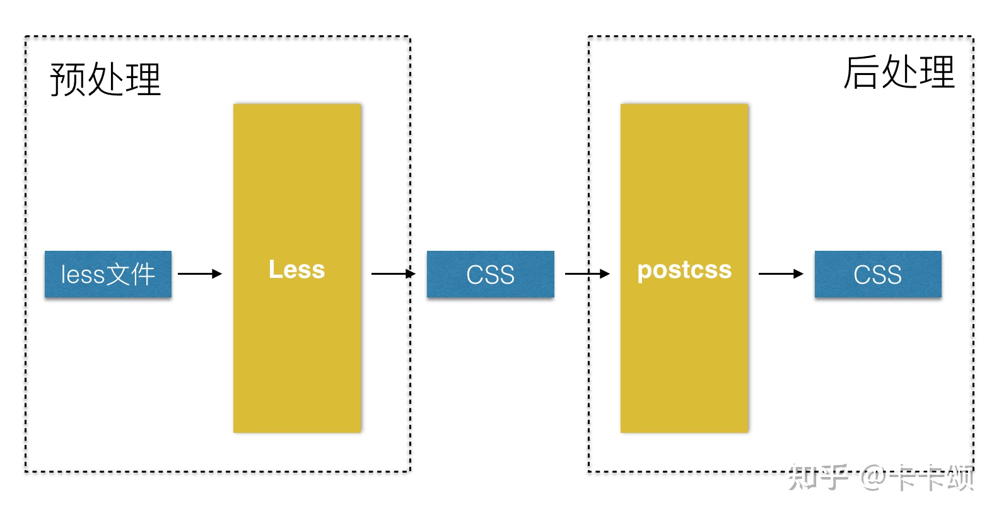
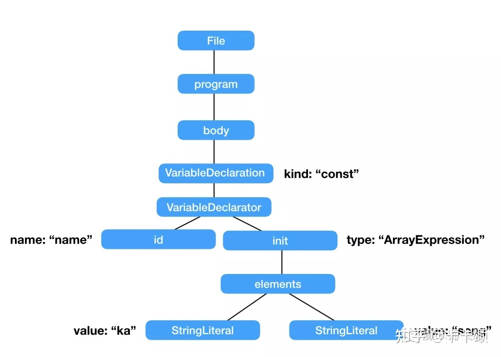
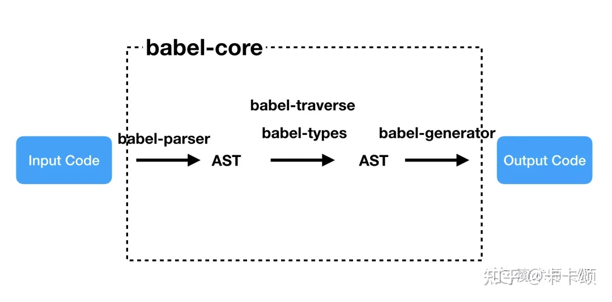

# postcss 和 babel

## PurgeCSS

最近很火的 TailwindCSS 有一个功能：

可以将项目未使用的 css 选择器从编译后 css 文件中移除。链接 TailwindCSS 与 PurgeCSS 的，则是一个 postCSS 插件@fullhuman/postcss-purgecss。

## autoprefixer

很多人在项目中使用 autoprefixer 插件，为 css 选择器增加不同的「浏览器前缀」。

在其内部会根据 browserslist[1]指定浏览器版本。

再去 caniuse[2]查找该浏览器版本兼容性支持情况。

最后通过 postCSS 的能力改写不支持的 css 属性。

什么是 postCSS
postCSS 是一款 css 编译器。

类比 Babel 家族的@babel/parser 可以将 js 代码解析为 AST（抽象语法树），再利用众多插件（@babel/plugin-xx）的能力改写 AST，最终输出改写后的 js 代码。

postCSS 利用自身的 parser 可以将 css 代码解析为 AST，再利用众多插件（上文介绍的 autoprefixer 就是一种）改写 AST，最终输出改写后的 css 代码

从这点就能看出其与 Less 这样的「css 预处理器」的不同 —— postCSS 的输入与输出产物都是 css 文件。

因此，postCSS 也被成为「后处理器」，因为其通常在 css 处理链条的最后端。

当前 postCSS 插件按功能划分大体有如下几类：

解决全局 css 问题，比如提供 css module[10]支持
使用未全面兼容的 css 特性，比如 autoprefixer[11]
格式化，提高 css 可读性
图片和文字处理
linters，比如 stylelint
不同语法的 css 支持，比如 postcss-html[12]可以解析类 html 文件中<style>标签内的 css 语法
读到这里，相信你会同意：相比 Less、Sass，postCSS 才是 css 处理领域的大杀器

## babel

作为一个庞大的家族，Babel 生态中有很多概念，比如：preset、plugin、runtime 等。

Babel 是什么
Babel 是一个 JavaScript 编译器。
作为 JS 编译器，Babel 接收输入的 JS 代码，经过内部处理流程，最终输出修改后的 JS 代码。

在 Babel 内部，会执行如下步骤：

将 Input Code 解析为 AST（抽象语法树）,这一步称为 parsing
编辑 AST，这一步称为 transforming
将编辑后的 AST 输出为 Output Code，这一步称为 printing

从 Babel 仓库[1]的源代码，可以发现：Babel 是一个由几十个项目组成的 Monorepo。

其中 babel-core 提供了以上提到的三个步骤的能力。

在 babel-core 内部，更细致的讲：

babel-parser 实现第一步
babel-generator 实现第三步
要了解第二步，我们需要简单了解下 AST。
进入 AST explorer[2]，选择@babel/parser 作为解析器，在左侧输入：

const name = ['ka', 'song'];
可以解析出如下结构的 AST，他是 JSON 格式的树状结构：

在 babel-core 内部：

babel-traverse 可以通过「深度优先」的方式遍历 AST 树
对于遍历到的每条路径，babel-types 提供用于修改 AST 节点的节点类型数据
所以，整个 Babel 底层编译能力由如下部分构成：

当我们了解 Babel 的底层能力后，接下来看看基于这些能力，上层能实现什么功能？

Babel 的上层能力
基于 Babel 对 JS 代码的编译处理能力，Babel 最常见的上层能力为：

polyfill
DSL 转换（比如解析 JSX）
语法转换（比如将高级语法解析为当前可用的实现）
由于篇幅有限，这里仅介绍 polyfill 与「语法转换」相关功能。

当我们了解 Babel 的底层能力后，接下来看看基于这些能力，上层能实现什么功能？

Babel 的上层能力
基于 Babel 对 JS 代码的编译处理能力，Babel 最常见的上层能力为：

polyfill
DSL 转换（比如解析 JSX）
语法转换（比如将高级语法解析为当前可用的实现）
由于篇幅有限，这里仅介绍 polyfill 与「语法转换」相关功能。

polyfill
作为前端，最常见的 Babel 生态的库想必是@babel/polyfill 与@babel/preset-env。

使用@babel/polyfill 或@babel/preset-env 可以实现高级语法的降级实现以及 API 的 polyfill。

从上文我们知道，Babel 本身只是 JS 的编译器，以上两者的转换功能是谁实现的呢？

答案是：core-js

core-js 简介
core-js 是一套模块化的 JS 标准库，包括：

一直到 ES2021 的 polyfill
promise、symbols、iterators 等一些特性的实现
ES 提案中的特性实现
跨平台的 WHATWG / W3C 特性，比如 URL

从 core-js 仓库[3]看到，core-js 也是由多个库组成的 Monorepo，包括：

core-js-builder
core-js-bundle
core-js-compat
core-js-pure
core-js
我们介绍其中几个库：

core-js
core-js 提供了 polyfill 的核心实现。

import 'core-js/features/array/from';
import 'core-js/features/array/flat';
import 'core-js/features/set';  
import 'core-js/features/promise';

Array.from(new Set([1, 2, 3, 2, 1])); // => [1, 2, 3]
[1, [2, 3], [4, [5]]].flat(2); // => [1, 2, 3, 4, 5]
Promise.resolve(32).then(x => console.log(x)); // => 32
直接使用 core-js 会污染全局命名空间和对象原型。

比如上例中修改了 Array 的原型以支持数组实例的 flat 方法。

core-js-pure
core-js-pure 提供了独立的命名空间：

import from from 'core-js-pure/features/array/from';
import flat from 'core-js-pure/features/array/flat';
import Set from 'core-js-pure/features/set';
import Promise from 'core-js-pure/features/promise';

from(new Set([1, 2, 3, 2, 1])); // => [1, 2, 3]
flat([1, [2, 3], [4, [5]]], 2); // => [1, 2, 3, 4, 5]
Promise.resolve(32).then(x => console.log(x)); // => 32
这样使用不会污染全局命名空间与对象原型。

core-js-compat
core-js-compat 根据 Browserslist 维护了不同宿主环境、不同版本下对应需要支持特性的集合。

Browserslist[4]提供了不同浏览器、node 版本下 ES 特性的支持情况

比如：

"browserslist": [
"not IE 11",
"maintained node versions"
]
代表：非 IE11 的版本以及所有 Node.js 基金会维护的版本。

@babel/polyfill 与 core-js 关系
@babel/polyfill 可以看作是：core-js 加 regenerator-runtime。

regenerator-runtime 是 generator 以及 async/await 的运行时依赖
单独使用@babel/polyfill 会将 core-js 全量导入，造成项目打包体积过大。

从 Babel v7.4.0[5]开始，@babel/polyfill 被废弃了，可以直接引用 core-js 与 regenerator-runtime 替代
为了解决全量引入 core-js 造成打包体积过大的问题，我们需要配合使用@babel/preset-env。

preset 的含义
在介绍@babel/preset-env 前，我们先来了解 preset 的意义。

初始情况下，Babel 没有任何额外能力，其工作流程可以描述为：

const babel = code => code;
其通过 plugin 对外提供介入 babel-core 的能力，类似 webpack 的 plugin 对外提供介入 webpack 编译流程的能力。

plugin 分为几类：

@babel/plugin-syntax-*语法相关插件，用于新的语法支持。比如 babel-plugin-syntax-decorators[6]提供 decorators 的语法支持
@babel/plugin-proposal-*用于 ES 提案的特性支持，比如 babel-plugin-proposal-optional-chaining 是可选链操作符特性支持
@babel/plugin-transform-\*用于转换代码，transform 插件内部会使用对应 syntax 插件
多个 plugin 组合在一起形成的集合，被称为 preset。

@babel/preset-env
使用@babel/preset-env，可以「按需」将 core-js 中的特性打包，这样可以显著减少最终打包的体积。

这里的「按需」，分为两个粒度：

宿主环境的粒度。根据不同宿主环境将该环境下所需的所有特性打包
按使用情况的粒度。仅仅将使用了的特性打包
我们来依次看下。

宿主环境的粒度
当我们按如下参数在项目目录下配置 browserslist 文件（或在@babel/preset-env 的 targets 属性内设置，或在 package.json 的 browserslist 属性中设置）：

not IE 11
maintained node versions
会将「非 IE11」且「所有 Node.js 基金会维护的 node 版本」下需要的特性打入最终的包。

显然这是利用了刚才介绍的 core-js 这个 Monorepo 下的 core-js-compat 的能力。

按使用情况的粒度
更理想的情况是只打包我们使用过的特性。

这时候可以设置@babel/preset-env 的 useBuiltIns 属性为 usage。

比如：

a.js：

var a = new Promise();
b.js：

var b = new Map();
当宿主环境不支持 promise 与 Map 时，输出的文件为：

a.js：

import "core-js/modules/es.promise";
var a = new Promise();
b.js：

import "core-js/modules/es.map";
var b = new Map();
当宿主环境支持这两个特性时，输出的文件为：

a.js：

var a = new Promise();
b.js：

var b = new Map();
进一步优化打包体积
打开 babel playground[7]，输入：

class App {}
会发现编译出的结果为：

function \_classCallCheck(instance, Constructor) { if (!(instance instanceof Constructor)) { throw new TypeError("Cannot call a class as a function"); } }

var App = function App() {
"use strict";

\_classCallCheck(this, App);
};
其中\_classCallCheck 为辅助方法。

如果多个文件都使用了 class 特性，那么每个文件打包对应的 module 中都将包含\_classCallCheck。

为了减少打包体积，更好的方式是：需要使用「辅助方法」的 module 都从同一个地方引用，而不是自己维护一份。

@babel/runtime 包含了 Babel 所有「辅助方法」以及 regenerator-runtime。

单纯引入@babel/runtime 还不行，因为 Babel 不知道何时引用@babel/runtime 中的「辅助方法」。

所以，还需要引入@babel/plugin-transform-runtime。

这个插件会在编译时将所有使用「辅助方法」的地方从「自己维护一份」改为从@babel/runtime 中引入。

所以我们需要将@babel/plugin-transform-runtime 置为 devDependence，因为他在编译时使用。

将@babel/runtime 置为 dependence，因为他在运行时使用。

总结
本文从底层向上介绍了前端日常业务开发会接触的 Babel 大家族成员。他们包括：

底层
@babel/core（由@babel/parser、@babel/traverse、@babel/types、@babel/generator 等组成）

他们提供了 Babel 编译 JS 的能力。

注：这里@babel/core 为库名，前文中 babel-core 为其在仓库中对应文件名
中层
@babel/plugin-\*

Babel 对外暴露的 API，使开发者可以介入其编译 JS 的能力

上层
@babel/preset-\*

日常开发会使用的插件集合。

