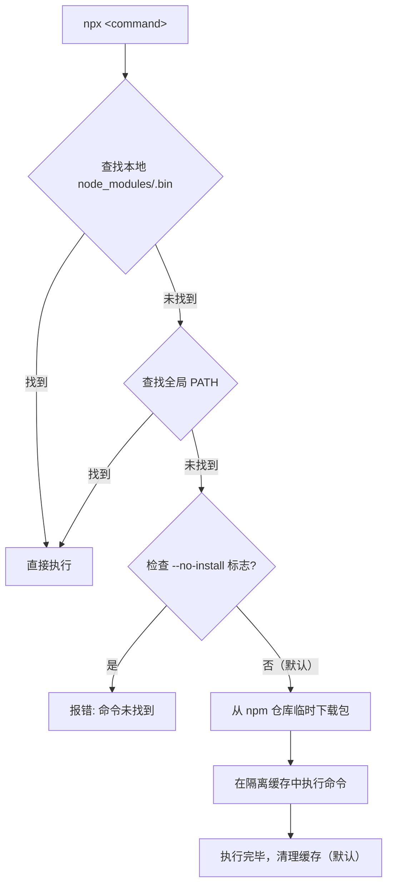

## 如何管理 Node.js 版本？

以下是三款常用的 Node.js 版本管理工具（**请仅选择其一安装，多工具并存可能导致冲突**）：

| 工具                                        | 说明                                   |
| ------------------------------------------- | -------------------------------------- |
| [nvm](https://github.com/nvm-sh/nvm)        | 基于 Shell 脚本的版本管理器            |
| [fnm](https://github.com/Schniz/fnm)        | 使用 Rust 编写的快速版本管理器         |
| [volta](https://github.com/volta-cli/volta) | 支持快速安装与运行 JS 工具的 Rust 工具 |

下文以 **nvm** 为例进行介绍。

---

### 在 macOS 上安装 nvm

**方法一：使用 Homebrew**

```sh
brew install nvm
```

**方法二：使用安装脚本**

```sh
curl -o- https://raw.githubusercontent.com/nvm-sh/nvm/v0.37.2/install.sh | bash
```

#### 配置环境变量

安装后，将以下内容添加到 shell 配置文件（如 `~/.zshrc`）：

```sh
export NVM_DIR="$([ -z "${XDG_CONFIG_HOME-}" ] && printf %s "${HOME}/.nvm" || printf %s "${XDG_CONFIG_HOME}/nvm")"
[ -s "$NVM_DIR/nvm.sh" ] && \. "$NVM_DIR/nvm.sh"
```

完成后在终端执行 `nvm` 验证是否安装成功。

---

### 常用 nvm 命令

| 命令                          | 用途                                              |
| ----------------------------- | ------------------------------------------------- |
| `nvm ls-remote`               | 列出所有可安装的 Node.js 版本                     |
| `nvm install <version>`       | 安装指定版本（如 `nvm install 8.14.0`）           |
| `nvm uninstall <version>`     | 卸载指定版本                                      |
| `nvm ls`                      | 列出已安装的所有版本                              |
| `nvm use <version>`           | 切换到指定版本                                    |
| `nvm current`                 | 显示当前使用的版本                                |
| `nvm alias default <version>` | 设置默认 Node.js 版本                             |
| `nvm deactivate`              | 解除当前版本绑定（用于删除被设为 default 的版本） |

---

### M1 芯片 Mac 兼容旧版 Node.js

低版本 Node.js 未适配 arm64 架构，在 M1 芯片上需通过 Rosetta 2 运行：

```sh
# 让 shell 运行在 Rosetta 2 下
arch -x86_64 zsh
# 然后安装低版本 Node.js
nvm install <version>
```

> Node.js v14 及之后的版本已原生支持 M1，无需此操作。

---

### 查看 Node.js 安装位置

- 查看当前使用的 Node.js 路径：

  ```sh
  which node
  # 示例输出：/Users/用户名/.nvm/versions/node/v10.13.0/bin/node
  ```

- 查看所有已安装版本：
  在访达中使用 `Command+Shift+G`，输入路径：
  ```
  /Users/你的用户名/.nvm/versions
  ```
  > `.nvm` 为隐藏文件夹，可使用 `Command+Shift+.` 切换显示/隐藏。

---

### 多版本环境下的 npm 使用须知

自 Node.js 10.0.0 起，每个 Node.js 主要版本会捆绑一个特定版本的 npm，以确保兼容性。例如 Node.js 12.x 通常搭配 npm 6.x。由于 npm 更新更频繁，同一 Node.js 主版本下也可能兼容多个 npm 版本，但建议保持版本匹配以维持稳定运行。

**全局安装的 npm 包在不同 Node.js 版本间不共享**，它们位于对应版本的目录中，例如：

```
~/.nvm/versions/node/<版本>/lib/node_modules
```

- 安装新 Node.js 版本时可迁移旧版本的全局包：
  ```sh
  nvm install v18.0.0 --reinstall-packages-from=v16.0.0
  ```

## npm 的三重身份

npm 是一个具有多重含义的术语，具体可指以下三个层面：

1. **包管理器（Package Manager）**
   自 2009 年开源以来，npm 作为 Node.js 的官方包管理器，帮助开发者轻松分享、安装、更新和管理代码包与项目依赖。

2. **代码包仓库（Registry）**
   npm 提供了一个公共的代码包集合服务，涵盖 Node.js、前端、移动端等多种类型的包。开发者可在此发布自己的包，也可下载使用他人共享的包。企业也可部署私有仓库，以供内部使用。

3. **命令行工具（CLI）**
   npm CLI 是与包管理器交互的命令行界面，支持安装、卸载、更新、发布包以及运行脚本等操作。它的核心作用是从仓库获取包信息，下载并按规范组织文件，使 Node.js 能通过 `require()` 或 `import` 正确加载模块。不同 CLI 的目录排布规则可能不同，主要出于依赖体积与安装速度的优化考虑。

## npm 配置

### 一、npm 配置来源与优先级

npm 配置可以来自多个渠道，最终生效配置取决于**优先级**。从高到低，一般可以理解为：

1. 命令行参数
2. 环境变量（`npm_config_` 前缀）
3. 项目级 `.npmrc`（项目根目录）
4. 用户级 `.npmrc`（`~/.npmrc` 或用户目录）
5. 全局级 `.npmrc`（`$PREFIX/etc/npmrc`）
6. npm 内置默认配置

当同一个配置项在多个来源中都被设置时，上层会覆盖下层。例如，如果你在项目 `.npmrc` 中设置了 `registry`，又在命令行中使用：

```sh
npm install --registry=https://registry.npmmirror.com
```

那么这次安装会使用命令行指定的 `registry`，而不是 `.npmrc` 中的配置。

> 提示：具体优先级在不同 npm 版本中细节略有差异，但整体顺序和“就近覆盖”原则是一致的。

---

### 二、方式一：命令行参数（CLI Options）

命令行参数是**最高优先级**的配置方式，适合一次性、临时改动。例如：

```sh
# 临时使用指定 registry 安装依赖
npm install --registry=https://registry.npmmirror.com
```

这次安装会使用你在命令行中指定的 registry，而不会修改 `.npmrc` 或全局配置。

**与 `npm run` 脚本参数的区别：**

在 `npm` 命令行工具中，当执行一个脚本命令 (如 `npm run start`) 时，`npm` 本身也接受一些参数。这些参数用于控制 `npm` 的行为，如 `--silent`、`--verbose` 等。这就带来了一个问题：如果你想向 `npm` 脚本中指定的命令传递参数，如何区分这些参数是给 `npm` 本身的，还是要传递给 `npm` 脚本中指定的命令？

为了解决这个问题，`npm` 使用了双横线 `--` 作为一个特殊的标记，来区分参数是给 `npm` 还是给脚本中的命令。当 `npm` 在命令行中遇到 `--` 时，它会停止解析自己的参数，而把 `--` 后面的所有内容作为参数传递给脚本中指定的命令。这样，你就可以在 `npm` 脚本中使用命令行参数了，而不会与 `npm` 的参数混淆。

例如：

```json
{
  "start": "webpack"
}
```

如果你执行 `npm start -- --config my-config.js`，`npm` 会执行 `start` 脚本中指定的 `webpack` 命令，并将 `--config my-config.js` 作为参数传递给它。这里的 `--` 告诉 `npm`，`--config my-config.js` 不是 `npm` 的参数，而是要传递给 `webpack` 命令的。

---

### 三、方式二：环境变量（`npm_config_` 前缀）

npm 会自动识别以 `npm_config_` 为前缀的环境变量，将其视为配置项。比如：

```sh
# 类 Unix 系统（macOS / Linux）
export npm_config_package_lock=false
npm install
```

这表示：在当前 shell 会话中执行 `npm install` 时，npm 将视 `package-lock` 配置为 `false`，即不生成 `package-lock.json`。

#### 2.1 环境变量的基本操作

- 查看环境变量（以类 Unix 系统为例）：

  ```sh
  echo $npm_config_package_lock
  ```

- 删除环境变量（当前 shell 会话中）：

  ```sh
  unset npm_config_package_lock
  ```

- Windows 中的写法：

  ```bat
  REM cmd
  set npm_config_package_lock=false
  npm install
  ```

  ```powershell
  # PowerShell
  $env:npm_config_package_lock = "false"
  npm install
  ```

#### 2.2 普通环境变量 vs npm 配置变量

容易混淆的一点是：普通环境变量（如 `NODE_ENV`）与 npm 配置变量不是一回事。

- `NODE_ENV`：约定俗成的应用环境变量（如 `development`/`production`），通常由应用逻辑使用，与 npm 配置无关。
- `npm_config_xxx`：npm 会识别并将其视为配置项，比如 `npm_config_registry`、`npm_config_package_lock` 等。

例如：

```sh
export NODE_ENV=production             # 应用逻辑用
export npm_config_registry=https://registry.npmmirror.com  # npm 使用
npm install
```

---

### 四、方式三：`.npmrc` 配置文件

`.npmrc` 是 npm 的配置文件，用于持久化设置。常见的配置包括：

- `registry`：镜像源地址
- 私有仓库地址与 token
- 缓存路径、代理设置
- 安装策略（如 `save-prefix`、`save-exact` 等）

根据作用范围不同，`.npmrc` 大致分为四级：

1. 项目级 `.npmrc`：位于项目根目录，仅对当前项目生效。
2. 用户级 `.npmrc`：
   - macOS/Linux：通常位于 `~/.npmrc`
   - Windows：通常位于 `C:\Users\<用户名>\.npmrc`
   - 可通过 `npm config get userconfig` 查看路径。
3. 全局级 `.npmrc`：
   - 一般位于 `$PREFIX/etc/npmrc`
   - 可通过 `npm config get globalconfig` 查看路径。
4. npm 内置 `.npmrc`：默认配置，通常不直接修改。

> 优先级上：项目级 > 用户级 > 全局级 > 内置配置。

#### 3.1 `.npmrc` 示例

一个简单的 `.npmrc` 示例：

```ini
# 使用国内镜像
registry=https://registry.npmmirror.com/

# 安装时版本前缀策略
save-prefix=~           # 版本写入 package.json 为 ~1.2.3
strict-ssl=true         # 强制使用 HTTPS 且验证证书

# 自定义缓存目录（按需）
# cache=/path/to/.npm-cache
```

私有 npm 仓库常见配置（示意，注意不要泄露真实 token）：

```ini
registry=https://registry.npmmirror.com/

# 为特定 scope 配置私有仓库
@your-scope:registry=https://registry.your-company.com/

# 私有仓库 token（建议只配置在 CI 环境变量或用户级 .npmrc 中）
# //registry.your-company.com/:_authToken=XXXXXX
```

#### 3.2 团队与 CI 中的推荐做法

- 项目级 `.npmrc`：
  - 固定 `registry`（可为公司私有源）
  - 固定安装策略（如 `save-prefix`、`engine-strict` 等）
- 用户级 `.npmrc`：
  - 配置个人偏好（代理、全局缓存、默认 registry 等）
- CI / Docker：
  - 优先通过环境变量和项目级 `.npmrc` 配置 registry 和鉴权信息。
  - 避免将 token 写入仓库中，使用 CI 工具的“机密变量”能力注入。

---

### 五、方式四：`npm config` 命令

npm 提供了一组内置命令，用于直接管理配置：

```sh
# 设置配置项
npm config set <key> <value>

# 获取配置项
npm config get <key>

# 删除配置项（默认删除用户级配置）
npm config delete <key>

# 查看所有配置项（包含默认值）
npm config list

# 在编辑器中编辑配置文件（默认编辑用户级 .npmrc）
npm config edit
```

#### 4.1 设置与获取配置

示例：

```sh
# 设置用户级 registry
npm config set registry https://registry.npmmirror.com

# 查看当前 registry
npm config get registry
```

此时，会在你的用户级 `.npmrc` 中写入相应配置。

#### 4.2 删除配置与项目级配置

```sh
npm config delete registry
```

- 默认情况下，该命令会删除**用户级配置中的 registry**。
- 项目级 `.npmrc` 中的配置一般不会被 `delete` 自动删除，通常需要你直接编辑项目根目录的 `.npmrc` 文件。

在较新的 npm 版本（npm 9+）中，部分命令支持 `--location` 参数，例如：

```sh
# 针对项目级配置操作
npm config set registry https://registry.npmmirror.com --location=project
```

这样更方便在项目层面管理配置项。

---

### 六、镜像源与 nrm：加速国内依赖安装

npm 默认的镜像源地址是：

```text
https://registry.npmjs.org/
```

在国内直接访问往往会较慢，因此很多团队会使用淘宝的镜像站：

```text
https://registry.npmmirror.com/
```

#### 6.1 手动配置镜像源

- 查看当前镜像源：

  ```sh
  npm config get registry
  ```

- 将当前镜像源设置为淘宝源：

  ```sh
  npm config set registry https://registry.npmmirror.com
  ```

这种方式适合个人环境长期使用，但在团队和 CI 环境中，如果每个人的 registry 都不一致，可能导致依赖版本、锁文件不一致，因此更推荐在**项目级 `.npmrc` 中统一配置**。

#### 6.2 使用 nrm 管理多个镜像源

手动切换镜像不够灵活时，可以使用 npm 镜像管理工具 nrm。

**全局安装 nrm：**

```sh
npm install nrm -g
```

安装完成后，可以使用：

```sh
nrm ls
```

示例输出（以某一版本为例）：

```text
  npm ---------- https://registry.npmjs.org/
  yarn --------- https://registry.yarnpkg.com/
  tencent ------ https://mirrors.cloud.tencent.com/npm/
  cnpm --------- https://r.cnpmjs.org/
* taobao ------- https://registry.npmmirror.com/
  npmMirror ---- https://skimdb.npmjs.com/registry/
```

带 `*` 的为当前使用的源。

切换到 taobao 源：

```sh
nrm use taobao
```

之后执行 `npm install` 就会使用该源进行下载。

#### 6.3 nrm 常用命令

| 命令                            | 功能说明                         |
| ------------------------------- | -------------------------------- |
| `nrm ls`                        | 查看所有配置好的源及当前使用的源 |
| `nrm add xxx http://npm.xxx.cn` | 添加自定义源，`xxx` 是自定义名称 |
| `nrm del xxx`                   | 删除对应名称的源                 |
| `nrm test` / `nrm test xxx`     | 测试所有源或某个源的响应速度     |
| `nrm use xxx`                   | 切换源，后续 npm 操作会使用该源  |

**注意事项：**

- 第三方镜像可能存在同步延迟或安全风险，生产环境（特别是 CI/CD）中建议团队统一策略。
- 建议将“团队统一的 registry”写在项目级 `.npmrc` 或 CI 配置中，而不是只依赖开发者本地的 nrm 设置。
- 对于已经不再维护的镜像源（如部分旧 cnpm 域名），不建议继续使用。

## npx

### 1. npm exec 与 npx

`npm exec`（通常以其别名 `npx` 调用）是 npm 包管理器的内置命令，用于在 Node.js 环境中执行软件包中的命令行工具。一个常见的误解是将其视为独立工具，实际上：

- **`npx` 是 `npm exec` 的别名**：自 `npm@5.2.0` 起，`npx` 被预装为 `npm` 的一部分，提供了一个更短、更便捷的调用方式。
- **行为统一**：在 `npm@7` 及更高版本中，`npm exec` 与 `npx` 在功能上已完全一致，可以互换使用。

它的核心价值在于：**无需全局安装，即可安全、便捷地运行任何来自 npm 仓库的 CLI 工具或一次性脚本**。

### 2. 核心机制：npx 如何工作？

理解 `npx` 的工作流程，能帮助你更精准地使用它。其执行遵循一个明确的优先级和决策链：



**关键行为说明：**

- **临时安装与缓存**：当启用“临时安装”模式时，包被下载到系统级缓存目录（如 `~/.npm/_npx/`），而非当前项目。这保证了项目的 `node_modules` 纯净，且同一版本的包在不同项目中可复用缓存，节省磁盘空间和安装时间。
- **`--no-install` 标志**：强制 `npx` 仅使用已在本地或全局安装的包，若未找到则直接报错。适用于要求环境严格一致或禁止网络请求的场景。

### 3. 主要优势与应用场景

#### 3.1 优势：为何选择 npx？

- **避免全局污染**：无需将 `create-react-app`、`vite` 等脚手架工具永久安装到全局，保持全局环境简洁。
- **支持多版本并行**：轻松运行特定版本的 CLI 工具（如 `npx webpack@4.44.0`），无需管理复杂的全局版本切换。
- **提升项目可复现性**：在脚本或文档中使用 `npx` 调用工具，明确指定了工具的版本来源（npm 仓库），增强了项目在不同环境下的行为一致性。
- **简化入门流程**：新手无需先学习“全局安装”，可以直接运行命令开始创建项目。

#### 3.2 典型应用场景与示例

##### 场景一：快速初始化或体验新项目

这是最常见的使用场景，用于运行项目脚手架。

```bash
# 使用最新版 Vite 创建项目 (推荐明确指定 `@latest`)
npx --yes create-vite@latest my-vite-app --template react-ts

# 使用特定版本的 Create React App 创建项目
npx --yes create-react-app@5.0.1 my-cra-app
```

> **`--yes` (`-y`) 标志至关重要**：它跳过“是否允许安装包”的交互式确认，使得命令可用于脚本和 CI/CD 环境。

##### 场景二：执行项目中的本地工具

在已安装依赖的项目中，`npx` 是调用这些工具最直接的方式。

```bash
# 假设项目已安装 eslint, prettier, jest
npx eslint .
npx prettier --write src/
npx jest --coverage
```

##### 场景三：运行一次性命令或特定版本工具

无需为了一个命令而将工具添加到 `package.json`。

```bash
# 查看 webpack 某个版本的帮助信息
npx -y webpack@4.44.0 --help

# 使用一个临时工具检查包的大小
npx -y bundle-phobia-cli date-fns

# 快速启动一个静态服务器
npx -y serve ./dist
```

##### 场景四：在 Monorepo 中指定工作空间执行

在使用了 npm Workspaces 的 Monorepo 项目中，可以精确地在某个子包内执行命令。

```bash
# 在名为 `packages/web-app` 的工作空间中执行构建命令
npx -w packages/web-app --yes vite build
```

### 4. npx vs npm run-script vs 直接执行：如何选择？

| 特性/方式     | `npx <command>`                          | `npm run <script>`                                         | `./node_modules/.bin/<command>`                |
| :------------ | :--------------------------------------- | :--------------------------------------------------------- | :--------------------------------------------- |
| **命令来源**  | 本地 `.bin`、全局 `PATH` 或 **临时安装** | `package.json` 中定义的 `scripts` 字段                     | 仅限本地 `node_modules/.bin` 目录              |
| **环境 PATH** | 标准 `PATH` 查找顺序                     | **优先**包含本项目 `node_modules/.bin`                     | 无，直接指定了可执行文件路径                   |
| **临时安装**  | 支持（默认开启）                         | 不支持                                                     | 不支持                                         |
| **典型用途**  | **临时/一次性**执行 CLI 工具、初始化项目 | 执行**预定义、可复用**的项目任务（dev, build, test, lint） | 在 **Shell 脚本** 或复杂命令中精确调用本地工具 |
| **版本管理**  | 可通过 `@version` 指定                   | 通过 `package.json` 的 `devDependencies` 管理              | 同 `npm run`                                   |

**简单决策指南：**

- **想快速试用或运行一个不属于当前项目常规流程的命令？** -> 用 `npx`。
- **运行项目内定义好的构建、测试、启动等标准任务？** -> 用 `npm run`。
- **在编写一个 Shell 脚本，需要明确调用本项目安装的某个工具？** -> 用 `./node_modules/.bin/<command>`。

### 5. 注意事项与最佳实践

1.  **安全第一**：`npx` 会从网络下载并执行代码。**切勿运行来源不明或不受信任的包**。在执行前，可先通过 `npm info <package-name>` 查看包信息。
2.  **为生产环境明确依赖**：对于构建、测试、代码检查等在 CI/CD 流水线中**必须存在**的工具，应将其版本固定到 `package.json` 的 `devDependencies` 中，而不是依赖 `npx` 的临时安装。这确保了构建的可重复性和稳定性。
3.  **善用 `--yes` (`-y`)**：在自动化脚本、CI 配置或文档中，总是添加 `-y` 标志以避免命令被交互式提示阻塞。
4.  **理解版本选择**：`npx create-react-app` 会安装并执行**最新版本**。为保持一致性，建议显式指定版本，如 `npx -y create-react-app@5`。
5.  **性能考量**：首次运行未缓存的包时有网络下载开销。在要求极致速度的场景（如热更新编译），应优先使用本地安装的工具。

## 常用 npm 指令

#### npm init

使用 `npm init` 初始化一个新的项目时会提示你去填写一些项目描述信息。如果觉得填写这些信息比较麻烦的话，可以使用 -y 标记表示接受 package.json 中的一些默认值：

```sh
npm init -y
```

也可以设置初始化的默认值：

```sh
npm config set init-author-name 'your name'
npm config set init-author-email 'yourdoemail@qq.com'
npm config set init-author-url 'http://yourdomain.com'
npm config set init-license 'MIT'
```

`npm init` 是一个众所周知的命令，但它还藏着一个鲜为人知的强大功能：

> 使用 `npm init <initializer>` 可以快速启动项目构建。

这里的 `<initializer>` 指的是一个名为 `create-<initializer>` 的 npm 包。当你运行 `npm init` 命令时，它会通过 `npx` 自动安装这个包，并执行包内 `package.json` 文件中 `bin` 字段指定的脚本。这个过程不仅创建或更新了 `package.json` 文件，还执行了初始化项目所需的其他操作。

转换规则如下：

- 执行 `npm init foo` 相当于运行 `npx create-foo`
- 执行 `npm init @usr/foo` 相当于运行 `npx @usr/create-foo`
- 执行 `npm init @usr` 相当于运行 `npx @usr/create`

以 `Vite` 为例，官方推荐的初始化命令：

```sh
npm init vite@latest # npx create-vite@latest
```

实际上也就是通过 `npx` 去下载 `create-vite` 最新的包。

#### npm list

```sh
# 当前项目安装的所有模块
npm list

# 列出全局安装的模块 带上[--depth=0] 不深入到包的支点 更简洁
npm list -g --depth=0

# 列出需要升级的全局包 包括 npm 自己
npm outdated -g
```

#### npm install

```sh
# 读取 package.json 安装
npm install
# 可简写成 npm i

# 默认安装指定模块的最新(@latest)版本
npm install [<@scope>/]<name>
# eg: npm install gulp

# 安装指定模块的指定版本
npm install [<@scope>/]<name>@<version>
# eg: npm install gulp@3.9.1

# 安装指定指定版本范围内的模块
npm install [<@scope>/]<name>@<version range>
# eg: npm install vue@">=1.0.28 < 2.0.0"

# 安装指定模块的指定标签 默认值为(@latest)
npm install [<@scope>/]<name>@<tag>
# eg: npm install sax@0.1.1

# 通过 Github 代码库地址安装
npm install <tarball url>
# eg: npm install git://github.com/package/path.git
```

`npm install` 大概流程如图所示：


详细概述：

1. **检查 `.npmrc` 文件的优先级顺序**：系统在处理 npm 配置时，会按照以下顺序考虑 `.npmrc` 文件的设置：首先是项目级别的 `.npmrc` 文件，其次是用户级别的，然后是全局级别的，最后是 npm 内置的配置文件。

2. **检查项目中是否存在 `lock` 文件**：
   - **若不存在 `lock` 文件**：
     1. 系统将从 npm 远程仓库获取包的信息。
     2. 根据 `package.json` 文件构建依赖树。在这个过程中，无论是直接依赖还是间接依赖，系统优先尝试将其放置在 `node_modules` 的根目录下。如果遇到相同的模块，系统会检查已存在的模块版本是否满足新模块的版本要求。如果满足，则跳过；如果不满足，则会在当前模块的 `node_modules` 目录下放置新的模块版本。
     3. 接下来，系统会在缓存中查找每个依赖包：
        - 如果**缓存不存在**，系统会从 npm 远程仓库下载包，并进行完整性校验。如果校验失败，系统会尝试重新下载；校验成功后，则将包复制到 npm 缓存目录，并按照依赖结构解压到 `node_modules` 目录中。
        - 如果**缓存存在**，则直接将缓存的包按照依赖结构解压到 `node_modules` 目录中。
     4. 最后，系统会生成 `lock` 文件，以锁定依赖版本。
   - **若存在 `lock` 文件**：
     1. 系统首先检查 `package.json` 中的依赖版本与 `package-lock.json` 中记录的版本是否存在冲突。
     2. 如果没有冲突，系统将直接使用 `lock` 文件中的信息来查找缓存中的包，跳过获取包信息和构建依赖树的过程，后续操作与无 `lock` 文件时相同。

为了深入了解每个包的具体安装过程和细节，您可以执行命令 `npm install package --timing=true --loglevel=verbose`。这将启用详细日志记录，同时显示包安装的时间统计信息，帮助您更好地理解 npm 包的安装流程。

#### npm update

```sh
# 升级当前项目或全局的指定模块
npm update <name> [-g]
# eg: npm update express
```

> 当然也可以通过重新安装包的方式更新包。

#### npm view

> name 是一个包的唯一标识，不得和其他包名重复，我们可以执行 `npm view packageName` 查看包是否被占用，并可以查看它的一些基本信息。若包名称从未被使用过，则会抛出 404 错误。

```sh
# 查看指定模块的版本信息
npm view <name>
# eg: npm view express

# 查看指定模块的指定版本信息
npm view <name>@<version>
# eg: npm view express@1.0.0
```

你可以执行 `npm view package version` 查看某个 `package` 的最新版本。
执行 `npm view conard versions` 查看某个 `package` 在 npm 服务器上所有发布过的版本。


#### npm run

package.json 的 `scripts` 字段，可以用于指定脚本命令，供 npm 直接调用。`npm run` 会创建一个 Shell，执行指定的命令。

用法指南：

1. **命令简写**：**`start` 和 `test` 属于特殊命令，可以省略 `run`，其余的都得带上 `run`。**
2. **可配置参数**：格式是加上两个连词线 (--)
3. **内部变量**：

   ```json
   {
     "name": "npm_test",
     "version": "1.0.0",
     "config": {
       "reporter": "xunit"
     },
     "scripts": {
       "bundle": "mkdir -p build/$npm_package_version/",
       // $npm_package_version 读的是 "version" 的值，同理 $npm_package_name 读的是 "name" 的值
       "test": "mocha test/ --reporter $npm_package_config_reporter"
       // $npm_package_config_reporter 读的是 "config" 里的 "reporter"
     }
   }
   ```

4. **`pre-` 和 `post-` 两个钩子**：

   当你在 package.json 中定义了一个脚本时，比如 build，你可以同时定义 prebuild 和 postbuild 脚本。npm 会在执行 `npm run build` 命令时，自动先查找并执行 prebuild 脚本，然后执行 build 脚本，最后执行 postbuild 脚本。

   假设你的 package.json 文件中有如下脚本定义：

   ```json
   "scripts": {
     "prebuild": "echo Preparing for build...",
     "build": "echo Building the project...",
     "postbuild": "echo Build completed."
     }
   ```

   当你运行 `npm run build` 命令时，输出将会是：

   ```sh
   > Preparing for build...
   > Building the project...
   > Build completed.
   ```

5. **串行执行**：`npm run script1 && npm run script2`

6. **并行执行**：`npm run script1 & npm run script2`

#### npm publish

```sh
# 未注册 注册一个用户 和直接在 https://www.npmjs.com/ 注册一样
npm adduser
# 执行后 填写几个问题 Username、Password、Email

#已注册 登录
npm login

#发布
npm publish
```

#### npm-link

使用 `npm link` 能够避免重复且繁琐的打包发布操作，给开发调试带来便捷，而且使用方法简单。


假设你维护的下游业务项目叫做 app，上游的依赖叫做 dep，那么要想做到 **“dep 一改动，app 就能同步更新”**，只需要这样：

```sh
# 1. 在 dep 所在路径执行
npm link

# 2. 在 app 所在路径执行
npm link dep
```

这样就形成了 app 与 dep 之间基本的 “链接” 关系。只要进入 app 的 `node_modules` 查看一下，不难发现 npm 其实就是替你建立了一个操作系统的 “快捷方式” (软链接) 跳到 dep 下而已。

**解除链接：**

```sh
# 1. 在 dep 所在路径执行，这样本地的 dep 包模块就解除了，其他项目的软连接也失效了。
npm unlink dep

# 2. 在 app 所在路径执行，这样 app 里就解除了 dep 模块的软连接
npm unlink dep
```

#### 其他实用命令

- **查看项目脚本**：要快速查看当前项目的 npm 脚本，您可以直接在项目的 `package.json` 文件中查找 `scripts` 部分。或者，使用 `npm run` 命令来列出所有可用的脚本。
- **查看环境变量**：运行 `npm run env` 命令可以显示当前的环境变量。这对于调试和确保正确的环境配置很有帮助。
- **环境自检**：使用 `npm doctor` 命令，您可以执行一系列检查，以确保您的环境配置适合 npm 操作。这包括连接到 npm 服务的能力、`node` 与 `npm` 的版本校验、npm 源检查以及缓存文件权限验证。
- **安全漏洞检查**：运行 `npm audit` 来检查项目依赖中的安全漏洞。添加 `--json` 标志可以以 JSON 格式输出报告，便于进一步的分析。
- **依赖版本锁定**：默认情况下，npm 使用脱字符 `^` 来限制安装的模块的主版本号。您可以通过运行 `npm config set save-prefix="~"` 来改用波浪符 `~`，或者使用 `npm config set save-exact true` 来仅安装精确版本的模块。
- **跨目录运行脚本**：如果您有多个应用程序分布在不同的目录中，可以使用 `--prefix` 标志配合 `npm run` 命令来指定在哪个目录下运行脚本，例如：`npm run dev --prefix /path/to/your/folder`，从而避免了多次使用 `cd` 命令切换目录。

## 语义化版本控制 (SemVer)

在 `npm` 生态系统中，模块的版本管理遵循一个被广泛认可的标准：语义化版本控制 (Semantic Versioning)，简称为 `SemVer`。这一规范是由 `GitHub` 提出的，旨在通过版本号提供更多关于软件变更的信息。

**官方网站**：您可以访问 [semver.org](https://semver.org/lang/zh-CN/) 了解 `SemVer` 规范的详细信息。

[规范的 SemVer 格式](https://semver.org/#backusnaur-form-grammar-for-valid-semver-versions)为：`<主版本号>.<次版本号>.<修订号>-<先行版本号>+<构建号>`。其中主版本号、次版本号和修订号必须是数字。先行版本号和构建号可以是字母、数字以及小数点 `.`，不过先行版本号是不可以有前导零的，构建号可以。

我们常见的在 SemVer 前面加上 `~`、`^` 等符号，就表示这是一个 SemVer 范围。下面不严谨地讲一下，更严谨的说明可参阅 [node-semver 文档](https://github.com/npm/node-semver#advanced-range-syntax)。

当我们更新了 `npm` 包的功能并需要发布新版本时，推荐的做法是使用 `npm` 命令行工具自动更新 `package.json` 文件中的版本号，避免手动更改导致的错误。以下是一些常用命令：

- `npm version patch`：发布修订版，例如 `1.0.0` -> `1.0.1`
- `npm version minor`：发布次版本，例如 `1.0.0` -> `1.1.0`
- `npm version major`：发布主版本，例如 `1.0.0` -> `2.0.0`
- `npm version prepatch`：版本号变为 `1.2.4-0`，也就是 `1.2.4` 版本的第一个预发布版本
- `npm version preminor`：版本号变为 `1.3.0-0`，也就是 `1.3.0` 版本的第一个预发布版本
- `npm version premajor`：版本号变为 `2.0.0-0`，也就是 `2.0.0` 版本的第一个预发布版本
- `npm version prerelease`：版本号变为 `2.0.0-1`，也就是使预发布版本号加一

为了方便地操作和比较版本号，我们可以使用 `npm` 提供的 `semver` 包：

```sh
npm install semver
```

这个工具包使我们能够执行以下操作：

```js
const semver = require('semver');

// 比较版本号大小
console.log(semver.gt('1.0.0', '0.9.0')); // 输出：true
console.log(semver.lt('1.0.0', '2.0.0')); // 输出：true

// 验证版本号是否符合某个范围
console.log(semver.satisfies('1.0.0', '>=1.0.0')); // 输出：true

// 将版本号字符串解析为对象
console.log(semver.parse('1.0.0-beta'));
// 输出：{ version: '1.0.0-beta', major: 1, minor: 0, patch: 0, prerelease: ['beta'], build: [] }

// 升级特定类型的版本号
console.log(semver.inc('1.0.0', 'patch')); // 输出：1.0.1
console.log(semver.inc('1.0.0', 'minor')); // 输出：1.1.0
console.log(semver.inc('1.0.0', 'major')); // 输出：2.0.0

// 计算两个版本之间的差异类型
console.log(semver.diff('1.0.0', '1.0.1')); // 输出：patch
```

这些是 `semver` 包的基础用法，更多高级功能和详细文档，请访问 [semver 文档](https://github.com/npm/node-semver)。

## 理解 npm 的依赖包层级关系

在现代 JavaScript 项目中，依赖管理是一个核心环节。项目 `App` 依赖于三个模块 `A`、`B`、和 `C`，它们各自又依赖于不同版本的模块 `D`，构成了一个典型的依赖场景：

```json
"dependencies": {
    "A": "1.0.0",
    "B": "1.0.0",
    "C": "1.0.0"
}
```

具体依赖关系如下：

- A@1.0.0 -> D@1.0.0
- B@1.0.0 -> D@2.0.0
- C@1.0.0 -> D@2.0.0

### 嵌套安装

在 `npm 2.x` 版本中，这种依赖关系通过递归方式安装，形成了一种树状的目录结构。每个包都会在自己的 `node_modules` 目录下安装它所依赖的包：

```sh
├── node_modules
│   ├── A@1.0.0
│   │   └── node_modules
│   │       └── D@1.0.0
│   ├── B@1.0.0
│   │   └── node_modules
│   │       └── D@2.0.0
│   └── C@1.0.0
│       └── node_modules
│           └── D@2.0.0
```

这种方式虽然简单直接，但可能导致模块的大量冗余和深层嵌套。

### 扁平化安装

从 `npm 3.x` 版本开始，npm 引入了一种扁平化的安装策略，旨在将依赖尽可能地安装在项目的顶层 `node_modules` 目录，这样做可以显著减少模块的冗余和嵌套深度。

当你执行 `npm install` 命令后，`node_modules` 的目录结构可能呈现出不同的样态。例如，你可能会看到如下两种目录结构之一：

```sh
├── node_modules
│   ├── A@1.0.0
│   │   └── node_modules
│   │       └── D@1.0.0
│   ├── B@1.0.0
│   ├── C@1.0.0
│   └── D@2.0.0
```

或者：

```sh
├── node_modules
│   ├── A@1.0.0
│   ├── B@1.0.0
│   │   └── node_modules
│   │       └── D@2.0.0
│   ├── C@1.0.0
│   │   └── node_modules
│   │       └── D@2.0.0
│   └── D@1.0.0
```

在这两种情况中，`D@2.0.0` 和 `D@1.0.0` 模块都有可能被优先安装在一级 `node_modules` 目录。那么，面对多个相同但版本不同的模块，哪个版本会被优先安装在一级目录下呢？

通过分析，我们可以得出结论：`npm install` 时，npm 首先会根据 package.json 中依赖的首字母顺序 (@符号排在最前) 对依赖进行排序，然后按照广度优先的策略进行安装。这意味着，系统会优先安装同一层级的模块及其依赖，而不是深入到某个模块的所有子模块。

例如，假设 `D@2.0.0` 最先被安装在一级 `node_modules` 目录下。之后，当你在项目中新增安装依赖于 `D@1.0.0` 的模块 `E@1.0.0` 时，目录结构将变为：

```sh
├── node_modules
│   ├── A@1.0.0
│   │   └── node_modules
│   │       └── D@1.0.0
│   ├── B@1.0.0
│   ├── C@1.0.0
│   ├── D@2.0.0
│   ├── E@1.0.0
│   │   └── node_modules
│   │       └── D@1.0.0
```

这表明，即使一级 `node_modules` 中已存在某个版本的依赖包，如果新安装的依赖包存在版本冲突，它仍会被安装在该新依赖包自己的 `node_modules` 目录中。

另一方面，如果在一级 `node_modules` 中已存在某个版本的依赖包，且新安装的依赖包不存在版本冲突，则新的依赖包将不会被重新安装。这一行为可以通过安装依赖于 `D@2.0.0` 的模块 `F@1.0.0` 来观察，其结果仅包含 `F` 模块，而不会重新安装 `D@2.0.0`。

```sh
├── node_modules
│   ├── A@1.0.0
│   │   └── node_modules
│   │   │   └── D@1.0.0
│   ├── B@1.0.0
│   ├── C@1.0.0
│   ├── D@2.0.0
│   ├── E@1.0.0
│   │   └── node_modules
│   │   │   └── D@1.0.0
│   └── F@1.0.0
```

尽管 `npm 3.x` 采取了扁平化安装策略，但它并没有完全解决 `npm 2.x` 时代存在的问题，有时甚至可能退化到 `npm 2.x` 的处理方式。

为了解决目录中存在多个版本副本的问题，可以使用 `npm dedupe` 命令。这个命令会尝试将所有的二级依赖模块 `D@1.0.0` 重定向到一级目录下，前提是这些模块可以安全地升级到 `D@2.0.0`：

```sh
├── node_modules
│   ├── A@1.0.0
│   ├── D@2.0.0
│   ├── B@1.0.0
│   ├── C@1.0.0
│   ├── E@1.0.0
│   └── F@1.0.0
```

通过这种方式，`npm` 旨在优化项目的依赖管理，减少不必要的模块重复和深层嵌套。

## 为什么 lock 文件至关重要：确保依赖结构的一致性

在分析 npm 的依赖包层级时，我们注意到 npm 3.x 版本引入了扁平化安装策略。尽管这种策略有其优势，但它也带来了一个挑战：依赖结构的不确定性。这种不确定性可能导致不同的安装环境之间出现差异，从而影响项目的可移植性和可复现性。

为了解决这一问题，npm 5.x 版本引入了 package-lock.json 文件。这个文件的目的是锁定依赖结构，确保每次执行 `npm install` 时，无论在何种环境下，都能重现相同的 node_modules 结构。这样，开发者可以确信，他们的代码在所有环境中都将按照相同的方式运行，从而减少了与依赖相关的问题。

## package-lock.json 文件结构

> package-lock.json 文件缓存了项目依赖包的确切版本信息和下载链接，避免了对远程仓库的重复查询。这种机制可以直接跳转到文件完整性校验阶段，显著减少了网络请求的数量。


## npm 缓存管理

当您运行 `npm install` 或 `npm update` 命令以下载项目依赖时，npm 不仅会在项目的 `node_modules` 目录中安装这些包，而且还会在本地的缓存目录中存储这些包的副本。

在 Linux 或 Mac 系统中，默认的缓存位置是位于用户主目录的 `.npm/_cacache`。此缓存包含两个关键子目录：`content-v2` 和 `index-v5`。`content-v2` 存储实际的包文件缓存，而 `index-v5` 则记录每个包的 hash 值。

npm 利用 `package-lock.json` 文件中的信息，如包的 `integrity`、`version` 和 `name`，来生成一个独特的 key。这个 key 用于定位 `index-v5` 中的缓存记录，进而检索对应的包 hash 值。一旦 hash 值被找到，npm 就可以直接使用缓存中的包，从而加快安装速度。

要管理这些缓存数据，npm 提供了以下命令：

- `npm cache add`：虽然这个命令通常由 npm 内部使用，但开发者也可以用它来手动为特定包添加缓存。
- `npm cache clean`：这个命令将清除缓存目录中的所有数据。出于数据完整性的考虑，执行此操作需要加上 `--force` 参数。
- `npm cache verify`：此命令用于检查缓存数据的有效性和完整性，并清理无用数据。

此外，npm 支持几种离线安装模式，使得在无网络连接时也能安装依赖：

- `--prefer-offline`：此模式下，npm 会优先使用缓存数据进行安装，仅当缓存不可用时才从远程仓库下载。
- `--prefer-online`：与上述模式相反，npm 会优先尝试从网络获取最新的包，仅当网络请求失败时才回退到缓存数据。
- `--offline`：此模式完全依赖于缓存数据，如果缓存中没有所需的包，则安装会失败。

通过合理使用这些缓存管理策略和离线模式，开发者可以在各种环境下高效地使用 npm 进行包管理。

## npm 模块标签 (tag) 简介

如果你不是经常发布 npm 包，可能会对 “模块标签 (tag)” 感到陌生。以 Vue.js 为例，你可以通过运行 `npm dist-tag ls vue` 来查看 Vue.js 包的所有标签。


你会看到像 `beta`、`csp` 和 `latest` 这样的标签。每个标签都与一个特定版本相关联。

标签的作用是什么呢？标签在 npm 中的作用类似于 Git 中的分支。它允许发布者在特定的标签上发布特定版本，同时用户可以选择安装特定标签下的版本。不同标签下的版本互不干扰，这样即使发布者推出预发布版，也不会影响到稳定版的用户。

通常，发布 npm 包时使用 `npm publish` 命令，默认会使用 `latest` 标签，实际上等同于执行 `npm publish --tag latest`。安装包时，使用 `npm install vue` 命令会默认安装 `latest` 标签下的最新版本，等同于执行 `npm install vue@latest`。你也可以创建和使用自定义标签：

```sh
# 假设当前版本是1.0.1
npm version prerelease  # 升级到1.0.2-0
npm publish --tag beta  # 以beta标签发布
npm dist-tag ls vue     # 查看vue的标签，beta对应1.0.2-0
npm install vue@beta    # 安装beta标签的版本，即1.0.2-0
```

当你的预发布版本足够稳定，想要将其设置为正式发布版本时，可以这样操作：

```sh
npm dist-tag add vue@1.0.2-0 latest  # 将1.0.2-0版本的标签设置为latest
npm dist-tag ls vue                   # 现在latest标签对应1.0.2-0版本
```

## 理解和发布域级包 (Scoped Packages)

在 `package.json` 文件中，您可能会遇到两种不同类型的依赖声明：

```json
"devDependencies": {
  "@commitlint/cli": "^7.2.1",
  "commitizen": "^3.0.4"
}
```

这里，以 `@` 符号开头的包名表示它是一个域级包 (scoped package)。域级包的设计初衷是为了把一系列相关的包组织在同一个命名空间之下。这样做不仅便于统一管理，还有助于避免不同包之间的命名冲突。

### 如何发布您的域级包

若要发布一个域级包，您需要在 `package.json` 文件的 `name` 字段中包含域 (scope) 的声明。这可以通过以下命令轻松完成：

```sh
npm init --scope=scopeName -y
```

执行后，您的 `package.json` 将更新为：

```json
{
  "name": "@scopeName/package"
}
```

此时，您可以选择使用您的用户名或组织名作为域。

注意，由于使用了 `@` 符号，npm 默认会将这个包视为私有包。然而，托管私有包在 npm 上是需要付费的。为了明确这是一个公开包，您可以在发布时使用 `--access=public` 选项，这样 npm 就会知道它是公开的：

```sh
npm publish --access=public
```

重要提示：**尽管所有私有包都是域级包，但并不是所有域级包都是私有的**。

### 安装域级包

当您想要安装一个域级包时，您需要使用其完整的名字，如下所示：

```sh
npm install @scopeName/package
```

通过这种方式，您可以确保正确地安装了所需的域级包。

## 实用工具

- [分析将 npm 软件包添加到项目的成本](https://bundlephobia.com/)
- [分析 npm 模块和依赖关系](https://npmgraph.js.org/)
- [分析 npm 包内容中的 TypeScript 类型问题](https://arethetypeswrong.github.io/)
- [比较一段时间内的 npm 软件包下载数量](https://npmtrends.com/)

## 或许是在项目中使用 npm 的最佳的实操建议

1. 优先使用 npm 的官方稳定版本，确保 npm 具备先进性和稳定性。
2. 初始搭建项目时，运行 `npm install` 来安装依赖，并提交 `package.json` 与 `package-lock.json` 文件。`node_modules` 目录无需提交。
3. 作为项目新成员，在 `checkout/clone` 项目后，执行 `npm install` 以安装所需依赖。
4. 需要升级依赖时：
   - 对于小版本更新，使用 `npm update`。
   - 对于大版本更新，使用 `npm install <package>@<version>`。
   - 可以直接在 `package.json` 中修改版本号，然后运行 `npm install`。
   - 升级并测试无误后，提交新的 `package.json` 和 `package-lock.json` 文件。
5. 降级依赖时，使用 `npm install <package>@<version>`，确认无误后提交更新的文件。
6. 移除依赖时：
   - 执行 `npm uninstall <package>`，验证后提交更新的 `package.json` 和 `package-lock.json`。
   - 或直接从 `package.json` 中删除依赖，然后运行 `npm install`，验证后提交更新。
7. 提交更新的 `package.json` 和 `package-lock.json` 后，通知团队成员以同步更新依赖。
8. 避免手动修改 `package-lock.json` 文件，以免引发问题。
9. 若 `package-lock.json` 出现问题，建议删除本地文件，从远端获取无冲突的版本，再执行 `npm install`。

## 一个项目中，你使用 yarn，我使用 npm，会不会有问题呢？

在项目开发中，选择合适的包管理工具对于确保依赖管理的一致性和效率至关重要。虽然 `yarn` 和 `npm` 都是流行的 JavaScript 包管理工具，它们在某些方面存在差异，尤其是当它们在同一项目中被混合使用时，可能会引发一系列问题。

### 什么是 yarn？

`yarn` 是一款于 2016 年发布的包管理工具，旨在解决当时 `npm` (尤其是其 V3 版本) 存在的一些问题，如依赖管理的不稳定性和安装速度慢等。`npm` 在那个时期还没有引入 `package-lock.json` 文件，这是 `yarn` 发布的背景。


`yarn` 采用了类似于 `npm v3` 的扁平依赖结构，并在安装依赖时自动生成 `yarn.lock` 文件，以确保项目依赖的一致性和稳定性。

```sh
"@babel/cli@^7.1.6", "@babel/cli@^7.5.5":
  version "7.8.4"
  resolved "http://npm.in.zhihu.com/@babel%2fcli/-/cli-7.8.4.tgz#505fb053721a98777b2b175323ea4f090b7d3c1c"
  integrity sha1-UF+wU3IamHd7KxdTI+pPCQt9PBw=
  dependencies:
    commander "^4.0.1"
    convert-source-map "^1.1.0"
    fs-readdir-recursive "^1.1.0"
    glob "^7.0.0"
    lodash "^4.17.13"
    make-dir "^2.1.0"
    slash "^2.0.0"
    source-map "^0.5.0"
  optionalDependencies:
    chokidar "^2.1.8"
```

与 `package-lock.json` 相比，**`yarn.lock` 使用了一种独特的格式**，并且其对子依赖版本的处理方式不同，这意味着**为了确定 `node_modules` 目录的结构，需要将 `yarn.lock` 与 `package.json` 文件一起使用，而 `package-lock.json` 则可以独立确定依赖结构**。

### 混用 yarn 和 npm 可能引发的问题

在同一个项目中同时使用 `yarn` 和 `npm` 可能会导致一系列问题。尽管这两个工具的主要目标都是为 JavaScript 项目管理依赖，但它们在依赖解析算法、锁文件的生成方式以及行为细节上存在差异。以下是混用它们可能导致的问题：

#### 锁文件冲突

- **不同的锁文件**：`yarn` 依赖 `yarn.lock` 文件，而 `npm` 则使用 `package-lock.json` (或在早期版本中为 `npm-shrinkwrap.json`) 来锁定依赖版本。如果团队成员间使用不同的工具，每次依赖的安装或更新都可能只更新其中一个锁文件，导致依赖版本的不一致。
- **版本不一致**：由于 `yarn` 和 `npm` 可能采用不同的依赖解析策略，即便是相同的 `package.json` 文件，两者解析出的依赖树也可能不同，这可能导致不同开发环境中应用的行为不一致。

#### 命令差异

- **命令不同**：虽然 `yarn` 和 `npm` 在许多命令上相似，但它们并不完全相同。例如，`yarn add` 和 `npm install` 都是用于添加依赖的命令，但它们的参数和具体行为可能存在差异，这可能导致误用命令，影响依赖管理。
- **行为差异**：即使是功能相似的命令，在两个工具中的具体行为也可能存在细微差异，如处理依赖冲突和版本升级的策略等。

这些问题提示我们，在一个项目中统一使用 `yarn` 或 `npm` 是维持依赖管理一致性和稳定性的最佳实践。

## 作为一个库的开发者，如何去保证依赖包之间的强制的最低版本的要求？

作为一个库的开发者，确保依赖包之间满足强制的最低版本要求是维护项目稳定性的关键。以 Vue 为例，Vue 官方强调，每当发布新版本的 Vue 包时，相应版本的 vue-template-compiler 也会同步发布。为了确保 vue-loader 能够生成与运行时代码兼容的代码，编译器的版本必须与 Vue 包的版本同步更新。

设想一个场景：**用户升级了 Vue 但未升级 vue-template-compiler**。面对这种情况，作为插件开发者，我们应如何处理？

此类情况背后的核心逻辑在于，依赖包之间的版本号需要严格匹配，以确保库的功能稳定性。我们可以从 create-react-app 的实践中获得灵感。在 create-react-app 的核心包 react-script 中，通过 verifyPackageTree 方法，对项目依赖进行了一系列的版本对比和限制工作。以下是这一方法的实现细节：

```js
function verifyPackageTree() {
  // 定义需要校验的依赖列表
  const depsToCheck = [
    'babel-eslint',
    'babel-jest',
    'babel-loader',
    'eslint',
    'jest',
    'webpack',
    'webpack-dev-server',
  ];

  // 生成用于匹配语义化版本号的正则表达式
  const getSemverRegex = () =>
    /\bv?(?:0|[1-9]\d*)\.(?:0|[1-9]\d*)\.(?:0|[1-9]\d*)(?:-[\da-z-]+(?:\.[\da-z-]+)*)?(?:\+[\da-z-]+(?:\.[\da-z-]+)*)?\b/gi;

  // 读取当前包的 package.json 文件
  const ownPackageJson = require('../../package.json');
  const expectedVersionsByDep = {};

  // 遍历依赖项，确保每个依赖在 package.json 中都有对应的、固定的版本号
  depsToCheck.forEach((dep) => {
    const expectedVersion = ownPackageJson.dependencies[dep];
    if (!expectedVersion) {
      throw new Error('This dependency list is outdated, fix it.');
    }
    if (!getSemverRegex().test(expectedVersion)) {
      throw new Error(
        `The ${dep} package should be pinned, instead got version ${expectedVersion}.`,
      );
    }
    expectedVersionsByDep[dep] = expectedVersion;
  });

  let currentDir = __dirname;

  // 循环向上遍历目录，直到到达文件系统的根目录
  while (true) {
    const previousDir = currentDir;
    currentDir = path.resolve(currentDir, '..');
    if (currentDir === previousDir) {
      break; // 已到达根目录
    }
    const maybeNodeModules = path.resolve(currentDir, 'node_modules');
    if (!fs.existsSync(maybeNodeModules)) {
      continue;
    }

    // 对每个依赖项，在 node_modules 中检查实际版本是否符合预期
    depsToCheck.forEach((dep) => {
      const maybeDep = path.resolve(maybeNodeModules, dep);
      if (!fs.existsSync(maybeDep)) {
        return;
      }
      const maybeDepPackageJson = path.resolve(maybeDep, 'package.json');
      if (!fs.existsSync(maybeDepPackageJson)) {
        return;
      }
      const depPackageJson = JSON.parse(
        fs.readFileSync(maybeDepPackageJson, 'utf8'),
      );
      const expectedVersion = expectedVersionsByDep[dep];
      // 使用 semver 库检查版本是否满足要求
      if (!semver.satisfies(depPackageJson.version, expectedVersion)) {
        console.error(
          `The installed version of ${dep} (${depPackageJson.version}) does not satisfy the expected version range (${expectedVersion}). Please update your dependencies.`,
        );
        process.exit(1); // 版本不匹配时，终止进程
      }
    });
  }
}
```

通过这段代码，我们看到 create-react-app 对项目中的核心依赖项如 babel-eslint、babel-jest、babel-loader、eslint、jest、webpack 和 webpack-dev-server 等进行了仔细的版本检查。如果项目依赖的版本不符合 create-react-app 的要求，构建过程将直接报错并停止。

这样做的目的是确保这些核心依赖项的特定版本，从而维护 create-react-app 源码的功能稳定性。通过在构建过程中强制执行这些版本要求，create-react-app 提高了其工具的可靠性，为开发者提供了更加一致和顺畅的开发体验。

## 使用 verdaccio 搭建公司 npm 私有库

随着公司前端项目数量的增加，我们发现了许多可复用的业务组件和逻辑。为了提高开发效率、便于维护，并避免重复在项目之间复制粘贴相同的代码，我们计划将这些可复用的组件和逻辑封装成 npm 包，并通过 npm 包的形式引入。但鉴于这些都是公司内部的业务逻辑，我们一般不希望将它们发布到全球公共的 npm 仓库中。因此，搭建一个属于公司自己的私有 npm 仓库变得尤为重要。

### 搭建 npm 私有库的优势

- **保护业务代码和核心技术**：在公司内部网络中托管组件库和封装的 SDK，能有效保护公司的业务代码和核心技术不被外泄。
- **加速依赖包安装**：**使用像 verdaccio 这样的私有库，能缓存从 npm 公共库安装过的包**，再次安装时会直接从私有库下载，大大提升安装速度。

### verdaccio 简介

[verdaccio](https://verdaccio.org/) 是一个简洁、无需配置的本地私有 npm 包代理注册表。简而言之，verdaccio 允许我们在自己的服务器上搭建一个 npm 仓库，发布 npm 包。当项目中执行 `npm i` 安装依赖时，根据配置文件的指定，系统会优先从 verdaccio 私有库中查找依赖包，如果找到则直接下载，如果没有则从公共 npm 包仓库中下载。

### 安装 verdaccio

首先，我们通过 npm 全局安装 verdaccio：

```sh
sudo npm i verdaccio -g
```

安装完成后，运行以下命令启动 verdaccio：

```sh
verdaccio
```


启动成功后，你将看到一些关键信息，包括配置文件的目录和服务地址。此时，打开 <http://0.0.0.0:4873/>，你将看到私服已经成功启动。


为了让 verdaccio 在后台运行，我们可以使用 pm2 来启动和守护进程。如果你还没有安装 pm2，可以通过 `npm i pm2 -g` 来安装。然后，使用 pm2 启动 verdaccio：

```sh
pm2 start verdaccio
```


### 配置 verdaccio

为了保证安全，我们需要对注册账号、发布和删除 npm 包进行权限控制。verdaccio 提供了灵活的权限配置方案。编辑 verdaccio 的配置文件 (启动服务时会显示配置文件的位置)。

```sh
code /Users/chuenwei/.config/verdaccio/config.yaml
```

你可以按照以下示例配置权限：

```yaml
# 存储发布到私有库的包和从 npm 公共库下载过缓存的包
storage: /Users/chuenwei/.local/share/verdaccio/storage

# ...
auth:
  htpasswd:
    # 存储用户账号的文件
    file: ./htpasswd
    # Maximum amount of users allowed to register, defaults to "+inf".
    # You can set this to -1 to disable registration.
    # 在不需要添加用户的时候只需要把 max_users 的值设置为 -1，就不能添加用户了
    max_users: 1000

# ...

packages:
  '@*/*':
    # 作用域包
    access: $authenticated # 只有注册的账号才可以访问私有库的包
    publish: yourname # 指定账号可以发布包到私有库
    unpublish: yourname # 指定账号可以删除私有库上的包
    proxy: npmjs
  '**':
    access:$authenticated  # 只有注册的账号才可以访问私有库的包
    publish: yourname # 指定账号可以发布包到私有库
    unpublish: yourname # 指定账号可以删除私有库上的包
```

若需配置多个账户，只需用空格隔开即可，如 `publish: yourname othername`。

verdaccio 还提供了许多其他配置选项，包括配置 HTTPS、可视化界面展示配置、发布离线包等，具体可参考[官方文档](https://verdaccio.org/docs/configuration/)了解详细信息。

## 使用 patch-package 给 npm 包打补丁

https://juejin.cn/post/6962554654643191815
https://juejin.cn/post/7156518889151528997
https://juejin.cn/post/7159169143323754503

## 如何写一个全面兼容的 npm 库

https://innei.in/posts/tech/write-a-universally-compatible-js-library-with-fully-types

## npm 版本号发布规则

[官方文档](https://docs.npmjs.com/about-semantic-versioning)中建议的 npm 库的版本号的发布规则如下：

| 场景                | 阶段       | 规则                                     | 例子    |
| ------------------- | ---------- | ---------------------------------------- | ------- |
| 首次发布            | 新产品     | 从 `1.0.0` 开始                          | `1.0.0` |
| 向后兼容的 bug 修复 | 发布补丁   | 第三位数字值递增                         | `1.0.1` |
| 向后兼容的新特性    | 小版本更新 | 第二位数字递增且将第三位数字重置为 0     | `1.1.0` |
| 破坏向后兼容的修改  | 大版本更新 | 第一位数字递增且将第二、三为数字重置为 0 | `2.0.0` |

这些规则可以图解为：


尽管理论上清晰，现实中许多库并未严格遵循这些规则，有时导致了一些混乱。
