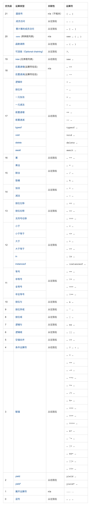

# JavaScript 从零单排(一)<!-- omit in toc -->

<details markdown="1">
  <summary>目录</summary>

- [数据类型](#数据类型)
  - [值类型和引用类型](#值类型和引用类型)
  - [函数参数按值传递](#函数参数按值传递)
- [类型检测](#类型检测)
  - [typeof](#typeof)
  - [instanceof](#instanceof)
  - [Object.prototype.toString](#objectprototypetostring)
  - [isObject](#isobject)
  - [isEmptyObject](#isemptyobject)
  - [isInteger](#isinteger)
  - [`Object.is` / `Array.isArray` / `Number.isInteger` / `isNaN` / `Number.isNaN`](#objectis--arrayisarray--numberisinteger--isnan--numberisnan)
  - [isPrime](#isprime)
- [类型转换](#类型转换)
  - [转换成布尔值](#转换成布尔值)
  - [转换成数字](#转换成数字)
  - [转换成字符串](#转换成字符串)
  - [转换成 JSON](#转换成-json)
  - [原始类型与实例对象的自动转换](#原始类型与实例对象的自动转换)
  - [对象转换成原始类型](#对象转换成原始类型)
  - [面试题：如何让 `if(a == 1 && a == 2 && a == 3)` 条件成立？](#面试题如何让-ifa--1--a--2--a--3-条件成立)
  - [面试题：为什么 `['1', '2', '3'].map(parseInt)` 返回 `[1,NaN,NaN]` ？](#面试题为什么-1-2-3mapparseint-返回-1nannan-)
  - [面试题：请实现一个 add 函数，满足以下功能。](#面试题请实现一个-add-函数满足以下功能)
- [运算符](#运算符)
  - [二元运算符 + 连接字符串](#二元运算符--连接字符串)
  - [数字转化，一元运算符 +](#数字转化一元运算符-)
  - [比较运算符](#比较运算符)
  - [原地修改 / 自增 / 自减](#原地修改--自增--自减)
  - [位运算符](#位运算符)
  - [逗号运算符](#逗号运算符)
  - [逻辑运算符](#逻辑运算符)
    - [或运算寻找第一个真值](#或运算寻找第一个真值)
    - [与运算寻找第一个假值](#与运算寻找第一个假值)
    - [感叹符号 `!` 表示布尔非运算符。](#感叹符号--表示布尔非运算符)
  - [空值合并运算符 '??'](#空值合并运算符-)
  - [可选链 "?."](#可选链-)
  - [运算符优先级](#运算符优先级)
- [循环](#循环)

</details>


## 数据类型

JavaScript 中有八种基本的数据类型（前七种为基本数据类型，也称为原始类型，而 `object` 为复杂数据类型）。

- `number` 用于任何类型的数字：整数或浮点数，在 `±(2^53-1)` 范围内的整数。
- `bigint` 用于任意长度的整数。
- `string` 用于字符串：一个字符串可以包含 `0` 个或多个字符，所以没有单独的单字符类型。
- `boolean` 用于 `true` 和 `false`。
- `null` 用于未知的值 —— 只有一个 `null` 值的独立类型。
- `undefined` 用于未定义的值 —— 只有一个 `undefined` 值的独立类型。
- `symbol` 用于唯一的标识符。
- `object` 用于更复杂的数据结构。

### 值类型和引用类型

**值类型**：字符串（string）、数值（number）、布尔值（boolean）、undefined、null、symbol、bigInt

> 值类型保存在栈中，值类型赋值之后两个变量互不影响

```js
let foo = 1
let bar = foo

bar = 2
console.log(foo, bar) // 1, 2
```

**引用类型**：对象（Object）、数组（Array）、函数（Function）...

> 引用类型保存在堆中，栈中保存的是引用类型的指针，引用类型赋值之后，两个变量具有相同的引用，指向同一个对象，相互之间有影响

```js
let foo = { a: 1, b: 2 }
var bar = foo

bar.a = 2

console.log(foo, bar) // { a: 2, b: 2 }, { a: 2, b: 2 }
```

### 函数参数按值传递

> 在向参数传递基本类型的值时，被传递的值会被复制给一个局部变量
>
> 在向参数传递引用类型的值时，会把这个引用类型的地址复制给一个局部变量，因此在函数内部修改参数，将会影响到原始值

```js
function test(person) {
  person.name = 'chu'
  person = { name: 'bar', age: 18 }
  return person
}
const p1 = { name: 'foo', age: 25 }
const p2 = test(p1)
console.log(p1) // -> { name: 'chu', age: 25 }
console.log(p2) // -> { name: 'bar', age: 18 }
```

## 类型检测

### typeof

`typeof` 运算符返回参数的类型。

它支持两种语法形式：

- 作为运算符：`typeof x`。
- 函数形式：`typeof(x)`。

```js
console.log(typeof null) // 'object'
console.log(typeof Array.isArray) // 'function'
console.log(typeof typeof Array.isArray) // 'string'
```

### instanceof

```js
function myInstanceof(left, right) {
  //基本数据类型直接返回false
  if (typeof left !== 'object' || left === null) return false
  //getPrototypeOf 是 Object 对象自带的一个方法，相当于 xxx.__proto__
  let proto = Object.getPrototypeOf(left)
  while (true) {
    //查找到尽头，还没找到
    if (proto === null) return false
    //找到相同的原型对象
    if (proto === right.prototype) return true
    proto = Object.getPrototypeOf(proto)
  }
}

console.log(myInstanceof(Number(1), Number)) // false
console.log(myInstanceof(new Date(), Date)) // true
```

### Object.prototype.toString

```js
Object.prototype.toString.call(2) // "[object Number]"
Object.prototype.toString.call('') // "[object String]"
Object.prototype.toString.call(true) // "[object Boolean]"
Object.prototype.toString.call(undefined) // "[object Undefined]"
Object.prototype.toString.call(null) // "[object Null]"
Object.prototype.toString.call(Math) // "[object Math]"
Object.prototype.toString.call({}) // "[object Object]"
Object.prototype.toString.call([]) // "[object Array]"
Object.prototype.toString.call(/\d/) // "[object RegExp]"
Object.prototype.toString.call(Array.isArray) // "[object Function]"
```

### isObject

```js
// Object 方法的参数是一个对象，它总是返回该对象，即不用转换。
function isObject(value) {
  return value === Object(value)
}
```

### isEmptyObject

```js
function isEmptyObject(obj) {
  if (typeof obj !== 'object' || obj === null) return false
  return Object.keys(obj).length === 0 ? true : false
}

console.log(isEmptyObject({})) // true
console.log(isEmptyObject([])) // true 空数组算空对象吗？
```

### isInteger

```js
// 整数取整还是整数
function isInteger(num) {
  return typeof num === 'number' && (num | 0) === num ? true : false
}

console.log(isInteger(1)) // true
console.log(isInteger(1.1)) // false
```

### `Object.is` / `Array.isArray` / `Number.isInteger` / `isNaN` / `Number.isNaN`

```js
console.log(Object.is(+0, -0)) // false
console.log(Object.is(NaN, NaN)) // true

console.log(Array.isArray([])) // true
console.log(Array.isArray({})) // false

console.log(Number.isInteger('1')) // false
console.log(Number.isInteger(1)) //true

console.log(Number.isNaN(NaN)) // true
console.log(isNaN(NaN)) // true

console.log(isNaN({})) // true 先 Number(...)
console.log(Number.isNaN({})) // false
```

### isPrime

```js
// 素数只能被自己和 1 整除不含 1 , 2 是素数
// 判断素数只要判断到开方就行，false 跳出条件是 num % i === 0

function isPrime(num) {
  if (typeof num === 'number' && (num | 0) === num) {
    if (num <= 1) return false
    const N = Math.floor(Math.sqrt(num))
    let primeState = true
    for (let i = 2; i <= N; i++) {
      if (num % i === 0) {
        primeState = false
        break
      }
    }
    return primeState
  } else {
    return false
  }
}

console.log(isPrime(2)) // true
console.log(isPrime(87)) // false
console.log(isPrime(77)) // false
```

## 类型转换

### 转换成布尔值

在 JavaScript 中，只有 `7` 种值可以被转换成 `false`，其他都会被转换成 `true`。

```js
console.log(Boolean(false)) // false

console.log(Boolean(undefined)) // false
console.log(Boolean(null)) // false
console.log(Boolean(+0)) // false
console.log(Boolean(-0)) // false
console.log(Boolean(NaN)) // false
console.log(Boolean('')) // false
console.log(Boolean(0n)) // false
```

### 转换成数字

```js
console.log(Number('')) // 0
console.log(Number(undefined)) // NaN
console.log(Number(null)) // 0
console.log(Number([])) // 0
console.log(Number([1, 2, 3])) // NaN
console.log(Number({})) // NaN
```

### 转换成字符串

```js
console.log(String([]) === '') // true
console.log(String({})) // "[object Object]"
```

### 转换成 JSON

```js
const obj = {
  toJSON() {
    return 'hello world'
  }
}

console.log(JSON.stringify(obj)) // "hello world"
```

### 原始类型与实例对象的自动转换

```js
console.log('hello world'.length) // 11
```

> 上面代码中，`'hello world'` 是一个字符串，本身不是对象，不能调用 length 属性。
>
> JavaScript 引擎自动将其转为包装对象，在这个对象上调用 length 属性。
>
> 调用结束后，这个临时对象就会被销毁。这就叫原始类型与实例对象的自动转换。

### 对象转换成原始类型

```js
const obj = {
  value: 3,
  valueOf: () => 4,
  toString: () => '5',
  [Symbol.toPrimitive]: () => 6
}
```

- 三者都存在，转换成原始类型会优先调用 `[Symbol.toPrimitive]` 的返回值。

  ```js
  console.log(String(obj)) // '6'
  console.log(Number(obj)) // 6
  ```

- `[Symbol.toPrimitive]` 不存在，`String` 会调用 `toString`，`Number` 会调用 `valueOf`。

  ```js
  console.log(String(obj)) // '5'
  console.log(Number(obj)) // 4
  ```

- 只有 `toString` 存在，`String` 会调用 `toString`，`Number` 也会调用 `toString`，然后会使用 `Number` 把字符串转换成数字。

  ```js
  console.log(String(obj)) // '5'
  console.log(Number(obj)) // 5
  ```

- 只有 `valueOf` 存在，`Number` 会调用 `valueOf`，`String` 会调用 `Object.prototype.toString`

  ```js
  console.log(String(obj)) // '[object Object]'
  console.log(Number(obj)) // 4
  ```

- 都不存在，`String` 会调用 `Object.prototype.toString`，`Number` 也会调用 `Object.prototype.toString`，然后会使用 `Number` 把字符串转换成数字。

  ```js
  console.log(String(obj)) // '[object Object]'
  console.log(Number(obj)) // NaN
  ```

### 面试题：如何让 `if(a == 1 && a == 2 && a == 3)` 条件成立？

解法一：

```js
const a = {
  i: 1,
  toString() {
    return this.i++
  }
}
if (a == 1 && a == 2 && a == 3) {
  console.log('success')
}
```

解法二：

```js
const a = {
  i: [1, 2, 3],
  valueOf() {
    return this.i.shift()
  }
}
if (a == 1 && a == 2 && a == 3) {
  console.log('success')
}
```

解法三：`===` 也行

```js
window.val = 1
Object.defineProperty(window, 'a', {
  get: () => this.val++
})

if (a == 1 && a == 2 && a == 3) {
  console.log('success')
}
```

### 面试题：为什么 `['1', '2', '3'].map(parseInt)` 返回 `[1,NaN,NaN]` ？

- `parseInt` 方法用于将字符串转为整数。
- `parseInt` 的参数不是字符串，会先转为字符串再转换。
- `parseInt` 方法还可以接受第二个参数（2 到 36 之间），如果第二个参数不是数值，会被自动转为一个整数。这个整数只有在 2 到 36 之间，才能得到有意义的结果，超出这个范围，则返回 NaN。如果第二个参数是 `0`、`undefined` 和 `null`，则直接忽略。
- 二进制只能转换含有'0'、'1'的字符串，其他进制也类似。
- `parseInt` 的返回值只有两种可能，要么是一个十进制整数，要么是 NaN。

### 面试题：请实现一个 add 函数，满足以下功能。

分析：链式调用的实现？链式操作，操作返回自身

小试牛刀：

```js
add(1); 	// 1
add(1)(2);  	// 3
add(1)(2)(3)；  // 6
```

实现：

```js
const add = sum => {
  const fn = n => add(n + sum)
  fn.valueOf = () => sum
  return fn
}

console.log(+add(1)) // 1
console.log(+add(1)(2)) // 3
console.log(+add(1)(2)(3)) // 6
```

扩展：

```
add(1)(2, 3);   // 6
add(1, 2)(3);   // 6
add(1, 2, 3);   // 6
```

```js
const add = (...sums) => {
  sums = sums.reduce((acc, cur) => acc + cur)
  const fn = (...args) => {
    args = args.reduce((acc, cur) => acc + cur)
    return add(sums + args)
  }
  fn.valueOf = () => sums
  return fn
}

console.log(+add(1)(2, 3)) // 6
console.log(+add(1, 2)(3)) // 6
console.log(+add(1, 2, 3)) // 6
```

## 运算符

### 二元运算符 + 连接字符串

通常，加号 `+` 用于求和。但是如果加号 `+` 被应用于字符串，它将合并（连接）各个字符串：

```js
console.log('2' + 2) // "22"
console.log(2 + 2 + '2') // "42"，不是 "222"
```

**注意：只要任意一个运算元是字符串，那么另一个运算元也将被转化为字符串。**

其他算术运算符只对数字起作用，并且总是将其运算元转换为数字。

### 数字转化，一元运算符 +

一元运算符加号，或者说，加号 + 应用于单个值，对数字没有任何作用。但是如果运算元不是数字，加号 + 则会将其转化为数字。

例如：

```js
// 对数字无效
let x = 1
console.log(+x) // 1

// 转化非数字
console.log(+true) // 1
console.log(+'') // 0
```

它的效果和 `Number(...)` 相同。

### 比较运算符

1. 比较运算符始终返回布尔值。
1. 字符串的比较，会按照“词典”顺序逐字符地比较大小。
1. 当对不同类型的值进行比较时，它们会先被转化为数字（不包括严格相等检查）再进行比较。
1. 在非严格相等 `==` 下，`null` 和 `undefined` 相等且各自不等于任何其他的值。
1. 在使用 `>` 或 `<` 进行比较时，需要注意变量可能为 `null/undefined` 的情况。比较好的方法是单独检查变量是否等于 `null/undefined`。

```js
console.log(null > 0) // false (3)
console.log(null == 0) // false (4)
console.log(null >= 0) // true (3)
console.log(undefined > 0) // false (3)
console.log(undefined < 0) // false (3)
console.log(undefined == 0) // false (4)
```

### 原地修改 / 自增 / 自减

我们经常需要对一个变量做运算，并将新的结果存储在同一个变量中。

例如：

```js
let n = 2
n += 5 // 现在 n = 7（等同于 n = n + 5）
n *= 2 // 现在 n = 14（等同于 n = n * 2）

console.log(n) // 14
```

这类运算符的优先级与普通赋值运算符的优先级相同，所以它们在大多数其他运算之后执行：

```js
let n = 2
n *= 3 + 5

alert(n) // 16 （右边部分先被计算，等同于 n *= 8）
```

对一个数进行加一、减一是最常见的数学运算符之一。

所以，对此有一些专门的运算符：

**自增 ++ 将变量与 1 相加、自减 -- 将变量与 1 相减：**

```js
// 以下代码中变量 a、b、c、d 的最终值分别是多少？

let a = 1,
  b = 1
let c = ++a // ?
let d = b++ // ?

// a = 2, b = 2, c = 2, d = 1
```

### 位运算符

使用 `&` 运算符判断一个数的奇偶

```js
// 偶数 & 1 = 0
// 奇数 & 1 = 1
console.log(2 & 1) // 0
console.log(3 & 1) // 1
```

使用 `~`, `>>`, `<<`, `>>>`, `|` 来取整

```js
console.log(~~6.83) // 6
console.log(6.83 >> 0) // 6
console.log(6.83 << 0) // 6
console.log(6.83 | 0) // 6
// >>>不可对负数取整
console.log(6.83 >>> 0) // 6
```

使用 `^` 来完成值交换

```js
var a = 5
var b = 8
a ^= b
b ^= a
a ^= b
console.log(a) // 8
console.log(b) // 5
```

### 逗号运算符

逗号运算符 `,` 是最少见最不常使用的运算符之一。有时候它会被用来写更简短的代码，因此为了能够理解代码，我们需要了解它。

```js
let a = (1 + 2, 3 + 4)
console.log( a ) // 7（3 + 4 的结果）

// 一行上有三个运算符
for (a = 1, b = 3, c = a * b; a < 10; a++) {
 ...
}
```

逗号运算符能让我们处理多个语句，使用 `,` 将它们分开。每个语句都运行了，但是只有最后的语句的结果会被返回。

### 逻辑运算符

JavaScript 中有三个逻辑运算符：`||`（或），`&&`（与），`!`（非）。

> 非运算符 ! 的优先级在所有逻辑运算符里面最高，所以它总是在 && 和 || 之前执行。
> 与运算 && 在或运算 || 之前进行
> 与运算 && 的优先级比或运算 || 要高。

所以代码 `a && b || c && d` 跟 `&&` 表达式加了括号完全一样：`(a && b) || (c && d)`。

#### 或运算寻找第一个真值

或运算符 `||` 做了如下的事情：

- 从左到右依次计算操作数。
- 处理每一个操作数时，都将其转化为布尔值。如果结果是 `true`，就停止计算，返回这个操作数的初始值。
- 如果所有的操作数都被计算过（也就是，转换结果都是 `false`），则返回最后一个操作数。
- 返回的值是操作数的初始形式，不会做布尔转换。

换句话说，**一个或运算 `||` 的链，将返回第一个真值，如果不存在真值，就返回该链的最后一个值。**

例如：

```js
console.log(1 || 0) // 1（1 是真值）
console.log(null || 1) // 1（1 是第一个真值）
console.log(null || 0 || 1) // 1（第一个真值）
console.log(undefined || null || 0) // 0（都是假值，返回最后一个值）
```

#### 与运算寻找第一个假值

与运算 `&&` 做了如下的事：

- 从左到右依次计算操作数。
- 在处理每一个操作数时，都将其转化为布尔值。如果结果是 `false`，就停止计算，并返回这个操作数的初始值。
- 如果所有的操作数都被计算过（例如都是真值），则返回最后一个操作数。
- 换句话说，**与运算返回第一个假值，如果没有假值就返回最后一个值。**

上面的规则和或运算很像。区别就是与运算返回第一个假值，而或运算返回第一个真值。

例如：

```js
// 如果第一个操作数是真值，
// 与运算返回第二个操作数：
console.log(1 && 0) // 0
console.log(1 && 5) // 5

// 如果第一个操作数是假值，
// 与运算将直接返回它。第二个操作数会被忽略
console.log(null && 5) // null
console.log(0 && 'no matter what') // 0
```

#### 感叹符号 `!` 表示布尔非运算符。

逻辑非运算符接受一个参数，并按如下运作：

- 将操作数转化为布尔类型：`true/false`。
- 返回相反的值。

例如：

```js
console.log(!true) // false
console.log(!0) // true
```

两个非运算 `!!` 有时候用来将某个值转化为布尔类型，等同于内置的 `Boolean` 函数：

```js
console.log(!!'non-empty string') // true
console.log(!!null) // false
console.log(Boolean('non-empty string')) // true
console.log(Boolean(null)) // false
```

也就是，第一个非运算将该值转化为布尔类型并取反，第二个非运算再次取反。最后我们就得到了一个任意值到布尔值的转化。

### 空值合并运算符 '??'

- 如果第一个参数不是 `null/undefined`，则 `??` 返回第一个参数。否则，返回第二个参数。
- 与 `||` 相比，`||` 无法区分 `false`、`0`、空字符串 `""` 和 `null/undefined`。它们都一样 —— 假值（falsy values）。如果其中任何一个是 `|`| 的第一个参数，那么我们将得到第二个参数作为结果。
- `??` 运算符的优先级非常低，仅略高于 `?` 和 `=`，因此在表达式中使用它时请考虑添加括号。
- 如果没有明确添加括号，不能将其与 `||` 或 `&&` 一起使用。

```js
let user1
console.log(user1 ?? 'Anonymous') // Anonymous
let user2 = 'John'
console.log(user2 ?? 'Anonymous') // John
```

### 可选链 "?."

可选链 `?.` 语法有三种形式：

1. `obj?.prop` —— 如果 `obj` 存在则返回 `obj.prop`，否则返回 `undefined`。
2. `obj?.[prop]` —— 如果 `obj` 存在则返回 `obj[prop]`，否则返回 `undefined`。
3. `obj.method?.()` —— 如果 `obj.method` 存在则调用 `obj.method()`，否则返回 `undefined`。

正如我们所看到的，这些语法形式用起来都很简单直接。`?.` 检查左边部分是否为 `null/undefined`，如果不是则继续运算。

`?.` 链使我们能够安全地访问嵌套属性。

### 运算符优先级



## 循环

- 通常条件为假时，循环会终止。但我们随时都可以使用 break 指令强制退出。
- `continue` 指令是 `break` 的“轻量版”。它不会停掉整个循环。而是停止当前这一次迭代，并强制启动新一轮循环（如果条件允许的话）。
- `switch` 语句有至少一个 `case` 代码块和一个可选的 `default` 代码块。如果没有 `break`，程序将不经过任何检查就会继续执行下一个 `case`。
- `switch/case` 有通过 `case` 进行“分组”的能力，其实是 `switch `语句没有 `break` 时的副作用。
- for 循环还有一个特别之处，就是设置循环变量的那部分是一个父作用域，而循环体内部是一个单独的子作用域。

```js
const arr = [1, 2, 3]

for (let i = 0; i < arr.length; i++) {
  const i = 'abc'
  // 循环体中的作用域是括号中作用域的子作用域
  console.log(i)
}

console.log(i) // i is not defined
```
