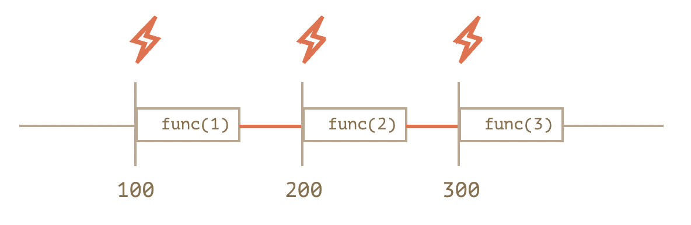
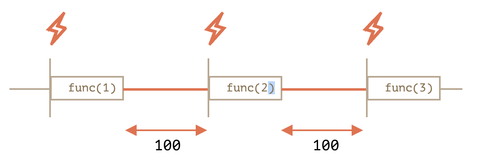

# JavaScript 基础知识梳理(七)<!-- omit in toc -->

- [声明](#声明)
- [Symbol 类型](#symbol-类型)
- [setTimeout 和 setInterval](#settimeout-和-setinterval)
  - [setTimeout](#settimeout)
  - [嵌套的 setTimeout](#嵌套的-settimeout)
- [错误处理，"try..catch"](#错误处理trycatch)
- [Eval](#eval)
- [Reference Type](#reference-type)
- [柯里化（Currying）](#柯里化currying)
- [Proxy](#proxy)
- [Reflect](#reflect)
- [Module](#module)
- [globalThis](#globalthis)
- [链判断操作符(?.)](#链判断操作符)

## 声明

- [x] var 命令：声明变量（存在变量提升）
- [x] let 命令：声明变量
- [x] const 命令：声明常量
- [x] function：声明函数
- [x] class：声明类
- [x] import

> ⚠️ 注意

- `let 命令`和`const 命令`不允许重复声明
- 未定义就使用会报错：`const 命令`和`let 命令`不存在变量提升
- `const 命令`声明常量后必须立马赋值，`let 命令`声明变量后可立马赋值或使用时赋值
- 暂时性死区：在代码块内使用`const 命令`和`let 命令`声明变量之前，该变量都不可用
- 作用域：`const 命令`和`let 命令`只能在代码块中执行———`块级作用域`，`var 命令`在全局代码中执行——`全局作用域`，for 循环中设置循环变量的那部分是一个父作用域，而循环体内部是一个单独的子作用域。
- `const 命令`实际上保证的，并不是变量的值不得改动，而是变量指向的那个内存地址所保存的数据不得改动。

```js
// 暂时性死区：在代码块内使用`const 命令`和`let 命令`声明变量之前，该变量都不可用，`let 命令`不同作用域可以重复声明的副作用。
let j = 1
!function () {
  console.log(j) // Cannot access 'j' before initialization
  let j = 2
}()

const foo = {}
// 为 foo 添加一个属性，可以成功
foo.prop = 123
console.log(foo) // { prop: 123 }

// 将 foo 指向另一个对象，就会报错
foo = {} // TypeError: Assignment to constant variable
```

## Symbol 类型

- [x] 定义：独一无二的值
- [x] 声明：`const set = Symbol(str)`
- [x] 入参：字符串(可选)

`Symbol` 保证是唯一的。即使我们创建了许多具有相同描述的 `Symbol`，它们的值也是不同。描述只是一个标签，不影响任何东西。

```js
let id1 = Symbol("id");
let id2 = Symbol("id");

alert(id1 == id2); // false
```

通常所有的 `Symbol` 都是不同的，即使它们有相同的名字。但有时我们想要名字相同的 `Symbol` 具有相同的实体。例如，应用程序的不同部分想要访问的 `Symbol "id"` 指的是完全相同的属性。为了实现这一点，这里有一个 全局 `Symbol` 注册表。

```js
// 从全局注册表中读取
let id = Symbol.for("id"); // 如果该 Symbol 不存在，则创建它

// 再次读取（可能是在代码中的另一个位置）
let idAgain = Symbol.for("id");

// 相同的 Symbol
alert( id === idAgain ); // true
```

对于全局 `Symbol`，不仅有 `Symbol.for(key)` 按名字返回一个 `Symbol`，还有一个反向调用：`Symbol.keyFor(sym)`，它的作用完全反过来：通过全局 `Symbol` 返回一个名字。

```js
// 通过 name 获取 Symbol
let sym = Symbol.for("name");
let sym2 = Symbol.for("id");

// 通过 Symbol 获取 name
alert( Symbol.keyFor(sym) ); // name
alert( Symbol.keyFor(sym2) ); // id
```

- `Symbol` 属性不参与 `for..in` 循环。
- `Object.keys/values/entries` 会忽略 `symbol` 属性
- `Object.assign` 会同时复制字符串和 `symbol` 属性

## setTimeout 和 setInterval

### setTimeout

- [x] `setTimeout(func, delay, ...args)` 和 `setInterval(func, delay, ...args)` 方法允许我们在 `delay` 毫秒之后运行 `func` 一次或以 `delay` 毫秒为时间间隔周期性运行 `func`。

- [x] 要取消函数的执行，我们应该调用 `clearInterval/clearTimeout`，并将 `setInterval/setTimeout` 返回的值作为入参传入。

- [x] 零延时调度 `setTimeout(func, 0)`（与 `setTimeout(func)` 相同）用来调度需要尽快执行的调用，但是会在当前脚本执行完成后进行调用。

- [x] 浏览器会将 `setTimeout` 或 `setInterval` 的五层或更多层嵌套调用（调用五次之后）的最小延时限制在 4ms。这是历史遗留问题。

> 所有的调度方法都不能 **保证** 确切的延时。

浏览器内的计时器可能由于许多原因而变慢：

- CPU 过载。
- 浏览器页签处于后台模式。
- 笔记本电脑用的是电池供电（译注：使用电池供电会以降低性能为代价提升续航）。
  
所有这些因素，可能会将定时器的最小计时器分辨率（最小延迟）增加到 300ms 甚至 1000ms，具体以浏览器及其设置为准。

### 嵌套的 setTimeout

嵌套的 `setTimeout` 能够精确地设置两次执行之间的延时，而 `setInterval` 却不能。

下面来比较这两个代码片段。第一个使用的是 `setInterval`：

```js
let i = 1;
setInterval(function() {
  func(i++);
}, 100);
```

第二个使用的是嵌套的 `setTimeout`：

```js
let i = 1;
setTimeout(function run() {
  func(i++);
  setTimeout(run, 100);
}, 100);
```



使用 `setInterval `时，`func` 函数的实际调用间隔要比代码中设定的时间间隔要短！

这也是正常的，因为 `func` 的执行所花费的时间“消耗”了一部分间隔时间。

也可能出现这种情况，就是 `func` 的执行所花费的时间比我们预期的时间更长，并且超出了 100 毫秒。

在这种情况下，JavaScript 引擎会等待 func 执行完成，然后检查调度程序，如果时间到了，则 立即 再次执行它。

极端情况下，如果函数每次执行时间都超过 delay 设置的时间，那么每次调用之间将完全没有停顿。



嵌套的 `setTimeout` 就能确保延时的固定（这里是 100 毫秒）。

这是因为下一次调用是在前一次调用完成时再调度的。

当一个函数传入 setInterval/setTimeout 时，将为其创建一个内部引用，并保存在调度程序中。这样，即使这个函数没有其他引用，也能防止垃圾回收器（GC）将其回收。

// 在调度程序调用这个函数之前，这个函数将一直存在于内存中
setTimeout(function() {...}, 100);
对于 setInterval，传入的函数也是一直存在于内存中，直到 clearInterval 被调用。

这里还要提到一个副作用。如果函数引用了外部变量（译注：闭包），那么只要这个函数还存在，外部变量也会随之存在。它们可能比函数本身占用更多的内存。因此，当我们不再需要调度函数时，最好取消它，即使这是个（占用内存）很小的函数。

## 错误处理，"try..catch"

## Eval
Eval：执行代码字符串
内建函数 eval 允许执行一个代码字符串。

语法如下：

let result = eval(code);
例如：

let code = 'alert("Hello")';
eval(code); // Hello
代码字符串可能会比较长，包含换行符、函数声明和变量等。

eval 的结果是最后一条语句的结果。

例如：

let value = eval('1+1');
alert(value); // 2
let value = eval('let i = 0; ++i');
alert(value); // 1
eval 内的代码在当前词法环境（lexical environment）中执行，因此它能访问外部变量：

let a = 1;

function f() {
  let a = 2;

  eval('alert(a)'); // 2
}

f();
它也可以更改外部变量：

let x = 5;
eval("x = 10");
alert(x); // 10，值被更改了
严格模式下，eval 有属于自己的词法环境。因此我们不能从外部访问在 eval 中声明的函数和变量：

// 提示：本教程所有可运行的示例都默认启用了严格模式 'use strict'

eval("let x = 5; function f() {}");

alert(typeof x); // undefined（没有这个变量）
// 函数 f 也不可从外部进行访问
如果不启用严格模式，eval 没有属于自己的词法环境，因此我们可以从外部访问变量 x 和函数 f。

## Reference Type

## 柯里化（Currying）


## Proxy

定义：修改某些操作的默认行为
声明：const proxy = new Proxy(target, handler)
入参

target：拦截的目标对象
handler：定制拦截行为


方法

Proxy.revocable()：返回可取消的Proxy实例(返回{ proxy, revoke }，通过revoke()取消代理)


拦截方式

get()：拦截对象属性读取
set()：拦截对象属性设置，返回布尔
has()：拦截对象属性检查k in obj，返回布尔
deleteProperty()：拦截对象属性删除delete obj[k]，返回布尔
defineProperty()：拦截对象属性定义Object.defineProperty()、Object.defineProperties()，返回布尔
ownKeys()：拦截对象属性遍历for-in、Object.keys()、Object.getOwnPropertyNames()、Object.getOwnPropertySymbols()，返回数组
getOwnPropertyDescriptor()：拦截对象属性描述读取Object.getOwnPropertyDescriptor()，返回对象
getPrototypeOf()：拦截对象原型读取instanceof、Object.getPrototypeOf()、Object.prototype.__proto__、Object.prototype.isPrototypeOf()、Reflect.getPrototypeOf()，返回对象
setPrototypeOf()：拦截对象原型设置Object.setPrototypeOf()，返回布尔
isExtensible()：拦截对象是否可扩展读取Object.isExtensible()，返回布尔
preventExtensions()：拦截对象不可扩展设置Object.preventExtensions()，返回布尔
apply()：拦截Proxy实例作为函数调用proxy()、proxy.apply()、proxy.call()
construct()：拦截Proxy实例作为构造函数调用new proxy()


应用场景


Proxy.revocable()：不允许直接访问对象，必须通过代理访问，一旦访问结束就收回代理权不允许再次访问
get()：读取未知属性报错、读取数组负数索引的值、封装链式操作、生成DOM嵌套节点
set()：数据绑定(Vue数据绑定实现原理)、确保属性值设置符合要求、防止内部属性被外部读写
has()：隐藏内部属性不被发现、排除不符合属性条件的对象
deleteProperty()：保护内部属性不被删除
defineProperty()：阻止属性被外部定义
ownKeys()：保护内部属性不被遍历


重点难点


要使Proxy起作用，必须针对实例进行操作，而不是针对目标对象进行操作
没有设置任何拦截时，等同于直接通向原对象
属性被定义为不可读写/扩展/配置/枚举时，使用拦截方法会报错
代理下的目标对象，内部this指向Proxy代理

## Reflect

定义：保持Object方法的默认行为
方法

get()：返回对象属性
set()：设置对象属性，返回布尔
has()：检查对象属性，返回布尔
deleteProperty()：删除对象属性，返回布尔
defineProperty()：定义对象属性，返回布尔
ownKeys()：遍历对象属性，返回数组(Object.getOwnPropertyNames()+Object.getOwnPropertySymbols())
getOwnPropertyDescriptor()：返回对象属性描述，返回对象
getPrototypeOf()：返回对象原型，返回对象
setPrototypeOf()：设置对象原型，返回布尔
isExtensible()：返回对象是否可扩展，返回布尔
preventExtensions()：设置对象不可扩展，返回布尔
apply()：绑定this后执行指定函数
construct()：调用构造函数创建实例


设计目的


将Object属于语言内部的方法放到Reflect上
将某些Object方法报错情况改成返回false
让Object操作变成函数行为
Proxy与Reflect相辅相成


废弃方法


Object.defineProperty() => Reflect.defineProperty()
Object.getOwnPropertyDescriptor() => Reflect.getOwnPropertyDescriptor()


重点难点


Proxy方法和Reflect方法一一对应
Proxy和Reflect联合使用，前者负责拦截赋值操作，后者负责完成赋值操作


数据绑定：观察者模式

const observerQueue = new Set();
const observe = fn => observerQueue.add(fn);
const observable = obj => new Proxy(obj, {
    set(tgt, key, val, receiver) {
        const result = Reflect.set(tgt, key, val, receiver);
        observerQueue.forEach(v => v());
        return result;
    }
});

const person = observable({ age: 25, name: "Yajun" });
const print = () => console.log(`${person.name} is ${person.age} years old`);
observe(print);
person.name = "Joway";

## Module

命令

export：规定模块对外接口

默认导出：export default Person(导入时可指定模块任意名称，无需知晓内部真实名称)
单独导出：export const name = "Bruce"
按需导出：export { age, name, sex }(推荐)
改名导出：export { name as newName }


import：导入模块内部功能

默认导入：import Person from "person"
整体导入：import * as Person from "person"
按需导入：import { age, name, sex } from "person"
改名导入：import { name as newName } from "person"
自执导入：import "person"
复合导入：import Person, { name } from "person"


复合模式：export命令和import命令结合在一起写成一行，变量实质没有被导入当前模块，相当于对外转发接口，导致当前模块无法直接使用其导入变量

默认导入导出：export { default } from "person"
整体导入导出：export * from "person"
按需导入导出：export { age, name, sex } from "person"
改名导入导出：export { name as newName } from "person"
具名改默认导入导出：export { name as default } from "person"
默认改具名导入导出：export { default as name } from "person"


继承：默认导出和改名导出结合使用可使模块具备继承性
设计思想：尽量地静态化，使得编译时就能确定模块的依赖关系，以及输入和输出的变量
严格模式：ES6模块自动采用严格模式(不管模块头部是否添加use strict)


模块方案


CommonJS：用于服务器(动态化依赖)
AMD：用于浏览器(动态化依赖)
CMD：用于浏览器(动态化依赖)
UMD：用于浏览器和服务器(动态化依赖)
ESM：用于浏览器和服务器(静态化依赖)


加载方式


运行时加载

定义：整体加载模块生成一个对象，再从对象上获取需要的属性和方法进行加载(全部加载)
影响：只有运行时才能得到这个对象，导致无法在编译时做静态优化


编译时加载

定义：直接从模块中获取需要的属性和方法进行加载(按需加载)
影响：在编译时就完成模块加载，效率比其他方案高，但无法引用模块本身(本身不是对象)，可拓展JS高级语法(宏和类型校验)


加载实现


传统加载：通过<script>进行同步或异步加载脚本

同步加载：<script src=""></script>
Defer异步加载：<script src="" defer></script>(顺序加载，渲染完再执行)
Async异步加载：<script src="" async></script>(乱序加载，下载完就执行)


模块加载：<script type="module" src=""></script>(默认是Defer异步加载)


CommonJS和ESM的区别


CommonJS输出值的拷贝，ESM输出值的引用

CommonJS一旦输出一个值，模块内部的变化就影响不到这个值
ESM是动态引用且不会缓存值，模块里的变量绑定其所在的模块，等到脚本真正执行时，再根据这个只读引用到被加载的那个模块里去取值


CommonJS是运行时加载，ESM是编译时加载

CommonJS加载模块是对象(即module.exports)，该对象只有在脚本运行完才会生成
ESM加载模块不是对象，它的对外接口只是一种静态定义，在代码静态解析阶段就会生成


Node加载


背景：CommonJS和ESM互不兼容，目前解决方案是将两者分开，采用各自的加载方案
区分：要求ESM采用.mjs后缀文件名

require()不能加载.mjs文件，只有import命令才可加载.mjs文件
.mjs文件里不能使用require()，必须使用import命令加载文件


驱动：node --experimental-modules file.mjs
限制：Node的import命令目前只支持加载本地模块(file:协议)，不支持加载远程模块
加载优先级

脚本文件省略后缀名：依次尝试加载四个后缀名文件(.mjs、.js、.json、node)
以上不存在：尝试加载package.json的main字段指定的脚本
以上不存在：依次尝试加载名称为index四个后缀名文件(.mjs、.js、.json、node)
以上不存在：报错


不存在的内部变量：arguments、exports、module、require、this、__dirname、__filename
CommonJS加载ESM

不能使用require()，只能使用import()


ESM加载CommonJS

自动将module.exports转化成export default
CommonJS输出缓存机制在ESM加载方式下依然有效
采用import命令加载CommonJS模块时，不允许采用按需导入，应使用默认导入或整体导入


循环加载


定义：脚本A的执行依赖脚本B，而脚本A的执行又依赖脚本B
加载原理

CommonJS：require()首次加载脚本就会执行整个脚本，在内存里生成一个对象缓存下来，二次加载脚本时直接从缓存中获取
ESM：import命令加载变量不会被缓存，而是成为一个指向被加载模块的引用


循环加载

CommonJS：只输出已经执行的部分，还未执行的部分不会输出
ESM：需开发者自己保证真正取值时能够取到值(可把变量写成函数形式，函数具有提升作用)


重点难点


ES6模块中，顶层this指向undefined，不应该在顶层代码使用this
一个模块就是一个独立的文件，该文件内部的所有变量，外部无法获取
export命令输出的接口与其对应的值是动态绑定关系，即通过该接口可获取模块内部实时的值
import命令大括号里的变量名必须与被导入模块对外接口的名称相同
import命令输入的变量只读(本质是输入接口)，不允许在加载模块的脚本里改写接口
import命令命令具有提升效果，会提升到整个模块的头部，首先执行
重复执行同一句import语句，只会执行一次
export default命令只能使用一次
export default命令导出的整体模块，在执行import命令时其后不能跟大括号
export default命令本质是输出一个名为default的变量，后面不能跟变量声明语句
export default命令本质是将后面的值赋给名为default的变量，可直接将值写在其后
export default命令和export {}命令可同时存在，对应复合导入
export命令和import命令可出现在模块任何位置，只要处于模块顶层即可，不能处于块级作用域
import()加载模块成功后，此模块会作为一个对象，当作then()的参数，可使用对象解构赋值来获取输出接口
同时动态加载多个模块时，可使用Promise.all()和import()相结合来实现
import()和结合async/await来书写同步操作的代码


单例模式：跨模块常量

// 常量跨文件共享
// person.js
const NAME = "Bruce";
const AGE = 25;
const SEX = "male";
export { AGE, NAME, SEX };
复制代码
// file1.js
import { AGE } from "person";
console.log(AGE);
复制代码
// file2.js
import { AGE, NAME, SEX } from "person";
console.log(AGE, NAME, SEX);
复制代码

默认导入互换整体导入

import Person from "person";
console.log(Person.AGE);
复制代码
import * as Person from "person";
console.log(Person.default.AGE);

## globalThis
globalThis：作为顶层对象，指向全局环境下的this
Browser：顶层对象是window
Node：顶层对象是global
WebWorker：顶层对象是self
以上三者：通用顶层对象是globalThis

## 链判断操作符(?.)
：是否存在对象属性(不存在返回undefined且不再往下执行)
对象属性：obj?.prop、obj?.[expr]
函数调用：func?.(...args)