# 我是如何使用 Mac 的<!-- omit in toc -->

## 给 Mac 硬件做健康检查

在使用 Mac 电脑的过程中，如果认为 Mac 可能存在硬件问题，[可以使用“Apple 诊断”来帮助确定可能存在故障的硬件组件](https://support.apple.com/zh-cn/HT202731)。

## 给 M1 芯片 Mac 重装系统

M1 芯片的 Mac 进入恢复模式很简单，就是先关机，然后长按电源键一直按住不动，直到出现图中这个 ⚙️ 的图标就算进入恢复模式了。

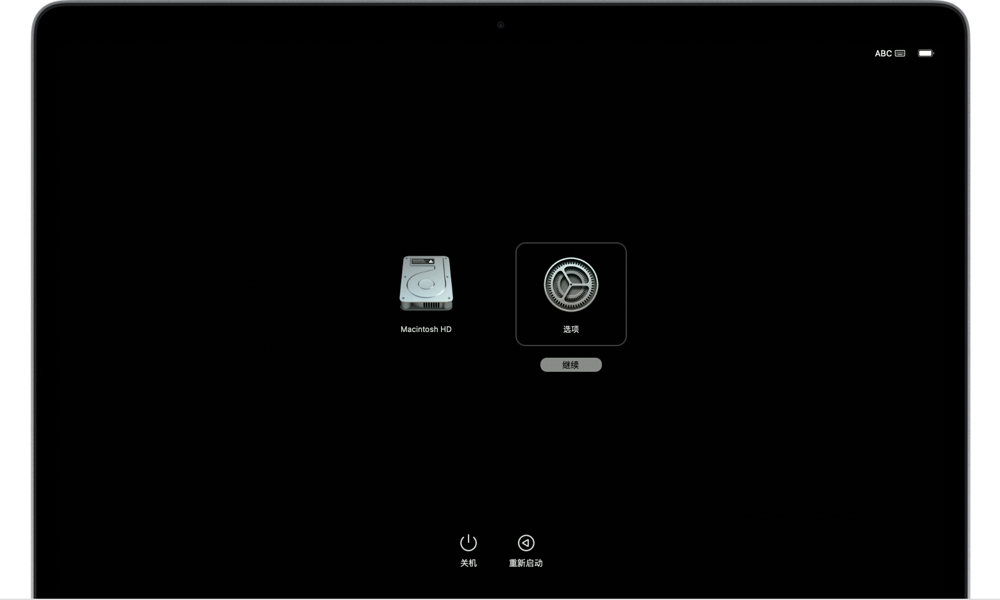

选择“选项”，然后点按“继续”。

如果是已有用户的话，应该会弹出用户图标以及输入密码登录界面，要求输入这个用户的管理员密码，请照做。

如果系统要求输入之前在这台 Mac 上使用过的 Apple ID 和密码，请照做。

接下来会提示 Mac 需要激活，所以必须连接网线或者 WiFi，这个界面没有出现 WiFi 的选项，实际在右上角，点击图标后就可以选择 WiFi，连接成功后点击下一步。Mac 会自动转圈显示激活成功。

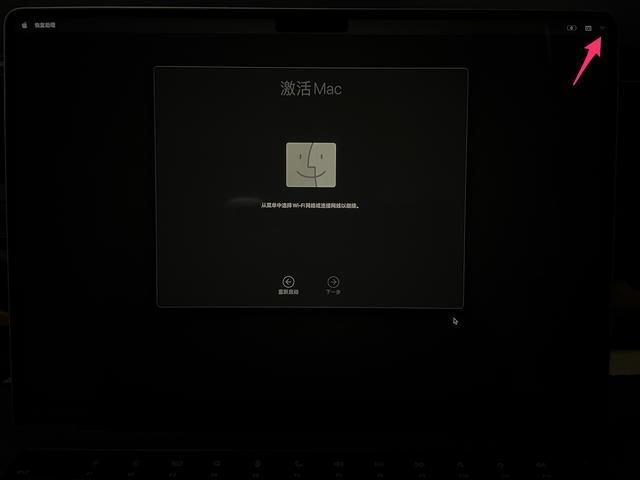

然后在这个界面会弹出熟悉的几个选项，这里先不要点击第二个重新安装 macOS 。

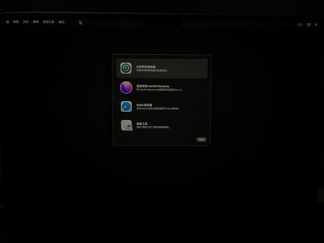

点击左上角的实用工具-终端。


输入 `resetpassword`， 回车。


在弹出的重设密码界面，不管显示啥不用去管，直接点击左上角的恢复助理-抹掉 Mac...

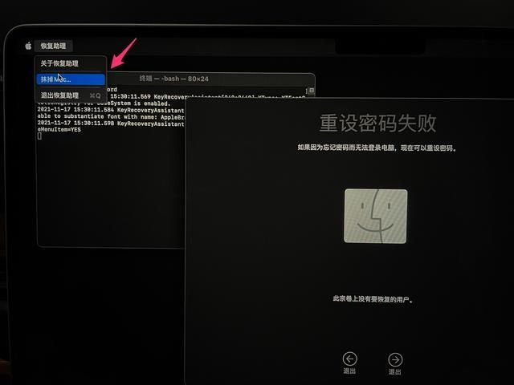

弹出的抹掉 Mac 界面，继续点下面的**小蓝字**，抹掉 Mac...

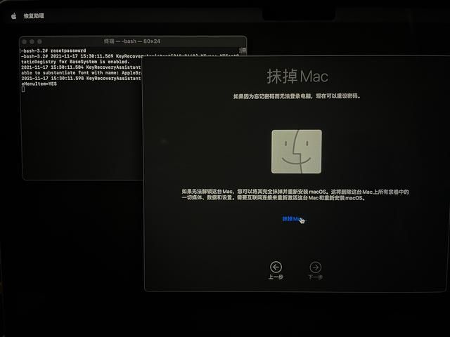

在弹出的警告图标选择抹掉 Mac 就可以了。

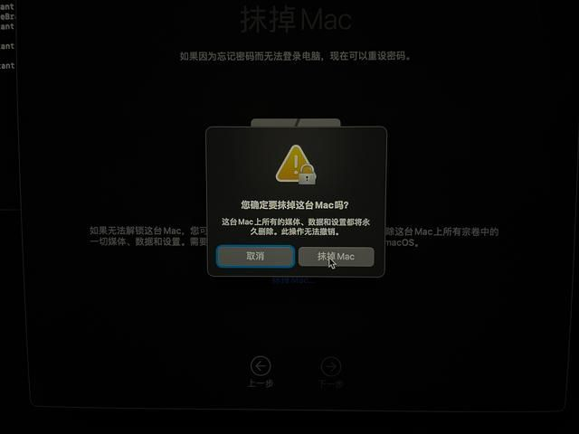

然后就是耐心得等待进度条加载完毕，就算抹掉成功了，不会太久。抹掉后可以看到和一开始的页面很像，这个页面就是提示激活 Mac，WiFi 图标还是右上角。

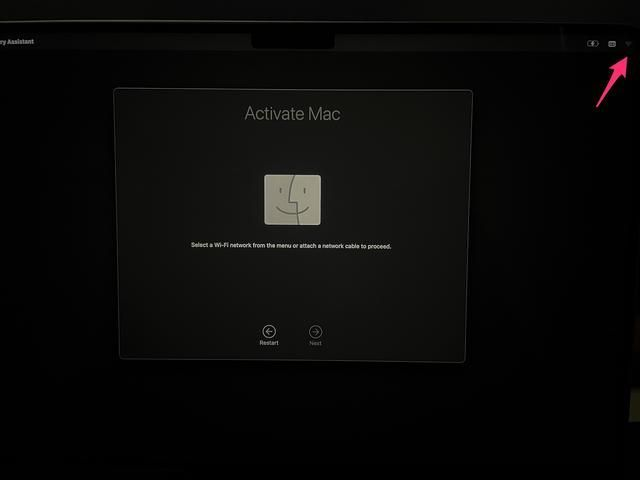

显示联网激活成功，点击下面的退出到恢复界面。

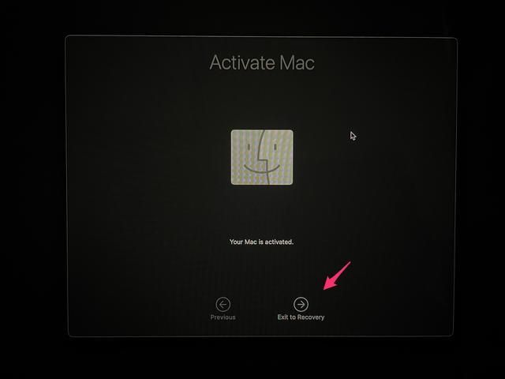

这个时候 Mac 就是干干净净的了，可以点击第二个选项开始重装系统了。

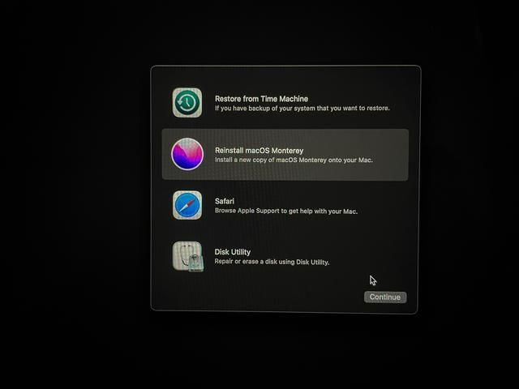

点击继续 Continue。

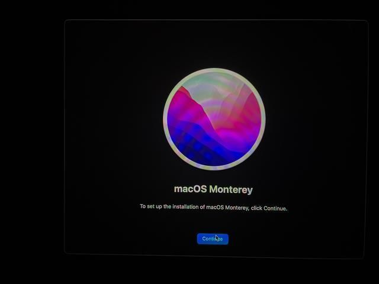

点击同意 Agree。

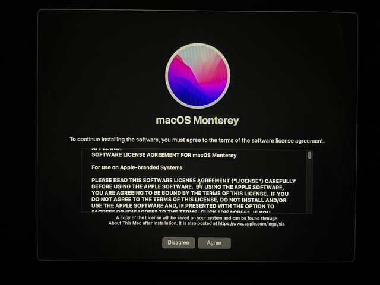

接下来就是就是纯粹的联网下载安装了。

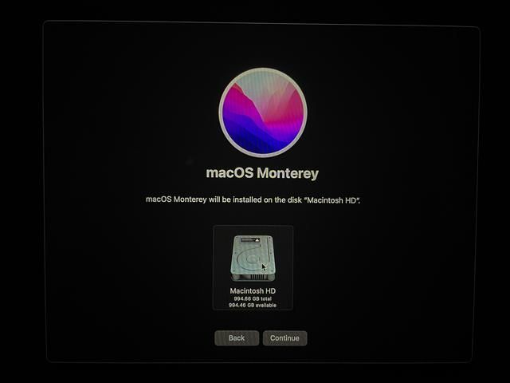

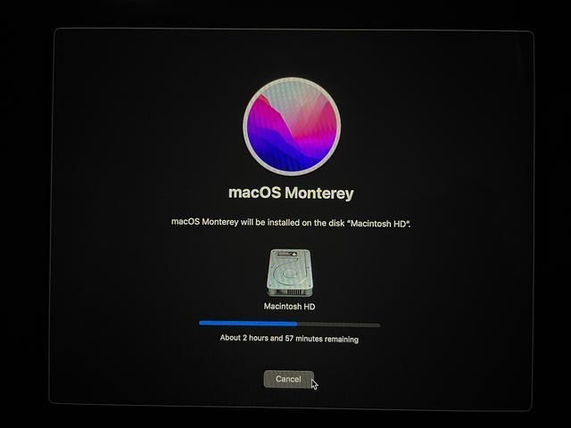

## Clash 代理

### Clash

- [Clash](https://github.com/Dreamacro/clash)：一个 Go 语言开发的多平台代理客户端
- [ClashX](https://github.com/yichengchen/clashX)：Clash 的一个简单轻量化的代理客户端
- [Clash for Windows](https://github.com/Fndroid/clash_for_windows_pkg)：Clash 的 Windows/macOS 跨平台可定制化的图形客户端

### 机场

- https://nsfwcloud.com/
- https://baicao.link/

### terminal 使用代理

通过设置 http_proxy、https_proxy，可以让终端走指定的代理。

```sh
export http_proxy=http://127.0.0.1:7890
export https_proxy=http://127.0.0.1:7890
```

> 7890 是 http 代理对应的端口，根据实际情况修改。

这里提供一个便捷脚本，里面包含打开、关闭功能：

```sh
function nogfw() {
    export http_proxy=http://127.0.0.1:1080
    export https_proxy=$http_proxy
    echo -e "终端代理已开启。"
}

function gfw(){
    unset http_proxy https_proxy
    echo -e "终端代理已关闭。"
}
```

通过 `nogfw` 启动代理，`gfw` 关闭代理。

接下来需要把脚本写入 `.zshrc`，`source ~/.zshrc` 就可以永久生效。

可以执行 `curl cip.cc` 验证

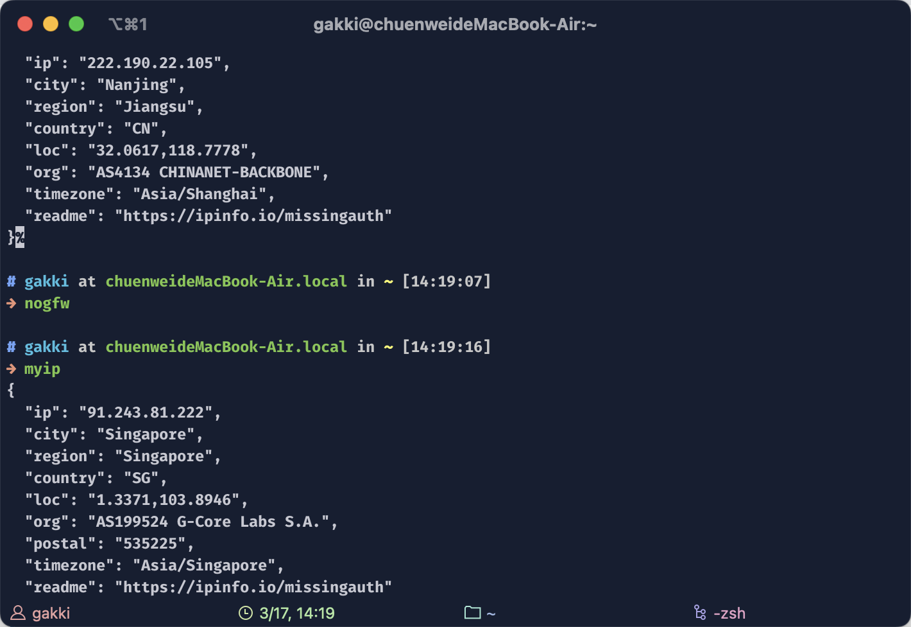

### 其他代理设置

#### git

```sh
# 设置
git config --global http.proxy 'socks5://127.0.0.1:1080' 
git config --global https.proxy 'socks5://127.0.0.1:1080'
```

```sh
# 恢复
git config --global --unset http.proxy
git config --global --unset https.proxy
```

#### npm

```sh
# 设置
npm config set proxy http://server:port
npm config set https-proxy http://server:port
```

```sh
# 恢复
npm config delete proxy
npm config delete https-proxy
```

### 常见问题

#### macOS 中“安全性与隐私”没有允许任何来源

为了安全，macOS 新版本已经默认屏蔽未知开发者选项，需要用命令手动开启

```sh
sudo spctl --master-disable
```

如果以后想撤消它，则可以返回 Terminal 并运行以下命令：

```sh
sudo spctl --master-enable
```

#### macOS DMG 安装后无法打开，提示损坏

网络下载应用被 Apple 添加隔离标识，终端输入命令解除即可：

```sh
# sudo xattr -r -d com.apple.quarantine

sudo xattr -r -d com.apple.quarantine <应用路径>

# 比如我装 M1 版本的语雀
sudo xattr -rd com.apple.quarantine /Applications/语雀.app
```

#### macOS 版本启动要求授权

在第一次或更新 APP 后打开软件会提示用户授权，这是因为需要安装/更新用于设置系统代理的工具，如果不进行授权，General 中的 System Proxy 开关将无法打开。一般情况下，除非工具更新，否则除了第一次启动外不会重复需要授权。

## homebrew 包管理


一些常用命令
1. 安装卸载软件
brew --version 或者 brew -v 显示 brew 版本信息
brew install <name> 安装指定软件
brew unistall <name> 卸载指定软件
brew list 显示所有的已安装的软件
brew search text 搜索本地远程仓库的软件，已安装会显示绿色的勾
brew search /text/ 使用正则表达式搜软件
2. 升级软件相关
brew update 自动升级 Homebrew（从 github 下载最新版本）
brew outdated 检测已经过时的软件
brew upgrade 升级所有已过时的软件，即列出的以过时软件
brew upgrade <formula> 升级指定的软件
brew pin <formula> 禁止指定软件升级
brew unpin <formula> 解锁禁止升级
brew upgrade --all 升级所有的软件包，包括未清理干净的旧版本的包
3. 清理相关
Homebrew 再升级软件时候不会清理相关的旧版本，在软件升级后我们可以使用如下命令清理

brew cleanup -n 列出需要清理的内容

brew cleanup <formula> 清理指定的软件过时包

brew cleanup 清理所有的过时软件

brew unistall <formula> 卸载指定软件

brew unistall <fromula> --force 彻底卸载指定软件，包括旧版本

