# Chrome DevTools 面板全攻略<!-- omit in toc -->

- [console](#console)
  - [占位符](#占位符)
  - [console.time(), timeEnd()](#consoletime-timeend)
  - [console.count()](#consolecount)
  - [console.table()](#consoletable)
  - [console.dir()](#consoledir)
- [$ 选择器](#-选择器)
  - [$\_](#_)
  - [$0,$1...$4](#014)
  - [$,?](#)
  - [$x](#x)
  - [keys(), values()](#keys-values)
- [Element 面板](#element-面板)
- [NetWork 面板](#network-面板)
  - [`Requests Table` 区域](#requests-table-区域)
  - [重新发起 xhr 请求](#重新发起-xhr-请求)
  - [Size 和 Time](#size-和-time)
  - [Summary](#summary)
  - [排队或停止阻塞](#排队或停止阻塞)
  - [TTFB](#ttfb)
  - [Content Download](#content-download)
- [Source 面板](#source-面板)
- [Performance 面板](#performance-面板)
  - [开始记录](#开始记录)
  - [controls 控制条区域](#controls-控制条区域)
  - [FPS](#fps)
  - [CPU](#cpu)
  - [performance API](#performance-api)
    - [memory](#memory)
    - [navigation](#navigation)
      - [redirectCount: 0](#redirectcount-0)
      - [type: 0](#type-0)
  - [timeOrigin](#timeorigin)
  - [timing](#timing)
    - [navigationStart: '时间戳'](#navigationstart-时间戳)
    - [unloadEventStart: 0](#unloadeventstart-0)
    - [unloadEventEnd: 0](#unloadeventend-0)
    - [redirectStart: 0](#redirectstart-0)
    - [redirectEnd: 0](#redirectend-0)
    - [fetchStart: '时间戳'](#fetchstart-时间戳)
    - [domainLookupStart: '时间戳'](#domainlookupstart-时间戳)
    - [domainLookupEnd: '时间戳'](#domainlookupend-时间戳)
    - [connectStart: '时间戳'](#connectstart-时间戳)
    - [connectEnd: '时间戳'](#connectend-时间戳)
    - [secureConnectionStart: 0](#secureconnectionstart-0)
    - [requestStart: '时间戳'](#requeststart-时间戳)
    - [responseStart: '时间戳'](#responsestart-时间戳)
    - [responseEnd: 0](#responseend-0)
    - [domLoading: 0](#domloading-0)
    - [dominteractive: 0](#dominteractive-0)
    - [domContentLoadedEventStart: 0](#domcontentloadedeventstart-0)
    - [domContentLoadedEventEnd: 0](#domcontentloadedeventend-0)
    - [domComplete: 0](#domcomplete-0)
    - [loadEventStart: 0](#loadeventstart-0)
    - [loadEventEnd: 0](#loadeventend-0)
  - [performance.now() 方法](#performancenow-方法)
  - [timing 内包含了几乎所有时序的时间节点](#timing-内包含了几乎所有时序的时间节点)
  - [performance.getEntries()](#performancegetentries)
- [截图](#截图)
- [Lighthouse(Audits) 面板](#lighthouseaudits-面板)
- [Security 面板](#security-面板)

## console

### 占位符

```js
// 占位符
// 带有占位符的参数之后的若干参数, 属于占位符的配置参数
// %s
console.log('%s', 'hello')
// %c
console.log('%s%c world', 'hello', 'color: red')
```

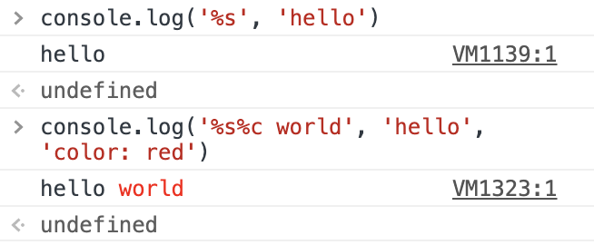

其余的占位符列表还有：

| 占位符 |      功能      |
| :----: | :------------: |
|   %s   |     字符串     |
|   %d   |      整数      |
|   %i   |      整数      |
|   %f   |     浮点数     |
|   %o   |   对象的链接   |
|   %c   | css 格式字符串 |

### console.time(), timeEnd()

`time` 和 `timeEnd` 一般放在一起用，传入一个参数用来标识起始位置用于统计时间:

```js
console.time('⌚️：')
Array(900000)
  .fill({})
  .map((v, i) => (v.i = i))
console.timeEnd('⌚️：')

// ⌚️：: 38.751953125 ms
```

会打印出中间代码的执行时间

### console.count()

计数, 可以用来统计某个函数的执行次数，也可以传入一个参数，并且根据传入的参数分组统计调用的次数

```js
function foo(type = '') {
  type ? console.count(type) : console.count()
  return 'type：' + type
}

foo('A') //A: 1
foo('B') //B: 1
foo() //default: 1
foo() //default: 2
foo() //default: 3
foo('A') //A: 2
```

### console.table()

`console.table()` 方法可以将复合类型的数据转为表格显示

```js
var arr = [
  { name: '梅西', qq: 10 },
  { name: 'C 罗', qq: 7 },
  { name: '内马尔', qq: 11 }
]
console.table(arr)
```

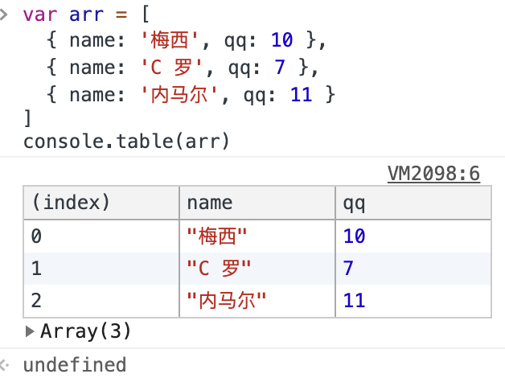

### console.dir()

可选的第二个参数指定的选项 `util.inspect()`

- **showHidden** 如果为 `true`，则还将显示对象的不可枚举的属性，默认为 `false`。

- **depth** 告诉检查格式化对象时要递归多少次。这对于检查大型复杂对象很有用。默认为 `2`。要使其无限期递归，请传递 `null`。

- **colors** 如果为 `true`，则将使用 `ANSI` 颜色代码设置输出样式。默认为 `false`。
- `customInspect` 如果为 `false`，则 `inspect()` 不会调用在被检查对象上定义的自定义函数。默认为 `true`。

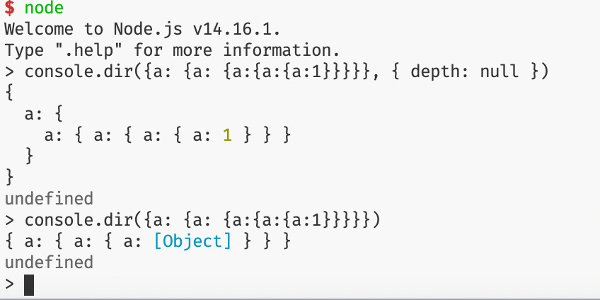

## $ 选择器

### $\_

可以记录上次计算的结果，直接用于代码执行:


### $0,$1...$4

代表最近 `5` 个审查元素选中过的 `DOM` 节点

### $,?

- `$(selector)` 是原生 `document.querySelector()` 的封装。
- `?(selector)` 返回的是所有满足选择条件的元素的一个集合，是 `document.querySelectorAll()` 的封装

### $x

将所匹配的节点放在一个数组里返回

```jsx
<ul>
  <ul>
    <li><p>li 下的 p1</p></li>
    <li><p>li 下的 p2</p></li>
    <li><p>li 下的 p3</p></li>
  </ul>
</ul>
<p>外面的 p</p>

$x('//li') // 所有的 li
$x('//p') // 所有的 p
$x('//li//p') // 所有的 li 下的 p
$x('//li[p]') // 所有的 li 下的 p
```

### keys(), values()

跟 `ES6` 对象扩展方法， `Object.keys()` 和 `Object.values()` 相同

## Element 面板

- `computed` 点击某个样式可以直接跳转至对应 `css` 定义

- 调整某个元素的数值，选中想要更改的值，按方向键上下就可以 `+ - 1` 个单位的值

  - `opt + 方向键` 可以 `×10` 调整单位值
  - `cmd + 方向键` 可以 `×100` 调整单位值
  - `shift + 方向键` 可以 `/10` 调整单位

- 选中节点，直接按键盘 `H` 可以直接让元素显示 / 隐藏，不用手动敲样式了，效果等同 `visibility: hidden`，还是要占据盒模型空间的。

- 将某个元素存储到全局临时变量中，选中节点，右键，`Store as global variable`（在 network 面板中也能用，尤其是筛选接口的返回值很方便）

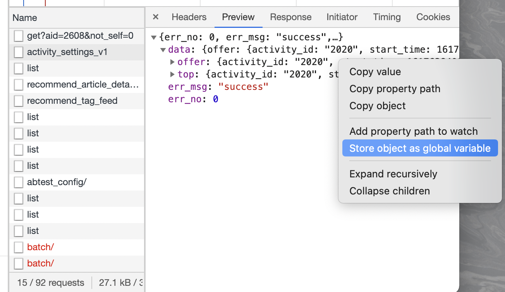

- 如果页面很长，想找一个文本节点的显示位置又不想手动滑动可以试试 `Scroll into view`

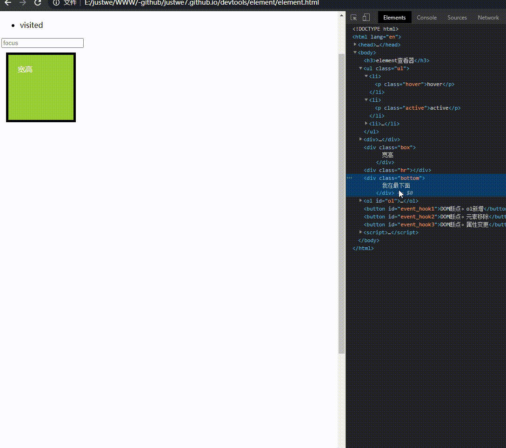

## NetWork 面板

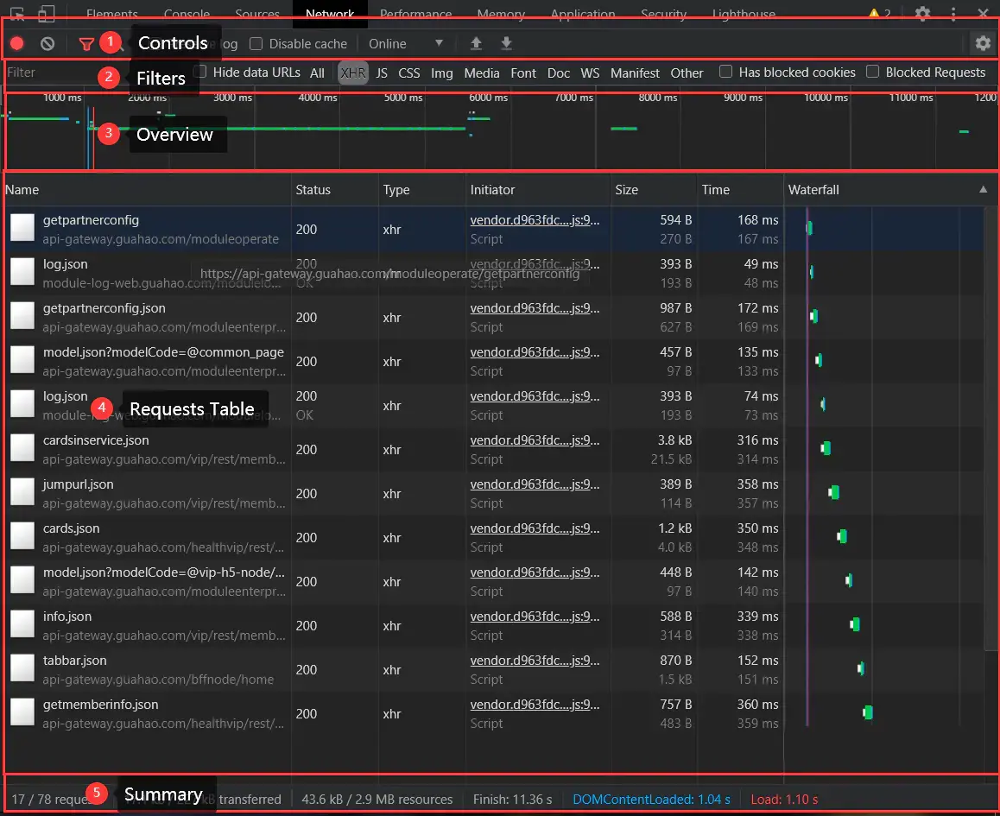

- `Controls` - 控制 `Network` 功能选项，以及一些展示外观

- `Filters` - 控制在 `Requests Table` 中显示哪些类型的资源

> `tips`：按住 `Cmd` (Mac) 或 `Ctrl` (Windows/Linux) 并点击筛选项可以同时选择多个筛选项

- `Overview` - 此图表显示了资源检索时间的时间线。如果看到多条竖线堆叠在一起，则说明这些资源被同时检索

- `Requests Table` - 此表格列出了检索的每一个资源。 默认情况下，此表格按时间顺序排序，最早的资源在顶部。点击资源的名称可以显示更多信息。 提示：右键点击 `Timeline` 以外的任何一个表格标题可以添加或移除信息列

### `Requests Table` 区域

标题栏的对应描述：

- Name(名称): 资源的名称。
- Status(状态): `HTTP` 状态代码。
- Type(类型): 请求的资源的 `MIME` 类型。
- Initiator(发起): 发起请求的对象或进程。它可能有以下几种值：
  - Parser(解析器): `Chrome` 的 `HTML` 解析器发起了请求。
  - Redirect(重定向): `HTTP` 重定向启动了请求。
  - Script(脚本): 脚本启动了请求。
  - Other(其他): 一些其他进程或动作发起请求，例如用户点击链接跳转到页面，或在地址栏中输入网址。
- Size(大小): 响应头的大小（通常是几百字节）加上响应数据，由服务器提供。
- Time(时间): 总持续时间，从请求的开始到接收响应中的最后一个字节
- Timeline/Waterfall(时间轴): 显示所有网络请求的可视化统计信息

### 重新发起 xhr 请求

在平时和后端联调时，我们用的最多的可能就是 `Network` 面板了。但是每次想重新查看一个请求通过刷新页面、点击按钮等方式去触发 `xhr` 请求，这种方式有时显得会比较麻烦，可以通过 `Replay XHR` 的方式去发起一条新的请求：

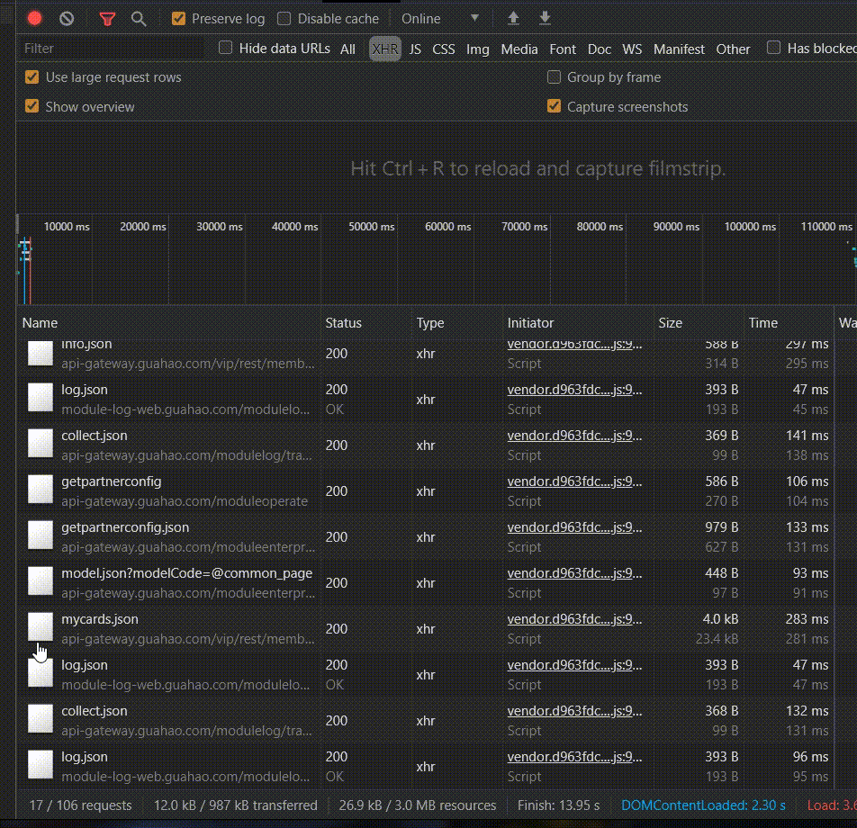

### Size 和 Time

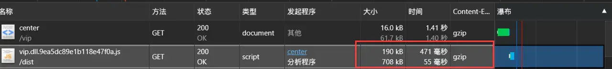

`Size` 有两行：

- 第一行表示的是数据的传输时的大小，例如上图中的 `190KB`
- 第二行表示的是数据实际的大小 `708KB`

在服务器端采取 `gzip` 压缩算法将原有 `708KB` 压缩至 `190KB`, 传输大小缩短 `3.7` 倍，大大的提高了资源传输的效率

> 需要注意的点：
> `gzip` 压缩只会压缩响应体内容，所以适用于返回数据量大的时候，如果数据量太小的话，有可能会导致数据传输时的大小比实际大小要大 (加入了一些额外的响应头)

`Time` 有两行：

- 第一行表示从客户端发送请求到服务端返回所有数据所花费的总时间，对于上图来说就是 `471ms`
- 第二行表示的是从客户端发送请求到服务器端返回第一个字节所表示的时间，对于上图来说就是 `55ms`

> 第一行的时间代表了所有项目：例如解析 `dns`，建立连接，等待服务器返回数据，传输数据等
>
> 第二行的时间是 **总时间 - 数据传输的时间**

从上面的分析中我们看到 从客户端请求到服务器处理结束准备返回数据花了 `55ms`，但是在进行传输数据的时候花费了 `471ms`

对于网慢的用户来说，可能会耗费更长的时间，所以在写代码（接口）的时候，返回的数据量要尽量精简

### Summary


`DOMContentLoaded` 会比 `Load` 时间小，两者时间差大致等于外部资源加载（一般是图片 / 字体）的时间

`Finish`  时间是页面上所有 `http` 请求发送到响应完成的时间（如果页面存在一个轮询的接口，这个值也会累加的）。`HTTP1.0/1.1` 协议限定单个域名的请求并发量是 `6` 个，即 `Finish` 是所有请求（不只是 `XHR` 请求，还包括 `DOC`，`img`，`js`，`css` 等资源的请求）在并发量为 `6` 的限制下完成的时间。

- `Finish`  的时间比  `Load`  大，意味着页面有相当部分的请求量
- `Finish`  的时间比  `Load`  小，意味着页面请求量很少，如果页面是只有一个 `html` 文档请求的静态页面，`Finish` 时间基本就等于 `HTML` 文档请求的时间

### 排队或停止阻塞

最常见的问题是很多个请求排队或被阻塞。这表示从单个客户端检索的资源太多。在 `HTTP 1.0/1.1` 连接协议中，`Chrome` 限制每个域名最多执行 `6` 个 `TCP` 连接。如果一次请求十二个资源，前 `6` 个将开始，后 `6` 个将排队。一旦其中一个请求完成，队列中的第一个请求项目将开始其请求过程。

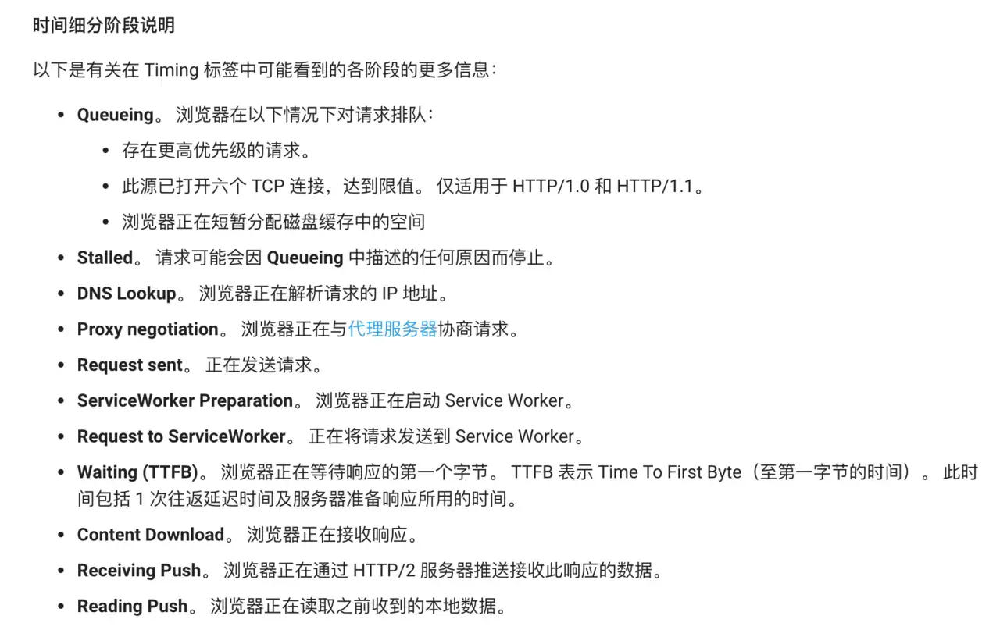

### TTFB

`TTFB` 就是等待第一个响应字节的时间，建议在 `200ms` 以下，以下情况可能会导致高 `TTFB`:

- 客户端和服务器之间的网络条件差
- 服务器端程序响应很慢

### Content Download

如果 `Content Download` (内容下载) 阶段花费了很多时间，提高服务响应速度、并行下载等优化措施帮助都不大。主要的解决方案是发送更少的字节（比如一张高质量的大图可能几 `M` 的大小，这时可以酌情优化一下图片的宽高 / 清晰度）

## Source 面板

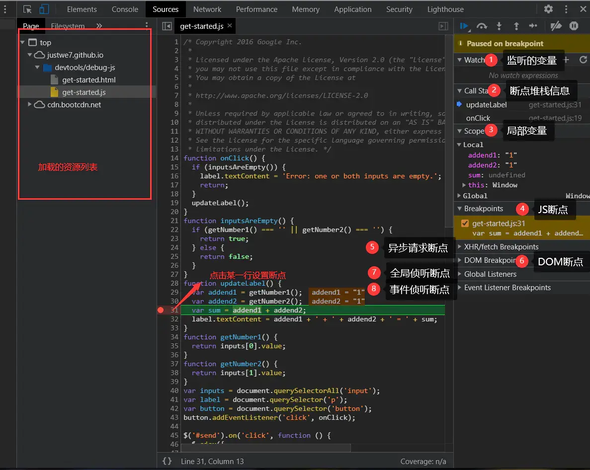

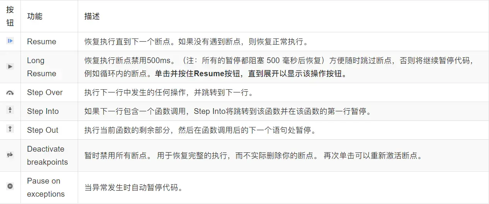

## Performance 面板

> 隐身模式可以保证 `Chrome` 在一个相对干净的环境下运行。假如安装了许多 chrome 插件，这些插件可能会影响分析性能表现
>
> 在 `Performance` 面板可以查看页面加载过程中的详细信息，比如在什么时间开始做什么事情，耗时多久等等。相较于 `Network` 面板，不仅可以看到通过网络加载资源的信息，还能看到解析 JS、计算样式、重绘等页面加载的方方面面的信息

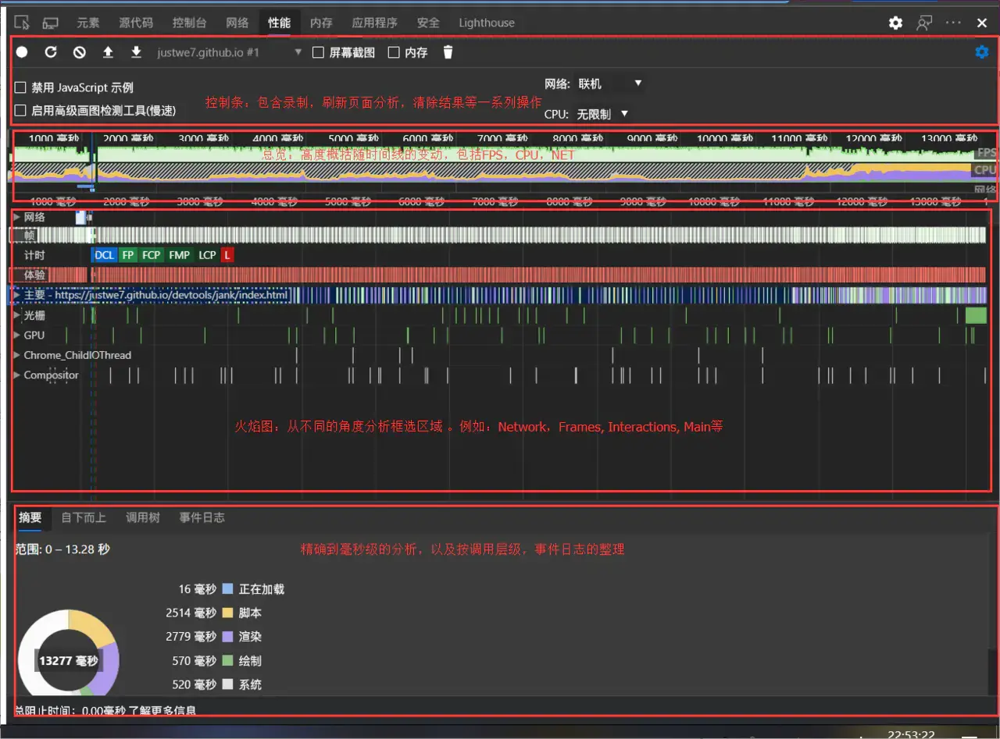

面板主要的区域划分：

- `Controls` - 开始记录，停止记录和配置记录期间捕获的信息

- `Overview` - 页面性能的汇总

- `Flame Chart` - [火焰图 (线程面板)]。在火焰图上看到三条（绿色的有好几条）垂直的虚线：

  - 蓝线代表 `DOMContentLoaded`  事件
  - 绿线代表首次绘制的时间
  - 红线代表 `load`  事件

- `Details` - 在 `Flame Chart` 中，选择了某一事件后，这部分会展示与这个事件相关的更多信息；

### 开始记录

- 首先点击控制条左边的第一个圆圈，开始记录日志
- 等待几分钟 (正常操作页面)
- 点击 `Stop` 按钮，`Devtools` 停止录制，处理数据，然后显示性能报告

### controls 控制条区域

- `Screenshots` 截图：默认勾选，每一帧都会截图
- `Memory` 内存消耗记录：勾选后可以看到各种内存消耗曲线
- `Disable javaScript samples` [禁用 javaScript 示例]：减少在手机运行时系统的开销，模拟手机运行时勾选
- `Network` [网络模拟]：可以模拟在 `3G`, `4G` 等网络条件下运行页面
- `Enable advanced paint instrumentation`(slow) [启用高级画图检测工具 (慢速)]：捕获高级画图检测工具，带来显著的性能开销
- `CPU` [CPU 限制性能]：主要为了模拟 `CPU` 下运行性能

### FPS

绿色竖线越高，`FPS` 越高。 `FPS` 图表上的红色块 (上图刚开始的部分) 表示长时间帧，很可能会出现卡顿。火焰图的 `FPS` 可以量化这项参数

### CPU

CPU 资源。此面积图指示消耗 CPU 资源的事件类型。在 CPU 图表中的各种颜色与 Summary 面板里的颜色是相互对应的，Summary 面板就在 Performance 面板的下方。

CPU 资源面积图颜色划分:

|       颜色       |           执行内容           |
| :--------------: | :--------------------------: |
|  蓝色 (Loading)  |     网络通信和 HTML 解析     |
| 黄色 (Scripting) |       JavaScript 执行        |
| 紫色 (Rendering) |    样式计算和布局，即重排    |
| 绿色 (Painting)  | 更改外观而不会影响布局，重绘 |
|   灰色 (other)   |      其它事件花费的时间      |
|   白色 (Idle)    |           空闲时间           |

> 重绘是当节点需要更改外观而不会影响布局的，比如改变 `color` 就叫称为重绘，回流 (重排) 是布局或者几何属性需要改变就称为回流
> 重排必定会发生重绘，重绘不一定会引发重排。重排所需的成本比重绘高的多，改变深层次的节点很可能导致父节点的一系列重排

> js 修改 dom 结构或样式 -> 计算 style -> layout(重排) -> paint(重绘) -> composite(合成)

- FP(First Paint): 首次绘制
- FCP(First Contentful Paint)： 第一次丰富内容的绘图
- FMP(First Meaningful Paint)：第一次有意义的绘图
- LCP(Largest Contentful Paint)： 最大区域内容绘制

### performance API

#### memory

- `usedJSHeapSize` 表示：`JS` 对象（包括 V8 引擎内部对象）占用的内存数
- `totalJSHeapSize` 表示：可使用的内存
- `jsHeapSizeLimit` 表示：内存大小限制

通常，`usedJSHeapSize` 不能大于 `totalJSHeapSize`，如果大于，有可能出现了内存泄漏。

#### navigation

##### redirectCount: 0

如果有重定向的话，页面通过几次重定向跳转而来

##### type: 0

类似于小程序定义的场景值，`type` 的值：

- `0` 即 `TYPE_NAVIGATENEXT` 正常进入页面（非刷新、非重定向等)
- `1` 即 `TYPE_RELOAD` 通过 `window.location.reload()` 刷新的页面
- `2` 即 `TYPE_BACK_FORWARD` 通过浏览器的前进后退按钮进入的页面（历史记录）
- `255` 即 `TYPE_UNDEFINED` 非以上方式进入的页面

### timeOrigin

返回性能测量开始时的时间的高精度时间戳

### timing

#### navigationStart: '时间戳'

在同一个浏览器上下文中，前一个网页（与当前页面不一定同域）`unload` 的时间戳，如果无前一个网页 `unload`，则与 `fetchStart` 值相等；

#### unloadEventStart: 0

前一个网页（与当前页面同域）`unload` 的时间戳，如果无前一个网页 `unload` 或者前一个网页与当前页面不同域，则值为 `0`

#### unloadEventEnd: 0

和 `unloadEventStart` 相对应，返回前一个网页 `unload` 事件绑定的回调函数执行王弼的时间戳

#### redirectStart: 0

第一个 `HTTP` 重定向发生时的时间，有跳转且是同域名内部的重定向才算，否则值为 `0`

#### redirectEnd: 0

最后一个 `HTTP` 重定向完成时的时间，有跳转切尔是同域名内部的重定向才算，否则值为 `0`

#### fetchStart: '时间戳'

浏览器准备好使用 `HTTP` 请求抓取文档的时间，这发生在检查本地缓存之前

#### domainLookupStart: '时间戳'

`DNS` 域名查询开始的时间，如果使用了本地缓存（即无 DNS 查询）或持久连接，则与 `fetchStart` 值相等

#### domainLookupEnd: '时间戳'

`DNS` 域名查询完成的时间，如果使用了本地缓存（即 无 DNS 查询）或持久连接，则与 `fetchStart` 值相等

#### connectStart: '时间戳'

`HTTP`(TCP) 开始建立连接的时间，如果是持久连接，则与 `fetchStart` 值相等；如果在传输层发生了错误且重新建立了连接，则这里显示的是新建立连接的时间

#### connectEnd: '时间戳'

HTTP(TCP) 完成建立连接的时间（握手），如果是持久连接，则与 `fetchStart` 相等；如果是在传输层发生了错误且重新建立连接，则这里是新建立的连接完成的时间；

#### secureConnectionStart: 0

- `HTTPS` 连接开始的时间，如果不是安全连接，则值为 0;

#### requestStart: '时间戳'

`HTTP` 请求读取真实文档开始的时间（完成建立连接），包括从本地读取缓存，连接错误时这里显示的是新建立的连接的时间

#### responseStart: '时间戳'

`HTTP` 开始接收响应的时间（获取到第一个字节），包括从本地读取缓存

#### responseEnd: 0

HTTP 响应全部接收完毕的时间（获取到最后一个字节），包括从本地读取的缓存

#### domLoading: 0

开始解析渲染 `DOM` 树的时间，此时 `Document.readyState` 变为 `interactive`，并将抛出 `readystatechange` 相关事件（这里只是 DOM 树解析完毕，这时候并没有开始加载网页内的

#### dominteractive: 0

完成解析 `DOM` 树的时间，`Document,readyState` 变为 `interactive`, 并将抛出 `readystatechange` 相关事件（这时候并没有开始加载网页资源）

#### domContentLoadedEventStart: 0

`DOM` 解析完成后，网页内资源加载开始的时间，在 `DOMContentLoaded` 事件抛出之前发生

#### domContentLoadedEventEnd: 0

`DOM` 解析完成后，网页内资源加载完成的时间

#### domComplete: 0

`DOM` 树解析完成，且资源也准备就绪的时间，`Document.readyState` 变为 `complete`, 并将抛出 `readystatechange` 相关事件

#### loadEventStart: 0

`load` 事件发送给文档，也即 `load` 回调函数开始执行的时间，如果没有绑定 `load` 事件，值为 `0`

#### loadEventEnd: 0

`load` 事件的回调函数执行完毕的时间

### performance.now() 方法

`performance.now()` 返回 `performance.navigationStart` 至当前的毫秒数。`performance.navigationStart` 是浏览器访问最初的时间测量点。

值得注意的两点：

- 测量初始点是浏览器访问最初测量点，或者理解为在地址栏输入 `URL` 后按回车的那一瞬间。
- 返回值是毫秒数，但带有精准的多位小数。

用 `performance.now()` 检测 `js` 代码的执行时间 (毫秒):

```js
var st = performance.now()
console.log(
  Array(9999999)
    .fill(null)
    .filter(v => !v).length
)
var end = performance.now()
console.log(`取值时间${end - st}ms`) // 取值时间 558.7849999992759ms
```

### timing 内包含了几乎所有时序的时间节点

可以通过此字段来统计页面相关事件的发生时长：

```js
function getTiming() {
  try {
    var timing = performance.timing
    var timingObj = {}

    var loadTime = (timing.loadEventEnd - timing.loadEventStart) / 1000

    if (loadTime < 0) {
      setTimeout(function () {
        getTiming()
      }, 0)
      return
    }

    timingObj['重定向时间'] = timing.redirectEnd - timing.redirectStart
    timingObj['DNS 解析时间'] =
      timing.domainLookupEnd - timing.domainLookupStart
    timingObj['TCP 完成握手时间'] = timing.connectEnd - timing.connectStart
    timingObj['HTTP 请求响应完成时间'] =
      timing.responseEnd - timing.requestStart
    timingObj['DOM 开始加载前所花费时间'] =
      timing.responseEnd - timing.navigationStart
    timingObj['DOM 加载完成时间'] =
      (timing.domComplete || timing.domLoading) - timing.domLoading
    timingObj['DOM 结构解析完成时间'] =
      timing.domInteractive - timing.domLoading
    timingObj['总体网络交互耗时，即开始跳转到服务器资源下载完成时间'] =
      timing.responseEnd - timing.navigationStart
    timingObj['可交互的时间'] =
      timing.domContentLoadedEventEnd - timing.domContentLoadedEventStart
    timingObj['首次出现内容'] = timing.domLoading - timing.navigationStart
    timingObj['onload 事件时间'] = timing.loadEventEnd - timing.loadEventStart
    timingObj['页面完全加载时间'] =
      timingObj['重定向时间'] +
      timingObj['DNS 解析时间'] +
      timingObj['TCP 完成握手时间'] +
      timingObj['HTTP 请求响应完成时间'] +
      timingObj['DOM 结构解析完成时间'] +
      timingObj['DOM 加载完成时间']

    for (item in timingObj) {
      console.log(item + ':' + timingObj[item] + '(ms)')
    }

    console.log(performance.timing)
  } catch (e) {
    console.log(performance.timing)
  }
}
window.onload = getTiming
```

### performance.getEntries()

浏览器获取网页时，会对网页中每一个对象（脚本文件、样式表、图片文件等等）发出一个 `HTTP` 请求。`performance.getEntries` 方法以数组形式，返回一个 `PerformanceEntry` 列表，这些请求的时间统计信息，有多少个请求，返回数组就会有多少个成员

- name：资源的链接
- duration: 资源的总耗时（包括等待时长，请求时长，响应时长 相当于 responseEnd - startTime）
- entryType: 资源类型，entryType 类型不同数组中的对象结构也不同:

|     值     |         该类型对象          | 描述                                                              |
| :--------: | :-------------------------: | ----------------------------------------------------------------- |
|    mark    |       PerformanceMark       | 通过 mark() 方法添加到数组中的对象                                |
|  measure   |     PerformanceMeasure      | 通过 measure() 方法添加到数组中的对象                             |
|   paint    |   PerformancePaintTiming    | 值为 first-paint'首次绘制、'first-contentful-paint'首次内容绘制。 |
|  resource  |  PerformanceResourceTiming  | 所有资源加载时间，用处最多                                        |
| navigation | PerformanceNavigationTiming | 现除 chrome 和 Opera 外均不支持，导航相关信息                     |
|   frame    |   PerformanceFrameTiming    | 现浏览器均未支持                                                  |

## 截图

当你只想对一个特定的 `DOM` 节点进行截图时，可能需要使用其他工具操作好久，使用控制台可以直接选中想要截图的节点，打开 `Command + shift + p` 菜单并且使用 **节点截图** 就可以了

- 截取特定节点： `Screenshot Capture node screenshot`
- 全屏截图： `Screenshot Capture full size screenshot`

## Lighthouse(Audits) 面板

来自 `Google` 的描述： `Lighthouse` 是一个开源的自动化工具，用于改进网络应用的质量。它将针对此页面运行一连串的测试，然后生成一个有关页面性能的报告
会对页面的加载进行分析，然后给出提高页面性能的建议

懒人专用 👍

有 5 个指标:

- `Performance` 性能
- `accessibility` 无障碍使用
- `Best Practice` 用户体验
- `SEO` SEO 优化
- `Progressive Web App` 页对于 `PWA` 的兼容性

## Security 面板

用于检测当面页面的安全性

该面板可以区分两种类型的不安全的页面：

如果被请求的页面通过 `HTTP` 提供服务，那么这个主源就会被标记为不安全。
如果被请求的页面是通过 `HTTPS` 获取的，但这个页面接着通过 `HTTP` 继续从其他来源检索内容，那么这个页面仍然被标记为不安全。这就是所谓的混合内容页面, 混合内容页面只是部分受到保护, 因为 `HTTP` 内容 (非加密的内容通信使用明文) 可能会被窃听, 容易受到中间人攻击。如 `163`，虽然证书是有效的，但是页面有一部分 `http` 资源：
