# 浏览器

下面是 `JavaScript` 在浏览器中运行时的鸟瞰示意图：

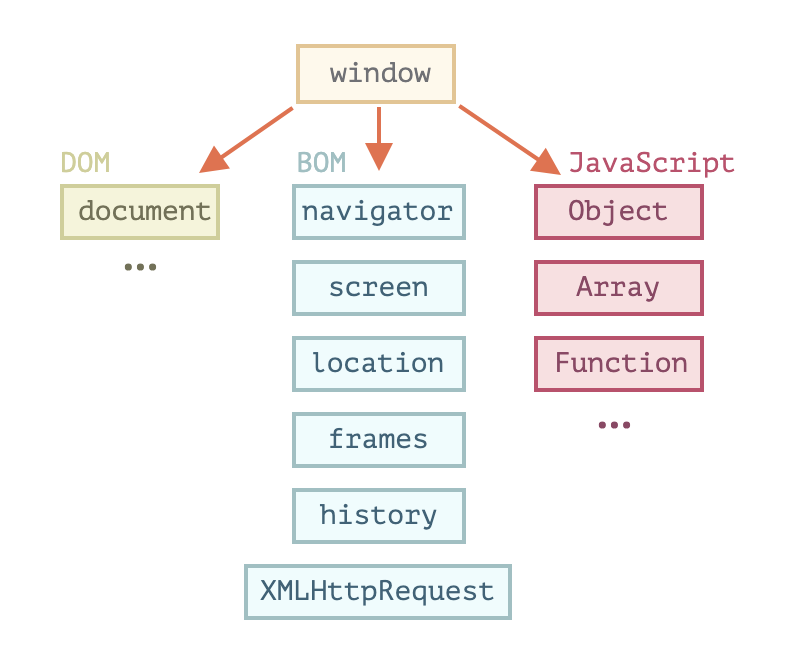

有一个叫做 `window` 的“根”对象。它有两个角色：

首先，它是 `JavaScript` 代码的全局对象。其次，它代表“浏览器窗口”，并提供了控制它的方法。

## navigator

`navigator` 对象提供了有关浏览器和操作系统的背景信息。

`navigator` 有许多属性，但是最广为人知的两个属性是：
- `navigator.userAgent` — 关于当前浏览器，
- `navigator.platform` — 关于平台（可以帮助区分 `Windows/Linux/Mac` 等）。

通过 `userAgent` 可以大致准确地识别手机浏览器，方法就是测试是否包含 `mobi` 字符串。

```js
var ua = navigator.userAgent.toLowerCase();

if (/mobi/i.test(ua)) {
  // 手机浏览器
} else {
  // 非手机浏览器
}
```

## location

`location` 对象允许我们读取当前 `URL`，并且可以将浏览器重定向到新的 `URL`。

```js
// 跳转到新网址
document.location.href = 'http://www.example.com';
```

这个特性常常用于让网页自动滚动到新的锚点。

```js
document.location.href = '#top';
// 等同于
document.location.hash = '#top';
```

直接改写 `location`，相当于写入 `href` 属性。

```js
document.location = 'http://www.example.com';
// 等同于
document.location.href = 'http://www.example.com';
```

`JavaScript` 提供四个 `URL` 的编码/解码方法。

- `encodeURI()` 方法用于转码整个 `URL`。它的参数是一个字符串，代表整个 `URL`。它会将元字符和语义字符之外的字符，都进行转义。

```js
encodeURI('http://www.example.com/q=春节') // "http://www.example.com/q=%E6%98%A5%E8%8A%82"
```

- `encodeURIComponent()` 方法用于转码 `URL` 的组成部分，会转码除了语义字符之外的所有字符，即元字符也会被转码。所以，它不能用于转码整个 `URL`。它接受一个参数，就是 `URL` 的片段。

```js
encodeURIComponent('春节')
// "%E6%98%A5%E8%8A%82"
encodeURIComponent('http://www.example.com/q=春节')
// "http%3A%2F%2Fwww.example.com%2Fq%3D%E6%98%A5%E8%8A%82"
```

- `decodeURI()` 方法用于整个 `URL` 的解码。它是 `encodeURI()` 方法的逆运算。它接受一个参数，就是转码后的 `URL`。

```js
decodeURI('http://www.example.com/q=%E6%98%A5%E8%8A%82') // "http://www.example.com/q=春节"
```

- `decodeURIComponent()` 用于 `URL` 片段的解码。它是 `encodeURIComponent()` 方法的逆运算。它接受一个参数，就是转码后的 `URL` 片段。

## 网页渲染原理

### Chrome 的多进程架构

- **浏览器**：控制应用程序 `chrome` 部分，包括地址栏，书签，后退和前进按钮。及处理 `Web` 浏览器的不可见特权部分，例如网络请求和文件访问
- **渲染**：控制显示网站的选项卡内的任何内容
- **插件**：控制网站使用的任何插件，例如 `flash`。
- **GPU**：独立于其他进程处理 `GPU` 任务。它被分成不同的进程，因为 `GPU` 处理来自多个应用程序的请求并将它们绘制在同表面中。
**其他进程**：浏览器右上角更多 -> 更多工具 -> 任务管理器，查看其他进程，如实用程序网络服务、辅助框架

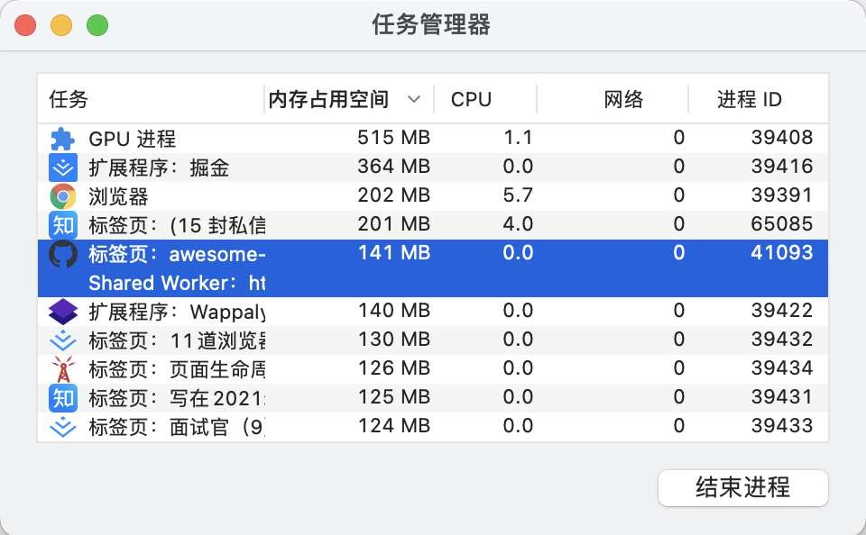

多进程架构

优点：

- 防一个页面崩溃影响整个浏览器
- 安全性和沙箱：操作系统提供了限制进程权限的方法，因此浏览器可以从某些功能中对某些进程进行沙箱处理。如任意访问文件
- 进程有自己的私有内存空间，可以拥有更多的内存。为了节省内存，Chrome 限制了它可以启动的进程数量。限制因设备的内存和 CPU 功率而异，但当 Chrome 达到限制时，它会在一个进程中开始从同一站点运行多个选项卡

### 页面导航过程

多进程架构启动多个进程处理不同的任务。**选项卡外部**的所有内容都由**浏览器进程**处理（包含 UI 线程、网络线程、存储线程）。在地址栏输入 url 时，由浏览器进程的 UI 线程处理。

#### 1. 处理输入

当用户开始输入地址栏时，`UI` 线程需判断是搜索查询还是 `URL`。

- 查询：发送到搜索引擎
- `URL`：请求 `URL` 的网站

#### 2. 开始导航

用户点击进入时：

> 有注册设置 `Service Worker` 从缓存加载页面，渲染进程中运行 `JavaScript` 代码，从缓存加载页面，无需请求网络

未设置 `Service Worker` 时：

1. `UI` 线程启动网络调用以获取站点内容，选项卡加载转圈

2. 网络线程通过 `DNS` 查找域名对应 `IP` 及建立 `http` 连接

3. 网络线程接收处理 `301` 重定向头。网络线程与请求重定向的 `UI` 线程通信，启动另一个 `URL` 请求

#### 3. 读取响应结果

##### 3.1 确定文件 MIME 类型

网络线程查看流的前几个字节，响应头中 `Content-Type` 头确定 `MIME` 数据类型。因此数据可能丢失，因此用 `MIME` 嗅探方式来查看资源。

##### 3.2 处理不同 MIME 文件

响应文件是 `HTML`，则将数据传递给渲染器进程。如果为 `.zip` 或其他文件则将数据传递给下载管理器。

##### 3.3 安全检查

恶意名单检查：如果域和响应数据在恶意站点名单中，则网络线程发出和显示警告页面。
跨域读取检查：`CrossOriginReadBlock` 检查，敏感的跨站点数据不进入渲染器进程


#### 4. 查找渲染进程

所有检查完成后，网络线程告知 `UI` 线程数据已准备就绪，`UI` 线程找到渲染进程以继续渲染网页。

由于网络请求可能需要几百毫秒才能得到响应，为加速此过程，在开始导航网络线程发送`url` 请求时，已经主动进行查找、启动渲染进程，数据接收完成后，渲染进程已备用。

#### 5. 提交导航

现在数据和渲染器进程已准备就绪，`IPC` 将从浏览器进程发送到渲染进程以提交导航。渲染进程确认提交完成，导航完成。文档加载开始。

1. `UI` 更新：地址栏更新、安全指示器、站点设置 `UI` 会反映新页面站点信息
2. 选项卡的会话历史记录更新(前进/后退)，为便于关闭浏览器后恢复，历史记录到磁盘

#### 6. 初始化 load complete

提交导航后，渲染器进程将继续加载资源并呈现页面，一旦渲染器进程“完成”（onload 事件在所有帧上触发执行完成后）渲染，它就会将 `IPC` 发送回浏览器进程。`UI` 线程停止选项卡的加载转圈。

#### 7. 导航到其他站点

导航完成后，再次将不同的 `URL` 放到地址栏导航，浏览器会检查当前渲染网站的`beforeunload` 事件。如有设置导航或关闭选项卡时发出警报“离开这个网站吗？” 包含 `JavaScript` 代码的选项卡内的所有内容都由渲染进程处理。

单击链接或客户端 `JavaScript` 运行 `window.location = “https://newsite.com“` ，过程与流程器进程启动导航过程相同，不同点在于导航请求是从渲染进程启动到浏览器进程。

### 页面渲染

#### 1. 渲染进程处理页面内容

渲染进程中，包含线程分别是：

- 一个主线程（main thread）
- 多个工作线程（work thread）
- 一个合成器线程（compositor thread）
- 多个光栅化线程（raster thread）

不同的线程，有着不同的工作职责。

#### 2. 解析

##### 2.1 构建 DOM

当渲染进程接收提交的导航消息和 `HTML` 数据，主线程开始解析文本串（HTML），使之成为一个 `DOM`。解析中遇到 `html` 能优雅容错。

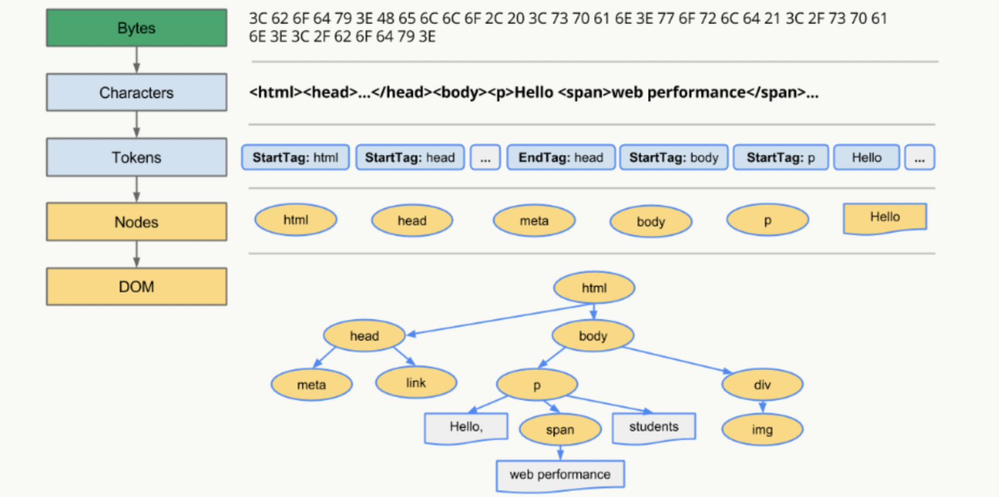

##### 2.2 子资源加载

网站通常使用图像，`CSS` 和 `JavaScript` 等外部资源，需要从网络或缓存加载。在解析构建 `DOM` 时，主线程可以逐个请求它们。**为了加快速度“预加载扫描器”同时运行**。

##### 2.3 JavaScript 阻塞解析

当遇到 `<script>` 时，暂停 `HTML` 解析，加载解析执行 `JS` 代码。因为 `JS` 可能会改变 `Html` 的结构导致重新 `reflow` 和 `repaint`。

##### 2.4 CSS 不会阻塞 DOM 的解析，但会阻塞页面渲染

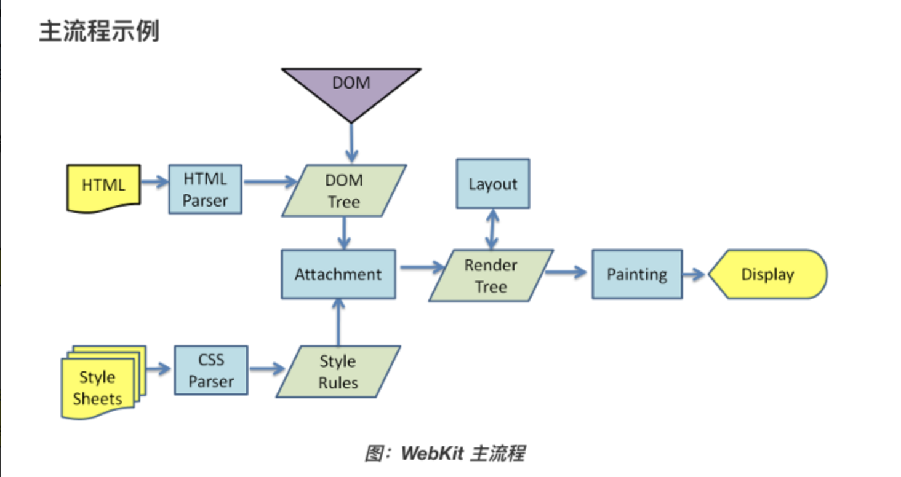

浏览器是解析 `DOM` 生成 `DOM Tree`，结合 `CSS` 生成的 `CSS Tree`，最终组成 `render tree`，再渲染页面。由此可见，在此过程中 `CSS` 完全无法影响 `DOM Tree`，因而无需阻塞 `DOM` 解析。但 `render tree` 依赖 `CSSOM` 因此，`CSS` 顺理成章地阻塞页面渲染。

##### CSS 会阻塞 JS 脚本执行

如果脚本的内容是获取元素的样式，宽高等 `CSS` 控制的属性，浏览器是需要计算的，也就是依赖于 `CSS`。浏览器也无法感知脚本内容到底是什么，为避免样式获取，因而只好等前面所有的样式下载完后，再执行 `JS`。

#### 3. 确定加载资源方式

在 `<script>` 加 `async` 或 `defer` 属性，浏览器异步加载和运行 `JS`，不阻止解析。

1. `async`：指示浏览器尽可能异步加载脚本，默认同步加载脚本(async=false)
2. `defer`：指示脚本要在解析文档之后但在触发 `DOMContentLoaded` 之前执行。
3. `async` 特性意味着脚本是完全独立的，`DOMContentLoaded` 和异步脚本不会彼此等待，其他脚本不会等待 `async` 脚本加载完成，同样，`async` 脚本也不会等待其他脚本。

`JS` 模块化（默认 defer）、样式文件中加 `rel=preload` 可设置资源加载优先级，优化加载渲染关键路径资源，优化性能。

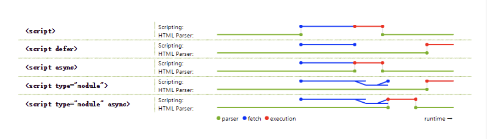

#### 4. 样式计算

主线程解析 `CSS` 并确定每个 `DOM` 节点的计算样式，再根据 `CSS` 选择器将哪种样式应用于哪个元素。

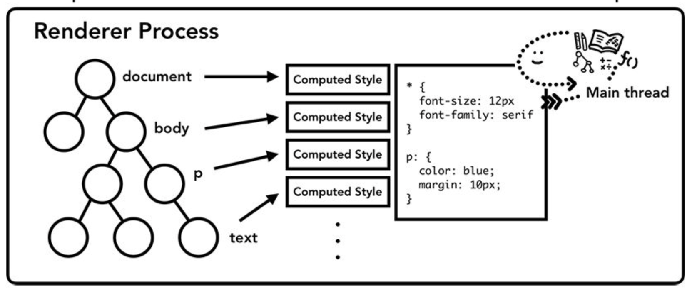

#### 5. 布局 - layout

渲染进程知道每个节点的文档结构和样式。布局是查找元素几何的过程。

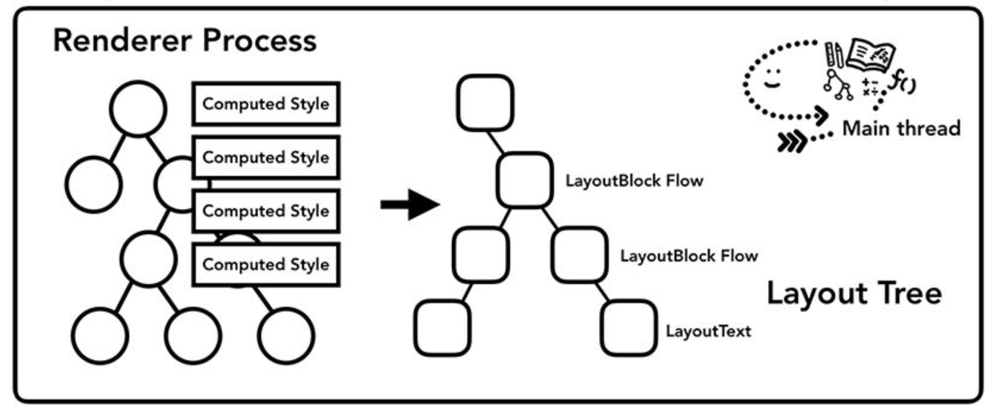

**布局过程**：主线程遍历 `DOM` 并计算样式，并创建布局树（layout tree, 包含坐标和边界框大小等信息）。

> ⚠️ **布局树的特殊情况**
> - 不包括 `display: none` 的节点
> - 包括 `visibility: hidden` 的元素
> - 包括伪类元素，如 `::before`

#### 6. 绘制 - Paint

知道元素的大小，形状和位置，但是不知道绘制的顺序。主线程遍历布局树以创建绘制记录，绘制记录是绘画过程的一个注释。

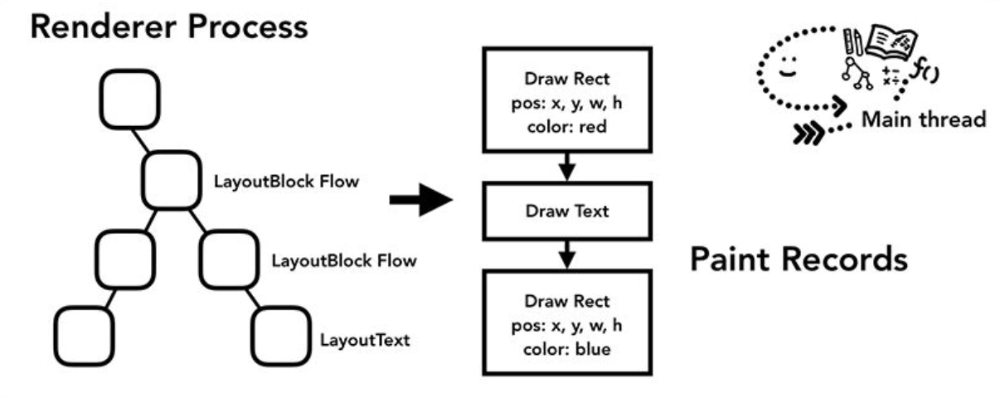

##### 渲染中的难点

- **重排**: 部分渲染树（或者整个渲染树）需要重新分析并且节点尺寸需要重新计算，表现为重新生成布局，重新排列元素
- **重绘**: 由于节点的几何属性发生改变或者由于样式发生改变，例如改变元素背景色时，屏幕上的部分内容需要更新，表现为某些元素的外观被改变

重排和重绘代价是高昂的，它们会破坏用户体验，并且让 UI 展示非常迟缓，而相比之下重排的性能影响更大，在两者无法避免的情况下，一般我们宁可选择代价更小的重绘。

> **『重绘』不一定会出现『重排』，『重排』必然会出现『重绘』**

##### 如何触发重排和重绘

任何改变用来构建渲染树的信息都会导致一次重排或重绘：

- 添加、删除、更新 `DOM` 节点
- 通过 `display: none` 隐藏一个 `DOM` 节点 —— 触发重排和重绘
- 通过 `visibility: hidden` 隐藏一个 `DOM` 节点 —— 只触发重绘，因为没有几何变化
- 移动或者给页面中的 `DOM` 节点添加动画
- 添加一个样式表，调整样式属性
- 用户行为，例如调整窗口大小，改变字号，或者滚动。

##### 如何避免重绘或者重排

1. 集中改变样式
2. 通过 `createDocumentFragment` 创建一个游离于 `DOM` 树之外的节点，然后在此节点上批量操作，最后插入 `DOM` 树中，因此只触发一次重排
3. 将元素提升为合成层
   1. 合成层的位图，会交由 `GPU` 合成，比 `CPU` 处理要快
   2. 当需要 `repaint` 时，只需要 `repaint` 本身，不会影响到其他的层
   3. 对于 `transform` 和 `opacity` 效果，不会触发 `layout` 和 `paint`

##### 动画

在每个帧之间运行这些操作。大多数显示器每秒刷新屏幕 `60` 次（60 fps），当你在每一帧移动屏幕时，动画对人眼来说会很平滑（视觉停留效应）。但是如果动画错过了两者之间的帧或程序运行 `JS`时，则页面将出现卡顿。

用时间不确定的 `setTimeout()` 只会更新内存中的属性变化，由于期间隔时间和屏幕刷新时间不同步，可能导致某些帧的操作被跨跃，直接更新下一帧的图像。

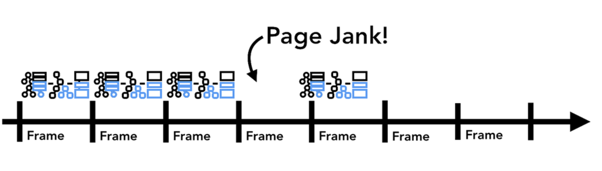

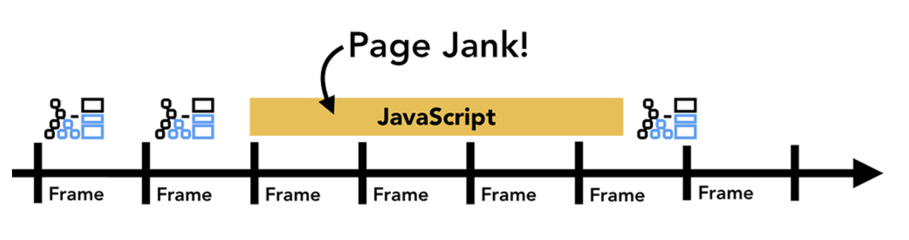

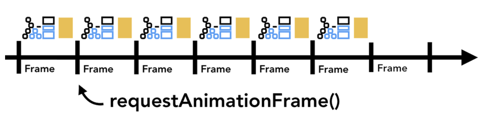

#### 7. 合成 - Compositing

文档结构、元素的样式、元素的几何关系、绘画顺序，这些信息我们都有了，这个时候如果要绘制一个页面，我们需要做的是把这些信息转化为显示器中的像素，这个转化的过程，叫做**光栅化**（rasterizing）。

合成是一种将页面分成若干层，然后分别对它们进行光栅化，最后在一个单独的线程 - **合成线程**（compositor thread）里面合并成一个页面的技术。当用户滚动页面时，由于页面各个层都已经被光栅化了，浏览器需要做的只是合成一个新的帧来展示滚动后的效果罢了。页面的动画效果实现也是类似，将页面上的层进行移动并构建出一个新的帧即可。

为了实现合成技术，我们需要对元素进行分层，确定哪些元素需要放置在哪一层，主线程需要遍历渲染树来创建一棵层次树（Layer Tree），对于添加了 `will-change CSS` 属性的元素，会被看做单独的一层，没有 `will-change CSS` 属性的元素，浏览器会根据情况决定是否要把该元素放在单独的层。

一旦 `Layer Tress` 被创建，渲染顺序被确定，主线程会把这些信息通知给合成器线程，合成器线程开始对层次数的每一层进行光栅化。有的层的可以达到整个页面的大小，所以合成线程需要将它们切分为一块又一块的小图块（tiles），之后将这些小图块分别进行发送给一系列光栅线程（raster threads）进行光栅化，结束后光栅线程会将每个图块的光栅结果存在 `GPU Process` 的内存中。

为了优化显示体验，合成线程可以给不同的光栅线程赋予不同的优先级，将那些在视口中的或者视口附近的层先被光栅化。

以上所有步骤完成后，合成线程就会通过 `IPC` 向浏览器进程（browser process）提交（commit）一个渲染帧。这个时候可能有另外一个合成帧被浏览器进程的 `UI` 线程（UI thread）提交以改变浏览器的 `UI`。这些合成帧都会被发送给 `GPU` 从而展示在屏幕上。如果合成线程收到页面滚动的事件，合成线程会构建另外一个合成帧发送给 `GPU` 来更新页面。

合成的好处在于这个过程没有涉及到主线程，所以**合成线程不需要等待样式的计算以及 `JavaScript` 完成执行**。这就是为什么合成器相关的动画最流畅，如果某个动画涉及到布局或者绘制的调整，就会涉及到主线程的重新计算，自然会慢很多

### 页面操作

#### 1. 接收输入事件

1) 浏览器进程接收 键入、鼠标事件、触摸手势等输入事件。浏览器进程仅知道手势发生位置，选项卡内部内容由渲染进程处理。

2) 浏览器进程将事件类型、坐标发送给渲染进程

3) 渲染进程通过查找事件目标并运行附加的事件侦听器来适当地处理事件

4) 合成器接入输入事件

#### 2. 非快速可滚动区域

1) 合成页面时，合成器线程标记页面的一个区域，该区域将事件处理程序附加为“非快速可滚动区域”。

2) 通过获取此信息，合成器线程可以确保在该区域中发生事件时将输入事件发送到运行 `JavaScript` 的主线程。如果输入事件来自该区域之外，则合成器线程在不等待主线程的情况下继续合成新帧。

#### 3. 事件处理

下面程序中，整个页面都被标记为非快速可滚动区域，合成器线程也必须与主线程通信，并在每次输入事件进入时等待它，最终影响合成器平滑滚动能力。

```js
document.body.addEventListener('touchstart', event = > {
    if (event.target === area) {
        event.preventDefault();
    }
});
```

在事件监听器中传递 `passive: true` 选项，提示浏览器在主线程中监听事件，合成器线程也可以继续合成新帧。

```js
document.body.addEventListener(
    'touchstart',
    event = > {
    if (event.target === area) {
        event.preventDefault();
    }
}, {
    passive: true
});
```

#### 4. 检查取消事件

通过 `event.cancelable` 和 `event.preventDefault()` 检查取消事件。

#### 5. 查找 `event.target`

当合成器线程向主线程发送输入事件时，首先要运行的是命中测试以查找事件目标。命中测试使用在渲染过程中生成的绘制记录数据来找出事件发生的点坐标下面的内容。

#### 6. 最小化事件派发到主线程

- 屏幕刷新率：`60 次/秒`
- 触摸屏触摸事件：`60-120 次/秒`
- 鼠标：`100 次/秒`

输入事件具有比屏幕刷新更高的保真度。主线程中触发过快的连续事件，会触发过多的命中测试和 `JS` 执行，导致页面抖动。为减少对主线程过度调用，`Chrome` 合并连续事件（如 wheel，mousewheel，mousemove，pointermove， touchmove）并延迟调度，直到下一个 `requestAnimationFrame` 执行。

### 页面生命周期：DOMContentLoaded，load，beforeunload，unload

`HTML` 页面的生命周期包含三个重要事件：

- `DOMContentLoaded` —— 浏览器已完全加载 `HTML`，并构建了 `DOM` 树，但像 `` 和样式表之类的外部资源可能尚未加载完成。
- `load` —— 浏览器不仅加载完成了 HTML，还加载完成了所有外部资源：图片，样式等。
- `beforeunload/unload` —— 当用户正在离开页面时。
  1. `beforeunload` 事件 —— 用户正在离开：我们可以检查用户是否保存了更改，并询问他是否真的要离开。
  2. `unload` 事件 —— 用户几乎已经离开了，但是我们仍然可以启动一些操作，例如发送统计数据。

> ⚠️ **不会阻塞 DOMContentLoaded 的脚本**
> - 具有 `async` 特性（attribute）的脚本不会阻塞 `DOMContentLoaded`
> - 使用 `document.createElement('script')` 动态生成并添加到网页的脚本也不会阻塞 `DOMContentLoaded`。

`document.readyState` 是文档的当前状态，可以在 `readystatechange` 事件中跟踪状态更改：

- `loading `—— 文档正在被加载。
- `interactive` —— 文档已被解析完成，与 `DOMContentLoaded` 几乎同时发生，但是在 `DOMContentLoaded` 之前发生。
- `complete` —— 文档和资源均已加载完成，与 `window.onload` 几乎同时发生，但是在 `window.onload` 之前发生。

`readystatechange` 事件也适用于资源，但很少被使用，因为 `load/error` 事件更简单。
