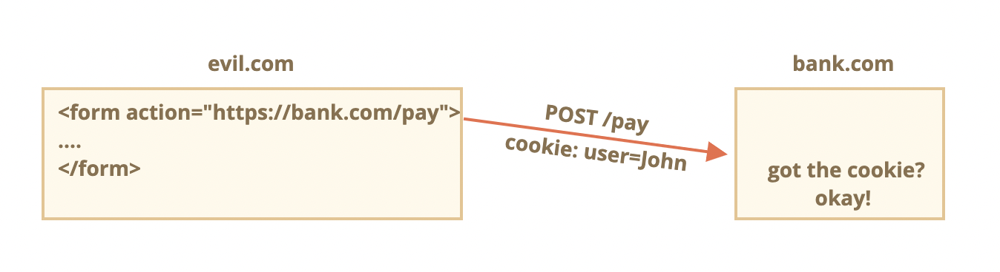
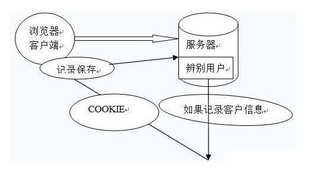
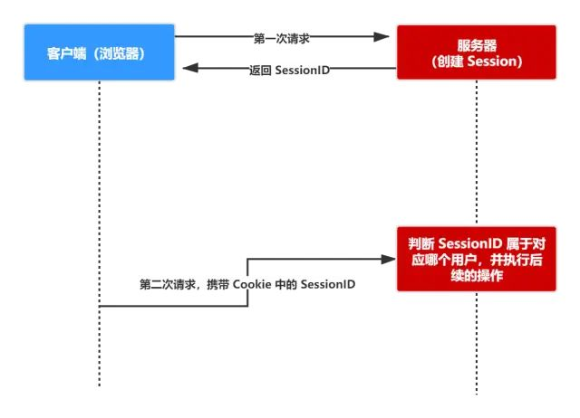
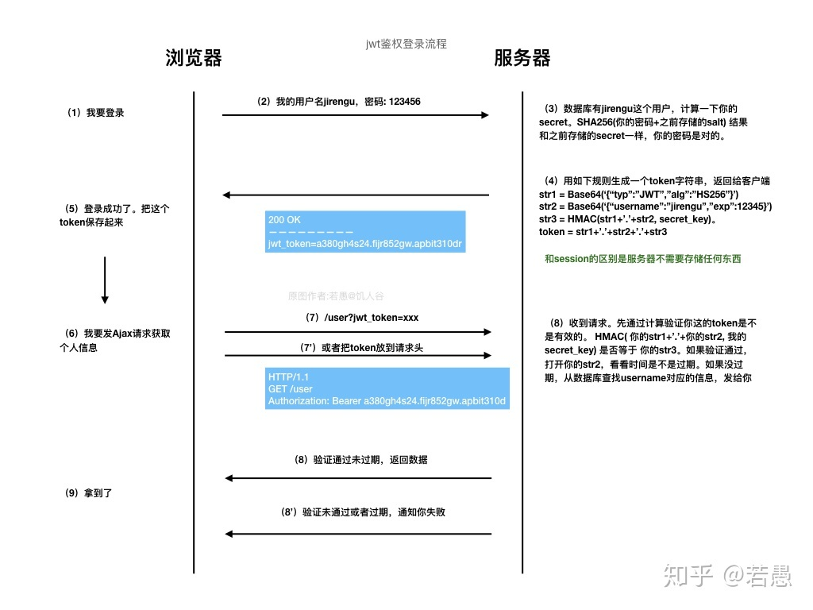
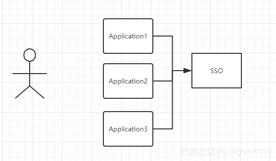

# 数据存储、安全和鉴权<!-- omit in toc -->

## cookie

`Cookie` 是直接存储在浏览器中的一小串数据。它们是 `HTTP` 协议的一部分。

`Cookie` 通常是由 `Web` 服务器使用响应 `Set-Cookie` `HTTP-header` 设置的。然后浏览器使用 `Cookie` `HTTP-header` 将它们自动添加到（几乎）每个对相同域的请求中。


我们还可以使用 `document.cookie` 属性从浏览器访问 `cookie`。

### document.cookie

`document.cookie` 的值由 `name=value` 对组成，以 `;` 分隔。每一个都是独立的 `cookie`。

对 `document.cookie` 的写入操作会更新其中提到的 `cookie`，而不会涉及其他 `cookie`。

```js
// 已经存在一些 cookie
alert( document.cookie ); // cookie1=value1; cookie2=value2;

document.cookie = "user=John"; // 只会更新名称为 user 的 cookie

alert( document.cookie ); // user=John;cookie1=value1; cookie2=value2;
```

从技术上讲，`cookie` 的名称和值可以是任何字符，为了保持有效的格式，它们应该使用内建的 `encodeURIComponent` 函数对其进行转义：

```js
// 特殊字符（空格），需要编码
let name = "my name";
let value = "John Smith"

// 将 cookie 编码为 my%20name=John%20Smith
document.cookie = encodeURIComponent(name) + '=' + encodeURIComponent(value);

alert(document.cookie); // ...; my%20name=John%20Smith
```

> 🧰 大小不能超过 `4` KB。因此，我们不能在一个 `cookie` 中保存大的东西。
> 每个域的 `cookie` 总数不得超过 `20+` 左右，具体限制取决于浏览器。浏览器一般只允许存放 `300` 个 `Cookie`
> 移动端对 `cookie` 的支持不是很好

### Cookie 选项

`Cookie` 有几个选项，其中很多都很重要，应该设置它。

选项被列在 `key=value` 之后，以 `;` 分隔，像这样：

```js
document.cookie = "user=John; path=/; expires=Tue, 19 Jan 2038 03:14:07 GMT"
```

#### path=/mypath

`url` 路径前缀，该路径下的页面可以访问该 `cookie`。必须是绝对路径。默认为当前路径。

如果一个 `cookie` 带有 `path=/admin` 设置，那么该 `cookie` 在 `/admin` 和 `/admin/something` 下都是可见的，但是在 `/home` 或 `/adminpage` 下不可见。

通常，我们应该将 `path` 设置为根目录：`path=/`，以使 `cookie` 对此网站的所有页面可见。

#### domain

可访问 `cookie` 的域。但是在实际中，有一些限制。我们无法设置任何域。

默认情况下，`cookie` 只有在设置的域下才能被访问到。所以，如果 `cookie` 设置在 `site.com` 下，我们在 `other.com` 下就无法获取它。我们在子域 `forum.site.com` 下也无法获取它！

`domain` 选项允许设置一个可以在子域访问的 `cookie`。

#### expires，max-age

默认情况下，如果一个 `cookie` 没有设置这两个参数中的任何一个，那么在关闭浏览器之后，它就会消失。此类 `cookie` 被称为 "session cookie”。

为了让 `cookie` 在浏览器关闭后仍然存在，我们可以设置 `expires` 或 `max-age` 选项中的一个。

```js
expires=Tue, 19 Jan 2038 03:14:07 GMT
```

`cookie` 的到期日期，那时浏览器会自动删除它。

如果我们将 `expires` 设置为过去的时间，则 `cookie` 会被删除。

```js
max-age=3600
```

`expires` 的替代选项，具指明 `cookie` 的过期时间距离当前时间的**秒**数。

如果为 `0` 或负数，则 `cookie` 会被删除：

```js
// cookie 会在一小时后失效
document.cookie = "user=John; max-age=3600";

// 删除 cookie（让它立即过期）
document.cookie = "user=John; max-age=0";
```

#### secure

默认情况下，如果我们在 `http://site.com` 上设置了 `cookie`，那么该 `cookie` 也会出现在 `https://site.com` 上，反之亦然。

也就是说，`cookie` 是基于域的，它们不区分协议。

使用此选项，如果一个 `cookie` 是通过 `https://site.com` 设置的，那么它不会在相同域的 `HTTP` 环境下出现，例如 `http://site.com`。

```js
// 假设我们现在在 HTTPS 环境下
// 设置 cookie secure（只在 HTTPS 环境下可访问）
document.cookie = "user=John; secure";
```

#### samesite

##### XSRF

这是另外一个关于安全的特性。它旨在防止 `XSRF`（跨网站请求伪造）攻击。

想象一下，你登录了 `bank.com` 网站。此时：**你有了来自该网站的身份验证 `cookie`。你的浏览器会在每次请求时将其发送到 `bank.com`，以便识别你**，并执行所有敏感的财务上的操作。

现在，在另外一个窗口中浏览网页时，你不小心访问了另一个网站 `evil.com`。该网站具有向 `bank.com` 网站提交一个具有启动与黑客账户交易的字段的表单 `<form action="https://bank.com/pay">` 的 `JavaScript` 代码。

你每次访问 `bank.com` 时，浏览器都会发送 `cookie`，即使该表单是从 `evil.com` 提交过来的。因此，银行会识别你的身份，并执行真实的付款。

这就是“跨网站请求伪造（Cross-Site Request Forgery，简称 XSRF）”攻击。



> 当然，实际的银行会防止出现这种情况。所有由 `bank.com` 生成的表单都具有一个特殊的字段，即所谓的 “XSRF 保护 token”，恶意页面既不能生成，也不能从远程页面提取它（它可以在那里提交表单，但是无法获取数据）。并且，网站 `bank.com` 会对收到的每个表单都进行这种 `token` 的检查。

但是，实现这种防护需要花费时间：我们需要确保每个表单都具有   字段，并且还必须检查所有请求。

##### samesite=strict（和没有值的 samesite 一样)

如果用户来自同一网站之外，那么设置了 `samesite=strict` 的 `cookie` 永远不会被发送。

当用户通过合法的链接访问 `bank.com` 时，例如从他们自己的笔记，他们会感到惊讶，`bank.com` 无法识别他们的身份。实际上，在这种情况下不会发送 `samesite=strict` `cookie`。

我们可以通过使用两个 `cookie` 来解决这个问题：一个 `cookie` 用于“一般识别”，仅用于说 “Hello, John”，另一个带有 `samesite=strict` 的 `cookie` 用于进行数据更改的操作。

##### samesite=lax

宽松（lax）模式，和 `strict` 模式类似，当从外部来到网站，则禁止浏览器发送 `cookie`，但是增加了一个例外。

如果以下两个条件均成立，则会发送 `samesite=lax` `cookie`：

1. HTTP 方法是“安全的”（例如 GET 方法，而不是 POST）。

2. 操作执行顶级导航（更改浏览器地址栏中的 URL）。

这通常是成立的，但是如果导航是在一个 `<iframe>` 中执行的，那么它就不是顶级的。此外，用于网络请求的 `JavaScript` 方法不会执行任何导航，因此它们不适合。

### httpOnly

`Web` 服务器使用 `Set-Cookie` `header` 来设置 `cookie`。并且，它可以设置 `httpOnly` 选项。

如果 `cookie` 设置了 `httpOnly`，那么 `document.cookie` 则看不到 `cookie`，所以它受到了保护。可以有效防止 `XSS` 攻击

但是可以通过 `Application` 中手动修改 `cookie`

## localStorage 和 sessionStorage

`Web` 存储对象 `localStorage` 和 `sessionStorage` 允许我们在浏览器中保存键/值对。

`key` 和 `value` 都必须为字符串。

- 存储大小限制为 `5MB+`，具体取决于浏览器。
- 它们不会过期。
- 数据绑定到源（域/端口/协议）。

localStorage|	sessionStorage
:--:|:--:
在同源的所有标签页和窗口之间共享数据|	在当前浏览器标签页中可见，包括同源的 iframe
浏览器重启后数据仍然保留|	页面刷新后数据仍然保留（但标签页关闭后数据则不再保留）

### API

- `setItem(key, value)` —— 存储键/值对。
- `getItem(key)` —— 按照键获取值。
- `removeItem(key)` —— 删除键及其对应的值。
- `clear()` —— 删除所有数据。
- `key(index)` —— 获取该索引下的键名。
- `length` —— 存储的内容的长度。

### Storage 事件

- 在调用 `setItem`，`removeItem`，`clear` 方法后触发。
- 包含有关操作的所有数据（`key/oldValue/newValue`），文档 `url` 和存储对象 `storageArea`。
- 在所有可访问到存储对象的 `window` 对象上触发，导致当前数据改变的 `window` 对象除外（对于 `sessionStorage` 是在当前标签页下，对于 `localStorage` 是在全局，即所有同源的窗口）

## Session

`session` 是一种记录服务器和客户端会话状态的机制

`session` 是基于 `cookie` 实现的，`session`存储在服务器端，`sessionId` 会被存储到客户端的 `cookie` 中



### session 认证流程



1. 用户第一次请求服务器的时候，服务器根据用户提交的相关信息，创建对应的 `Session`

2. 请求返回时将此 `Session` 的唯一标识信息 `SessionID` 返回给浏览器

3. 浏览器接收到服务器返回的 `SessionID` 信息后，会将此信息存入到 `Cookie` 中，同时 `Cookie` 记录此 `SessionID` 属于哪个域名

3. 当用户第二次访问服务器的时候，请求会自动判断此域名下是否存在 `Cookie` 信息，如果存在自动将 `Cookie` 信息也发送给服务端，服务端会从 `Cookie` 中获取 `SessionID`，再根据 `SessionID` 查找对应的 `Session` 信息，如果没有找到说明用户没有登录或者登录失效，如果找到 `Session` 证明用户已经登录可执行后面操作。

### 使用 session 时需要考虑的问题

- 将 `session` 存储在服务器里面，当用户同时在线量比较多时，这些 `session` 会占据较多的内存，需要在服务端定期的去清理过期的 `session`

- 当网站采用集群部署的时候，会遇到多台 `web` 服务器之间如何做 `session` 共享的问题。因为 `session` 是由单个服务器创建的，但是处理用户请求的服务器不一定是那个创建 `session` 的服务器，那么该服务器就无法拿到之前已经放入到 `session` 中的登录凭证之类的信息了。

- 当多个应用要共享 `session` 时，除了以上问题，还会遇到跨域问题，因为不同的应用可能部署的主机不一样，需要在各个应用做好 `cookie` 跨域的处理。

- `sessionId` 是存储在 `cookie` 中的，假如浏览器禁止 `cookie` 或不支持 `cookie` 怎么办？ 一般会把 `sessionId` 跟在 `url` 参数后面即重写 `url`，所以 `session` 不一定非得需要靠 `cookie` 实现

## JWT

JSON Web Token（简称 JWT）是目前最流行的**跨域**认证解决方案。通过客户端保存数据，而服务器根本不保存会话数据，每个请求都被发送回服务器。 

### JWT 的原则

JWT 的原则是在服务器身份验证之后，将生成一个 JSON 对象并将其发送回用户，如下所示。

```json
{
    "UserName":"Chongchong",
    "Role":"Admin",
    "Expire":"2018-08-08 20:15:56"
}
```

之后，当用户与服务器通信时，客户在请求中发回 `JSON` 对象。服务器仅依赖于这个 `JSON` 对象来标识用户。为了防止用户篡改数据，服务器将在生成对象时添加签名。
服务器不保存任何会话数据，即服务器变为无状态，使其更容易扩展。

### JWT 的数据结构

`JWT` 对象为一个长字串，字符之间通过"."分隔符分为三个子串。`JWT` 的三个部分如下。`JWT` 头、有效载荷和签名，将它们写成一行如下。

#### JWT 头

`JWT` 头部分是一个描述 `JWT` 元数据的 `JSON` 对象，通常如下所示。

```json
{
    "alg":"HS256",
    "typ":"JWT"
}
```

`alg` 属性表示签名使用的算法，默认为 `HMAC SHA256`（写为 HS256）；`typ` 属性表示令牌的类型，`JWT` 令牌统一写为 `JWT`。最后，使用 `Base64 URL` 算法将上述 `JSON` 对象转换为字符串保存。

#### 有效载荷

有效载荷部分，是 `JWT` 的主体内容部分，也是一个 `JSON` 对象，包含需要传递的数据。`JWT` 指定七个默认字段供选择。

- `iss`：发行人
- `exp`：到期时间
- `sub`：主题
- `aud`：用户
- `nbf`：在此之前不可用
- `iat`：发布时间
- `jti`：`JWT ID` 用于标识该 `JWT`

除以上默认字段外，我们还可以自定义私有字段，如下例：

```json
{
    "sub":"1234567890",
    "name":"chongchong",
    "admin":true
}
```

请注意，默认情况下 `JWT` 是未加密的，任何人都可以解读其内容，因此不要构建隐私信息字段，存放保密信息，以防止信息泄露。

#### 签名哈希

签名哈希部分是对上面两部分数据签名，通过指定的算法生成哈希，以确保数据不会被篡改。

首先，需要指定一个密码（secret）。该密码仅仅为保存在服务器中，并且不能向用户公开。然后，使用标头中指定的签名算法（默认情况下为 HMAC SHA256）根据以下公式生成签名。

```js
HMACSHA256(base64UrlEncode(header) + "." + base64UrlEncode(payload),
secret)
```

在计算出签名哈希后，`JWT` 头，有效载荷和签名哈希的三个部分组合成一个字符串，每个部分用"."分隔，就构成整个 `JWT` 对象。

### JWT 认证流程



1. 用户输入用户名/密码登录，服务端认证成功后，会返回给客户端一个 `JWT`

2. 客户端将 `token` 保存到本地（通常使用 `localstorage`，也可以使用 `cookie`）

3. 当用户希望访问一个受保护的路由或者资源的时候，需要请求头的 `Authorization` 字段中使用 `Bearer` 模式添加 `JWT`，其内容看起来是下面这样
    ```js
    Authorization: Bearer <token>
    ```
4. 服务端的保护路由将会检查请求头 `Authorization` 中的 `JWT` 信息，如果合法，则允许用户的行为

5. 因为 `JWT` 是自包含的（内部包含了一些会话信息），因此减少了需要查询数据库的需要———因为 `JWT` 自包含了用户信息和加密的数据。

6. 因为 `JWT` 并不使用 `Cookie` 的，所以你可以使用任何域名提供你的 `API` 服务而不需要担心跨域资源共享问题（CORS）

7. 因为用户的状态不再存储在服务端的内存中，所以这是一种无状态的认证机制

### 使用 JWT 时需要考虑的问题

- 因为 `JWT` 并不依赖 `Cookie` 的，所以你可以使用任何域名提供你的 `API` 服务而不需要担心跨域资源共享问题（CORS）

- `JWT` 默认是不加密，但也是可以加密的。生成原始 `Token` 以后，可以用密钥再加密一次。

- `JWT` 不仅可以用于认证，也可以用于交换信息。有效使用 `JWT`，可以降低服务器查询数据库的次数。

- `JWT` 最大的优势是服务器不再需要存储 `Session`，使得服务器认证鉴权业务可以方便扩展。但这也是 `JWT` 最大的缺点：由于服务器不需要存储 `Session` 状态，因此使用过程中无法废弃某个 `Token` 或者更改 `Token` 的权限。也就是说一旦 `JWT` 签发了，到期之前就会始终有效，除非服务器部署额外的逻辑。

- `JWT` 本身包含了认证信息，一旦泄露，任何人都可以获得该令牌的所有权限。为了减少盗用，`JWT` 的有效期应该设置得比较短。对于一些比较重要的权限，使用时应该再次对用户进行认证。

- 为了减少盗用，`JWT` 不应该使用 `HTTP` 协议明码传输，要使用 `HTTPS` 协议传输。

## OAuth 2.0

为了理解 `OAuth 2.0` 的适用场合，举一个假设的例子。

有一个"云冲印"的网站，可以将用户储存在 `Google` 的照片，冲印出来。用户为了使用该服务，必须让"云冲印"读取自己储存在 `Google` 上的照片。

问题是只有得到用户的授权，`Google` 才会同意"云冲印"读取这些照片。那么，"云冲印"怎样获得用户的授权呢？

传统方法是，用户将自己的 `Google` 用户名和密码，告诉"云冲印"，后者就可以读取用户的照片了。这样的做法有以下几个严重的缺点。

（1）"云冲印"为了后续的服务，会保存用户的密码，这样很不安全。

（2）Google 不得不部署密码登录，而我们知道，单纯的密码登录并不安全。

（3）"云冲印"拥有了获取用户储存在 Google 所有资料的权力，用户没法限制"云冲印"获得授权的范围和有效期。

（4）用户只有修改密码，才能收回赋予"云冲印"的权力。但是这样做，会使得其他所有获得用户授权的第三方应用程序全部失效。

（5）只要有一个第三方应用程序被破解，就会导致用户密码泄漏，以及所有被密码保护的数据泄漏。

`OAuth` 就是为了解决上面这些问题而诞生的。

### OAuth 的思路

`OAuth` 在"客户端（云冲印）"与"服务提供商（Google）"之间，设置了一个授权层（authorization layer）。"客户端"不能直接登录"服务提供商"，只能登录授权层，以此将用户与客户端区分开来。"客户端"登录授权层所用的令牌（token），与用户的密码不同。用户可以在登录的时候，指定授权层令牌的权限范围和有效期。

"客户端"登录授权层以后，"服务提供商"根据令牌的权限范围和有效期，向"客户端"开放用户储存的资料。

### 运行流程

`OAuth` 运行流程

（A）用户打开客户端以后，客户端要求用户给予授权。

（B）用户同意给予客户端授权。

（C）客户端使用上一步获得的授权，向认证服务器申请令牌。

（D）认证服务器对客户端进行认证以后，确认无误，同意发放令牌。

（E）客户端使用令牌，向资源服务器申请获取资源。

（F）资源服务器确认令牌无误，同意向客户端开放资源。

不难看出来，上面六个步骤之中，`B` 是关键，即用户怎样才能给于客户端授权。有了这个授权以后，客户端就可以获取令牌，进而凭令牌获取资源。

### 客户端的授权模式

#### 授权码模式

授权码模式（authorization code）是功能最完整、流程最严密的授权模式。它的特点就是通过客户端的后台服务器，与"服务提供商"的认证服务器进行互动。

它的步骤如下：

（A）用户访问客户端，后者将前者导向认证服务器（即服务提供商专门用来处理认证的服务器。）。

（B）用户选择是否给予客户端授权。

（C）假设用户给予授权，认证服务器将用户导向客户端事先指定的"重定向 URI"（redirection URI），同时附上一个授权码。

（D）客户端收到授权码，附上早先的"重定向 URI"，向认证服务器申请令牌。这一步是在客户端的后台的服务器上完成的，对用户不可见。

（E）认证服务器核对了授权码和重定向 URI，确认无误后，向客户端发送访问令牌（access token）和更新令牌（refresh token）。

## SSO

单点登录英文全称 `Single Sign On`，简称就是 `SSO`。它的解释是：在多个应用系统中，只需要登录一次，就可以访问其他相互信任的应用系统。



图中有 4 个系统，分别是 `Application1`、`Application2`、`Application3`、和 `SSO`。

`Application1`、`Application2`、`Application3` 没有登录模块，而 `SSO` 只有登录模块，没有其他的业务模块，当 `Application1`、`Application2`、`Application3` 需要登录时，将跳到 `SSO` 系统，`SSO` 系统完成登录，其他的应用系统也就随之登录了。这完全符合我们对单点登录（SSO）的定义。

具体流程如下：

1. 用户访问 `app` 系统，`app` 系统是需要登录的，但用户现在没有登录。

2. 跳转到 `SSO` 登录系统，`SSO` 系统也没有登录，弹出用户登录页。

3. 用户填写用户名、密码，`SSO` 系统进行认证后，将登录状态写入 `SSO` 的 `session`，浏览器（Browser）中写入 `SSO` 域下的 `Cookie`。

4. `SSO` 系统登录完成后会生成一个 `ST`（Service Ticket），然后跳转到 `app` 系统，同时将 `ST` 作为参数传递给 `app` 系统。

5. `app` 系统拿到 `ST` 后，从后台向 `SSO` 发送请求，验证 `ST` 是否有效。

6. 验证通过后，`app` 系统将登录状态写入 `session` 并设置 `app` 域下的 `Cookie`。

至此，跨域单点登录就完成了。以后我们再访问 `app` 系统时，`app` 就是登录的。接下来，我们再看看访问 `app2` 系统时的流程。

1. 用户访问 `app2` 系统，`app2` 系统没有登录，跳转到 `SSO`。

2. 由于`SSO`已经登录了，不需要重新登录认证。`SSO` 生成 `ST`，浏览器跳转到 `app2` 系统，并将 `ST` 作为参数传递给 `app2`。

3. `app2` 拿到 `ST`，后台访问 `SSO`，验证 `ST` 是否有效。

4. 验证成功后，`app2` 将登录状态写入 `session`，并在 `app2` 域下写入 `Cookie`。

这样，`app2` 系统不需要走登录流程，就已经是登录了。`SSO`，`app` 和 `app2` 在不同的域，它们之间的 `session` 不共享也是没问题的。

## 拓展安全知识

### XSS

XSS 的攻击方式就是想办法“教唆”用户的浏览器去执行一些这个网页中原本不存在的前端代码。本质是 `HTML` 注入。

### XSRF

跨站请求伪造。它利用用户已登录的身份，在第三方域（网站），以用户的名义（用户 cookie）完成非法操作。

### HTTP 劫持

在运营商的路由器节点上，设置协议检测，一旦发现是 `HTTP` 请求，而且是 `html` 类型请求，则拦截处理（因为是明文传输）。后续做法往往分为 2 种，1 种是类似 DNS 劫持返回 302 让用户浏览器跳转到另外的地址，还有 1 种是在服务器返回的 HTML 数据中插入 js 或 dom 节点（广告）。

### DNS 劫持

一般而言，用户上网的 DNS 服务器都是运营商分配的，所以，在这个节点上，运营商可以为所欲为。

例如，访问 `http://qq.com/index.html`，正常 `DNS` 应该返回腾讯的 `ip`，而 `DNS` 劫持后，会返回一个运营商的中间服务器 `ip`。访问该服务器会一致性的返回 `302`，让用户浏览器跳转到预处理好的带广告的网页，在该网页中再通过 `iframe` 打开用户原来访问的地址。

### 点击劫持

点击劫持是一种视觉欺骗的攻击手段。攻击者将需要攻击的网站通过 `iframe` 嵌套的方式嵌入自己的网页中，并将 `iframe` 设置为透明，在页面中透出一个按钮诱导用户点击。
