# CSS 查漏补缺<!-- omit in toc -->

- [选择器](#选择器)
  - [基础选择器](#基础选择器)
  - [属性选择器](#属性选择器)
  - [组合选择器](#组合选择器)
  - [伪类](#伪类)
    - [条件伪类](#条件伪类)
    - [行为伪类](#行为伪类)
    - [状态伪类](#状态伪类)
    - [结构伪类](#结构伪类)
    - [伪元素](#伪元素)
  - [优先级](#优先级)
- [@import](#import)
- [继承性](#继承性)
- [盒模型](#盒模型)
  - [content-box](#content-box)
  - [border-box](#border-box)
- [文档流](#文档流)
- [盒子类型](#盒子类型)
  - [block](#block)
  - [inline](#inline)
  - [inline-block](#inline-block)
- [BFC](#bfc)
  - [BFC 渲染规则](#bfc-渲染规则)
  - [如何创建 BFC](#如何创建-bfc)
  - [BFC 应用场景](#bfc-应用场景)
    - [自适应两栏布局](#自适应两栏布局)
    - [清除内部浮动](#清除内部浮动)
    - [防止垂直 `margin` 合并](#防止垂直-margin-合并)
- [IFC](#ifc)
  - [IFC 应用场景](#ifc-应用场景)
- [值和单位](#值和单位)
  - [px](#px)
  - [em](#em)
  - [rem/vw/vh](#remvwvh)
- [层叠上下文](#层叠上下文)
- [浮动](#浮动)
  - [浮动的特征](#浮动的特征)
  - [清除浮动](#清除浮动)
  - [table 布局](#table-布局)
- [margin 负值](#margin-负值)
  - [对于自身的影响](#对于自身的影响)
  - [对文档流的影响](#对文档流的影响)
  - [对浮动元素的影响](#对浮动元素的影响)
- [flex 布局](#flex-布局)
  - [flex 父容器属性](#flex-父容器属性)
    - [设置子容器沿主轴排列：`justify-content`](#设置子容器沿主轴排列justify-content)
    - [设置子容器如何沿交叉轴排列：align-items](#设置子容器如何沿交叉轴排列align-items)
  - [flex 子容器属性](#flex-子容器属性)
    - [在主轴上如何伸缩：`flex`](#在主轴上如何伸缩flex)
    - [单独设置子容器如何沿交叉轴排列：align-self](#单独设置子容器如何沿交叉轴排列align-self)
  - [轴](#轴)
    - [主轴](#主轴)
    - [交叉轴](#交叉轴)
  - [flex 进阶概念](#flex-进阶概念)
    - [父容器设置换行方式：flex-wrap](#父容器设置换行方式flex-wrap)
    - [轴向与换行组合设置：flex-flow](#轴向与换行组合设置flex-flow)
    - [多行沿交叉轴对齐：align-content](#多行沿交叉轴对齐align-content)
    - [子容器 flex 属性](#子容器-flex-属性)
      - [设置基准大小：flex-basis](#设置基准大小flex-basis)
  - [总结](#总结)
- [grid 布局](#grid-布局)
  - [grid 容器属性](#grid-容器属性)
  - [grid 项目属性](#grid-项目属性)

## 选择器

### 基础选择器

- 标签选择器：`h1`
- 类选择器：`.checked`
- `ID` 选择器：`#picker`
- 通配选择器：`*`

### 属性选择器

- `[attr]`：指定属性的元素
- `[attr=val]`：属性等于指定值的元素
- `[attr*=val]`：属性包含指定值的元素
- `[attr^=val]`	：属性以指定值开头的元素
- `[attr$=val]`：属性以指定值结尾的元素

### 组合选择器

- 相邻兄弟选择器：`A + B`
- 普通兄弟选择器：`A ~ B`
- 子选择器：`A > B`
- 后代选择器：`A B`

### 伪类


#### 条件伪类

- `:dir()`：匹配特定文字书写方向的元素
- `:lang()`：基于元素语言来匹配页面元素
- `:has()`：匹配包含指定元素的元素
- `:is()`：匹配指定选择器列表里的元素
- `:not()`：用来匹配不符合一组选择器的元素

#### 行为伪类

- `:active`：鼠标激活的元素
- `:hover`： 鼠标悬浮的元素
- `::selection`：鼠标选中的元素

#### 状态伪类

- `:target`：当前锚点的元素
- `:link`：未访问的链接元素
- `:visited`：已访问的链接元素
- `:focus`：输入聚焦的表单元素
- `:required`：输入必填的表单元素
- `:valid`：输入合法的表单元素
- `:invalid`：输入非法的表单元素
- `:in-range`：输入范围以内的表单元素
- `:out-of-range`：输入范围以外的表单元素
- `:checked`：选项选中的表单元素
- `:optional`：选项可选的表单元素
- `:enabled`：事件启用的表单元素
- `:disabled`：事件禁用的表单元素
- `:read-only`：只读的表单元素
- `:read-write`：可读可写的表单元素
- `:blank`：输入为空的表单元素
- `:current()`：浏览中的元素
- `:past()`：已浏览的元素
- `:future()`：未浏览的元素

#### 结构伪类

- `:root`：文档的根元素
- `:empty`：无子元素的元素
- `:first-letter`：元素的首字母
- `:first-line`：元素的首行
- `:nth-child(n)`：元素中指定顺序索引的元素
- `:nth-last-child(n)`：元素中指定逆序索引的元素
- `:first-child`：元素中为首的元素
- `:last-child`：元素中为尾的元素
- `:only-child`：父元素仅有该元素的元素
- `:nth-of-type(n)`：标签中指定顺序索引的标签
- `:nth-last-of-type(n)`：标签中指定逆序索引的标签
- `:first-of-type`：标签中为首的标签
- `:last-of-type`：标签中为尾标签
- `:only-of-type`：父元素仅有该标签的标签

#### 伪元素

- `::before`：在元素前插入内容
- `::after`：在元素后插入内容

### 优先级

- `10000`：`!important`
- `01000`：内联样式
- `00100`：`ID` 选择器
- `00010`：类选择器、伪类选择器、属性选择器
- `00001`：元素选择器、伪元素选择器
- `00000`：通配选择器、后代选择器、兄弟选择器

## @import

`link` 和 `@import` 都能导入一个样式文件，它们有什么区别嘛？

- `link` 是 `HTML` 标签，除了能导入 `CSS` 外，还能导入别的资源，比如图片、脚本和字体等；而 `@import` 是 `CSS` 的语法，只能用来导入 `CSS`
- `link` 导入的样式会在页面加载时同时加载，`@import` 导入的样式需等页面加载完成后再加载
- `link` 可以通过 `JS` 操作 `DOM` 动态引入样式表改变样式，而 `@import` 不可以。

## 继承性

在 `CSS` 中有一个很重要的特性就是子元素会继承父元素对应属性计算后的值。

`CSS` 属性很多，但并不是所有的属性默认都是能继承父元素对应属性的，那哪些属性存在默认继承的行为呢？一定是那些不会影响到页面布局的属性，可以分为如下几类：

- 字体相关：`font-family`、`font-style`、`font-size`、`font-weight` 等
- 文本相关：`text-align`、`text-indent`、`text-decoration`、`text-shadow`、`letter-spacing`、`word-spacing`、`white-space`、`line-height`、`color` 等
- 列表相关：`list-style`、`list-style-image`、`list-style-type`、`list-style-position` 等
- 其他属性：`visibility`、`cursor` 等

对于其他默认不继承的属性也可以通过以下几个属性值来控制继承行为：

- `inherit`：继承父元素对应属性的计算值
- `initial`：应用该属性的默认值，比如 `color` 的默认值是 `#000`
- `unset`：如果属性是默认可以继承的，则取 `inherit` 的效果，否则同 `initial`

## 盒模型

盒模型分为标准盒模型和怪异盒模型(IE 模型)

```js
box-sizing：content-box   /* 标准盒模型 */
box-sizing：border-box    /* 怪异盒模型 */
```

### content-box

> 默认值，标准盒子模型。 `width` 与 `height` 只包括内容的宽和高， 不包括边框（border），内边距（padding），外边距（margin）。

尺寸计算公式：

`width` = 内容的宽度

`height` = 内容的高度

宽度和高度的计算值都不包含内容的边框（border）和内边距（padding）。

### border-box

>`width` 和 `height` 属性包括内容，内边距和边框，但不包括外边距。

尺寸计算公式：

`width` = `border` + `padding` + 内容的宽度

`height` = `border` + `padding` + 内容的高度

## 文档流

- 除根元素、`float`、`absolute`，其他元素都在文档流内
- 使用浮动 `float` 会将元素脱离文档流，移动到容器左/右侧边界或者是另一个浮动元素旁边，该浮动元素之前占用的空间将被别的元素填补，另外浮动之后所占用的区域不会和别的元素之间发生重叠
- 使用绝对定位 `position: absolute;` 或者固定定位 `position: fixed;` 也会使得元素脱离文档流，且空出来的位置将自动被后续节点填补
- 块级元素默认会占满整行，所以多个块级盒子之间是从上到下排列的
- 内联元素默认会在一行里一列一列的排布，当一行放不下的时候，会自动切换到下一行继续按照列排布

## 盒子类型

- 块级盒子：`display` 为 `block`、`list-item`、`table`、`flex`、`grid`、`flow-root` 等
- 行内级盒子：`display `为 `inline`、`inline-block`、`inline-table `等

### block

- 占满一行，默认继承父元素的宽度；多个块元素将从上到下进行排列
- 设置 `width/height` 将会生效
- 设置 `padding` 和 `margin` 将会生效

### inline

- 不会占满一行，宽度随着内容而变化；多个 `inline` 元素将按照从左到右的顺序在一行里排列显示，如果一行显示不下，则自动换行
- 设置 `width/height` 将不会生效
- 设置竖直方向上的 `padding` 和 `margin` 将不会生效

### inline-block

- 是行内块元素，不单独占满一行，可以看成是能够在一行里进行左右排列的块元素
- 设置 `width/height` 将会生效
- 设置 `padding` 和 `margin` 将会生效

## BFC

块格式化上下文，它是一个独立的渲染区域，只有块级盒子参与，它规定了内部的块级盒子如何布局，并且与这个区域外部毫不相干。

### BFC 渲染规则

- 内部的盒子会在垂直方向，一个接一个地放置
- 盒子垂直方向的距离由 `margin` 决定，属于同一个 `BFC` 的两个相邻盒子的 `margin` 会发生重叠
- 每个元素的 `margin` 的左边，与包含块 `border` 的左边相接触(对于从左往右的格式化，否则相反)，即使存在浮动也是如此
- `BFC` 的区域不会与 `float` 盒子重叠
- BFC 就是页面上的一个隔离的独立容器，容器里面的子元素不会影响到外面的元素。反之也如此。
- 计算 `BFC` 的高度时，浮动元素也参与计算。

### 如何创建 BFC

- 根元素：`html`
- 非溢出的可见元素：`overflow` 不为 `visible`
- 设置浮动：`float` 属性不为 `none`
- 设置定位：`position` 为 `absolute `或 `fixed`
- 定义成块级的非块级元素：`display: inline-block/table-cell/table-caption/flex/inline-flex/grid/inline-grid`

### BFC 应用场景

#### 自适应两栏布局

**BFC 的区域不会和浮动区域重叠**：所以就可以把侧边栏固定宽度且左浮动，而对右侧内容触发 `BFC`，使得它的宽度自适应该行剩余宽度。

#### 清除内部浮动

浮动造成的问题就是父元素高度坍塌，所以清除浮动需要解决的问题就是让父元素的高度恢复正常。而用 `BFC` 清除浮动的原理就是：**计算 `BFC` 的高度时，浮动元素也参与计算**。只要触发父元素的 `BFC` 即可。


#### 防止垂直 `margin` 合并

`BFC` 渲染原理之一：**同一个 `BFC` 下的垂直 `margin` 会发生合并**。所以如果让 `2` 个元素不在同一个 `BFC` 中即可阻止垂直 `margin` 合并。那如何让 `2` 个相邻的兄弟元素不在同一个 `BFC` 中呢？可以给其中一个元素外面包裹一层，然后触发其包裹层的 `BFC`，这样一来 `2` 个元素就不会在同一个 `BFC` 中了。

## IFC

- 子元素在水平方向上一个接一个排列，在垂直方向上将以容器顶部开始向下排列
- 节点无法声明宽高，其中 `margin` 和 `padding` 在水平方向有效在垂直方向无效
- 节点在垂直方向上以不同形式对齐
- 能把在一行上的框都完全包含进去的一个矩形区域，被称为该行的线盒 `line box` 。线盒的宽度是由包含块 `containing box` 和与其中的浮动来决定
- `IFC` 中的 `line box` 一般左右边贴紧其包含块，但 `float` 元素会优先排列。
- `IFC` 中的 `line box` 高度由 `line-height` 计算规则来确定，同个 `IFC` 下的多个 `line box` 高度可能会不同
- 当内联级盒子的总宽度少于包含它们的 `line box` 时，其水平渲染规则由 `text-align` 属性值来决定
- 当一个内联盒子超过父元素的宽度时，它会被分割成多盒子，这些盒子分布在多个 `line box` 中。如果子元素未设置强制换行的情况下，`inline box` 将不可被分割，将会溢出父元素。

### IFC 应用场景

- 水平居中：当一个块要在环境中水平居中时，设置其为 `inline-block` 则会在外层产生 `IFC`，通过 `text-align` 则可以使其水平居中。
- 垂直居中：创建一个 `IFC`，用其中一个元素撑开父元素的高度，然后设置其 `vertical-align: middle`，其他行内元素则可以在此父元素下垂直居中。

## 值和单位

### px

`px` 表示的是 `CSS` 中的像素，在 `CSS` 中它是绝对的长度单位，也是最基础的单位，其他长度单位会自动被浏览器换算成 `px`。但是对于设备而言，它其实又是相对的长度单位，比如宽高都为 `2px`，在正常的屏幕下，其实就是 `4` 个像素点，而在设备像素比(`devicePixelRatio`) 为 `2` 的 `Retina` 屏幕下，它就有 `16` 个像素点。所以屏幕尺寸一致的情况下，屏幕分辨率越高，显示效果就越细腻。

### em

`em` 是 `CSS` 中的相对长度单位中的一个。居然是相对的，那它到底是相对的谁呢？它有 `2` 层意思：

- 在 `font-size` 中使用是相对于父元素的 `font-size` 大小，比如父元素 `font-size: 16px`，当给子元素指定 `font-size: 2em` 的时候，经过计算后它的字体大小会是 `32px`
- 在其他属性中使用是相对于自身的字体大小，如 `width/height/padding/margin` 等

`em` 在计算的时候是会层层计算的，比如：

```html
<div>
  <p></p>
</div>
```
```css
div { font-size: 2em; }
p { font-size: 2em; }
```
对于如上一个结构的 `HTML`，由于根元素 `html` 的字体大小是 `16px`，所以 `p` 标签最终计算出来后的字体大小会是 `16 * 2 * 2 = 64px`

### rem/vw/vh

- `rem(root em)` 和 `em` 一样，也是一个相对长度单位，不过 `rem` 相对的是 `HTML` 的根元素 `html`

- `vw` 和 `vh` 分别是相对于屏幕视口宽度和高度而言的长度单位

- 在 `JS` 中 `100vw = window.innerWidth，100vh = window.innerHeight`。

## 层叠上下文

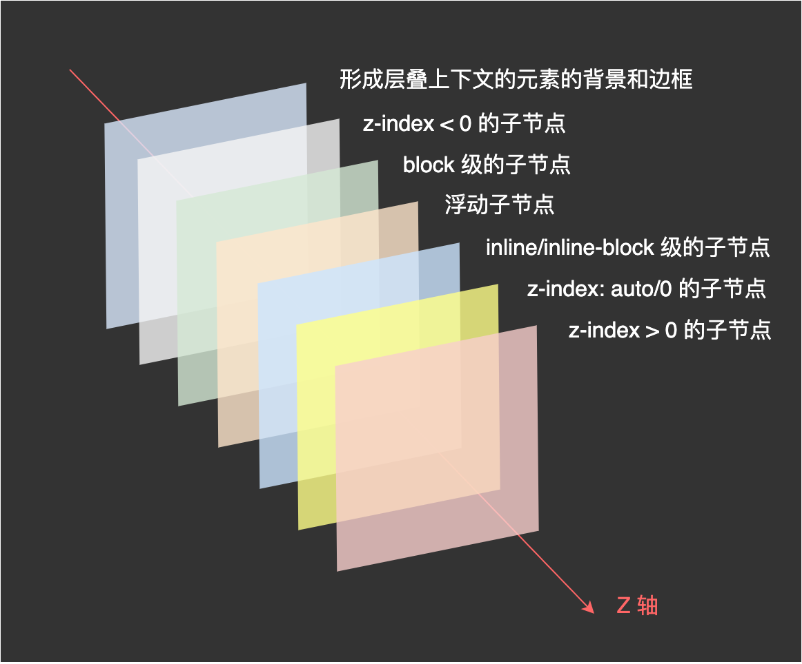

## 浮动

浮动核心就一句话：**浮动元素会脱离文档流并向左/向右浮动，直到碰到父元素或者另一个浮动元素。**

### 浮动的特征

- 浮动会脱离文档，**漂浮在父元素左边或右边**
- 浮动可以内联排列，**浮动盒会一直飘到其外边缘挨着的容器边缘或另外的浮动盒**
- **浮动元素不会影响其后面的块级盒**但是浮动元素后面的行级盒子会变短以避开浮动元素
- 浮动会导致父元素高度坍塌，导致高度塌陷的原因是因为浮动元素脱离了正常的文档流

### 清除浮动

`clear` 属性不允许被清除浮动的元素的左边/右边挨着浮动元素，底层原理是在被清除浮动的元素上边或者下边添加足够的清除空间。

> ⚠️ 不要在浮动元素上清除浮动，浮动元素脱离了文档流，就算给浮动元素上下加了清除空间，也是没有任何意义的。

```css
/* before 处理器 margin 重叠 */
.clearfix::before,
.clearfix::after {
	display: table;
	content: " ";
}
.clearfix::after {
	clear: both;
}
```

### table 布局

- `table` 可设置 `width`、`height`、`border`、`padding`、`margin` 值
- 宽高默认由内容撑开，如果设置了宽度，宽度默认被里面的 `td` 平分，如果给某个 `td` 设置宽度，剩下来宽度由其他 `td` 平分
- 给 `table` 设置的高度只起到 `min-height` 作用，内容超过设置高度，`table` 的高度会被撑高
- 给 `table-row(行:tr)` 设置的高度只起到 `min-height` 作用，内容超过设置高度，`tr` 的高度会被撑高
- `tr` 中的 `table-cell(列:td)` 默认高度继承 `tr` 高度，若给其中一个 `td` 设置高度，其他 `td` 也会变高，多列等高布局
- `tr` 无法设置宽度，`margin` 值
- `td` 单独设置：若 `table` 不存在，宽高不能为百分比
- `td` 继承 `table` 高度，平分宽度
- 给 `td` 设置 `vertical-align: middle;` 除了 `float`，`absolute` 所有 `block`，`inline` 元素都会相对于`td` 垂直居中
- 给 `td` 设置 `text-align: center;` 除了 `float，absolute` 所有 `inline` 元素水平居中，`block` 元素不居中但他的内容或子 `inline` 元素居中

## margin 负值

### 对于自身的影响

当元素不存在 `width` 属性或者 `width：auto` 的时候

- `margin-left` 和 `margin-right` 都是可以增加宽度
- `margin-top` 为负值不会增加高度，只会产生向上位移
- `margin-bottom` 为负值不会产生位移，会减少自身的供 `css` 读取的高度

**利用 `margin-bottom` 为负值会减少 `css` 读取元素高度的特性，加上 `padding-bottom` 和 `overflow:hidden` ,就能实现一个未知高度的多列等高布局**

### 对文档流的影响

不脱离文档流不使用 `float` 的话，负 `margin` 元素是不会破坏页面的文档流。

### 对浮动元素的影响

负 `margin` 会改变浮动元素的显示位置，即使我的元素写在 `DOM` 的后面，我也能让它显示在最前面。圣杯布局、双飞翼布局啊什么的，都是利用这个原理实现的。

## flex 布局

`flex` 的核心的概念就是**容器**和**轴**。容器包括外层的**父容器**和内层的**子容器**，轴包括**主轴**和**交叉轴**。

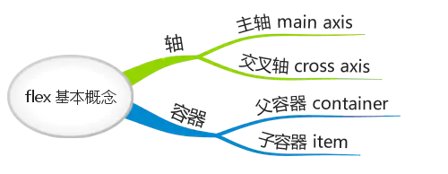

> 容器具有这样的特点：父容器可以统一设置子容器的排列方式，子容器也可以单独设置自身的排列方式，**如果两者同时设置，以子容器的设置为准**。

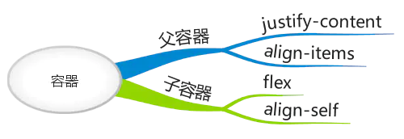

### flex 父容器属性

#### 设置子容器沿主轴排列：`justify-content`

`justify-content` 属性用于定义如何沿着主轴方向排列子容器。

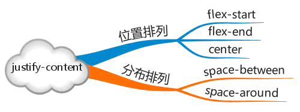

`flex-start`：起始端对齐

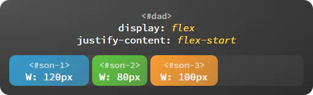

`flex-end`：末尾段对齐

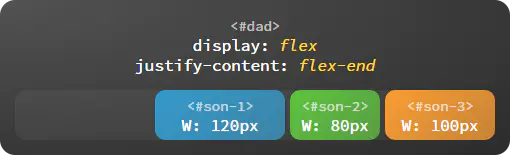

`center`：居中对齐

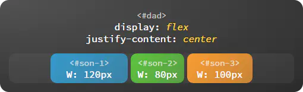

`space-around`：子容器沿主轴均匀分布，位于首尾两端的子容器到父容器的距离是子容器间距的一半。

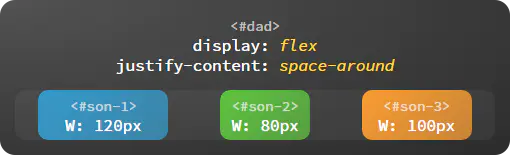

`space-between`：子容器沿主轴均匀分布，位于首尾两端的子容器与父容器相切。

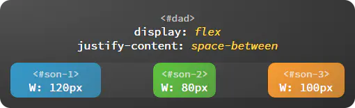

#### 设置子容器如何沿交叉轴排列：align-items

`align-items` 属性用于定义如何沿着交叉轴方向分配子容器的间距。

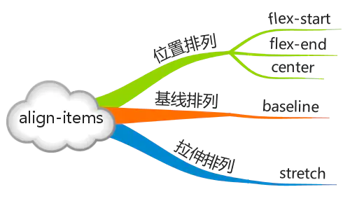

`flex-start`：起始端对齐

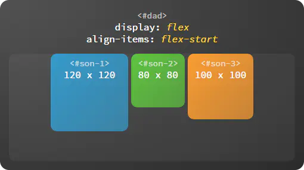

`flex-end`：末尾段对齐

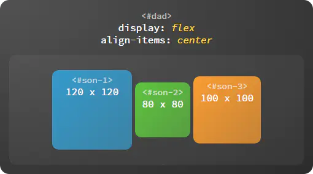

`center`：居中对齐

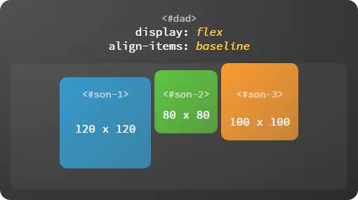

`baseline`：基线对齐，这里的 baseline 默认是指首行文字，即 `first baseline`，所有子容器向基线对齐，交叉轴起点到元素基线距离最大的子容器将会与交叉轴起始端相切以确定基线。


`stretch`：子容器沿交叉轴方向的尺寸拉伸至与父容器一致。

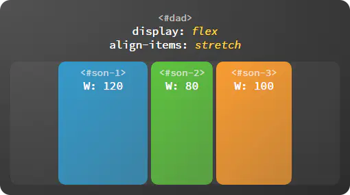

### flex 子容器属性

#### 在主轴上如何伸缩：`flex`

子容器是有弹性的（flex 即弹性），它们会自动填充剩余空间，子容器的伸缩比例由 `flex` 属性确定。

`flex` 的值可以是无单位数字（如：1, 2, 3），也可以是有单位数字（如：15px，30px，60px），还可以是 `none` 关键字。子容器会按照 `flex` 定义的尺寸比例自动伸缩，如果取值为 `none` 则不伸缩。

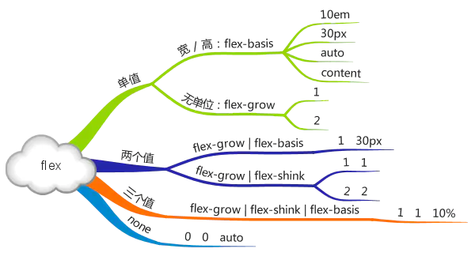

#### 单独设置子容器如何沿交叉轴排列：align-self

每个子容器也可以单独定义沿交叉轴排列的方式，此属性的可选值与父容器 `align-items` 属性完全一致，如果两者同时设置则以子容器的 `align-self` 属性为准。

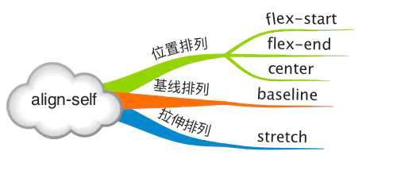

`flex-start`：起始端对齐

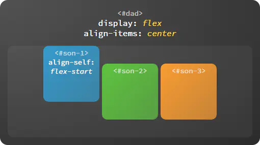

`flex-end`：末尾段对齐

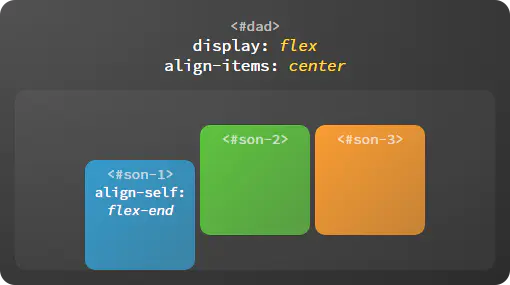

`center`：居中对齐

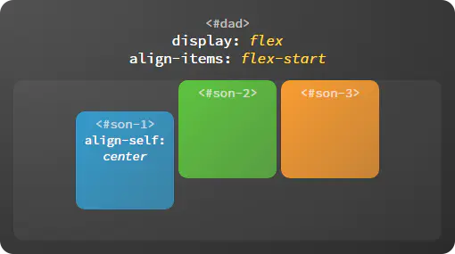

`baseline`：基线对齐

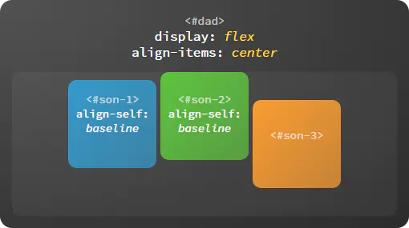

`stretch`：拉伸对齐

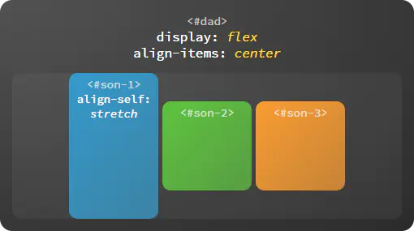

### 轴

轴包括主轴和交叉轴，`justify-content` 属性决定子容器沿主轴的排列方式，`align-items` 属性决定子容器沿着交叉轴的排列方式。在 `flex` 布局中，`flex-direction` 属性决定主轴的方向，交叉轴的方向由主轴确定。

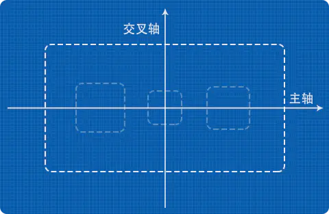

#### 主轴

主轴的起始端由 `flex-start` 表示，末尾段由 `flex-end` 表示。不同的主轴方向对应的起始端、末尾段的位置也不相同。

向右：`flex-direction: row`

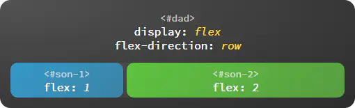

向下：`flex-direction: column`

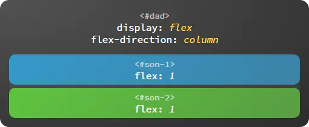

向左：`flex-direction: row-reverse`


向上：`flex-direction: column-reverse`

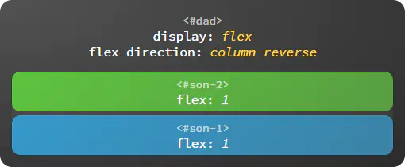

#### 交叉轴

主轴沿逆时针方向旋转 `90°` 就得到了交叉轴，交叉轴的起始端和末尾段也由 `flex-start` 和 `flex-end` 表示。

### flex 进阶概念

#### 父容器设置换行方式：flex-wrap

决定子容器是否换行排列，不但可以顺序换行而且支持逆序换行。

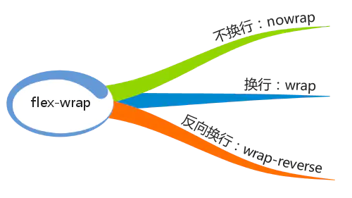

`nowrap`：不换行

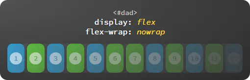

`wrap`：换行

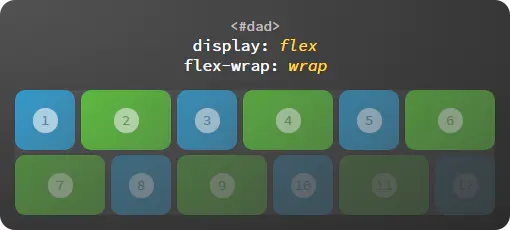

`wrap-reverse`：逆序换行

逆序换行是指沿着交叉轴的反方向换行。

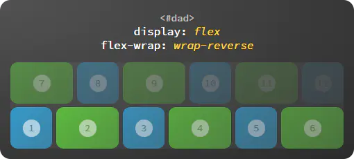

#### 轴向与换行组合设置：flex-flow

`flow` 即流向，也就是子容器沿着哪个方向流动，流动到终点是否允许换行，比如 `flex-flow: row wrap`，**`flex-flow` 是一个复合属性**，相当于 `flex-direction` 与 `flex-wrap` 的组合，可选的取值如下：
- `row`、`column `等，可单独设置主轴方向
- `wrap`、`nowrap` 等，可单独设置换行方式
- `row nowrap`、`column wrap` 等，也可两者同时设置

#### 多行沿交叉轴对齐：align-content

当子容器多行排列时，设置行与行之间的对齐方式。

`flex-start`：起始端对齐

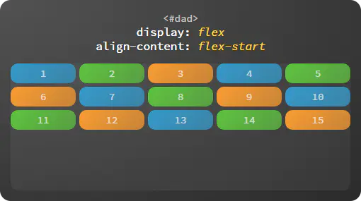

`flex-end`：末尾段对齐

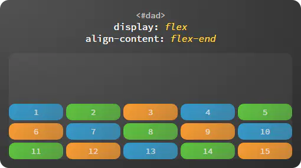

`center`：居中对齐

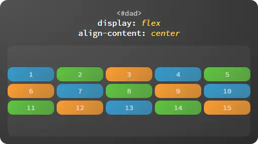

`space-around`：等边距均匀分布

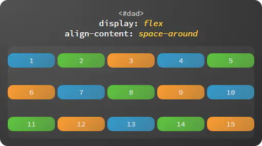

`space-between`：等间距均匀分布

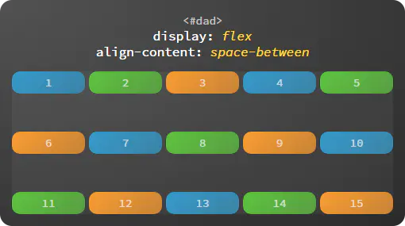

`stretch`：拉伸对齐

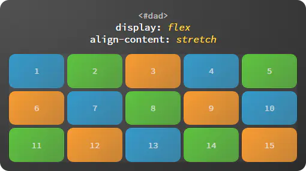

#### 子容器 flex 属性

##### 设置基准大小：flex-basis

`flex-basis` 表示在不伸缩的情况下子容器的原始尺寸。**主轴为横向时代表宽度，主轴为纵向时代表高度。**

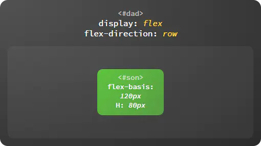

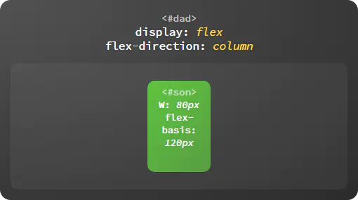

设置扩展比例：`flex-grow`

子容器弹性伸展的比例。如图，剩余空间按 `1:2` 的比例分配给子容器。

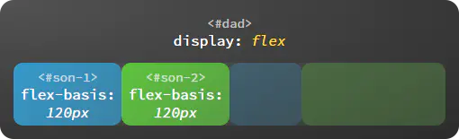

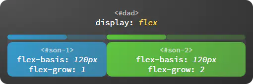

设置收缩比例：`flex-shrink`

子容器弹性收缩的比例。如图，超出的部分按 1:2 的比例从给子容器中减去。


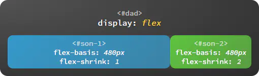

设置排列顺序：`order`

改变子容器的排列顺序，覆盖 `HTML` 代码中的顺序，默认值为 `0`，可以为负值，数值越小排列越靠前。


总结：

- `order` 属性规定了弹性容器中的可伸缩项目在布局时的顺序。元素按照 `order` 属性的值的增序进行布局。拥有相同 `order` 属性值的元素按照它们在源代码中出现的顺序进行布局。**初始值为 0**。
  
- 属性 `flex` 规定了弹性元素如何伸长或缩短以适应 `flex` 容器中的可用空间。这是一个简写属性，可以同时设置`flex-grow`, `flex-shrink` 与 `flex-basis`。
  - 值 `auto` 相当于将属性设置为 `"flex: 1 1 auto"`
  - 默认值 `initial` 相当于将属性设置为 `"flex: 0 1 auto"`
  - 值 `none` 相当于将属性设置为 `"flex: 0 0 auto"`

- `flex-grow` 属性定义弹性盒子项（flex item）的拉伸因子。**初始值为 0**。负值是不被允许的。

- `flex-shrink` 属性指定了 `flex` 元素的收缩规则。`flex` 元素仅在默认宽度之和大于容器的时候才会发生收缩，其收缩的大小是依据 `flex-shrink` 的值。**初始值为 1**。负值是不被允许的。

- 属性 `flex-basis` 指定了 `flex` 元素在主轴方向上的初始大小。如果不使用 `box-sizing` 来改变盒模型的话，那么这个属性就决定了 `flex` 元素的内容盒（content-box）的宽或者高（取决于主轴的方向）的尺寸大小。**初始值	auto**。

- 属性 `align-self` 会对齐当前 `flex` 行中的 `flex` 元素，并覆盖 `align-items`（全局设置）的值. 如果任何 `flex` 元素的侧轴方向 `margin` 值设置为 `auto`，则会忽略 `align-self`（个体设置）。

### 总结

以上就是 `flex` 布局的全部属性，一共 `12` 个，父容器、子容器各 `6` 个，可以随时通过下图进行回顾。

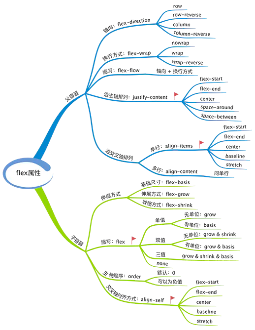

## grid 布局

### grid 容器属性

- `grid-template-columns`：定义垂直栏
- `grid-template-rows`：定义水平行
- `grid-template-areas`：定义区域
- `grid-column-gap`：定义垂直栏与垂直栏之间的间距
- `grid-row-gap`：定义水平行与水平行之间的间距
- `grid-gap`：上面两个栏与行间距的缩写
- `justify-items`：`item` 在水平行中的对齐方式
- `align-items`：`item` 在垂直栏中的对齐方式
- `justify-content`：整个水平行在 `grid` 范围的对齐方式，这里有个好用的 `space-evenly` 值，补足了以前 `flex` 的`space-around` 和 `space-between` 的不足
- `align-content`：整个垂直栏在 `grid` 范围的对齐方式
- 当定义的行或列数量不够时，`item` 的自动排列方式：
  - `grid-auto-columns`：定义多出的 `item` 的自动 `column` 的宽度大小
  - `grid-auto-rows`：定义多出的 `item` 自动 `row` 的高度大小
  - `grid-auto-flow`：定义自动 `item` 是按照先水平方向排列还是垂直方向排列

### grid 项目属性

- `grid-column-start`：`item` 的起始栏
- `grid-column-end`：`item` 的结束栏
- `grid-column`：起始栏和结束栏的简写
- `grid-row-start`：`item` 的起始行
- `grid-row-end`：`item` 的结束行
- `grid-row`：起始行与结束行的简写
- `grid-area`：`item` 所在区域 
- `justify-self`：自定义 `item` 的水平方向对齐方式
- `align-self`：自定义 `item` 的垂直方向对齐方式
