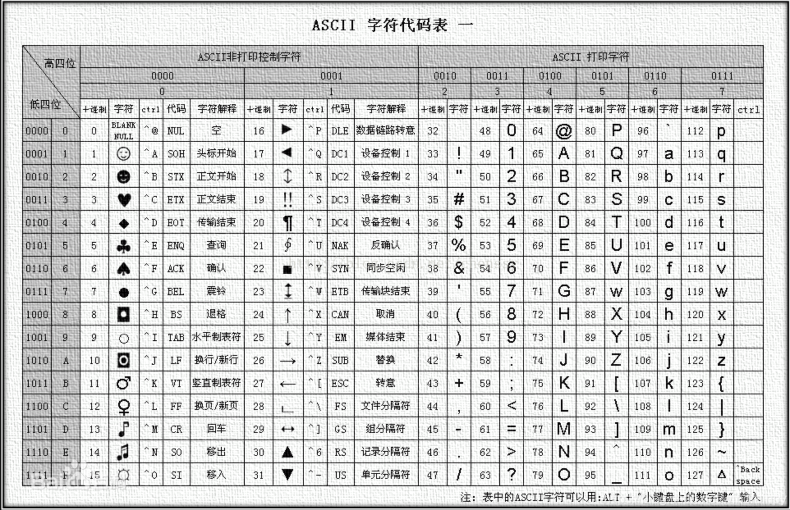

# 前端操作文件和二进制数据
操作用户选中的本地二进制文件，需要用二进制流的方式上传到服务端。
保存快照 HTML 文件。JS拿到的只是HTML源码长字符串，需要生成二进制流上传到服务端。（其中涉及到 base64 和 encodeURIComponent 等编码问题）
前端通过 screen-capture-js 库取得当前页面的 documentText – 长长的字符串，需要转成二进制文件流的格式，通过websocket 分多次数据包传输给后台存储。
结合JS的ArrayBuffer和 Typed Array去获取及处理音频数据、XHR2上传或下载二进制内容等等

URL.createObjectURL
blob
file
arrayBuffer
FormData

## 编码知识

ASCII 字符集
背景：因为计算机只能处理数字，如果要处理文本，就必须先把文本转换为数字才能处理。最早的计算机在设计时采用8个比特（bit）作为一个字节（byte）。一个字节能表示的最大的整数就是255（2^8-1=255），而ASCII编码，占用0 - 127用来表示大小写英文字母、数字和一些符号，这个编码表被称为ASCII编码。
组成：26个字母的大小写、数字、特殊符号、美式英语中的控制字符。在英语中，用128个符号编码便可以表示所有。
32～126(共95个)是字符(32是空格），其中48～57为0到9十个阿拉伯数字，65～90为26个大写英文字母，97～122号为26个小写英文字母，其余为一些标点符号、运算符号等。
大小规则：09<AZ<a~z。

Unicode码也是一种国际标准编码，采用二个字节编码，与ASCII码不兼容。在网络、Windows系统和很多大型软件中得到应用。
因为ASCII编码无法表示多国语言的编码，为了统一所有文字的编码，Unicode应运而生。Unicode把所有语言都统一到一套编码里，这样就不会再有乱码问题了。
Unicode通常用两个字节表示一个字符，原有的英文编码从单字节变成双字节，只需要把高字节全部填为0就可以。
Unicode 编码共有三种具体实现，分别为utf-8,utf-16,utf-32
它前128个字符就是ASCII码，之后是扩展码。
JS 中 ASCII 码和 unicode 码之间的转换
ASCII 转 unicode：用 String 的 CharCodeAt() 方法，返回指定位置的字符的 unicode 编码。
unicode 转 ASCII：用 String 的 fromCharCode() 方法，可将 unicode 编码转为字符。

MIME 类型
媒体类型（通常称为 Multipurpose Internet Mail Extensions 或 MIME 类型 ）是一种标准，用来表示文档、文件或字节流的性质和格式。

重要：浏览器通常使用MIME类型（而不是文件扩展名）来确定如何处理URL，因此Web服务器在响应头中添加正确的MIME类型非常重要。如果配置不正确，浏览器可能会曲解文件内容，网站将无法正常工作，并且下载的文件也会被错误处理。

通用结构
type/subtype
MIME的组成结构非常简单；由类型与子类型两个字符串中间用'/'分隔而组成。不允许空格存在。type 表示可以被分多个子类的独立类别。subtype 表示细分后的每个类型。

MIME类型对大小写不敏感，但是传统写法都是小写。

独立类型
text/plain
text/html
image/jpeg
image/png
audio/mpeg
audio/ogg
audio/*
video/mp4
application/*
application/json
application/javascript
application/ecmascript
application/octet-stream
…
独立类型表明了对文件的分类，可以是如下之一：
类型	描述	典型示例
text	表明文件是普通文本，理论上是人类可读	text/plain, text/html, text/css, text/javascript
image	表明是某种图像。不包括视频，但是动态图（比如动态gif）也使用image类型	image/gif, image/png, image/jpeg, image/bmp, image/webp, image/x-icon, image/vnd.microsoft.icon
audio	表明是某种音频文件	audio/midi, audio/mpeg, audio/webm, audio/ogg, audio/wav
video	表明是某种视频文件	video/webm, video/ogg
application	表明是某种二进制数据	
application/octet-stream, application/pkcs12, application/vnd.mspowerpoint, application/xhtml+xml, application/xml,  application/pdf

对于text文件类型若没有特定的subtype，就使用 text/plain。类似的，二进制文件没有特定或已知的 subtype，即使用 application/octet-stream。

Multipart 类型
multipart/form-data
multipart/byteranges
Multipart 类型表示细分领域的文件类型的种类，经常对应不同的 MIME 类型。这是复合文件的一种表现方式。multipart/form-data 可用于联系 HTML Forms 和 POST 方法，此外 multipart/byteranges使用状态码206 Partial Content来发送整个文件的子集，而HTTP对不能处理的复合文件使用特殊的方式：将信息直接传送给浏览器（这时可能会建立一个“另存为”窗口，但是却不知道如何去显示内联文件。）

multipart/form-data 可用于HTML表单从浏览器发送信息给服务器。作为多部分文档格式，它由边界线（一个由'--'开始的字符串）划分出的不同部分组成。每一部分有自己的实体，以及自己的 HTTP 请求头，Content-Disposition和 Content-Type 用于文件上传领域，最常用的 (Content-Length 因为边界线作为分隔符而被忽略）。

Content-Type: multipart/form-data; boundary=aBoundaryString
(other headers associated with the multipart document as a whole)

--aBoundaryString
Content-Disposition: form-data; name="myFile"; filename="img.jpg"
Content-Type: image/jpeg

(data)
--aBoundaryString
Content-Disposition: form-data; name="myField"

(data)
--aBoundaryString
(more subparts)
--aBoundaryString--

如下所示的表单:

<form action="http://localhost:8000/" method="post" enctype="multipart/form-data">
  <input type="text" name="myTextField">
  <input type="checkbox" name="myCheckBox">Check</input>
  <input type="file" name="myFile">
  <button>Send the file</button>
</form>
会发送这样的请求:

POST / HTTP/1.1
Host: localhost:8000
User-Agent: Mozilla/5.0 (Macintosh; Intel Mac OS X 10.9; rv:50.0) Gecko/20100101 Firefox/50.0
Accept: text/html,application/xhtml+xml,application/xml;q=0.9,*/*;q=0.8
Accept-Language: en-US,en;q=0.5
Accept-Encoding: gzip, deflate
Connection: keep-alive
Upgrade-Insecure-Requests: 1
Content-Type: multipart/form-data; boundary=---------------------------8721656041911415653955004498
Content-Length: 465

-----------------------------8721656041911415653955004498
Content-Disposition: form-data; name="myTextField"

Test
-----------------------------8721656041911415653955004498
Content-Disposition: form-data; name="myCheckBox"

on
-----------------------------8721656041911415653955004498
Content-Disposition: form-data; name="myFile"; filename="test.txt"
Content-Type: text/plain

Simple file.
-----------------------------8721656041911415653955004498--

Base64 是一组相似的二进制到文本（binary-to-text）的编码规则，使得二进制数据在解释成 radix-64 的表现形式后能够用 ASCII 字符串的格式表示出来。Base64 这个词出自一种 MIME 数据传输编码。 

Base64编码普遍应用于需要通过被设计为处理文本数据的媒介上储存和传输二进制数据而需要编码该二进制数据的场景。这样是为了保证数据的完整并且不用在传输过程中修改这些数据。Base64 也被一些应用（包括使用 MIME 的电子邮件）和在 XML (en-US) 中储存复杂数据时使用。 

在 JavaScript 中，有两个函数被分别用来处理解码和编码 base64 字符串：

atob()
btoa()
atob() 函数能够解码通过base-64编码的字符串数据。相反地，btoa() 函数能够从二进制数据“字符串”创建一个base-64编码的ASCII字符串。

atob() 和 btoa() 均使用字符串。如果你想使用 ArrayBuffers，请参阅后文。

由于 DOMString 是16位编码的字符串，所以如果有字符超出了8位ASCII编码的字符范围时，在大多数的浏览器中对Unicode字符串调用 window.btoa 将会造成一个 Character Out Of Range 的异常。有很多种方法可以解决这个问题

注意 encodeURL 和 encodeURLComponent 编码方法的使用
当单页应用里的不同路由之间想通过 URL params 的方式传递参数的话，要注意对中文等其他非英文语言做编码处理，也就是 encodeURL方法、或者 encodeURLComponent 方法。
对应的解码方法分别是：decodeURL 和 decodeURLComponent。
注意：当URL参数里包含特殊字符 - _ . ! ~ * ’ ( ) 的时候，要注意 encodeURLComponent 编码方法不会对这些字符作编码的，可能会在编码结果中以这些字符作分隔符时遇到坑。比如：

ArrayBuffer对象代表储存二进制数据的一段内存，它不能直接读写，只能通过视图（TypedArray视图和DataView视图)来读写，视图的作用是以指定格式解读二进制数据。

ArrayBuffer也是一个构造函数，可以分配一段可以存放数据的连续内存区域。

const buf = new ArrayBuffer(32);
上面代码生成了一段 32 字节的内存区域，每个字节的值默认都是 0。可以看到，ArrayBuffer构造函数的参数是所需要的内存大小（单位字节）。

为了读写这段内容，需要为它指定视图。DataView视图的创建，需要提供ArrayBuffer对象实例作为参数。

const buf = new ArrayBuffer(32);
const dataView = new DataView(buf);
dataView.getUint8(0) // 0
上面代码对一段 32 字节的内存，建立DataView视图，然后以不带符号的 8 位整数格式，从头读取 8 位二进制数据，结果得到 0，因为原始内存的ArrayBuffer对象，默认所有位都是 0。

另一种TypedArray视图，与DataView视图的一个区别是，它不是一个构造函数，而是一组构造函数，代表不同的数据格式。

const buffer = new ArrayBuffer(12);

const x1 = new Int32Array(buffer);
x1[0] = 1;
const x2 = new Uint8Array(buffer);
x2[0]  = 2;

x1[0] // 2
上面代码对同一段内存，分别建立两种视图：32 位带符号整数（Int32Array构造函数）和 8 位不带符号整数（Uint8Array构造函数）。由于两个视图对应的是同一段内存，一个视图修改底层内存，会影响到另一个视图。

TypedArray视图的构造函数，除了接受ArrayBuffer实例作为参数，还可以接受普通数组作为参数，直接分配内存生成底层的ArrayBuffer实例，并同时完成对这段内存的赋值。

const typedArray = new Uint8Array([0,1,2]);
typedArray.length // 3

typedArray[0] = 5;
typedArray // [5, 1, 2]
上面代码使用TypedArray视图的Uint8Array构造函数，新建一个不带符号的 8 位整数视图。可以看到，Uint8Array直接使用普通数组作为参数，对底层内存的赋值同时完成。

ArrayBuffer.prototype.byteLength
ArrayBuffer实例的byteLength属性，返回所分配的内存区域的字节长度。

const buffer = new ArrayBuffer(32);
buffer.byteLength
// 32

ArrayBuffer.prototype.slice()
ArrayBuffer实例有一个slice方法，允许将内存区域的一部分，拷贝生成一个新的ArrayBuffer对象。

const buffer = new ArrayBuffer(8);
const newBuffer = buffer.slice(0, 3);
上面代码拷贝buffer对象的前 3 个字节（从 0 开始，到第 3 个字节前面结束），生成一个新的ArrayBuffer对象。slice方法其实包含两步，第一步是先分配一段新内存，第二步是将原来那个ArrayBuffer对象拷贝过去。

slice方法接受两个参数，第一个参数表示拷贝开始的字节序号（含该字节），第二个参数表示拷贝截止的字节序号（不含该字节）。如果省略第二个参数，则默认到原ArrayBuffer对象的结尾。

除了slice方法，ArrayBuffer对象不提供任何直接读写内存的方法，只允许在其上方建立视图，然后通过视图读写。

ArrayBuffer对象作为内存区域，可以存放多种类型的数据。同一段内存，不同数据有不同的解读方式，这就叫做“视图”（view）。ArrayBuffer有两种视图，一种是TypedArray视图，另一种是DataView视图。前者的数组成员都是同一个数据类型，后者的数组成员可以是不同的数据类型。

目前，TypedArray视图一共包括 9 种类型，每一种视图都是一种构造函数。

Int8Array：8 位有符号整数，长度 1 个字节。
Uint8Array：8 位无符号整数，长度 1 个字节。
Uint8ClampedArray：8 位无符号整数，长度 1 个字节，溢出处理不同。
Int16Array：16 位有符号整数，长度 2 个字节。
Uint16Array：16 位无符号整数，长度 2 个字节。
Int32Array：32 位有符号整数，长度 4 个字节。
Uint32Array：32 位无符号整数，长度 4 个字节。
Float32Array：32 位浮点数，长度 4 个字节。
Float64Array：64 位浮点数，长度 8 个字节。

这 9 个构造函数生成的数组，统称为TypedArray视图。它们很像普通数组，都有length属性，都能用方括号运算符（[]）获取单个元素，所有数组的方法，在它们上面都能使用。普通数组与 TypedArray 数组的差异主要在以下方面。

TypedArray 数组只是一层视图，本身不储存数据，它的数据都储存在底层的ArrayBuffer对象之中，要获取底层对象必须使用buffer属性。
1）TypedArray(buffer, byteOffset=0, length?)

同一个ArrayBuffer对象之上，可以根据不同的数据类型，建立多个视图。

// 创建一个8字节的ArrayBuffer
const b = new ArrayBuffer(8);

// 创建一个指向b的Int32视图，开始于字节0，直到缓冲区的末尾
const v1 = new Int32Array(b);

// 创建一个指向b的Uint8视图，开始于字节2，直到缓冲区的末尾
const v2 = new Uint8Array(b, 2);

// 创建一个指向b的Int16视图，开始于字节2，长度为2
const v3 = new Int16Array(b, 2, 2);

视图还可以不通过ArrayBuffer对象，直接分配内存而生成。

注意，TypedArray 数组没有concat方法。如果想要合并多个 TypedArray 数组，可以用下面这个函数。

ArrayBuffer 与字符串的互相转换
ArrayBuffer 和字符串的相互转换，使用原生 TextEncoder 和 TextDecoder 方法。为了便于说明用法，下面的代码都按照 TypeScript 的用法，给出了类型签名。

不同的视图类型，所能容纳的数值范围是确定的。超出这个范围，就会出现溢出。比如，8 位视图只能容纳一个 8 位的二进制值，如果放入一个 9 位的值，就会溢出。

TypedArray 数组的溢出处理规则，简单来说，就是抛弃溢出的位，然后按照视图类型进行解释。

TypedArray.from()
静态方法from接受一个可遍历的数据结构（比如数组）作为参数，返回一个基于这个结构的TypedArray实例。

复合视图 § ⇧
由于视图的构造函数可以指定起始位置和长度，所以在同一段内存之中，可以依次存放不同类型的数据，这叫做“复合视图”。

const buffer = new ArrayBuffer(24);

const idView = new Uint32Array(buffer, 0, 1);
const usernameView = new Uint8Array(buffer, 4, 16);
const amountDueView = new Float32Array(buffer, 20, 1);

网页Canvas元素输出的二进制像素数据，就是 TypedArray 数组。

传统上，服务器通过 AJAX 操作只能返回文本数据，即responseType属性默认为text。XMLHttpRequest第二版XHR2允许服务器返回二进制数据，这时分成两种情况。如果明确知道返回的二进制数据类型，可以把返回类型（responseType）设为arraybuffer；如果不知道，就设为blob

Fetch API 取回的数据，就是ArrayBuffer对象。

WebSocket可以通过ArrayBuffer，发送或接收二进制数据。

多线程共享内存，最大的问题就是如何防止两个线程同时修改某个地址，或者说，当一个线程修改共享内存以后，必须有一个机制让其他线程同步。SharedArrayBuffer API 提供Atomics对象，保证所有共享内存的操作都是“原子性”的，并且可以在所有线程内同步。

什么叫“原子性操作”呢？