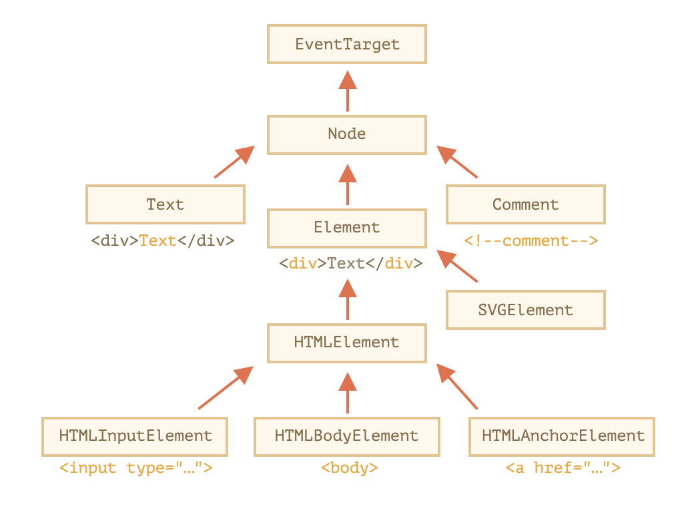
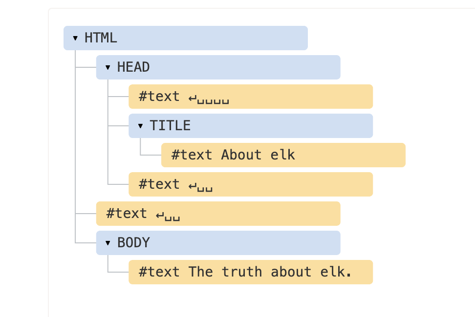
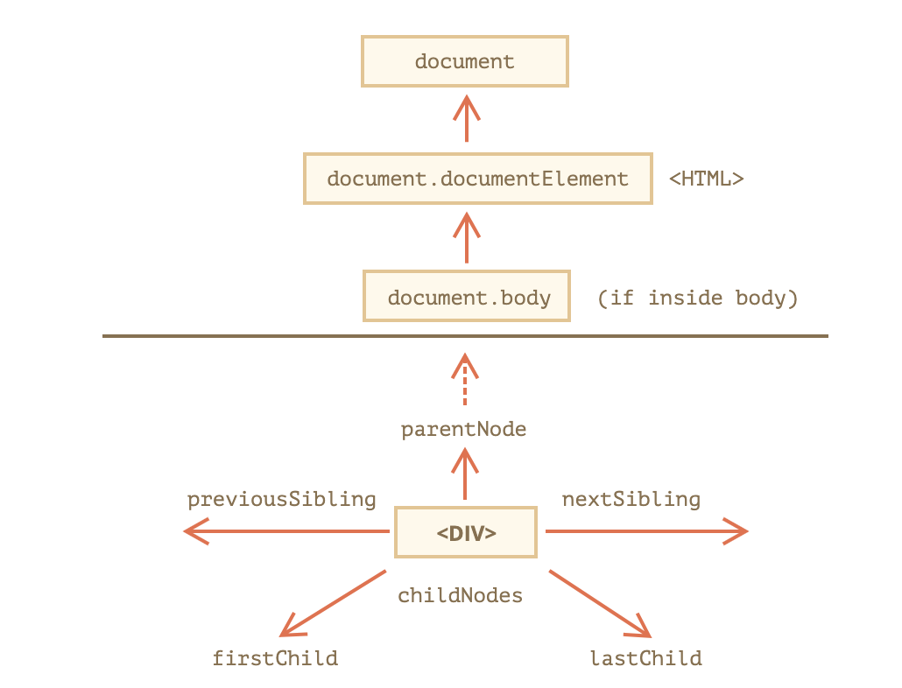
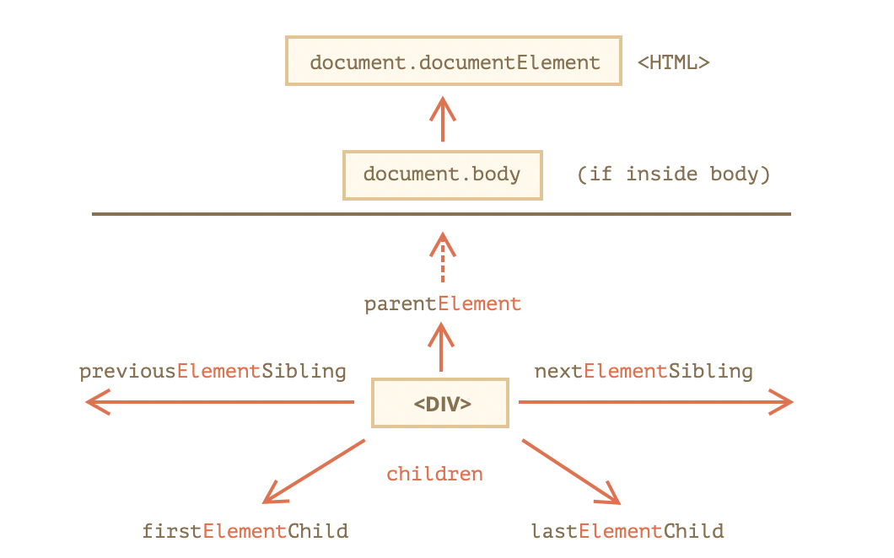
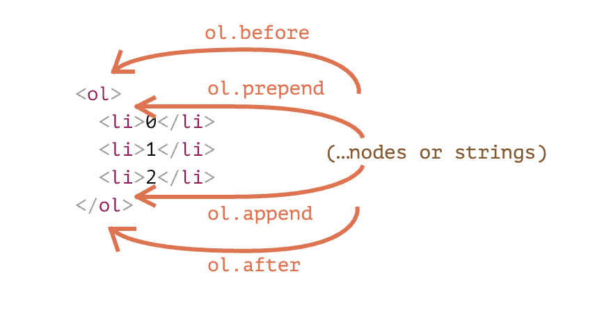
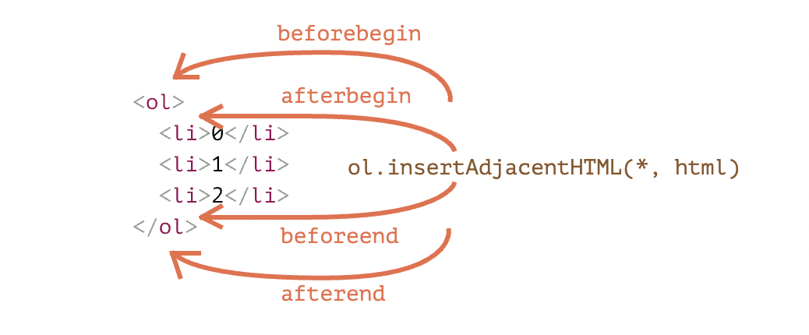

# DOM <!-- omit in toc -->
- [层次结构](#层次结构)
- [节点](#节点)
- [DOM 树 🌴](#dom-树-)
- [Node](#node)
	- [常用属性](#常用属性)
		- [nodeType、nodeName、nodeValue](#nodetypenodenamenodevalue)
		- [textContent](#textcontent)
		- [nextSibling、previousSibling、firstChild、lastChild、childNodes](#nextsiblingprevioussiblingfirstchildlastchildchildnodes)
		- [parentNode](#parentnode)
		- [parentElement](#parentelement)
		- [isConnected](#isconnected)
	- [常用方法](#常用方法)
		- [appendChild()](#appendchild)
		- [hasChildNodes()](#haschildnodes)
		- [insertBefore()](#insertbefore)
		- [removeChild()](#removechild)
		- [replaceChild()](#replacechild)
- [NodeList 接口，HTMLCollection 接口](#nodelist-接口htmlcollection-接口)
	- [NodeList 接口](#nodelist-接口)
	- [HTMLCollection 接口](#htmlcollection-接口)
- [Document 节点](#document-节点)
	- [document.visibilityState](#documentvisibilitystate)
	- [document.readyState](#documentreadystate)
	- [document.domain](#documentdomain)
	- [querySelector()，querySelectorAll()，getElementsByTagName()，getElementsByClassName()，getElementsByName()，getElementById()](#queryselectorqueryselectorallgetelementsbytagnamegetelementsbyclassnamegetelementsbynamegetelementbyid)
	- [createElement()，createTextNode()，createAttribute()，createComment()，createDocumentFragment()](#createelementcreatetextnodecreateattributecreatecommentcreatedocumentfragment)
	- [document.createNodeIterator()](#documentcreatenodeiterator)
	- [其他](#其他)
- [Element 节点](#element-节点)
	- [Element.dataset](#elementdataset)
	- [Element.innerHTML](#elementinnerhtml)
	- [Element.outerHTML](#elementouterhtml)
	- [Element.insertAdjacentElement()](#elementinsertadjacentelement)
	- [Element.insertAdjacentHTML()，Element.insertAdjacentText()](#elementinsertadjacenthtmlelementinsertadjacenttext)
	- [Element.focus()，Element.blur()](#elementfocuselementblur)
	- [elem.matches(css)，elem.closest(css)](#elemmatchescsselemclosestcss)
- [属性的操作](#属性的操作)
- [CSS 操作](#css-操作)
	- [行内样式](#行内样式)
		- [设置元素节点的 style 属性](#设置元素节点的-style-属性)
		- [驼峰直接读写](#驼峰直接读写)
		- [elem.style.cssText](#elemstylecsstext)
		- [className 和 classList](#classname-和-classlist)
	- [CAN I USE](#can-i-use)
	- [window.getComputedStyle()](#windowgetcomputedstyle)

## 层次结构

`DOM` 的根节点是 `EventTarget`，`Node` 继承自它，其他 `DOM` 节点继承自 `Node`。`DOM` 节点是常规的 `JavaScript` 对象。它们使用基于原型的类进行继承。

类如下所示：

- `EventTarget` — 是根的“抽象（abstract）”类。该类的对象从未被创建。它作为一个基础，以便让所有 `DOM` 节点都支持所谓的“事件（event）”。
- `Node` — 也是一个“抽象”类，充当 `DOM` 节点的基础。它提供了树的核心功能：`parentNode`，`nextSibling`，`childNodes` 等（它们都是 getter）。`Node` 类的对象从未被创建。但是有一些继承自它的具体的节点类，例如：文本节点的 `Text`，元素节点的 `Element`，以及更多异域（exotic）类，例如注释节点的 `Comment`。
- `Element` — 是 `DOM` 元素的基本类。它提供了元素级的导航（navigation），例如 `nextElementSibling`，`children`，以及像 `getElementsByTagName` 和 `querySelector` 这样的搜索方法。浏览器中不仅有 `HTML`，还会有 `XML` 和 `SVG`。`Element` 类充当更多特定类的基本类：`SVGElement`，`XMLElement` 和 `HTMLElement`。
- `HTMLElement` — 最终是所有 `HTML` 元素的基本类。各种 `HTML` 元素均继承自它：
  - `HTMLInputElement` — `<input>` 元素的类，
  - `HTMLBodyElement` — `<body>` 元素的类，
  - `HTMLAnchorElement` — `<a>` 元素的类，……等。

**每个标签都有自己的类，这些类可以提供特定的属性和方法。
因此，给定节点的全部属性和方法都是继承的结果。**



例如 `<input>` 元素的 `DOM` 对象。它属于 `HTMLInputElement` 类。

它获取属性和方法，并将其作为下列类（按继承顺序列出）的叠加：

- `HTMLInputElement` — 该类提供特定于输入的属性，
- `HTMLElement` — 它提供了通用（common）的 HTML 元素方法（以及 getter 和 setter）
- `Element` — 提供通用（generic）元素方法，
- `Node` — 提供通用 DOM 节点属性，
- `EventTarget` — 为事件（包括事件本身）提供支持，
- 最后，它继承自 `Object`，因为像 `hasOwnProperty `这样的“普通对象”方法也是可用的。

```js 
console.log(elem) // 显示元素的 DOM 树。
console.dir(elem) // 将元素显示为 DOM 对象，非常适合探索其属性。
```

## 节点

DOM 的最小组成单位叫做节点，节点的类型有七种。

- `Document`：整个文档树的顶层节点
- `DocumentType`：`doctype` 标签（比如 `<!DOCTYPE html>`）
- `Element`：网页的各种 HTML 标签（比如 `<body>、<a>` 等
- `Attr`：网页元素的属性（比如 `class="right"`）
- `Text`：标签之间或标签包含的文本
- `Comment`：注释
- `DocumentFragment`：文档的片段



## DOM 树 🌴

浏览器原生提供 `document` 节点，代表整个文档。

`document` 有两个子节点，第一个是文档类型节点 `<!doctype html>`，第二个是 `HTML` 网页的顶层容器标签 `<html>`。后者构成了树结构的根节点 `root node`，其他 `HTML` 标签节点都是它的下级节点。

**除了根节点，其他节点都有三种层级关系。**

- 父节点关系（parentNode）：直接的那个上级节点
- 子节点关系（childNodes）：直接的下级节点
- 同级节点关系（sibling）：拥有同一个父节点的节点

## Node

所有 `DOM` 节点对象都继承了 `Node` 接口，拥有一些共同的属性和方法



### 常用属性

#### nodeType、nodeName、nodeValue

|       节点       | nodeType 值 |        nodeType 常量        |      nodeName      | nodeValue |
| :--------------: | :---------: | :-------------------------: | :----------------: | :-------: |
|     Document     |      9      |     node.DOCUMENT_NODE      |     #document      |   null    |
|   DocumentType   |     10      |   node.DOCUMENT_TYPE_NODE   |     文档的类型     |   null    |
|     Element      |      1      |      node.ELEMENT_NODE      |    大写的标签名    |   null    |
|       Attr       |      2      |     node.ATTRIBUTE_NODE     |     属性的名称     |  文本值   |
|       Text       |      3      |       node.TEXT_NODE        |       #text        |  文本值   |
|     Comment      |      8      |      node.COMMENT_NODE      |      #comment      |  文本值   |
| DocumentFragment |     11      | node.DOCUMENT_FRAGMENT_NODE | #document-fragment |   null    |

#### textContent

`textContent` 属性返回当前节点和它的所有后代节点的文本内容

该属性是可读写的，设置该属性的值，会用一个新的文本节点，替换所有原来的子节点。它还有一个好处，就是自动对 `HTML` 标签转义。

```js
document.getElementById('foo').textContent = '<p>GoodBye!</p>'
```

上面代码在插入文本时，会将`<p>`标签解释为文本，而不会当作标签处理。

对于文本节点（text）、注释节点（comment）和属性节点（attr），`textContent` 属性的值与 `nodeValue` 属性相同。对于其他类型的节点，该属性会将每个子节点（不包括注释节点）的内容连接在一起返回。如果一个节点没有子节点，则返回空字符串。

文档节点（document）和文档类型节点（doctype）的 `textContent` 属性为 `null`。如果要读取整个文档的内容，可以使用 `document.documentElement.textContent`。

#### nextSibling、previousSibling、firstChild、lastChild、childNodes

`nextSibling` 属性返回紧跟在当前节点后面的第一个同级节点。如果当前节点后面没有同级节点，则返回 `null`

`previousSibling` 属性返回当前节点前面的、距离最近的一个同级节点。如果当前节点前面没有同级节点，则返回 `null`

`firstChild` 属性返回当前节点的第一个子节点，如果当前节点没有子节点，则返回 `null`

`lastChild` 属性返回当前节点的最后一个子节点，如果当前节点没有子节点，则返回 `null`

`childNodes`属性返回一个类似数组的对象（`NodeList`集合），成员包括当前节点的所有子节点，除了元素节点，`childNodes`属性的返回值还包括文本节点和注释节点

```js
<div id="parent">
  <div id="child1">子节点1</div>
  <div id="child2">子节点2</div>
</div>
<script>
  var child1 = document.getElementById('child1'),
    child2 = document.getElementById('child2'),
    parent = document.getElementById('parent')

  console.log('child1...', child1.previousSibling, child1.nextSibling)
  console.log(
    'child2...',
    child2.previousSibling.previousSibling,
    child2.nextSibling.nextSibling
  )
  console.log('parent...', parent.firstChild.nextSibling, parent.lastChild)
  console.log('childNodes...', parent.childNodes)

  // child1... #text #text
  // child2... <div id="child1">​子节点1​</div>​ null
  // parent... <div id=​"child1">​子节点1​</div>​ #text
  // childNodes... NodeList(5) [text, div#child1, text, div#child2, text]
</script>
```

注意，节点还包括文本节点和注释节点（`<!-- comment -->`）。因此如果当前节点前面或后面或与子节点有空格，属性会返回一个文本节点，内容为`#text`。

**ps**：`nextSibling` 属性可以用来遍历所有子节点。

```js
var el = document.getElementById('div1').firstChild

while (el !== null) {
	console.log(el.nodeName)
	el = el.nextSibling
}
```

#### parentNode

`parentNode`属性返回当前节点的父节点。对于一个节点来说，它的父节点只可能是三种类型：元素节点（element）、文档节点（document）和文档片段节点（documentfragment）。

文档节点（document）和文档片段节点（documentfragment）的父节点都是`null`。另外，对于那些生成后还没插入 DOM 树的节点，父节点也是`null`

#### parentElement

`parentElement`属性返回当前节点的父元素节点。如果当前节点没有父节点，或者父节点类型不是元素节点，则返回`null`。

#### isConnected

`isConnected` 属性返回一个布尔值，表示当前节点是否在文档之中。

```js
var test = document.createElement('p')
test.isConnected // false

document.body.appendChild(test)
test.isConnected // true
```

### 常用方法

#### appendChild()

`appendChild` 方法接受一个节点对象作为参数，将其作为最后一个子节点，插入当前节点，如果参数节点是 `DOM` 已经存在的节点，`appendChild` 方法会将其从原来的位置，移动到新位置。该方法的返回值就是插入文档的子节点。

```js
<div id="parent">
  <div id="child">子节点</div>
  <p>hello world</p>
</div>
<script>
  var parent = document.getElementById('parent'),
    div = document.getElementById('child')

  parent.appendChild(div)
</script>
```

#### hasChildNodes()

`hasChildNodes` 方法返回一个布尔值，表示当前节点是否有子节点

判断一个节点有没有子节点，有许多种方法，下面是其中的三种。

- `node.hasChildNodes()`
- `node.firstChild !== null`
- `node.childNodes && node.childNodes.length > 0`

#### insertBefore()

`insertBefore` 方法用于将某个节点插入父节点内部的指定位置。返回值是插入的新节点 newNode。

```js
var insertedNode = parentNode.insertBefore(newNode, referenceNode)
```

`insertBefore` 方法接受两个参数，第一个参数是所要插入的节点 `newNode`，第二个参数是父节点 `parentNode` 内部的一个子节点 `referenceNode`。`newNode` 将插在 `referenceNode` 这个子节点的前面。

由于不存在 `insertAfter` 方法，如果新节点要插在父节点的某个子节点后面，可以用 `insertBefore` 方法结合 `nextSibling` 属性模拟。

```js
parent.insertBefore(s1, s2.nextSibling)
```

#### removeChild()

`removeChild` 方法接受一个子节点作为参数，用于从当前节点移除该子节点。返回值是移除的子节点。

下面是如何移除当前节点的所有子节点。

```js
var element = document.getElementById('top')
while (element.firstChild) {
	element.removeChild(element.firstChild)
}
```

被移除的节点依然存在于内存之中，但不再是 `DOM` 的一部分。所以，一个节点移除以后，依然可以使用它，比如插入到另一个节点下面。

#### replaceChild()

`replaceChild` 方法用于将一个新的节点，替换当前节点的某一个子节点。

```js
var replacedNode = parentNode.replaceChild(newChild, oldChild)
```

上面代码中，`replaceChild` 方法接受两个参数，第一个参数 `newChild` 是用来替换的新节点，第二个参数 `oldChild` 是将要替换走的子节点。返回值是替换走的那个节点 `oldChild`。

## NodeList 接口，HTMLCollection 接口

节点都是单个对象，有时需要一种数据结构，能够容纳多个节点。DOM 提供两种节点集合，用于容纳多个节点：`NodeList` 和 `HTMLCollection`。

### NodeList 接口

`NodeList` 实例是一个类似数组的对象，它的成员是节点对象。通过以下方法可以得到 `NodeList` 实例。

- `Node.childNodes`
- `document.querySelectorAll()` 等节点搜索方法

`NodeList` 实例很像数组，**可以使用 `length` 属性和 `forEach` 方法。但是，它不是数组，不能使用 `pop` 或 `push` 之类数组特有的方法**。

`forEach` 方法用于遍历 `NodeList` 的所有成员。它接受一个回调函数作为参数，每一轮遍历就执行一次这个回调函数，用法与数组实例的 `forEach` 方法完全一致。

`item` 方法接受一个整数值作为参数，表示成员的位置，返回该位置上的成员。
所有类似数组的对象，都可以使用方括号运算符取出成员。一般情况下，都是使用方括号运算符，而不使用 `item` 方法。

`keys()`、`values()`、`entries()` 这三个方法都返回一个 `ES6` 的遍历器对象，可以通过 `for...of` 循环遍历获取每一个成员的信息。

### HTMLCollection 接口

`HTMLCollection` 是一个节点对象的集合，只能包含元素节点（`element`），不能包含其他类型的节点。它的返回值是一个类似数组的对象，但是与 `NodeList` 接口不同，**`HTMLCollection`没有`forEach` 方法**，只能使用 `for` 循环遍历。

返回 `HTMLCollection` 实例的，**主要是一些 `Document` 对象的集合属性**，比如 `document.links`、`document.forms`、`document.images` 等。

如果元素节点有 `id` 或 `name` 属性，那么 `HTMLCollection` 实例上面，可以使用 `id` 属性或 `name` 属性引用该节点元素。如果没有对应的节点，则返回 `null`。

```js
// HTML 代码如下
// 

var pic = document.getElementById('pic')
document.images.pic === pic // true
```

## Document 节点

### document.visibilityState

`document.visibilityState` 返回文档的可见状态。

它的值有四种可能。

- **visible**：页面可见。注意，页面可能是部分可见，即不是焦点窗口，前面被其他窗口部分挡住了。
- **hidden**：页面不可见，有可能窗口最小化，或者浏览器切换到了另一个 Tab。
- **prerender**：页面处于正在渲染状态，对于用户来说，该页面不可见。
- **unloaded**：页面从内存里面卸载了。

这个属性可以用在页面加载时，防止加载某些资源；或者页面不可见时，停掉一些页面功能。

### document.readyState

`document.readyState` 属性返回当前文档的状态，共有三种可能的值。

- **loading**：加载 HTML 代码阶段（尚未完成解析）
- **interactive**：加载外部资源阶段
- **complete**：加载完成

这个属性变化的过程如下。

1. 浏览器开始解析 `HTML` 文档，`document.readyState` 属性等于 `loading`。
1. 浏览器遇到 `HTML` 文档中的`<script>`元素，并且没有 `async` 或 `defer` 属性，就暂停解析，开始执行脚本，这时 `document.readyState` 属性还是等于 `loading`。
1. `HTML` 文档解析完成，`document.readyState` 属性变成 `interactive`。
1. 浏览器等待图片、样式表、字体文件等外部资源加载完成，一旦全部加载完成，`document.readyState` 属性变成 `complete`

### document.domain

- `document.domain`属性返回当前文档的域名，不包含协议和端口。

- `document.domain` 基本上是一个只读属性，只有一种情况除外。次级域名的网页，可以把 `document.domain` 设为对应的上级域名。

- `document.domain` 相同的两个网页，可以读取对方的资源，比如设置的 Cookie。

### querySelector()，querySelectorAll()，getElementsByTagName()，getElementsByClassName()，getElementsByName()，getElementById()

- `document.querySelector` 方法接受一个 CSS 选择器作为参数，返回匹配该选择器的元素节点。如果有多个节点满足匹配条件，则返回第一个匹配的节点。如果没有发现匹配的节点，则返回 `null`。

- `document.querySelectorAll` 方法与 `querySelector` 用法类似，区别是返回一个 `NodeList` 对象，包含所有匹配给定选择器的节点。

- `document.getElementsByTagName()`方法搜索 HTML 标签名，返回符合条件的元素。它的返回值是一个类似数组对象（`HTMLCollection实例`）

- `document.getElementById()`方法返回匹配指定 `id` 属性的元素节点。如果没有发现匹配的节点，则返回 `null`。

### createElement()，createTextNode()，createAttribute()，createComment()，createDocumentFragment()

- `document.createElement` 方法用来生成元素节点，并返回该节点。
  `createElement` 方法的参数为元素的标签名，即元素节点的 `tagName` 属性，
  `document.createElement` 的参数可以是自定义的标签名。

- `document.createDocumentFragmen`t 方法生成一个空的文档片段对象。
  `DocumentFragment` 是一个存在于内存的 DOM 片段，不属于当前文档，常常用来生成一段较复杂的 DOM 结构，然后再插入当前文档。这样做的好处在于，因为 `DocumentFragment` 不属于当前文档，对它的任何改动，都不会引发网页的重新渲染，比直接修改当前文档的 DOM 有更好的性能表现。

### document.createNodeIterator()

`document.createNodeIterator` 方法返回一个子节点遍历器。

`document.createNodeIterator` 方法第一个参数为所要遍历的根节点，第二个参数为所要遍历的节点类型，几种主要的节点类型写法如下。

- 所有节点：`NodeFilter.SHOW_ALL`
- 元素节点：`NodeFilter.SHOW_ELEMENT`
- 文本节点：`NodeFilter.SHOW_TEXT`
- 评论节点：`NodeFilter.SHOW_COMMENT`

`document.createNodeIterator` 方法返回一个“遍历器”对象（`NodeFilter` 实例）。该实例的 `nextNode()`方法和 `previousNode()`方法，可以用来遍历所有子节点。

### 其他

- `document.documentElement` 属性返回当前文档的根元素节点（root），一般是 `<html>` 节点

- `document.body` 属性指向 <`body>` 节点，`document.head` 属性指向 `<head>` 节点

- `document.title` 属性返回当前文档的标题。默认情况下，返回`<title>`节点的值。但是该属性是可写的，一旦被修改，就返回修改后的值

- `document.scrollingElement` 属性返回文档的滚动元素，标准模式下，这个属性返回的文档的根元素 `document.documentElement`（即`<html>`）。兼容（quirk）模式下，返回的是`<body>`元素，如果该元素不存在，返回 `null`

- `document.activeElement` 属性返回获得当前焦点（focus）的 DOM 元素。通常，这个属性返回的是`<input>`、`<textarea>`、`<select>`等表单元素，如果当前没有焦点元素，返回<body>元素或 `null`

- `document.fullscreenElement` 属性返回当前以全屏状态展示的 DOM 元素。如果不是全屏状态，该属性返回 `null`

- `document.links` 属性返回当前文档所有设定了 href 属性的`<a>`及`<area>`节点

- `document.forms` 属性返回所有`<form>`表单节点

- `document.images` 属性返回页面所有<`img>`图片节点

- `document.embeds` 属性和 `document.plugins` 属性，都返回所有`<embed>`节点

- `document.scripts` 属性返回所有`<script>`节点

- `document.hidden` 属性返回一个布尔值，表示当前页面是否可见。如果窗口最小化、浏览器切换了 Tab，都会导致导致页面不可见，使得 `document.hidden` 返回 `true`

- `document.documentURI` 属性和 `document.URL` 属性都返回一个字符串，表示当前文档的网址。不同之处是它们继承自不同的接口，`documentURI` 继承自 `Document` 接口，可用于所有文档；`URL` 继承自 `HTMLDocument` 接口，只能用于 HTML 文档

- `document.write()` 会当作 HTML 代码解析，不会转义。

## Element 节点



- `children` 属性返回一个 `HTMLCollection` 实例，成员是当前节点的所有元素子节点。该属性只读
- `firstElementChild` 属性返回当前节点的第一个元素子节点。如果没有任何元素子节点，则返回 `null`
- `lastElementChild` 属性返回当前节点的最后一个元素子节点，如果不存在任何元素子节点，则返回 `null`
- `childElementCount` 属性返回一个整数，表示当前节点的所有元素子节点的数目。如果不包含任何元素子节点，则返回 `0`
- `nextElementSibling` 属性返回当前元素节点的后一个同级元素节点，如果没有则返回 `null`。
- `previousElementSibling` 属性返回当前元素节点的前一个同级元素节点，如果没有则返回 `null`。



- `append` 方法为当前节点追加一个或多个子节点，位置是最后一个元素子节点的后面
- `prepend` 方法为当前节点追加一个或多个子节点，位置是第一个元素子节点的前面。它的用法与 `append` 方法完全一致，也是没有返回值
- `remove` 方法用于从父节点移除当前节点
- `before` 方法用于在当前节点的前面，插入一个或多个同级节点。两者拥有相同的父节点
- `after` 方法用于在当前节点的后面，插入一个或多个同级节点，两者拥有相同的父节点。用法与 `before` 方法完全相同
- `replaceWith` 方法使用参数节点，替换当前节点。参数可以是元素节点，也可以是文本节点

### Element.dataset

网页元素可以自定义 data-属性，用来添加数据。

```html
<div data-timestamp="1522907809292"></div>
```

上面代码中，<div>元素有一个自定义的 data-timestamp 属性，用来为该元素添加一个时间戳。

`Element.dataset` 属性返回一个对象，可以从这个对象读写 data-属性。

```js
// <article
// id="foo"
// data-columns="3"
// data-index-number="12314"
// data-parent="cars">
// ...
// </article>

var article = document.getElementById('foo')
article.dataset.columns // "3"
article.dataset.indexNumber // "12314"
article.dataset.parent // "cars"

// 注意，dataset 上面的各个属性返回都是字符串。
```

### Element.innerHTML

`Element.innerHTML` 属性返回一个字符串，等同于该元素包含的所有 HTML 代码。该属性可读写，常用来设置某个节点的内容。它能改写所有元素节点的内容，包括`<HTML>`和<`body>`元素。

如果将 innerHTML 属性设为空，等于删除所有它包含的所有节点。

注意，读取属性值的时候，如果文本节点包含`&`、小于号（`<`）和大于号（`>`），`innerHTML` 属性会将它们转为实体形式`&amp;`、`&lt;`、`&gt;`。

写入的时候，如果插入的文本包含 HTML 标签，会被解析成为节点对象插入 DOM。注意，如果文本之中含有`<script>`标签，虽然可以生成 `script` 节点，但是插入的代码不会执行。

### Element.outerHTML

`Element.outerHTML` 属性返回一个字符串，表示当前元素节点的所有 HTML 代码，包括该元素本身和所有子元素。

如果一个节点没有父节点，设置 `outerHTML` 属性会报错

### Element.insertAdjacentElement()

`Element.insertAdjacentElement` 方法在相对于当前元素的指定位置，插入一个新的节点。该方法返回被插入的节点，如果插入失败，返回 `null`。

`Element.insertAdjacentElement` 方法一共可以接受两个参数，第一个参数是一个字符串，表示插入的位置，第二个参数是将要插入的节点。第一个参数只可以取如下的值。

- `beforebegin`：当前元素之前
- `afterbegin`：当前元素内部的第一个子节点前面
- `beforeend`：当前元素内部的最后一个子节点后面
- `afterend`：当前元素之后

注意，`beforebegin` 和`afterend` 这两个值，只在当前节点有父节点时才会生效。如果当前节点是由脚本创建的，没有父节点，那么插入会失败。

```js
var p1 = document.createElement('p')
var p2 = document.createElement('p')
p1.insertAdjacentElement('afterend', p2) // null
```

上面代码中，p1 没有父节点，所以插入 p2 到它后面就失败了。

如果插入的节点是一个文档里现有的节点，它会从原有位置删除，放置到新的位置

### Element.insertAdjacentHTML()，Element.insertAdjacentText()

```js
// HTML 代码：<div id="one">one</div>
var d1 = document.getElementById('one')
d1.insertAdjacentHTML('afterend', '<div id="two">two</div>')
// 执行后的 HTML 代码：
// <div id="one">one</div><div id="two">two</div>
```

该方法只是在现有的 DOM 结构里面插入节点，这使得它的执行速度比 `innerHTML` 方法快得多。



注意，该方法不会转义 HTML 字符串，这导致它不能用来插入用户输入的内容，否则会有安全风险。

`Element.insertAdjacentText` 方法在相对于当前节点的指定位置，插入一个文本节点，用法与 `Element.insertAdjacentHTML` 方法完全一致

### Element.focus()，Element.blur()

`Element.focus` 方法用于将当前页面的焦点，转移到指定元素上
`Element.blur` 方法用于将焦点从当前元素移除。
从 `document.activeElement` 属性可以得到当前获得焦点的元素

### elem.matches(css)，elem.closest(css)

`elem.matches(css)` 用于检查 `elem` 与给定的 `CSS` 选择器是否匹配。
`elem.closest(css)` 用于查找与给定 `CSS` 选择器相匹配的最近的祖先。`elem` 本身也会被检查。

另一种用来检查子级与父级之间关系的方法，因为它有时很有用：

如果 `elemB` 在 `elemA` 内（elemA 的后代）或者 `elemA===elemB`，`elemA.contains(elemB)` 将返回 `true`。

## 属性的操作

元素对象有一个 `attributes` 属性，返回一个类似数组的动态对象

```js
// HTML 代码如下
// <body bgcolor="yellow" onload="">
document.body.attributes[0]
document.body.attributes.bgcolor
document.body.attributes['ONLOAD']
```

元素节点提供六个方法，用来操作属性。

- `getAttribute(key)` 方法返回当前元素节点的指定属性。如果指定属性不存在，则返回 `null`
- `getAttributeNames()`返回一个数组，成员是当前元素的所有属性的名字。使用 `Element.attributes` 属性，也可以拿到同样的结果，唯一的区别是它返回的是类似数组的对象。
- `setAttribute(key, val)`方法用于为当前元素节点新增属性。如果同名属性已存在，则相当于编辑已存在的属性。该方法没有返回值
- `hasAttribute(key)`方法返回一个布尔值，表示当前元素节点是否包含指定属性
- `hasAttributes()`方法返回一个布尔值，表示当前元素是否有属性，如果没有任何属性，就返回 `false`，否则返回 `true`
- `removeAttribute(key)`方法移除指定属性。该方法没有返回值

## CSS 操作

### 行内样式

#### 设置元素节点的 style 属性

操作 `CSS` 样式最简单的方法，就是使用网页元素节点的 `getAttribute()`方法、`setAttribute()`方法和 `removeAttribute()`方法，直接读写或删除网页元素的 `style` 属性。

```js
div.setAttribute('style', 'background-color:red;' + 'border:1px solid black;')
```

上面的代码相当于下面的 `HTML` 代码。

```html
<div style="background-color:red; border:1px solid black;" />
```

#### 驼峰直接读写

`CSSStyleDeclaration` 接口可以直接读写 CSS 的样式属性，不过，连词号需要变成骆驼拼写法。

```js
var divStyle = document.querySelector('div').style

divStyle.backgroundColor = 'red'
divStyle.fontSize = '10em'
```

#### elem.style.cssText

`CSSStyleDeclaration.cssText` 属性用来读写当前规则的所有样式声明文本。

```js
var divStyle = document.querySelector('div').style

divStyle.cssText =
	'background-color: red;' +
	'border: 1px solid black;' +
	'height: 100px;' +
	'width: 100px;'
```

删除一个元素的所有行内样式，最简便的方法就是设置 `cssText` 为空字符串。

```js
divStyle.cssText = ''
```

> ⚠️ 我们很少使用这个属性，因为这样的赋值会删除所有现有样式：它不是进行添加，而是替换它们。有时可能会删除所需的内容。

#### className 和 classList

对于类属性，引入了看起来类似的属性 "className"：`elem.className `对应于 "class" 特性（attribute）。

如果我们对 `elem.className` 进行赋值，它将替换类中的整个字符串。

这里还有另一个属性：`elem.classList`。`elem.classList` 是一个特殊的对象，它具有 `add/remove/toggle` 单个类的方法。

- `elem.classList.add/remove(class)` — 添加/移除类。
- `elem.classList.toggle(class)` — 如果类不存在就添加类，存在就移除它。
- `elem.classList.contains(class)` — 检查给定类，返回 `true/false`。

此外，`classList` 是可迭代的。

### CAN I USE

CSS 的规格发展太快，新的模块层出不穷。不同浏览器的不同版本，对 CSS 模块的支持情况都不一样。

一个比较普遍适用的方法是，判断元素的 style 对象的某个属性值是否为字符串。

```js
typeof element.style.animationName === 'string'
typeof element.style.transform === 'string'
```

如果该 CSS 属性确实存在，会返回一个字符串。即使该属性实际上并未设置，也会返回一个空字符串。如果该属性不存在，则会返回 `undefined`。


### window.getComputedStyle()

行内样式（`inline style`）具有最高的优先级，改变行内样式，通常会立即反映出来。但是，网页元素最终的样式是综合各种规则计算出来的。因此，如果想得到元素实际的样式，只读取行内样式是不够的，需要得到浏览器最终计算出来的样式规则。

`window.getComputedStyle` 方法，就用来返回浏览器计算后得到的最终规则。它接受一个节点对象作为参数，返回一个 `CSSStyleDeclaration` 实例，包含了指定节点的最终样式信息。所谓“最终样式信息”，指的是各种 CSS 规则叠加后的结果。

```JS
var div = document.querySelector('div');
var styleObj = window.getComputedStyle(div);
styleObj.backgroundColor
```

注意，`CSSStyleDeclaration` 实例是一个活的对象，任何对于样式的修改，会实时反映到这个实例上面。另外，**这个实例是只读的**。

`getComputedStyle`方法还可以接受第二个参数，表示当前元素的伪元素（比如`:before`、`:after`、`:first-line`、`:first-letter` 等）

> 在 `CSS` 中有两个概念：

>- 计算 (computed) 样式值是所有 `CSS` 规则和 `CSS` 继承都应用后的值，这是 `CSS` 级联（cascade）的结果。它看起来像 `height:1em` 或 `font-size:125%`。
>- 解析 (resolved) 样式值是最终应用于元素的样式值值。诸如 `1em` 或 `125%` 这样的值是相对的。浏览器将使用计算（computed）值，并使所有单位均为固定的，且为绝对单位，例如：`height:20px` 或 `font-size:16px`。对于几何属性，解析（resolved）值可能具有浮点，例如：`width:50.5px`。

>很久以前，创建了 `getComputedStyle` 来获取计算（computed）值，但事实证明，解析（resolved）值要方便得多，标准也因此发生了变化。
所以，现在 `getComputedStyle` 实际上返回的是属性的解析值（resolved）。
