# HTTP<!-- omit in toc -->

- [什么是 HTTP](#什么是-http)
- [与 HTTP 相关的各种协议](#与-http-相关的各种协议)
  - [URI 和 URL](#uri-和-url)
  - [TCP/IP 协议](#tcpip-协议)
  - [DNS 协议](#dns-协议)
    - [域名的层级结构](#域名的层级结构)
    - [域名解析](#域名解析)
    - [DNS 缓存](#dns-缓存)
    - [DNS 的完整解析](#dns-的完整解析)
- [HTTP 报文格式](#http-报文格式)
  - [请求报文格式](#请求报文格式)
  - [响应报文格式](#响应报文格式)
  - [请求和响应头](#请求和响应头)
- [HTTP 缓存管理](#http-缓存管理)
- [HTTP 连接管理](#http-连接管理)
  - [短连接和长连接](#短连接和长连接)
  - [对头阻塞](#对头阻塞)
- [HTTP 2.0](#http-20)
  - [头部压缩](#头部压缩)
  - [二进制格式](#二进制格式)
  - [服务端推送](#服务端推送)
- [GET 和 POST 和 OPTIONS](#get-和-post-和-options)
  - [POST 是否比 GET 安全](#post-是否比-get-安全)
  - [GET 相对 POST 的优势是什么](#get-相对-post-的优势是什么)
  - [OPTIONS](#options)
    - [简单请求](#简单请求)
    - [复杂请求](#复杂请求)
- [HTTP 的明文传输](#http-的明文传输)
- [HTTP 状态码](#http-状态码)
  - [1xx](#1xx)
  - [2xx](#2xx)
  - [3xx](#3xx)
  - [4xx](#4xx)
  - [5xx](#5xx)
- [HTTP 无状态](#http-无状态)
- [HTTP 请求头必传的字段](#http-请求头必传的字段)
- [三次握手和四次挥手](#三次握手和四次挥手)
  - [三次握手](#三次握手)
  - [四次挥手](#四次挥手)
- [代理](#代理)
  - [正向代理](#正向代理)
  - [反向代理](#反向代理)
- [HTTPS](#https)
  - [对称加密（天王盖地虎）](#对称加密天王盖地虎)
  - [非对称加密](#非对称加密)
  - [HTTPS 加密方式](#https-加密方式)
  - [HTTPS 通讯方式](#https-通讯方式)
  - [HTTPS 的缺点](#https-的缺点)
  - [HTTPS 握手](#https-握手)
- [Websocket](#websocket)
  - [典型的 Websocket 握手](#典型的-websocket-握手)
  - [Websocket 的作用](#websocket-的作用)
    - [ajax 轮询](#ajax-轮询)
    - [long poll](#long-poll)
    - [Websocket 和 HTTP 对比](#websocket-和-http-对比)

## 什么是 HTTP

`HTTP` 全称 `HyperText Transfer Protocol`「超文本传输协议」,拆成三个部分来看，即「超文本」,「传输」,「协议」

**超文本**：即「超越了普通文本的文本」，即音视频，图片，文件的混合体，除了这些超文本内容外，最关键的是超文本中含有**超链接**，超链接意味着网页等文件内容的超文本上可以点击链接到其他页面上，**互联网就是通过这样的超链接构成的**。

**传输**: 传输意味着至少有两个参与者，比如 `A`，`B`，这意味着 **HTTP 协议是个双向协议**，一般是将「超文本」按照约定的协议以二进制数据包的形式从 `A` 传到 `B` 或 `B` 传到 A，`A <===> B`，我们把发起请求的叫请求方，接到请求后返回数据的那一方称为响应方，但需要注意的是**传输也不限于两个参与者，允许中间有中转或者接力**，只要参与者间遵循约定的协议即可传输。

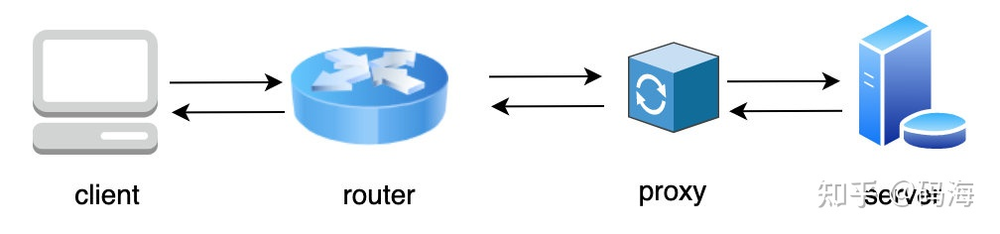

**协议**：`HTTP` 是一个协议，啥是协议？在日常生活中协议并不少见，比如我们租房时签订的租房协议，入职后和企业签订的劳动合同协议。

所以给 `HTTP` 下一个比较准确的定义：

**HTTP 是一个在计算机世界里专门在两点之间传输文字、图片、音频、视频等超文本数据的约定和规范。**

## 与 HTTP 相关的各种协议

### URI 和 URL

使用 `URI`（Uniform Resource Identifier）即**统一资源标识符**就可以唯一定位互联网上的资源。

`URL` 是 `URI` 的一种子集，区别就是 `URI` 定义资源，而 `URL` 不单定义这个资源，**还定义了如何找到这个资源**。

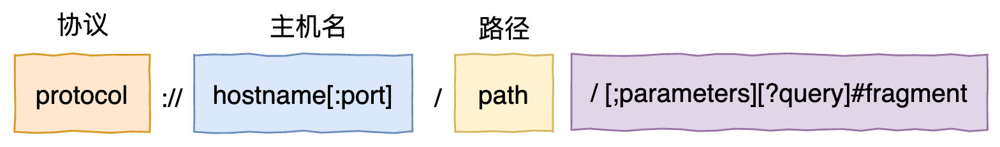

### TCP/IP 协议

`TCP/IP` 协议栈总共有四层

- `link layer`: **链接层**，负责在以太网，`WIFI` 这样的底层网络上发送原始数据包，工作在网卡这一层，使用 `MAC` 地址来标记网络上的设备，所以也叫 `MAC` 层

- `Internet layer`: **网络层**，`IP` 协议即处于这一层，提供**路由**和**寻址**的功能，使两终端系统能够互连且决定最佳路径，並具有一定的拥塞控制和流量控制的能力

- `transport layer`: **传输层**，该层的协议为应用进程提供端到端的通信服务，这层主要有 `TCP`，`UDP` 两个协议，
    - `TCP` 提供面向连接的数据流支持、可靠性、流量控制、多路复用等服务，
    - `UDP` 不提供复杂的控制机制，利用 `IP` 提供面向无连接的简单消息传输

- `application layer`: **应用层**，前面三层已经为网络通信打下了坚实的基础，这层可发挥的空间就大很多了，应用层协议可以想象为不同的服务，每个应用层协议都是为了解决某一类应用问题而生的，每一个服务需要用不同的协议，规定应用进程在通信时所遵循的协议。

> 我们可以把前面三层认为是高速公路的基础设施，至于要传什么货物，高速公路是否要关闭等则由应用层决定。

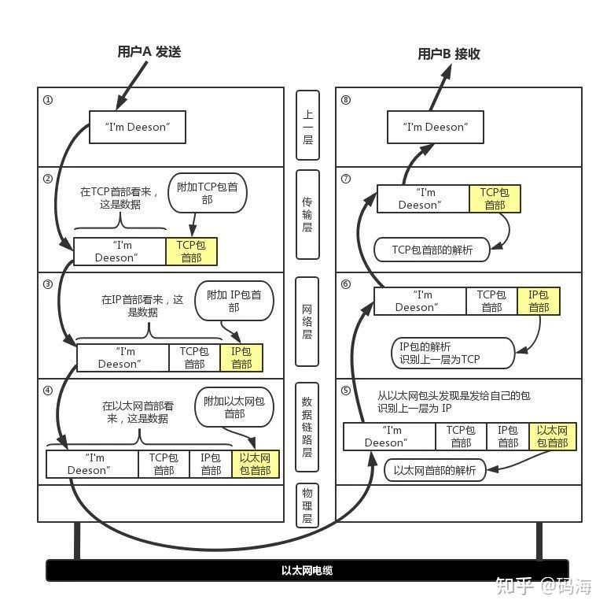

> 通过这样分层的方式，每个层各司其职，只要管好自己的工作即可，可扩展性很好，**比如对于 `HTTP` 来说，它底层可以用 `TCP`，也可以用 `UDP` 来传输**，哪天如果再出现了更牛逼的协议，也可以替换之，不影响上下层，这就是计算机中比较有名的分层理论：**没有什么是分层解决不了的，如果有那就再分一层。**

### DNS 协议

应用层在请求传输数据时必须事先要知道对方的 `IP` 地址，然后才能开始传输。

但 `IP` 地址是由 `161.117.232.65` 这样的数字组成的，正常人根本记不住，同样的，正常人只会记住 `http://baidu.com` 这样的网址，那就需要有类似电话本这样的翻译器把网址转成 `IP` 地址，`DNS`（域名服务器）就是干这个事的

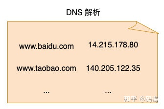

#### 域名的层级结构

类似 `http://www.baidu.com` 这样的网址也叫域名，是一个有层次的结构, 最右边的被称为顶级域名，然后是二级域名，层级关系向左降低，最左边的是主机名，通常用来表示主机的用途，比如 「www」 表示提供万维网服务


#### 域名解析

`http://www.apple.com` 的 `DNS` 解析如下

1. 首先访问根域名服务器，获取 `com` 顶级域名服务器的地址
2. 请求 `com` 顶级域名服务器，返回 `http://apple.com` 域名服务器的地址
3. 然后返回 `http://apple.com` 域名服务器，返回 `http://www.apple.com` 的地址

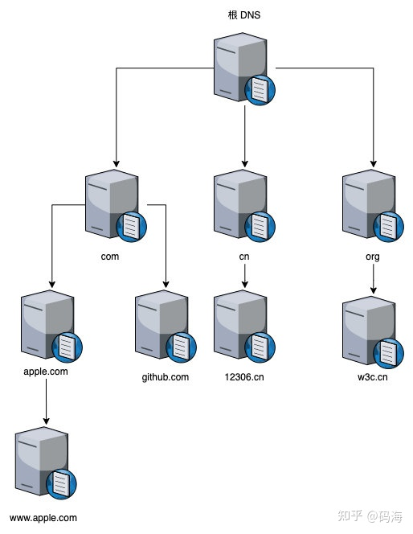

#### DNS 缓存

全世界的设备多如牛毛，如果每发一次请求都要按上面的 DNS 解析来获取 IP，那估计 DNS 解析系统就要炸了，如何缓解这种压力呢，答案是用缓存

- 非权威域名服务器（类似 Google 的 `8.8.8.8` DNS 解析服务器）
- 操作系统缓存（`/etc/hosts` 就是操作系统 DNS 缓存的一种）
- 浏览器缓存

#### DNS 的完整解析

这样的话如果请求 `http://www.example.com`，DNS 的完整解析流程如下:

1. 浏览器中输入 `http://www.example.com` 后，会先查看浏览器的 `DNS` 缓存是否过期，未过期直接取缓存的，已过期会继续请求操作系统的缓存（`/etc/hosts` 文件等）还未找到，进入步骤 2

2. 请求本地地址配置的 `DNS resolver`（非权威域名服务器），一般由用户的 `Internet` 服务提供商 (ISP) 进行管理

3. `DNS resolver` 将 `http://www.example.com` 的请求转发到 `DNS` 根名称服务器, 根服务器返回「.com」顶级域名服务器地址

    ...

`DNS` 解析程序还会将 `http://example.com` 的 `IP` 地址缓存 (存储) 您指定的时长，以便它能够在下次有人浏览 `http://example.com` 时更快地作出响应。

一个域名解析出多个 `ip` 地址，这样的话 `client` 可以随机选择其中一个请求，这就是我们常说的 **DNS 负载均衡**，可有效缓存 `server` 压力。

## HTTP 报文格式

请求和响应报文都由「起始行」，「头部」，「空行」，「实体」 四个部分组成，只不过起始行稍有不同。

### 请求报文格式

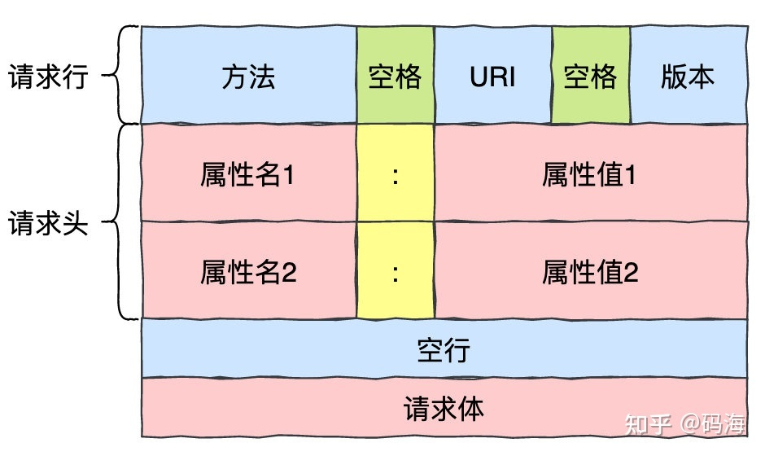

请求方法比较常见的有以下几类

1、**GET**: 请求 `URL` 指定的资源，指定的资源经服务器端解析后返回响应内容，**GET 方法具有幂等性**，即无论请求多次，都只会返回资源，而不会额外创建或改变资源，`GET` 请求**只传请求头，不传请求体**。

2、**POST**: 主要用来创建，修改，上传资源，不具有幂等性，一般将要请求的资源附在请求体上传输

3、**OPTIONS**: 列出可对资源实行的方法，这个方法很少见，但在跨域中会用到，也比较重要

### 响应报文格式

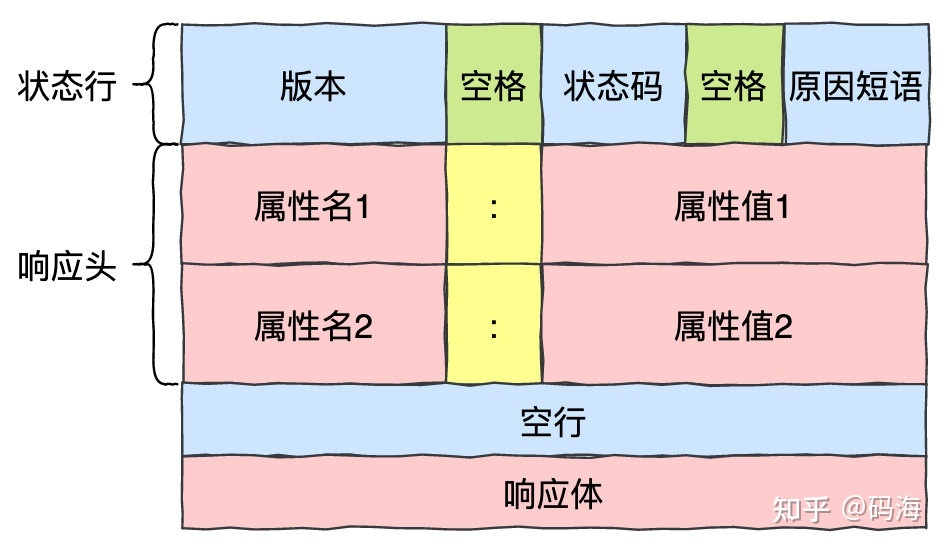

响应报文主要有如下五类状态码：

- `1××`：提示信息，表示目前是协议处理的中间状态，还需要后续的操作；
- `2××`：成功，报文已经收到并被正确处理；
- `3××`：重定向，资源位置发生变动，需要客户端重新发送请求；
- `4××`：客户端错误，请求报文有误，服务器无法处理；
- `5××`：服务器错误，服务器在处理请求时内部发生了错误。

### 请求和响应头

请求和响应头部报文的 `header` 格式基本都是一样的，都是 `key-value` 的形式，**对 `HTTP` 报文的解析和处理其实本质上就是对头字段的处理**，`HTTP` 的连接管理，缓存控制，内容协商等都是通过头字段来处理的，理解了头字段，基本上也就理解了 `HTTP`

请求报文的「Accept」，「Accept-Charset」,「Accept-Encoding」，「Accept-Language」,「Content-Language」,即为内容协商的判定标准。

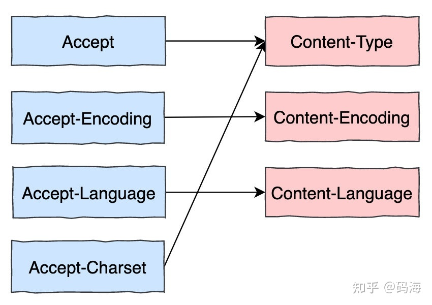

请求方如果要上传资源（一般是 POST 请求），可以在用 `Content-Type` 指定资源所属类型，如果请求方想要获取资源（GET 请求），可以用 `Accept` 请求头指定想要获取什么资源，这样 `server` 找到匹配的资源后就可以在 `Content-Type` 中指定返回的资源类型，浏览器等客户端看到后就可以据此解析处理了

> 注意：如果返回的 `Content-Type` 是 `application/octet-stream`，这个类型是应用程序文件的默认值，意思是**未知的应用程序文件**，浏览器一会不会自动执行或询问执行，**会直接下载**。

## HTTP 缓存管理

对于资源来说，由于有些挺长时间内都不会更新，所以没必要每次请求都向 `server` 发起网络请求，如果第一次请求后能保存在本地，下次请求直接在本地取，那无疑会快得多，对服务器的压力也会减少。

涉及到缓存的请求头为 `Cache-Control`。**这个缓存指令是单向的**，也就是说请求中设置的指令，不一定包含在响应中，请求中如果没有传 `Cache-Control`，`server` 也可以返回 `Cache-Control`。

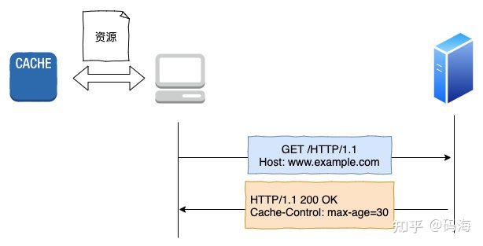

**如图示：客户端发起请求后，服务器返回 `Cache-Control： max-age=30`，代表资源在客户端可以缓存 30 秒，30 秒内客户端的请求可以直接从缓存获取，超过 30 秒后需要向服务器发起网络请求。**

`max-age` 是 `HTTP` 缓存控制最常用的属性，表示资源存储的最长时间，需要注意的是，时间的计算起点是响应报文的创建时刻（即 `Date` 字段，也就是离开服务器的时刻），超过后客户端需要重新发起请求

除此之外，还有其它属性值如下:

- `no-cache`: **缓存但重新验证**服务器端会验证请求中所描述的缓存是否过期，若未过期（注：实际就是返回 304），则缓存才使用本地缓存副本。

- `no-store`: 这才是真正的不允许缓存，比如秒杀页面这样变化非常频繁的页面就不适合缓存

- `must-revalidate`：一旦资源过期（比如已经超过 max-age），在成功向原始服务器验证之前，缓存不能用该资源响应后续请求。

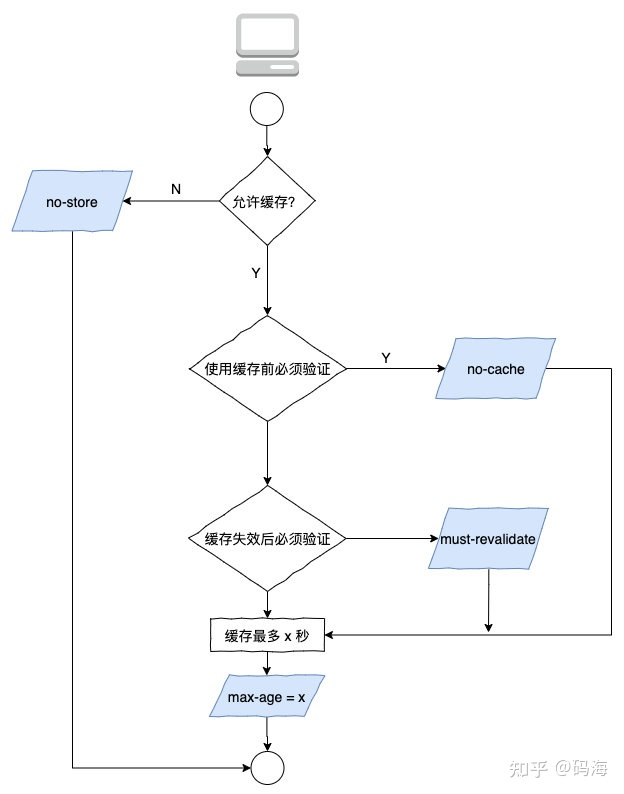

`Cache-Control` 只能刷新数据，但不能很好地利用缓存，又因为缓存会失效，使用前还必须要去服务器验证是否是最新版，存在一定的性能稳定，所以 `HTTP` 又引入了条件缓存（协商缓存）。

条件请求以 `If` 开头，有「If-Match」，「If-Modified-Since」，「If-None-Match」,「If-Range」,「If-Unmodified-Since」五个头字段，我们最常用的是「if-Modified-Since」和「If-None-Match」这两个头字段，所以重点介绍一下。

- `if-Modified-Since`：指的是文件最后修改时间，服务器只在所请求的资源**在给定的日期时间之后对内容进行过修改的情况下**才会将资源返回，如果请求的资源从那时起未经修改，那么**返回一个不带有消息主体的 `304` 响应**，需要第一次请求提供「Last-modified」，只能精确到一秒，第二次请求就可以在 「if-Modified-Since」首部带上此值了

- `If-None-Match`：条件请求首部，对于 `GET` 和 `HEAD` 请求方法来说，当且仅当服务器上没有任何资源的 `ETag` 属性值与这个首部中列出的相匹配的时候，服务器端会才返回所请求的资源，响应码为 `200`，

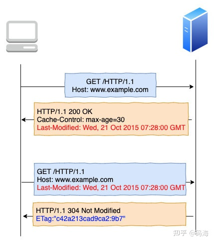

> ETag 是实体标签（Entity Tag）的缩写，是资源的唯一标识，主要解决修改时间无法准确区分文件变化的问题，比如文件在一秒内修改了多次，由于修改时间是秒级的，用 `if-Modified-Since` 就会误认为资源没有变化，而每次文件修改了都会修改 `ETag`，也就是说 `ETag` 可以精确识别资源的变动, 所以如果对资源变化很敏感觉的话，应该用 `If-None-Match`

> 注：ETag 有强，弱之分，强 ETag 要求资源在字节级别必须完全相符，弱 ETag 在值前有「W/」标记，只要求资源在语义上没啥变化，比如加了几个空格等等。

需要注意的是不管是 `if-Modified-Since` 还是 `If-None-Match`，**这两者只会在资源过期（即存活时间超 max-age）后才会触发**，

在开发环境下，缓存可能会影响我们联调，我们希望每次请求都从 `server` 拿，而不是缓存里，该怎么办？这种情况下就要用到刷新或者强制刷新了。

如果是刷新，请求头里会加上一个 `Cache-Control: max-age=0`，代表需要最新的资源，浏览器看到了后就不会使用本地资源，会向 `server` 请求，如果是强制刷新，请求头会加上 `Cache-Control: no-cache`，也会向 `server` 发送请求。

## HTTP 连接管理

### 短连接和长连接

首先我们知道双方要建立可靠连接要经过 `TCP` 的三次握手，然后才能开始传输 `HTTP` 的报文，报文传输之后要经过四次挥手断开连接

`HTTP` `0.9`，`1.0` 时期，发送完 `HTTP` 报文后， 连接立马关闭，这种连接被称为短链接，短链接效率非常低下，大量时间浪费在无意义的三次握手和四次挥手上。

`HTTP` `1.1` 对此进行了改进，每次报文发送后不立即关闭，可复用，长链接由于减少了大量无意义的三次握手，四次挥手，效率大大提升了！

我们可以在请求头里明确要求使用长链接，指定 `Connection: keep-alive` 即可，**在 `HTTP 1.1` 就算不指定也是默认开启的**。

> 如果服务器支持长链接，不管客户端是否显式要求长链接，它都会在返回头里带上 `Connection: keep-alive`，这样接下来双方就会使用长连接来收发报文，客户端如果想显式关闭关闭，只需要指定` Connection: Close` 头字段即可。

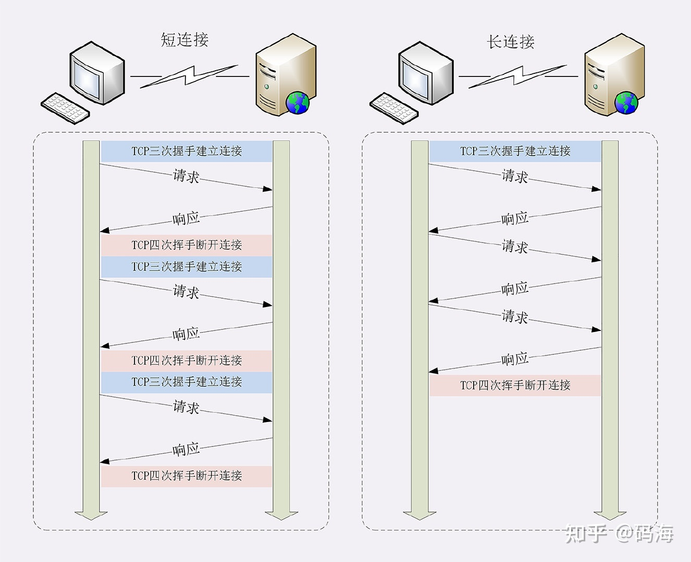

### 对头阻塞

长连接让传输效率大大提升，但新的问题又来了，因为 `HTTP` 规定报文必须一发一收，如果在要连接上发多个 `HTTP` 报文，**多个报文会被累积到队列里依次处理（不能并行处理）只要队首的请求被阻塞了**，后续 `HTTP` 的发送就受到影响，这就是有名的队头阻塞

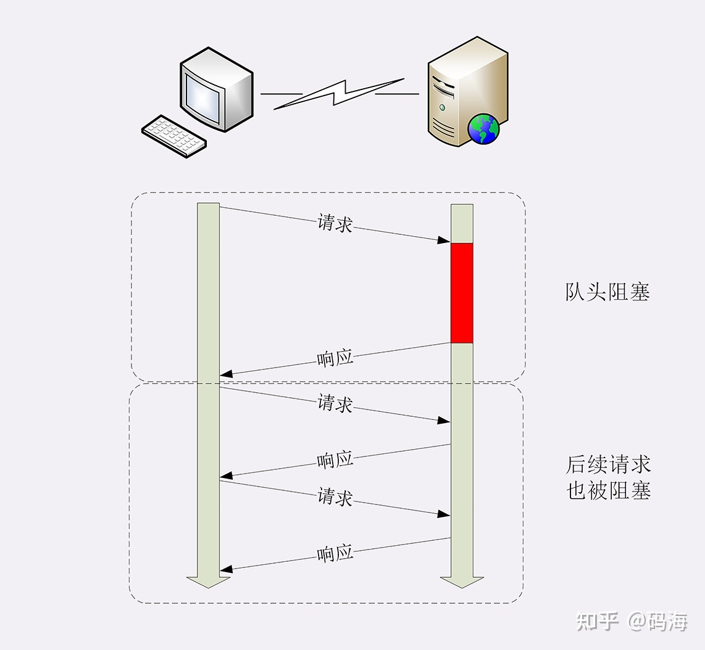

> HTTP 1.1 提出了**管线化机制**，一次可以发送多个请求，但依然要等前一个请求的响应返回后才能处理下一个请求，所以这种机制聊胜于无。

**对头阻塞本质上其实是因为我们没法区分每一个请求**

每个数据链接层的包（准确地说，链路层的包应该叫帧）规定的 `IP` 数据报的大小是有限制的，一般把这个大小限制称为最大传输单元（MTU, Maximum Transmission Unit）, `TCP` 数据报的大小也是有限制的，我们称之为 `MSS`（Maximum Transmission Unit）

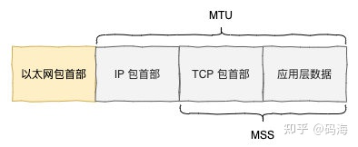

对于每一个最终发送的以太网包能传输的应用层数据是有限的，如果上层的应用层要发的数据大小超过了以太网包的大小，就需要对其进行拆分，分成几个以太网包再传输。

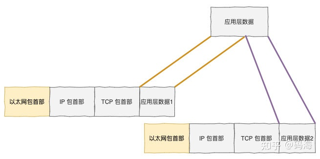

**接收方拿到每个包的应用层数据再组装成应用层数据，然后一个请求才算接收完成**，响应也是类似的原理。

接收方通过 `Content-Length` 就可以判断几个请求报文组合后大小是否达到这个设置值，如果是说明报文接收完毕，就可以对请求进行解析了，如果少于这个值，说明还需要接收请求包直到达到这个设定的值。

> Content-Length 指的是实体消息首部，也就是在 POST，PUT 等方法中传输实体数据时才会出现，GET 请求不会出现

<!-- http 1.1 对头阻塞原因，没法区分每个数据包所属的请求，http 2 可以区分，响应也是没法区分，那么请求响应必须一一对应 -->
**在底层，每个请求是复用同一个连接的，也就是说每个包发送都是串行的。**

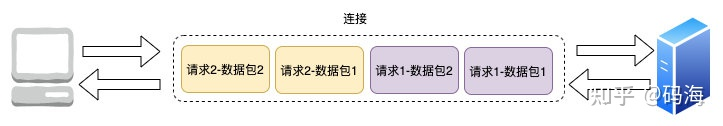

> 🌿 在 `HTTP 1.1` 中，**没法区分每个数据包所属的请求**，**所以它规定每个请求只能串行处理**，每个请求通过 `Content-Length` 判断接收完每个请求的数据包并处理后，才能再处理下一个请求，这样的话如果某个请求处理太慢就会影响后续请求的处理。

## HTTP 2.0

`HTTP 2.0` 只在语法上做了重要改进，完全变更了 `HTTP` 报文的传输格式，与 `HTTP 1.1` 的语义完全相同

### 头部压缩

`HTTP 1.1` 考虑了 `body` 的压缩，但没有考虑 `header` 的压缩, 经常出现传了头部上百，上千字节，但 `Body` 却只有几十字节的情况，浪费了带宽。

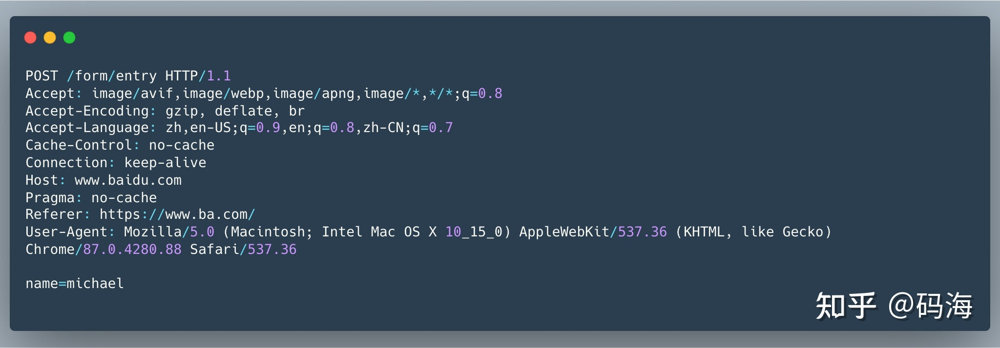

那么 `HTTP 2.0` 是如何解决的呢？它开发了专门的 「HPACK」算法，在客户端和服务器两端建立字典，用索引号表示重复的字符串，还采用哈夫曼编码来压缩数字和整数，可以达到最高达 90% 的压缩率

- 维护一份静态的字典（Static table），包含常见的头部名称，以及特别常见的头部名称与值的组合。这样的话如果请求响应命中了静态字典，直接发索引号即可

- 维护一份相同的动态字典（Dynamic table），可以动态地添加字典，这样的话如果客户端首次请求由于「User-Agent: xxx」,「host:xxx」,「Cookie」这些的动态键值对没有命中静态字典，还是会传给服务器，但服务器收到后会基于传过来的键值对创建动态字典条目

- 支持基于静态哈夫曼码表的哈夫曼编码（Huffman Coding）：对于静态、动态字典中不存在的内容，可以使用哈夫曼编码来减小体积。`HTTP/2` 使用了一份静态哈夫曼码表，也需要内置在客户端和服务端之中。

### 二进制格式

`HTTP 1.1` 是纯文本形式，而 `2.0` 是完全的二进制形式，它把 `TCP` 协议的部分特性挪到了应用层，把原来的 `Header + Body` 消息打散为了数个小版的二进制"帧"（Frame）,“HEADERS”帧存放头数据、“DATA”帧存放实体数据

`HTTP 2` 定义了「流」（stream）的的概念，它是二进制帧的双向传输序列，同一个消息往返的数据帧 （header 帧和 data 帧）会分配一个唯一的流 `ID`，**这样我们就能区分每一个请求**。在这个虚拟的流里，数据帧按先后次序传输，到达应答方后，将这些数据帧按它们的先后顺序组装起来，最后解析 `HTTP 1.1` 的请求头和实体。

**在同一时间，请求方可以在流里发请求，应答方也可以也流里发响应，对比 `HTTP 1.1` 一个连接一次只能处理一次请求-应答，吞吐量大大提升**

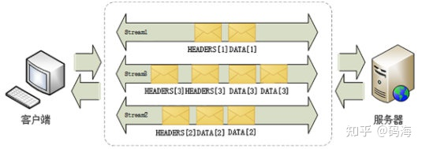

一个连接里多个流可以同时收发请求-应答数据帧，每个流中数据包按序传输组装

所有的流都是在同一个连接中流动的，这也是 `HTTP 2.0` 经典的**多路复用**（ Multiplexing），另外由于每个流都是独立的，所以谁先处理好请求，谁就可以先将响应通过连接发送给对方，也就解决了队头阻塞的问题。

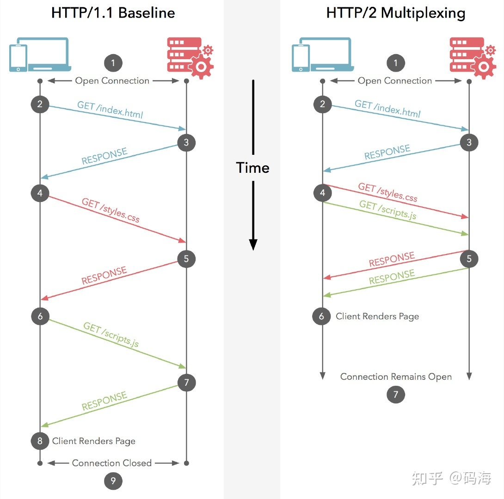

**在 `HTTP 2` 中，两个请求同时发送，可以同时接收，而在 `HTTP 1.1` 中必须等上一个请求响应后才能处理下一个请求**

`HTTP 2` 引入的流，帧等语法层面的改造确实让其传输效率有了质的飞跃，但是它依然存在着队头阻塞

其实主要是因为 `HTTP 2` 的分帧主要是在应用层处理的，而分帧最终还是要传给下层的 `TCP` 层经由它封装后再进行传输，每个连接最终还是顺序传输这些包，


> TCP 是可靠连接，为了保证这些包能顺序传给对方，会进行丢包重传机制，如果传了三个包，后两个包传成功，但第一个包传失败了，`TCP` 协议栈会把已收到的包暂存到缓存区中，停下等待第一个包的重传成功，这样的话在网络不佳的情况下只要一个包阻塞了，由于重传机制，后面的包就被阻塞了，上层应用由于拿不到包也只能干瞪眼了

由于这是 `TCP` 协议层面的机制，无法改造，所以 `HTTP 2` 的队头阻塞是不可避免的。

`HTTP 3` 对此进行了改进，将 `TCP` 换成了 `UDP` 来进行传输，由于 `UDP` 是无序的，不需要断建连，包之间没有依赖关系，所以从根本上解决了“队头阻塞”, 当然由于 `UDP` 本身的这些特性不足以支撑可靠的通信，所以 `Google` 在 `UDP` 的基础上也加了 `TCP` 的连接管理，拥塞窗口，流量控制等机制，这套协议我们称之为 `QUIC` 协议。

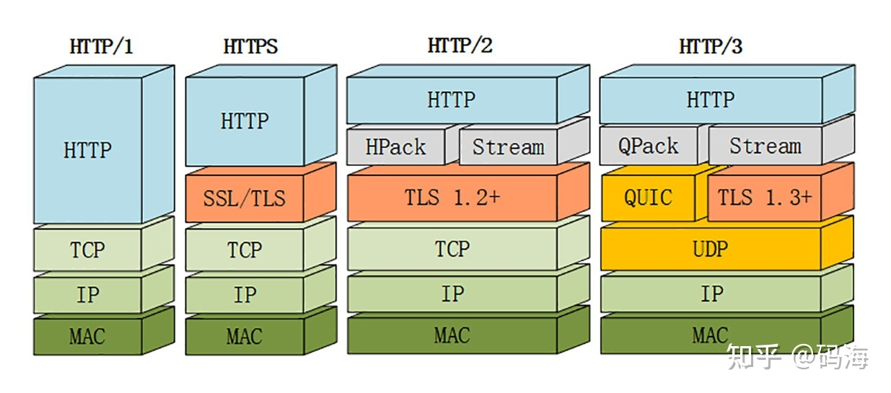

### 服务端推送

`HTTP` 需要请求方发起请示，然后应答方对此作出响应，应答方不会无缘无故地发响应给请求方，另外请求和应答方的角色是可以互换的，比如 `HTTP 2` 中 `server` 是可以主动 `push` 给 `client` 的，这种情况下 `server` 即为请求方，`cilent` 即为应答方


## GET 和 POST 和 OPTIONS

### POST 是否比 GET 安全

是的，`POST` 要比 `GET` 安全一点点，注意，是一点点。。。两者都是明文传送，但是有一个细节，就是 `GET` 的 `URL` 会被放在浏览器历史和 `WEB` 服务器日志里面。`POST` 发完基本就木有了。所以如果你把关键数据放在 `GET` 里面，被人偷窥了浏览器，或者 `WEB` 服务器被入侵日志被人倒去了，基本泄露可能性 `100%`。而 `POST` 来说，日志没有记录，只要数据库服务器不被入侵，基本还是安全的。

当然如果被抓了包，这一切都没有什么卵用，所以，`HTTPS` 该用还是得用。

### GET 相对 POST 的优势是什么

最大的优势是，`GET` 的 `URL` 可以人肉手输啊。。。本质上面，`GET` 的所有信息都在 `URL`，所以很方便的记录下来重复使用。

所以下列情况

- 请求中的 `URL` 可以被手动输入
- 请求中的 `URL` 可以被存在书签里，或者历史里，或者快速拨号里面，或者分享给别人。
- 请求中的 `URL` 是可以被搜索引擎收录的。
- 带云压缩的浏览器，比如 `Opera mini/Turbo 2` , 只有 `GET` 才能在服务器端被预取的。
- 请求中的 `URL` 可以被缓存。

请使用 GET.

> 可以重复的交互，比如取个数据，跳个页面， 用 `GET`，不可以重复的操作，比如创建一个条目/修改一条记录，用 `POST`, 因为 `POST` 不能被缓存，所以浏览器不会多次提交。`GET` 请求也可以用 `body` 传输数据（但不建议）

### OPTIONS

`HTTP` 的 `OPTIONS` 方法 用于获取目的资源所支持的通信选项。客户端可以对特定的 `URL` 使用 `OPTIONS` 方法，也可以对整站（通过将 `URL` 设置为“*”）使用该方法。”

简单来说，就是可以用 `options` 请求去嗅探某个请求在对应的服务器中都支持哪种请求方法。

在前端中我们一般不会主动发起这个请求，但是往往你可以看到浏览器中相同的请求发起了 `2` 次

其实，这是因为在跨域的情况下，在浏览器发起"复杂请求"时主动发起的。

跨域共享标准规范要求，对那些可能对服务器数据产生副作用的 `HTTP` 请求方法（特别是 `GET` 以外的 `HTTP` 请求，或者搭配某些 `MIME` 类型的 `POST` 请求），浏览器必须首先使用 `OPTIONS` 方法发起一个预检请求（preflight request），从而获知服务端是否允许该跨域请求。服务器确认允许之后，才发起实际的 `HTTP` 请求。

某些请求不会触发 `CORS` 预检请求，这样的请求一般称为"简单请求",而会触发预检的请求则称为"复杂请求"。

而在项目中常见的 `Content-Type: application/json` 及 `Authorization: <token>` 为典型的非简单请求，在发送请求时往往会带上 `Options`

#### 简单请求

- 请求方法为 GET、HEAD、POST 时发的请求
- 人为设置了规范集合之内的首部字段，如 `Accept/Accept-Language/Content-Language/Content-Type/DPR/Downlink/Save-Data/Viewport-Width/Width`
- `Content-Type` 的值仅限于下列三者之一,即 `application/x-www-form-urlencoded`、`multipart/form-data`、`text/plain`
- 请求中的任意 `XMLHttpRequestUpload` 对象均没有注册任何事件监听器；
- 请求中没有使用 `ReadableStream` 对象。

#### 复杂请求

- 使用了下面任一 `HTTP` 方法，`PUT/DELETE/CONNECT/OPTIONS/TRACE/PATCH`
- 人为设置了以下集合之外首部字段，即简单请求外的字段
- `Content-Type` 的值不属于下列之一，即`application/x-www-form-urlencoded`、`multipart/form-data`、`text/plain`

## HTTP 的明文传输

`HTTP` 的明文传输带来的问题是无法防止中间人截获、盗取和篡改信息，从你的路由器、运营商到对方服务器，中间每一步都是明文。这里面可下手的地方太多了。


比如很多地方电信运营商就擅自给用户的网页插入浮动窗口广告，甚至影响正常浏览，不知情的用户还骂网站。其实这就是 HTTP 的明文特性导致的天然漏洞，对 HTTPS 网站则束手无策。因为后者只有用户和服务器能看到真实请求数据，对所有中间环节都加了密，自然也就无从篡改。

比如与运营商合作的营销公司。他们可以通过截获请求盗取并伪造你的身份信息来关注一票僵尸号或给某些营销微博点赞。方法也简单，把你本次成功访问微博的 `cookie` 存下来，直接用这个 `cookie` 发送关注别人的请求就行。这种情况根本无需窃取你密码，也就无所谓密码大量泄露了。

## HTTP 状态码

### 1xx

`1xx` 类状态码属于提示信息，是协议处理中的一种中间状态，实际用到的比较少。

### 2xx

`2xx` 类状态码表示服务器成功处理了客户端的请求，也是我们最愿意看到的状态。

- 「200 OK」是最常见的成功状态码，表示一切正常。如果是非 `HEAD` 请求，服务器返回的响应头都会有 `body` 数据。
- 「204 No Content」也是常见的成功状态码，与 `200 OK` 基本相同，但响应头没有 `body` 数据。
- 「206 Partial Content」是应用于 `HTTP` 分块下载或断点续传，表示响应返回的 `body` 数据并不是资源的全部，而是其中的一部分，也是服务器处理成功的状态。

### 3xx

`3xx` 类状态码表示客户端请求的资源发送了变动，需要客户端用新的 `URL` 重新发送请求获取资源，也就是重定向。

- 「301 Moved Permanently」表示永久重定向，说明请求的资源已经不存在了，需改用新的 `URL` 再次访问。
- 「302 Moved Permanently」表示临时重定向，说明请求的资源还在，但暂时需要用另一个 `URL` 来访问。
- `301` 和 `302` 都会在响应头里使用字段 `Location`，指明后续要跳转的 `URL`，浏览器会自动重定向新的 `URL`。
- 「304 Not Modified」不具有跳转的含义，表示资源未修改，重定向已存在的缓冲文件，也称缓存重定向，用于缓存控制。

### 4xx

`4xx` 类状态码表示客户端发送的报文有误，服务器无法处理，也就是错误码的含义。

- 「400 Bad Request」表示客户端请求的报文有错误，但只是个笼统的错误。
- 「403 Forbidden」表示服务器禁止访问资源，并不是客户端的请求出错。
- 「404 Not Found」表示请求的资源在服务器上不存在或未找到，所以无法提供给客户端。

### 5xx

`5xx` 类状态码表示客户端请求报文正确，但是服务器处理时内部发生了错误，属于服务器端的错误码。

- 「500 Internal Server Error」与 `400` 类型，是个笼统通用的错误码，服务器发生了什么错误，我们并不知道。
- 「501 Not Implemented」表示客户端请求的功能还不支持，类似“即将开业，敬请期待”的意思。
- 「502 Bad Gateway」通常是服务器作为网关或代理时返回的错误码，表示服务器自身工作正常，访问后端服务器发生了错误。
- 「503 Service Unavailable」表示服务器当前很忙，暂时无法响应服务器，类似“网络服务正忙，请稍后重试”的意思。

## HTTP 无状态

`HTTP` 的每次的收发报文都是完全独立，没有任何联系的，服务器收到每个请求响应后，不会记录这个请求的任何信息，比如访问一个网站需要反复进行登录操作

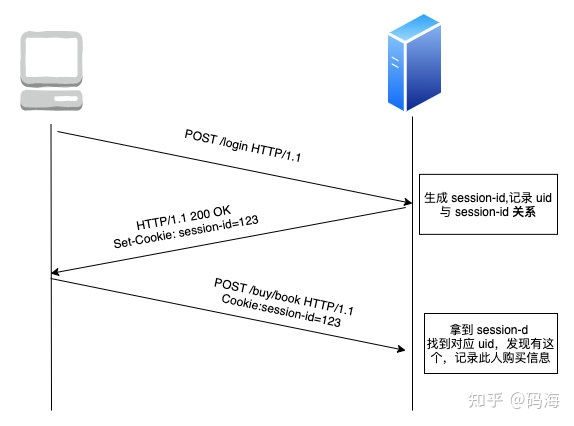

`Session` 可以认为是 `Server` 用来追踪每个用户行为的一个会话，`server` 会给每个用户分配一个这个 `Session` 的 `sessionId`，通过 `Cookie` 这个头字段返回给 `client`，之后 `client` 每次请求都会在 `Cookie` 里带上这个 `sessionId`，`server` 拿到 `sessionId` 之后就知道是哪个用户发起的了

## HTTP 请求头必传的字段

是 `Host`, `HTTP 1.1` 允许一台服务器搭建多个 `Web` 站点，也就是说一台服务器可以托管多个域名对应的网站，这样的话必须指定 `Host`，到达服务器后才能找到对应的网址向其请求。

## 三次握手和四次挥手

### 三次握手

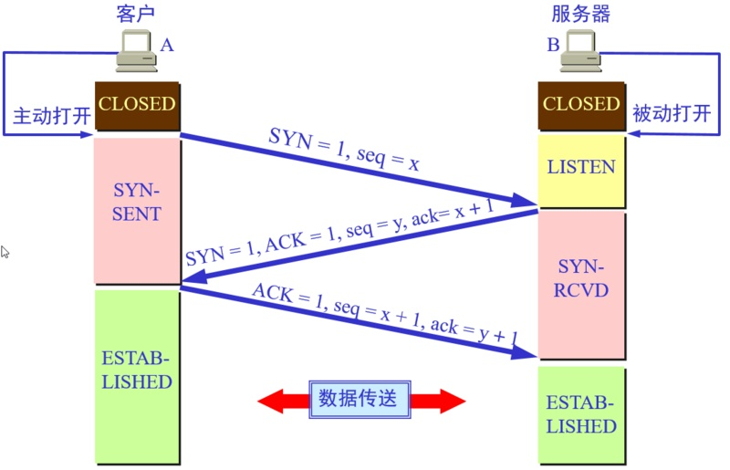

为什么要进行三次握手呢? 

第三次握手是为了**防止失效的连接请求到达服器，让服务器错误打开连接**。客户端发送的连接请求如果在网络中滞留，那么就会隔很长一段时间才能收到服务器端发回的连接确认。客户端等待一个超时重传时间之后，就会重新请求连接。但是这个滞留的连接请求最后还是会到达服务器，如果不进行三次握手，那么服务器就会打开两个连接。如果有第三次握手，客户端会忽略服务器之后发送的对滞留连接请求的连接确认，不进行第三次握手，因此就不会再次打开连接。

### 四次挥手


为什么要四次挥手？

客户端发送了 `FIN` 连接释放报文之后，服务器收到了这个报文，就进入了 `CLOSE-WAIT` 状态。这个状态是为了让服务器端发送还未传送完毕的数据，传送完毕之后，服务器会发送 `FIN` 连接释放报文。

## 代理

说到代理，首先我们要明确一个概念，所谓代理就是一个代表、一个渠道；此时就涉及到两个角色，一个是被代理角色，一个是目标角色。

被代理角色通过这个代理访问目标角色完成一些任务的过程称为代理操作过程；如同生活中的专卖店，客人到 `adidas` 专卖店买了一双鞋，这个专卖店就是代理，被代理角色就是 adidas 厂家，目标角色就是用户。

简而言之，就是 `adidas` 老板找来专卖店这个代理来卖鞋子给客人这个目标角色。

### 正向代理

用 `FQ` 软件进行访问 `facebook`，`FQ` 的方式主要是找到一个可以访问国外网站的代理服务器，我们将请求发送给代理服务器，代理服务器去访问国外的网站，然后将访问到的数据传递给我们！

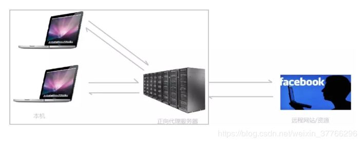

上述这样的代理模式称为正向代理，正向代理最大的特点是**客户端非常明确要访问的服务器地址**；**服务器只清楚请求来自哪个代理服务器**，而不清楚来自哪个具体的客户端；**正向代理模式屏蔽或者隐藏了真实客户端信息**。

客户端必须设置正向代理服务器，当然前提是要知道正向代理服务器的 `IP` 地址，还有代理程序的端口。

总结来说：正向代理，**“它代理的是客户端”**，是一个位于客户端和原始服务器（Origin Server）之间的服务器，为了从原始服务器取得内容，客户端向代理发送一个请求并指定目标（原始服务器）。

### 反向代理

明白了什么是正向代理，我们继续看关于反向代理的处理方式，举例如我国的某宝网站，每天同时连接到网站的访问人数已经爆表，单个服务器远远不能满足人民日益增长的购买欲望了。

此时就出现了一个大家耳熟能详的名词：分布式部署；也就是通过部署多台服务器来解决访问人数限制的问题。

某宝网站中大部分功能也是直接使用 `Nginx` 进行反向代理实现的，并且通过封装 `Nginx` 和其他的组件之后起了个高大上的名字：`Tengine`。

那么反向代理具体是通过什么样的方式实现的分布式的集群操作呢，我们先看一个示意图（我把服务器和反向代理框在一块，同属于一个环境，后面我有介绍）

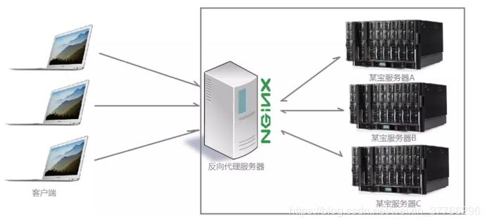

此时请求的来源也就是客户端是明确的，但是请求具体由哪台服务器处理的并不明确了，`Nginx` 扮演的就是一个反向代理角色。

客户端是无感知代理的存在的，**反向代理对外都是透明的**，**访问者并不知道自己访问的是一个代理**。因为客户端不需要任何配置就可以访问。

反向代理，“**它代理的是服务端**”，主要用于服务器集群分布式部署的情况下，反向代理隐藏了服务器的信息。

反向代理的作用：

- 保证内网的安全，通常将反向代理作为公网访问地址，`Web` 服务器是内网。
- 负载均衡，通过反向代理服务器来优化网站的负载。

通常情况下，我们在实际项目操作时，正向代理和反向代理很有可能会存在同一个应用场景中，正向代理代理客户端的请求去访问目标服务器，目标服务器是一个反向单利服务器，反向代理了多台真实的业务处理服务器。

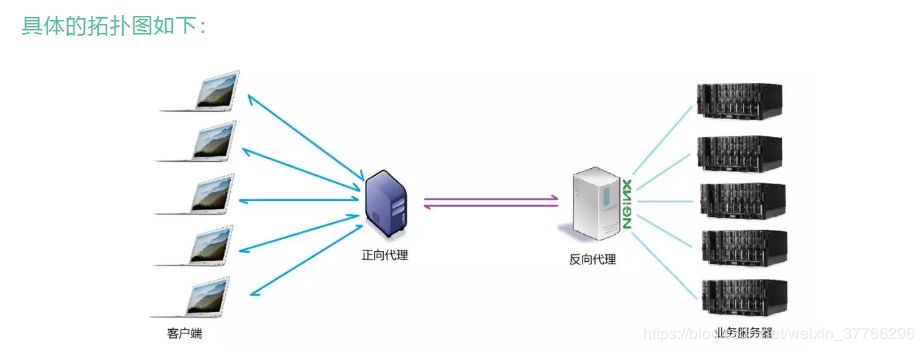

## HTTPS

`HTTPS` 并非是应用层的一种新协议。只是 `HTTP` 通信接口部分用 `SSL`（Secure Socket Layer）和 `TLS`（Transport Layer Security）协议代替而已。通常，`HTTP` 直接和 `TCP` 通信。当使用 `SSL` 时，则演变成先和 `SSL` 通信，再由 `SSL` 和 `TCP` 通信了。简言之，所谓 `HTTPS`，其实就是身披 `SSL` 协议这层外壳的 `HTTP`。

> http 和 `https` 使用连接方式不同，默认端口也不一样，`http` 是 `80`，`https` 是 `443`。

### 对称加密（天王盖地虎）

对称加密：即通信的双方都使用**同一个秘钥**进行加解密，比如特务接头的暗号，就属于对称加密

对称加密虽然很简单性能也好，但是**无法解决首次把秘钥发给对方的问题**，很容易被 `hacker` 拦截秘钥。

### 非对称加密

>私钥 + 公钥 = 密钥对

即用私钥加密的数据,只有对应的公钥才能解密,用公钥加密的数据,只有对应的私钥才能解密

因为**通信双方的手里都有一套自己的密钥对**,通信之前双方会先把自己的公钥都先发给对方

然后对方再拿着这个公钥来加密数据响应给对方,等到到了对方那里,对方再用自己的私钥进行解密

非对称加密虽然安全性更高，但是带来的问题就是速度很慢，影响性能。

### HTTPS 加密方式

结合两种加密方式，**将对称加密的密钥使用非对称加密的公钥进行加密**，然后发送出去，接收方使用私钥进行解密得到对称加密的密钥，然后双方可以使用对称加密来进行沟通。

> 此时又带来一个问题，中间人问题

如果此时在客户端和服务器之间存在一个中间人,这个中间人只需要把原本双方通信互发的公钥,换成自己的公钥,这样中间人就可以轻松解密通信双方所发送的所有数据。

所以这个时候需要一个安全的第三方颁发证书（CA），证明身份，防止被中间人攻击。

**证书中包括：签发者、证书用途、使用者公钥、使用者私钥、使用者的 HASH 算法、证书到期时间等**

> 但是问题来了，如果中间人篡改了证书，那么身份证明是不是就无效了？这个证明就白买了，这个时候需要一个新的技术，数字签名。

数字签名就是用 `CA` 自带的 `HASH` 算法对证书的内容进行 `HASH` 得到一个摘要，再用 `CA` 的私钥加密，最终组成数字签名。
当别人把他的证书发过来的时候,我再用同样的 `Hash` 算法,再次生成消息摘要，然后用 `CA` 的公钥对数字签名解密,得到 `CA` 创建的消息摘要,两者一比,就知道中间有没有被人篡改了。

这个时候就能最大程度保证通信的安全了。

### HTTPS 通讯方式

1. 客户使用 `https` 的 `URL` 访问 `Web` 服务器，要求与 `Web` 服务器建立 `SSL` 连接。

2. `Web` 服务器收到客户端请求后，会将网站的证书信息（证书中包含公钥）传送一份给客户端。

3. 客户端的浏览器与 `Web` 服务器开始协商 `SSL` 连接的安全等级，也就是信息加密的等级。

4. 客户端的浏览器根据双方同意的安全等级，建立**会话密钥**，然后利用网站的公钥将会话密钥加密，并传送给网站。

5. `Web` 服务器利用自己的私钥解密出会话密钥。
`Web` 服务器利用会话密钥加密与客户端之间的通信。

### HTTPS 的缺点

- HTTPS 协议多次握手，导致页面的加载时间延长近 50%；
- HTTPS 连接缓存不如 HTTP 高效，会增加数据开销和功耗；
- 申请 SSL 证书需要钱，功能越强大的证书费用越高。
- SSL 涉及到的安全算法会消耗 CPU 资源，对服务器资源消耗较大。

### HTTPS 握手

在 `TLS 1.2` 中，握手协议过程需要耗费两个 `RTT`，过程如下

- [OUT] `Client Hello`，客户端选出自身支持的 TLS 版本号、`cipher suites`、一个随机数、`SessionId` 传送给服务器端 (有可能可服用 Session)
- [IN] `Server Hello`，服务器端选出双方都支持的 TLS 版本，`cipher suite` 、一个随机数、`SeesionId` 给客户端
- [IN] `Certificate`，服务器端给客户端发送证书，用以身份验证及提供公钥
- [IN] `Server Key Exchange`，服务器端给客户端发送秘钥交换算法的一些参数
- [IN] `Server Finished`
- [OUT] `Client Key Exchange`，客户端给服务器端发送秘钥交换算法的一些参数，计算出预备主密钥 (pre master key)，作为随机数传递给服务器端 (这个随机数是安全的)。双方根据三个随机数生成对称加密中的秘钥
- [OUT] `Change Cipher Spec`，告知对方以后的消息将要使用 `TLS` 记录层协议进行加密
- [OUT] `Finished`，发送第一条加密的消息并完整性验证
- [IN] `Change Cipher Spec`，告知以后的消息将要使用 `TLS` 记录层协议进行加密
- [IN] `Finished`，发送第一条加密的消息并完整性验证

`TLS 1.3` 握手时间从以前的 `2RTT` 缩短到 `1RTT`，通过 `Pre shared-key` 减少了单独的 `ServerKeyExchange` 与 `ClientKeyExchange` 消耗的一个 `RTT`

## Websocket

首先，`Websocket` 是一个持久化的协议，相对于 `HTTP` 这种非持久的协议来说。

`HTTP` 的生命周期通过 `Request` 来界定，也就是一个 `Request` 一个 `Response`，**而且这个 `response` 也是被动的，不能主动发起**。

### 典型的 Websocket 握手

```js
GET /chat HTTP/1.1
Host: server.example.com
Upgrade: websocket
Connection: Upgrade
Sec-WebSocket-Key: x3JJHMbDL1EzLkh9GBhXDw==
Sec-WebSocket-Protocol: chat, superchat
Sec-WebSocket-Version: 13
Origin: http://example.com
```

这段类似 `HTTP` 协议的握手请求中，多了几个东西。

```js
Upgrade: websocket
Connection: Upgrade
```

这个就是 `Websocket` 的核心了，告诉 `Apache`、`Nginx` 等服务器：注意啦，窝发起的是 `Websocket` 协议，快点帮我找到对应的助理处理~不是那个老土的 `HTTP`。

```js
Sec-WebSocket-Key: x3JJHMbDL1EzLkh9GBhXDw==
Sec-WebSocket-Protocol: chat, superchat
Sec-WebSocket-Version: 13
```

首先，`Sec-WebSocket-Key` 是一个 `Base64 encode` 的值，这个是浏览器随机生成的，告诉服务器：泥煤，不要忽悠窝，我要验证尼是不是真的是 `Websocket` 助理。

然后，`Sec_WebSocket-Protocol` 是一个用户定义的字符串，用来区分同 `URL` 下，不同的服务所需要的协议。简单理解：今晚我要服务 `A`，别搞错啦~

最后，`Sec-WebSocket-Version` 是告诉服务器所使用的 `Websocket Draft`（协议版本）

然后服务器会返回下列东西，表示已经接受到请求， 成功建立 `Websocket` 啦！

```js
HTTP/1.1 101 Switching Protocols
Upgrade: websocket
Connection: Upgrade
Sec-WebSocket-Accept: HSmrc0sMlYUkAGmm5OPpG2HaGWk=
Sec-WebSocket-Protocol: chat
```

这里开始就是 `HTTP` 最后负责的区域了，告诉客户，我已经成功切换协议啦~

```js
Upgrade: websocket
Connection: Upgrade
```

依然是固定的，告诉客户端即将升级的是 `Websocket` 协议，而不是 `mozillasocket`，`lurnarsocket` 或者 `shitsocket`。

然后，`Sec-WebSocket-Accept` 这个则是经过服务器确认，并且加密过后的 `Sec-WebSocket-Key`。服务器：好啦好啦，知道啦，给你看我的 `ID CARD` 来证明行了吧。。

后面的，`Sec-WebSocket-Protocol` 则是表示最终使用的协议。

至此，`HTTP` 已经完成它所有工作了，接下来就是完全按照 `Websocket` 协议进行了。
具体的协议就不在这阐述了。

### Websocket 的作用

#### ajax 轮询

`ajax` 轮询 的原理非常简单，让浏览器隔个几秒就发送一次请求，询问服务器是否有新信息。

#### long poll

`long poll` 其实原理跟 `ajax` 轮询 差不多，都是采用轮询的方式，不过采取的是阻塞模型（一直打电话，没收到就不挂电话），也就是说，客户端发起连接后，如果没消息，就一直不返回 `Response` 给客户端。直到有消息才返回，返回完之后，客户端再次建立连接，周而复始。

#### Websocket 和 HTTP 对比

他解决了 `HTTP` 的这几个难题。

首先，被动性，当服务器完成协议升级后（HTTP->Websocket），服务端就可以主动推送信息给客户端啦。

只需要经过一次 `HTTP` 请求，就可以做到源源不断的信息传送了。（在程序设计中，这种设计叫做回调，即：你有信息了再来通知我，而不是我傻乎乎的每次跑来问你）

这样的协议解决了上面同步有延迟，而且还非常消耗资源的这种情况。

其实我们所用的程序是要经过两层代理的，即 `HTTP` 协议在 `Nginx` 等服务器的解析下，然后再传送给相应的 `Handler`（PHP 等）来处理。

简单地说，我们有一个非常快速的接线员（Nginx），他负责把问题转交给相应的客服（Handler）。

本身接线员基本上速度是足够的，但是每次都卡在客服（Handler）了，老有客服处理速度太慢。导致客服不够。

`Websocket` 就解决了这样一个难题，建立后，可以直接跟接线员建立持久连接，有信息的时候客服想办法通知接线员，然后接线员在统一转交给客户。
这样就可以解决客服处理速度过慢的问题了（客服不够多搞几个）。

同时，在传统的方式上，要不断的建立，关闭 `HTTP` 协议，由于 `HTTP` 是非状态性的，每次都要重新传输 `identity info`（鉴别信息），来告诉服务端你是谁。

虽然接线员很快速，但是每次都要听这么一堆，效率也会有所下降的，同时还得不断把这些信息转交给客服，不但浪费客服的处理时间，而且还会在网路传输中消耗过多的流量/时间。

但是 `Websocket` 只需要一次 `HTTP` 握手，所以说整个通讯过程是建立在一次连接/状态中，也就避免了 `HTTP` 的非状态性，服务端会一直知道你的信息，直到你关闭请求，这样就解决了接线员要反复解析 `HTTP` 协议，还要查看 `identity info` 的信息。

同时由客户主动询问，转换为服务器（推送）有信息的时候就发送（当然客户端还是等主动发送信息过来的。。），没有信息的时候就交给接线员（Nginx），不需要占用本身速度就慢的客服（Handler）了
