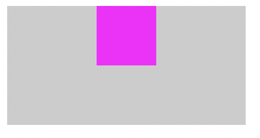
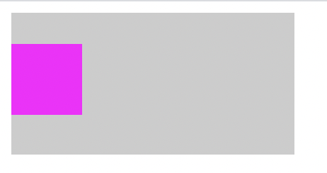
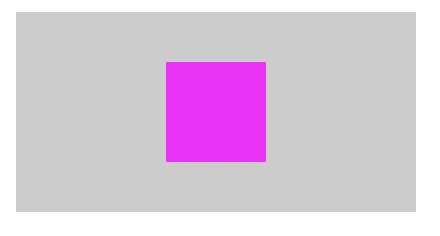
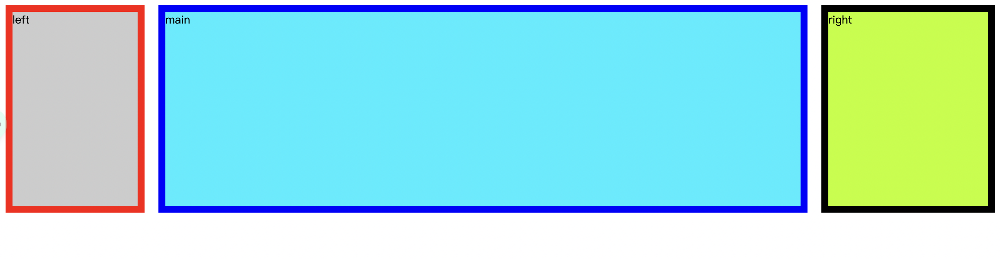
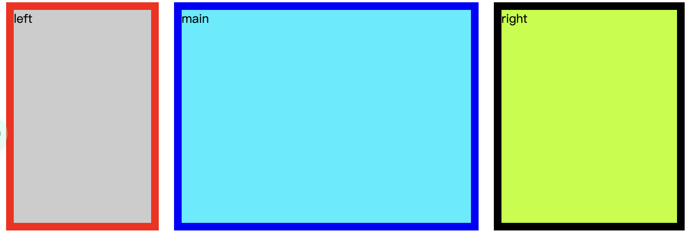

# css 居中和三栏布局<!-- omit in toc -->
- [水平居中](#水平居中)
  - [inline-block + text-align](#inline-block--text-align)
  - [width + margin](#width--margin)
    - [relative + margin 负值](#relative--margin-负值)
  - [absolute + translate](#absolute--translate)
  - [flex](#flex)
  - [grid](#grid)
- [垂直居中](#垂直居中)
  - [flex](#flex-1)
  - [grid](#grid-1)
  - [table-cell](#table-cell)
  - [vertical-align: middle](#vertical-align-middle)
  - [absolute + translate](#absolute--translate-1)
- [水平垂直居中](#水平垂直居中)
  - [absolute + margin：auto](#absolute--marginauto)
  - [table-cell](#table-cell-1)
- [三栏布局](#三栏布局)
  - [流体布局](#流体布局)
  - [BFC 布局](#bfc-布局)
  - [绝对定位布局](#绝对定位布局)
  - [双飞翼布局](#双飞翼布局)
  - [圣杯布局](#圣杯布局)
  - [flex 布局](#flex-布局)
  - [table-cell 布局](#table-cell-布局)
  - [grid 布局](#grid-布局)

## 水平居中
效果：



HTML 结构：

```html
<div class="father">
  <div class="child"></div>
</div>
```

### inline-block + text-align

CSS 实现：

```css
.father {
	width: 200px;
	height: 100px;
	background-color: #ccc;
	text-align: center;
}
.child {
	display: inline-block;
	width: 50px;
	height: 50px;
	background-color: #f0f;
}
```

### width + margin

CSS 实现：
```css
.father {
	width: 200px;
	height: 100px;
	background-color: #ccc;
}
.child {
	margin: 0 auto;
	width: 50px;
	height: 50px;
	background-color: #f0f;
}
```

#### relative + margin 负值

CSS 实现：
```css
.father {
	width: 200px;
	height: 100px;
	background-color: #ccc;
}
.child {
	position: relative;
	left: 50%;
	margin-left: -25px;
	width: 50px;
	height: 50px;
	background-color: #f0f;
}
```

### absolute + translate

CSS 实现：

```css
.father {
	position: relative;
	width: 200px;
	height: 100px;
	background-color: #ccc;
}
.child {
	position: absolute;
	left: 50%;
	width: 50px;
	height: 50px;
	background-color: #f0f;
	transform: translateX(-50%);
}
```

### flex

CSS 实现：

```css
.father {
	display: flex;
	justify-content: center;
	width: 200px;
	height: 100px;
	background-color: #ccc;
}
.child {
	width: 50px;
	height: 50px;
	background-color: #f0f;
}
```

### grid

CSS 实现：

```css
.father {
	display: grid;
	width: 200px;
	height: 100px;
	background-color: #ccc;
}
.child {
	width: 50px;
	height: 50px;
	background-color: #f0f;
	justify-self: center;
}
```

## 垂直居中

效果：



HTML 结构：

```html
<div class="father">
  <div class="child"></div>
</div>
```

### flex

CSS 实现：

```css
.father {
	display: flex;
	align-items: center;
	width: 200px;
	height: 100px;
	background-color: #ccc;
}
.child {
	width: 50px;
	height: 50px;
	background-color: #f0f;
}
```

### grid

CSS 实现：

```css
.father {
	display: grid;
	width: 200px;
	height: 100px;
	background-color: #ccc;
}
.child {
	align-self: center;
	width: 50px;
	height: 50px;
	background-color: #f0f;
}
```

### table-cell

CSS 实现：

```css
.father {
	display: table-cell;
	width: 200px;
	height: 100px;
	background-color: #ccc;
	vertical-align: middle;
}
.child {
	display: inline-block;
	width: 50px;
	height: 50px;
	background-color: #f0f;
}
```

### vertical-align: middle

CSS 实现：

```css
.father {
	width: 200px;
	height: 100px;
	background-color: #ccc;
	vertical-align: middle;
}
.father::before {
	display: inline-table;
	width: 0;
	height: 100%;
	vertical-align: middle;
	content: "";
}
.child {
	display: inline-block;
	width: 50px;
	height: 50px;
	background-color: #f0f;
	vertical-align: middle;
}
```

### absolute + translate

CSS 实现：

```css
.father {
	position: relative;
	width: 200px;
	height: 100px;
	background-color: #ccc;
}
.child {
	position: absolute;
	top: 50%;
	width: 50px;
	height: 50px;
	background-color: #f0f;
	/* margin-top: -25px; */
	transform: translateY(-50%);
}
```

## 水平垂直居中

效果：



HTML 结构：

```html
<div class="father">
  <div class="child"></div>
</div>
```

### absolute + margin：auto

CSS 实现：

```css
.father {
	position: relative;
	width: 200px;
	height: 100px;
	background-color: #ccc;
}
.child {
	position: absolute;
	left: 0;
	right: 0;
	top: 0;
	bottom: 0;
	margin: auto;
	width: 50px;
	height: 50px;
	background-color: #f0f;
}
```

### table-cell

CSS 实现：

```css
.father {
	display: table-cell;
	width: 200px;
	height: 100px;
	background-color: #ccc;
	vertical-align: middle;
	text-align: center;
}
.child {
	display: inline-block;
	width: 50px;
	height: 50px;
	background-color: #f0f;
}
```

## 三栏布局

左右模块固定宽度，中间模块随浏览器变化自适应，想要完成的最终效果如下图所示：





### 流体布局

左右模块各自向左右浮动，并设置中间模块的 `margin` 值使中间模块宽度自适应。

```html
<!DOCTYPE html>
<html lang="en">
<head>
  <style>
		* {
			box-sizing: border-box;
		}
		.left {
			float: left;
			border: 10px solid red;
			width: 200px;
			height: 300px;
			background-color: #ccc;
		}
		.right {
			float: right;
			border: 10px solid black;
			width: 250px;
			height: 300px;
			background-color: #bf0;
		}
		.main {
			margin-left: 220px;
			margin-right: 270px;
			border: 10px solid blue;
			height: 300px;
			background-color: #0ef;
		}
  </style>
</head>

<body>
  <div class="container">
    <div class="left">left</div>
    <div class="right">right</div>
    <div class="main">main</div>
  </div>
</body>

</html>
```

**缺点就是主要内容无法最先加载，当页面内容较多时会影响用户体验**。

### BFC 布局

`BFC` 规则有这样的描述：`BFC` 区域，不会与浮动元素重叠。

```html
<!DOCTYPE html>
<html lang="en">
<head>
  <style>
		.left {
			float: left;
			margin-right: 20px;
			border: 10px solid red;
			width: 200px;
			height: 300px;
			background-color: #ccc;
		}
		.right {
			float: right;
			margin-left: 20px;
			border: 10px solid black;
			width: 250px;
			height: 300px;
			background-color: #bf0;
		}
		.main {
			overflow: hidden;
			border: 10px solid blue;
			height: 300px;
			background-color: #0ef;
		}
  </style>
</head>

<body>
  <div class="container">
    <div class="left">left</div>
    <div class="right">right</div>
    <div class="main">main</div>
  </div>
</body>

</html>
```

**缺点跟流体布局类似，主要内容模块无法最先加载，当页面中内容较多时会影响用户体验**。

### 绝对定位布局

```html
<!DOCTYPE html>
<html lang="en">
<head>
  <style>
		* {
			box-sizing: border-box;
		}
		.container {
			position: relative;
		}
		.left {
			position: absolute;
			left: 0;
			top: 0;
			border: 10px solid red;
			width: 200px;
			height: 300px;
			background-color: #ccc;
		}
		.right {
			position: absolute;
			right: 0;
			top: 0;
			border: 10px solid black;
			width: 250px;
			height: 300px;
			background-color: #bf0;
		}
		.main {
			margin-left: 220px;
			margin-right: 270px;
			border: 10px solid blue;
			height: 300px;
			background-color: #0ef;
		}
  </style>
</head>

<body>
  <div class="container">
    <div class="main">main</div>
    <div class="left">left</div>
    <div class="right">right</div>
  </div>
</body>

</html>
```

简单实用，并且主要内容可以优先加载。

### 双飞翼布局

原理：负 `margin` 会改变浮动元素的显示位置
思路：`left`, `right`, `content` 都浮动，`margin` 负值调位置，最后使用 `margin` 值调 `main` 的内容显示。

```html
<!DOCTYPE html>
<html lang="en">
<head>

  <style>
		* {
			box-sizing: border-box;
		}
		.left {
			float: left;
			margin-left: -100%;
			border: 10px solid red;
			width: 200px;
			height: 300px;
			background-color: #ccc;
		}
		.right {
			float: left;
			margin-left: -250px;
			border: 10px solid black;
			width: 250px;
			height: 300px;
			background-color: #bf0;
		}
		.content {
			float: left;
			width: 100%;
		}
		.main {
			margin-left: 220px;
			margin-right: 270px;
			border: 10px solid blue;
			height: 300px;
			background-color: #0ef;
		}
  </style>
</head>

<body>
  <div class="container">
    <div class="content">
      <div class="main">main</div>
    </div>
    <div class="left">left</div>
    <div class="right">right</div>
  </div>
</body>

</html>
```

### 圣杯布局

思路：`left`, `right`, `main` 都浮动，在使用 `margin-left` 调容器位置，`margin` 负值调位置，`relative` 调位置。

```html
<!DOCTYPE html>
<html lang="en">
<head>
  <style>
		* {
			box-sizing: border-box;
		}
		.container {
			margin-left: 220px;
			margin-right: 270px;
		}
		.left {
			float: left;
			position: relative;
			left: -220px;
			margin-left: -100%;
			border: 10px solid red;
			width: 200px;
			height: 300px;
			background-color: #ccc;
		}
		.right {
			float: left;
			position: relative;
			right: -270px;
			margin-left: -250px;
			border: 10px solid black;
			width: 250px;
			height: 300px;
			background-color: #bf0;
		}
		.main {
			float: left;
			border: 10px solid blue;
			width: 100%;
			height: 300px;
			background-color: #0ef;
		}
  </style>
</head>

<body>
  <div class="container">
    <div class="main">main</div>
    <div class="left">left</div>
    <div class="right">right</div>
  </div>
</body>

</html>
```

### flex 布局

```html
<!DOCTYPE html>
<html lang="en">
<head>
  <style>
		* {
			box-sizing: border-box;
		}
		.container {
			display: flex;
		}
		.left {
			flex-basis: 200px;
			order: -1;
			border: 10px solid red;
			height: 300px;
			background-color: #ccc;
		}
		.right {
			flex-basis: 250px;
			order: 1;
			border: 10px solid black;
			height: 300px;
			background-color: #bf0;
		}
		.main {
			flex-grow: 1;
			margin: 0 20px;
			border: 10px solid blue;
			height: 300px;
			background-color: #0ef;
		}
  </style>
</head>

<body>
  <div class="container">
    <div class="main">main</div>      
    <div class="left">left</div>
    <div class="right">right</div>
  </div>
</body>

</html>
```

### table-cell 布局

```html
<!DOCTYPE html>
<html lang="en">
<head>
  <style>
		* {
			box-sizing: border-box;
		}
		.container {
			display: table;
			width: 100%;
		}
		.left {
			display: table-cell;
			border: 10px solid red;
			width: 200px;
			height: 300px;
			background-color: #ccc;
		}
		.right {
			display: table-cell;
			border: 10px solid black;
			width: 250px;
			height: 300px;
			background-color: #bf0;
		}
		.main {
			display: table-cell;
			border: 10px solid blue;
			height: 300px;
			background-color: #0ef;
		}
  </style>
</head>

<body>
  <div class="container">
    <div class="left">left</div>
    <div class="main">main</div>
    <div class="right">right</div>
  </div>
</body>

</html>
```

缺点：无法设置栏间距。

### grid 布局

```html
<!DOCTYPE html>
<html lang="en">
<head>
  <style>
		* {
			box-sizing: border-box;
		}
		.container {
			display: grid;
			grid-template-columns: 200px auto 250px;
			grid-template-rows: 300px;
			grid-column-gap: 20px;
		}
		.left {
			order: -1;
			border: 10px solid red;
			background-color: #ccc;
		}
		.right {
			order: 1;
			border: 10px solid black;
			background-color: #bf0;
		}
		.main {
			border: 10px solid blue;
			background-color: #0ef;
		}
  </style>
</head>

<body>
  <div class="container">
    <div class="main">main</div>      
    <div class="left">left</div>
    <div class="right">right</div>
  </div>
</body>

</html>
```

未来的趋势，需要考虑浏览器的兼容性。