# Windows 日常使用的技巧<!-- omit in toc -->
- [重装系统](#重装系统)
  - [制作 U 盘启动盘](#制作-u-盘启动盘)
  - [通过 U 盘启动电脑](#通过-u-盘启动电脑)
  - [驱动安装](#驱动安装)
- [Win+R 快捷启动工具](#winr-快捷启动工具)
- [Windows 10 的邮件添加并同步 Gmail](#windows-10-的邮件添加并同步-gmail)
  - [准备工作](#准备工作)
  - [向 Win10 邮件 app 添加 Gmail 账户](#向-win10-邮件-app-添加-gmail-账户)
- [Windows 为当前用户添加开机自启项](#windows-为当前用户添加开机自启项)
- [利用 Windows 系统评估工具测试硬盘速度](#利用-windows-系统评估工具测试硬盘速度)
- [Windows 10 快速检查修复系统](#windows-10-快速检查修复系统)
- [局域网内 Windows / Ipad 传输文件](#局域网内-windows--ipad-传输文件)
  - [Windows 设置共享文件夹](#windows-设置共享文件夹)
  - [Ipad 上访问局域网](#ipad-上访问局域网)
- [Windows 软件包管理工具](#windows-软件包管理工具)
  - [WinGet](#winget)
    - [安装](#安装)
    - [仓库](#仓库)
    - [操作和命令](#操作和命令)
    - [官方文档](#官方文档)
  - [Scoop](#scoop)
    - [安装 Scoop](#安装-scoop)
    - [帮助文档](#帮助文档)
    - [自定义软件安装的位置](#自定义软件安装的位置)
    - [代理](#代理)
    - [aria2 多线程下载](#aria2-多线程下载)
    - [添加仓库](#添加仓库)
    - [常用操作和命令](#常用操作和命令)
    - [备份](#备份)
    - [基本信息](#基本信息)
    - [小技巧](#小技巧)
- [快速保存图片 && 放大镜 && 图片批量编号](#快速保存图片--放大镜--图片批量编号)
- [Powershell 对文件批量重命名](#powershell-对文件批量重命名)
  - [单个文件重命名](#单个文件重命名)
  - [批量改文件扩展名](#批量改文件扩展名)
  - [批量为文件加前缀](#批量为文件加前缀)
  - [批量重命名并编号](#批量重命名并编号)

## 重装系统

### 制作 U 盘启动盘

准备大于等于 8G 的空白 U 盘，去 [微软官方](https://www.microsoft.com/zh-cn/software-download/windows10) 下载制作工具，
点击 exe 文件，根据提示无脑下一步即可。


制作工具 **MediaCreationTool<版本号>**


### 通过 U 盘启动电脑

1. 电脑不能启动： 插入制作好的 win10 安装 U 盘，开机狂按 F12 修改 BIOS 为 U 盘启动即可（不同品牌启动项快捷键不同，此处为联想笔记本）。

2. 电脑能启动：插入制作好的 win10 安装 U 盘，win + i 打开 windows 设置 ---> 更新和安全 ---> 恢复 ---> 高级启动 ---> 高级选项 ---> 点击 UEFI 固件设置即可。

   

3. 不出意外，win10 就会进入一个安装界面，无脑下一步。

   

4. 为了安装一个纯净的系统，此处选择 **自定义：“仅安装 window”**

   

5. 删除系统盘（系统分区所在的驱动器）的所有分区，如图所示为：驱动器 0 ，此时驱动器 0 为一整块未分配分区，开始新建硬盘分区，系统会自动重新分区。

   

6. 看到这个界面，接下来就没有困难了，无脑下一步，即可完成重装。

   

### 驱动安装

微软商店下载 [lenovo vantage](https://www.microsoft.com/zh-cn/p/lenovo-vantage/9wzdncrfj4mv) 安装即可。

## Win+R 快捷启动工具

在 `C:\Users\{你的用户名}\AppData\Local\Microsoft\WindowsApps` 文件夹内放置快捷方式，随意重命名。

```sh
Win + R
```

然后输入重命名的快捷方式就可打开。

## Windows 10 的邮件添加并同步 Gmail

### 准备工作

登录 Gmail 邮箱，点击右上角的图标进入设置界面

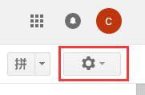

点击“转发和 POP / IMAP 并启用 IMAP 服务”

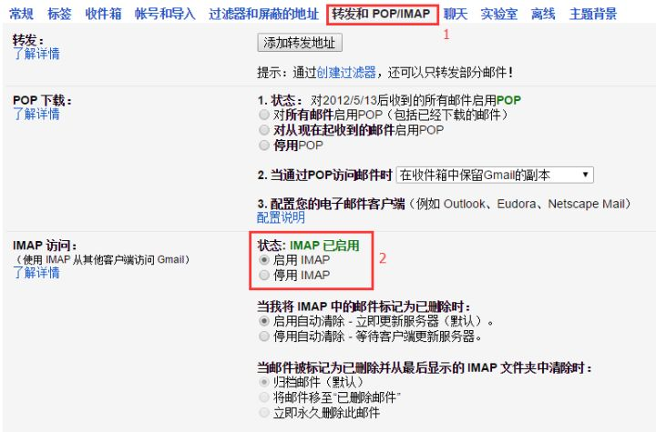

启用两步验证后，进入 google 账户，选择“登录 google”，进入“应用专用密码”子栏。


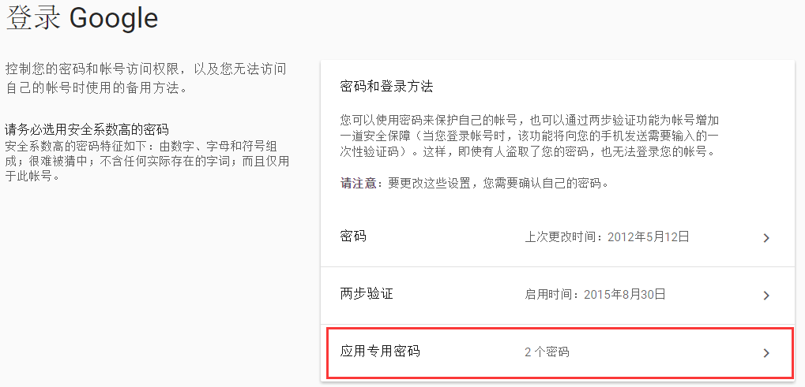

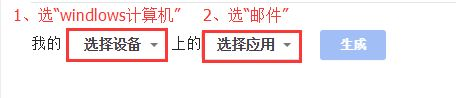

按实际情况选择设备和应用，生成应用专用密码并复制


### 向 Win10 邮件 app 添加 Gmail 账户

点击邮件中的 **其他账户 这一栏**

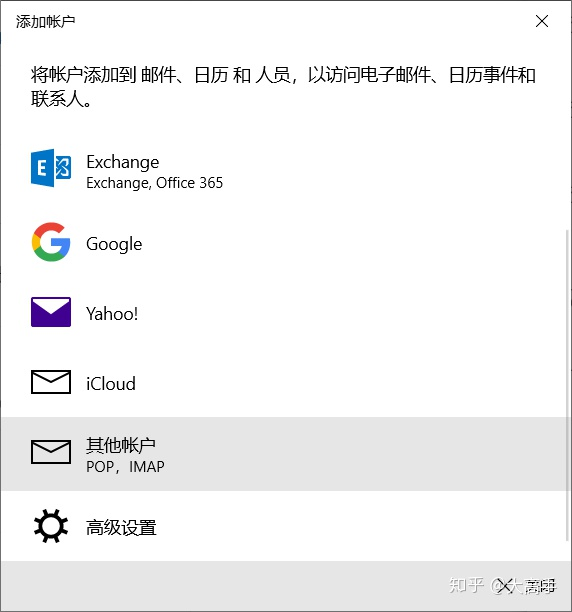

把应用专用密码粘贴进去，保存即可

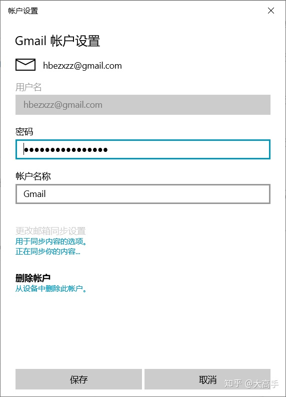

## Windows 为当前用户添加开机自启项

下面是 Windows 当前用户的自启动目录的路径

```sh
C:\Users\{你的用户名}\AppData\Roaming\Microsoft\Windows\Start Menu\Programs\Startup
```

我们可以为想要自启动的程序创建一个快捷方式，然后将快捷方式放到这个目录下就可以啦。

## 利用 Windows 系统评估工具测试硬盘速度

- 以管理员模式输入命令 `winsat disk` 并回车，此时为默认扫描系统盘，一般也就是 `C` 盘。

  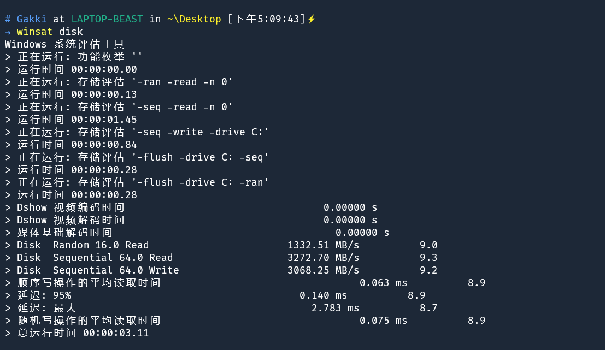

- 输入 **winsat disk** + 参数 **-drive** 盘符,就是扫描指定盘了，例如扫描 `D` 盘：`winsat disk -drive d`

  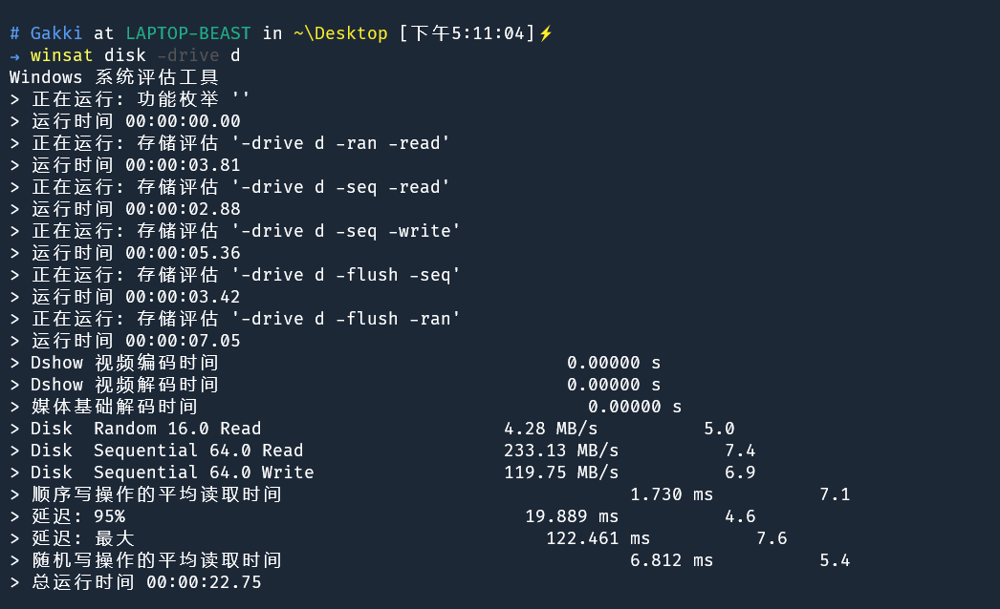

- 更多功能可以输入命令 `winsat -help` 查看。

  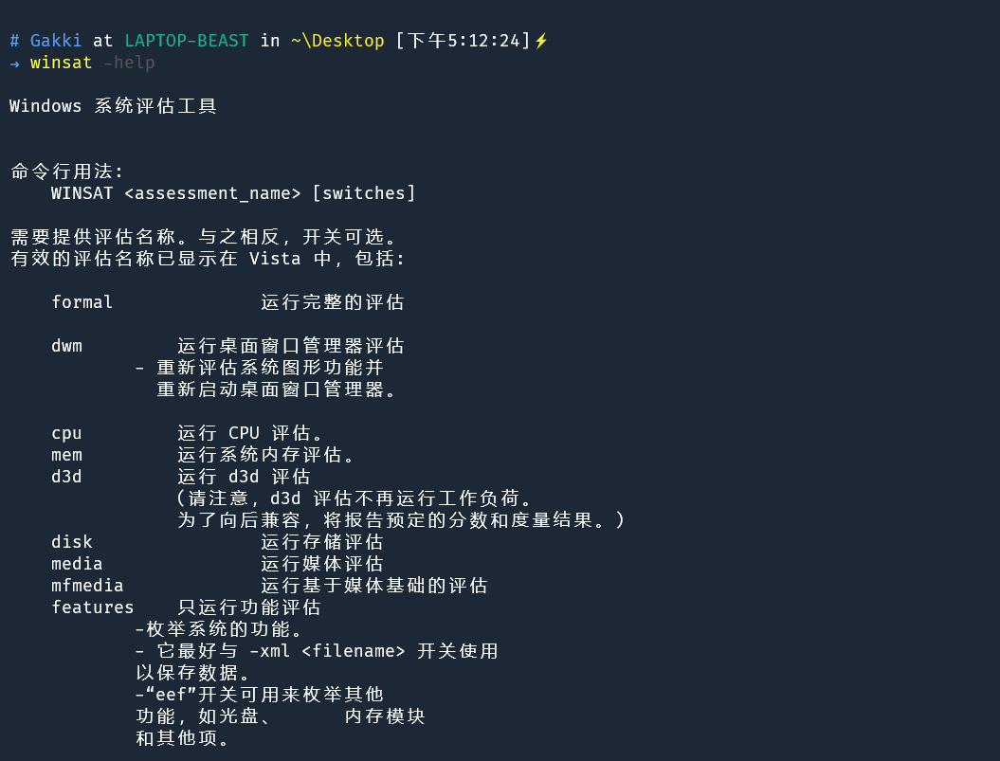

## Windows 10 快速检查修复系统

这个是系统自检命令，用来检查当前系统是否存在问题。

```sh
sfc /SCANNOW
```

如果查出问题的话，我们可以用

```sh
Dism /Online /Cleanup-Image /ScanHealth
```

进行修复，这条命令会扫描系统文件并和官方服务器上文件进行对比，找到问题。

> 为什么会出现系统会和官方不一致的情况：被第三方软件篡改（含优化、安全管理）、系统使用过程中死机造成的文件丢失、下载补丁网络闪断造成文件缺失等，所以呢，扫描出问题是很正常的事情。

如果发现了有问题，想要修复的话，使用

```sh
Dism /Online /Cleanup-Image /CheckHealth
```

就行了，系统会自动联网下载与官方不同的系统文件进行替换，安心等待即可。

要是觉得命令一条一条输入实在是太麻烦了，直接来个终极版的

```sh
DISM /Online /Cleanup-image /RestoreHealth
```

这条命令的作用就是把和官方不同的系统文件直接还原成源文件,简单粗暴。

## 局域网内 Windows / Ipad 传输文件

### Windows 设置共享文件夹

Windows 在 **文件管理器 => 在文件夹上右键 => 属性** 中可以看到共享，接下来，设置该文件夹为共享文件夹，那么 Ipad 便能下载 / 上传文件到该目录中了。

1. 点击共享
2. 选择共享的用户
3. 确认共享

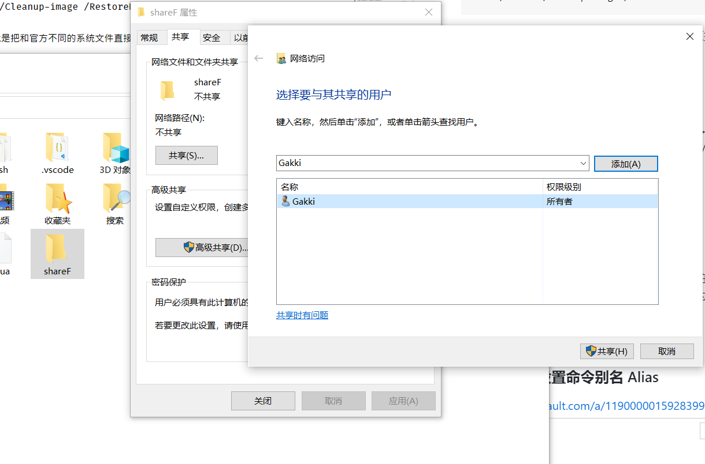

### Ipad 上访问局域网

打开文件 app ，点击左上角三个点，弹出对话框，点击连接服务器，输入主机 IP 、主机用户名、密码即可。

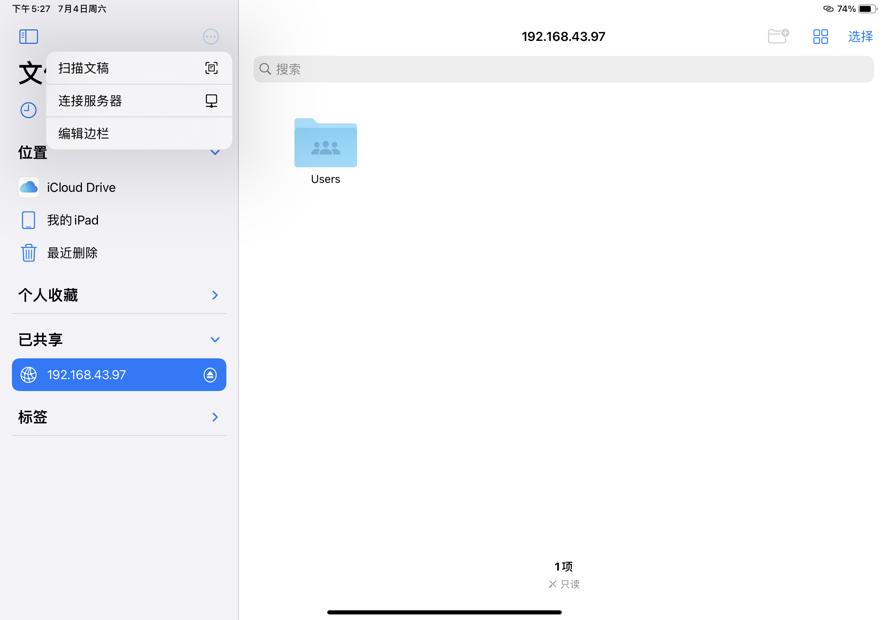


## Windows 软件包管理工具

> WinGet 和 Scoop 在安装软件过程，都是先去各自维护的软件 Manifest 库，寻找相应的软件安装 Manifest 清单文件，这一文件就像说明书一样指导软件包管理工具安装软件的具体过程。WinGet 和 Scoop 等 Windows 包管理工具就会依据软件相应的 Manifest 文件：准备、下载、安装、善后。

### WinGet

#### 安装

在 WinGet 的官方 GitHub 仓库 [Release](https://github.com/microsoft/winget-cli/releases) 页面下，手动下载 WinGet 的安装程序进行手动安装。

#### 仓库

可用应用程序的完整 Manifest 文件列表可以在 GitHub 上面开源的 [microsoft / winget-pkgs](https://github.com/microsoft/winget-pkgs/tree/master/manifests) 仓库找到。

#### 操作和命令

搜索特定软件

```sh
winget search --name wechat  # --name 可省略
```

显示软件详细信息

```sh
winget show wechat
```

安装软件

```sh
winget install wechat --rainbow # --rainbow 进度条花里胡哨
```

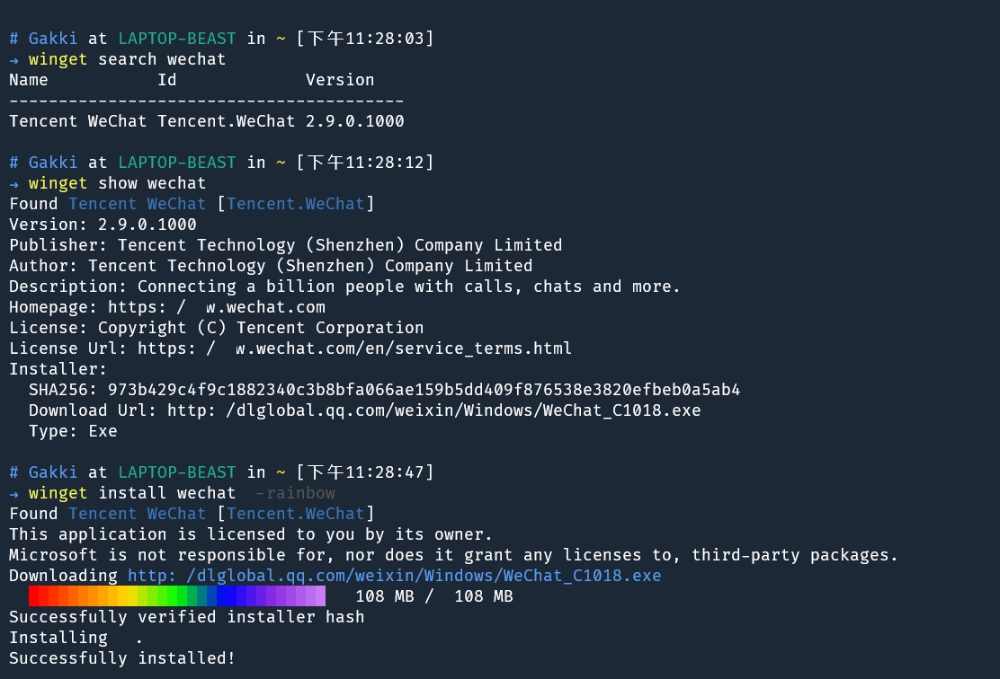

基本信息

安装的是 exe 文件，安装后在桌面自动创建快捷方式，默认的安装路径是在 C 盘的 Program Flies(x86) 里面，当然安装位置在安装时可以添加命令修改，目前 winget 还不支持卸载文件。

常用命令

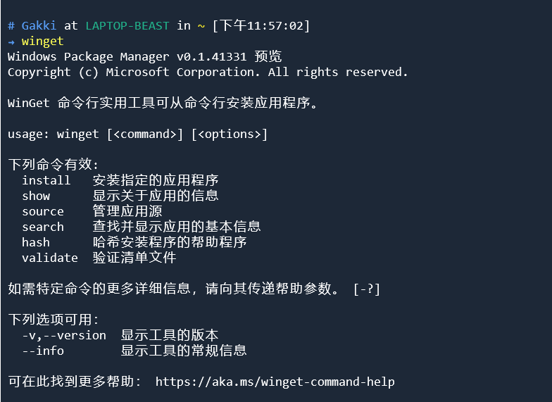

**PS:** WinGet 提供了一个 source 的命令，利用 winget source <command>，我们就可以方便地管理不同的 WinGet 软件 Manifest 仓库，比如：

- winget source add <软件源>：添加新的软件源
- winget source list：列出当前已添加的软件源
- winget source update：更新当前全部添加的软件源
- winget source remove：移除当前使用的软件源 ……

当然，由于 WinGet 还处于预览版，所以还没有出现除了官方仓库外可用的软件仓库。

#### 官方文档

https://docs.microsoft.com/zh-cn/windows/package-manager/

### Scoop

> 安装前，强烈建议将自己手动配的环境变量清除，比如 $HOME，$PYTHONPATH 等，既然选择试用 scoop，那就用 scoop 自己处理环境变量，否则可能会与其他软件冲突。

#### 安装 Scoop

```sh
Invoke-Expression (New-Object System.Net.WebClient).DownloadString('https://get.scoop.sh')

# or shorter
iwr -useb get.scoop.sh | iex
```

#### 帮助文档

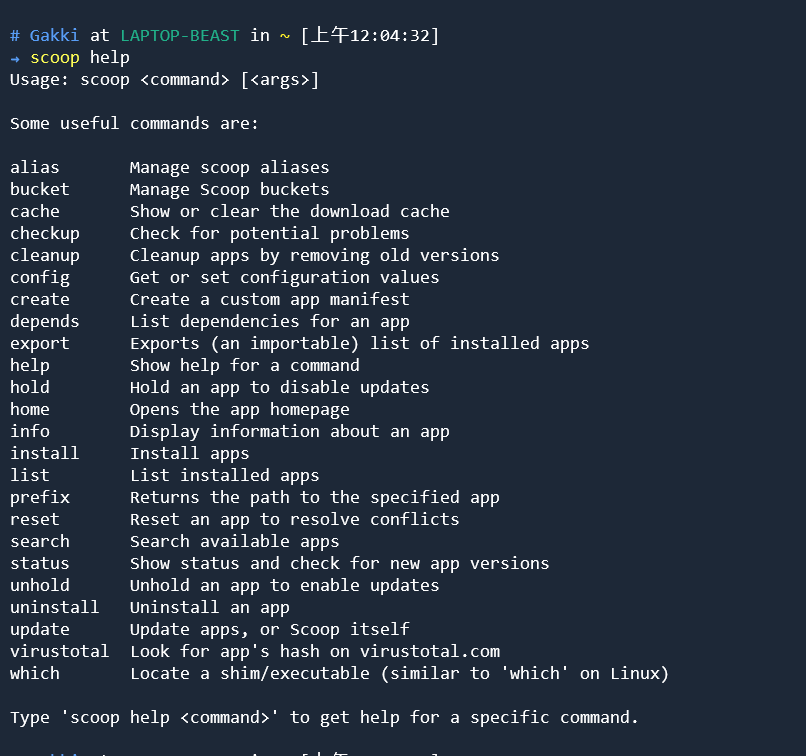

#### 自定义软件安装的位置

自定义 Scoop 安装软件的位置，需要指定 \$SCOOP 环境变量，在 powershell 里可以用几条命令完成。

```sh
$env:SCOOP='D:\Applications\Scoop'
[Environment]::SetEnvironmentVariable('SCOOP', $env:SCOOP, 'User')
```

#### 代理

由于某些程序网站的网络环境的问题，如果有代理可以配置一下代理

```sh
scoop config proxy [username:password@]host:port
```

这会将相关配置写入 Scoop 的配置文件，一般在 \$HOME/.config/scoop/config.json 里配置。

#### aria2 多线程下载

aria2 多线程下载替换默认下载方式：`scoop install aria2`

#### 添加仓库

Scoop 自带的 main bucket 软件过少，我们需要添加常用仓库 extras bucket：

```sh
 scoop bucket add extras
```

以及

```sh
scoop bucket add Ash258 'https://github.com/Ash258/scoop-Ash258.git'
```

前者是官方的，后者是个人维护的，有许多有用的但无法进入官方标准的软件，比如 potplayer

社区提供的可用源列表 github 地址如下：https://github.com/lukesampson/scoop/blob/master/buckets.json

其他原团队或者个人维护的资源库列表参考地址：[scoop-directory](https://rasa.github.io/scoop-directory/)

#### 常用操作和命令

|   命令    |     动作     |
| :-------: | :----------: |
| 🌟search  |  搜索软件名  |
|   info    | 查看软件详情 |
|   home    | 打开软件主页 |
| 🌟install |   安装软件   |
| 🌟status  | 查看软件状态 |
|  update   |   更新软件   |
| uninstall |   卸载软件   |

#### 备份

Scoop 有一个功能可以导出所安装的软件至文本文件，但目前我还没找到如何导入…… 幸运的是，有一款叫[scoop-backup](https://github.com/KNOXDEV/scoop-backup) 的软件可以把当前所安装的软件都导出成一个 .ps1 文件或者 .bat 文件。双击该文件可以恢复整个 Scoop 软件列表。不过 persist 文件夹的设置文件目前还需要手动拷贝粘贴。

#### 基本信息

Scoop 在你的用户根目录（一般是 C:\Users\用户名）下创建了一个名为 scoop 的文件夹，并默认将软件下载安装到这个文件夹下

Scoop 将软件安装到一个相对隔离的环境下（Each program you install is isolated and independent），从而保证环境的统一和路径不被污染

scoop 是通过 shim 来软链接一些应用，这样的设计让应用之间不会互相干扰，十分方便。

进阶命令和使用方法可以参考 [Github](https://github.com/lukesampson/scoop)，[Wiki](https://github.com/lukesampson/scoop/wiki)。

#### 小技巧

强制安装，像 vscode-portable-nightly 这种 nightly 的软件如果有更新，其指向的链接通常没有变化，但 Scoop 无法检测到的时候可以通过 `scoop update vscode-portable-nightly -kf` 来强制更新。

Scoop 路径下 \$SCOOP\persist 是持续存在的目录，通常用来放配置文件，即使软件更新也可以保持老的配置。但有时你想完全重装某个软件的时候，就需要删除该目录下对应的软件文件夹，以达到完全重装的目的。

## 快速保存图片 && 放大镜 && 图片批量编号

当在网上看到喜欢的图片，不需要再右键另存了，直接拖拽到要存放的位置即可！

.gif>)

使用 Win + "+"，快速打开系统自带的放大镜，继续 Win + "+"，可以对屏幕进行放大，而 Win+ "-"，则可以对屏幕进行缩小。

.gif>)

当对文件夹中的图片进行批量编号时，系统就会自动将所有图片重命名为 “ 新名称 +（数字编号）” 的格式。

.gif>)

## Powershell 对文件批量重命名

### 单个文件重命名

需求：將 C:\Users\Gakki\Pictures\Saved Pictures 文件夾下的 test.jpg 文件重命名为 TEST.jpg

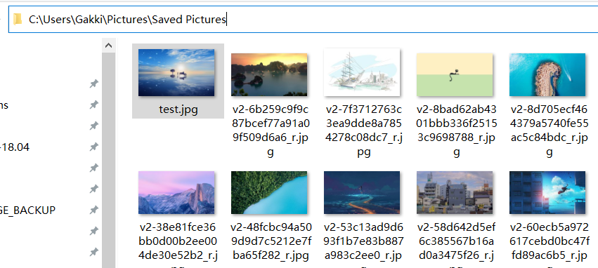

```sh
Rename-Item 'C:\Users\Gakki\Pictures\Saved Pictures\test.jpg' -NewName 'TEST.jpg'
```

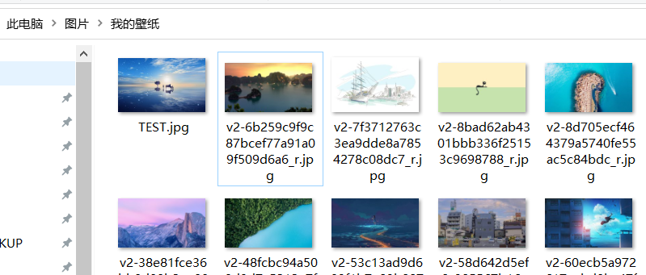

### 批量改文件扩展名

需求：將 C:\Users\Gakki\Pictures\TEST 文件夾下的所有的 png 文件改为 jpg 文件，即 .png 改为 .jpg

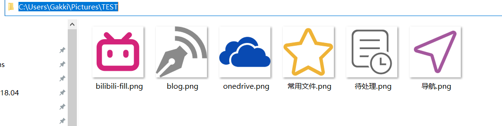

```sh
get-childItem 'C:\Users\Gakki\Pictures\TEST' *.png | rename-item -newname { $_.name -replace '\.png','.jpg' }
```

PS：由于 replace 的模式匹配字符串参数支持正则，'.png' 要转义成 '\.png' 。

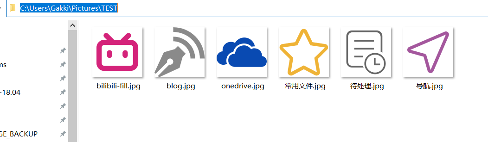

### 批量为文件加前缀

需求：將 C:\Users\Gakki\Pictures\Saved Pictures 文件夾下的所有的 jpg 文件加上一个 "Test\_" 的前缀

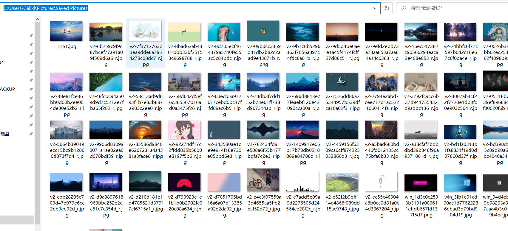

```sh
get-childItem 'C:\Users\Gakki\Pictures\Saved Pictures' -r *.jpg | rename-Item -newname { 'Test_'+ $_.name }
```

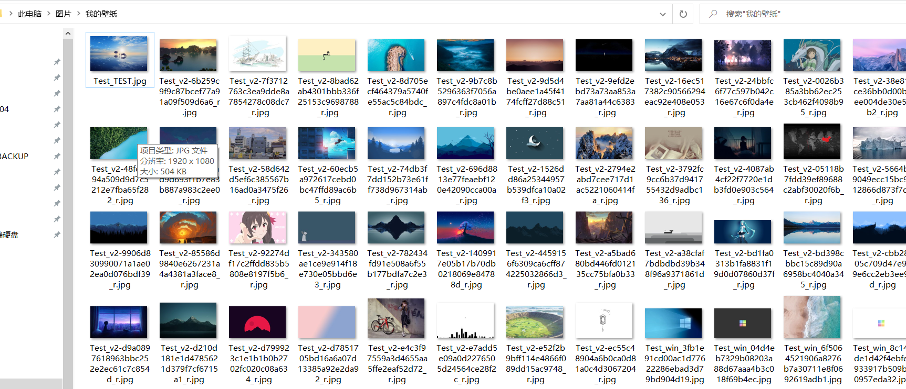

### 批量重命名并编号

需求：將 C:\Users\Gakki\Pictures\Saved Pictures 文件夾下的所有的 jpg 文件重命名为 win_wallpaper_1.jpg、win_wallpaper_2.jpg 这样的形式

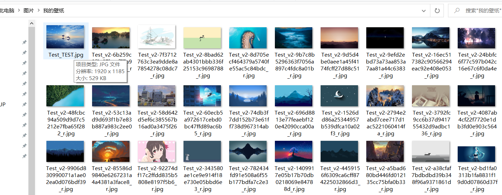

```sh
get-childItem 'C:\Users\Gakki\Pictures\Saved Pictures' -r *.jpg | foreach-Object -Begin { $count = 1 } -Process { rename-Item $_.fullname -NewName "win_wallpaper_$count.jpg"; $count++ }
```


