<!-- # [专有钉钉前端面试指南](https://juejin.cn/post/6986436944913924103?utm_source=gold_browser_extension#heading-16) -->
<!-- no, it means I have the memory of a human being -->
<!-- 一个问题不好解决时，计算机科学家会选择在上面套一层 -->
<!-- 为什么 Java 和 JS 等语言需要 VM，不能直接操作内存堆栈空间？ -->
<!-- 因为js有个不成文的规定: 在期望字符串的地方一定会转换成字符串。s -->

# 知识图谱<!-- omit in toc -->

- [基础](#基础)
  - [什么是解释型语言？](#什么是解释型语言)
  - [V8 是如何执行 JavaScript 代码的？](#v8-是如何执行-javascript-代码的)
    - [`Parser` 生成抽象语法树](#parser-生成抽象语法树)
    - [解释器(Ignition)如何将 `AST` 翻译为字节码并执行？](#解释器ignition如何将-ast-翻译为字节码并执行)
    - [执行代码及优化](#执行代码及优化)
      - [內联算法](#內联算法)
      - [逃逸分析](#逃逸分析)
    - [JIT 编译](#jit-编译)
    - [那么变量提升呢?](#那么变量提升呢)
    - [总结](#总结)
  - [V8 引擎的垃圾回收](#v8-引擎的垃圾回收)
    - [JavaScript 的内存管理](#javascript-的内存管理)
    - [为什么需要垃圾回收](#为什么需要垃圾回收)
    - [V8 内存限制](#v8-内存限制)
    - [V8 垃圾回收算法](#v8-垃圾回收算法)
      - [新生代垃圾回收器 - Scavenge](#新生代垃圾回收器---scavenge)
      - [老生代垃圾回收 - Mark-Sweep & Mark-Compact](#老生代垃圾回收---mark-sweep--mark-compact)
        - [Mark-Sweep](#mark-sweep)
        - [Mark-Compact](#mark-compact)
        - [全停顿 Stop-The-World](#全停顿-stop-the-world)
      - [优化 Orinoco](#优化-orinoco)
        - [增量标记 - Incremental marking](#增量标记---incremental-marking)
        - [懒性清理 - Lazy sweeping](#懒性清理---lazy-sweeping)
        - [并发 - Concurrent](#并发---concurrent)
        - [并行 - Parallel](#并行---parallel)
      - [V8 当前垃圾回收机制](#v8-当前垃圾回收机制)
        - [副垃圾回收器](#副垃圾回收器)
        - [主垃圾回收器](#主垃圾回收器)
  - [JS 中的內存泄露](#js-中的內存泄露)
    - [JS 中的弱引用](#js-中的弱引用)
      - [WeakMap](#weakmap)
      - [WeakRef](#weakref)
    - [关于 JS 闭包是否真的会造成内存泄漏？](#关于-js-闭包是否真的会造成内存泄漏)
  - [`Babel` 的编译过程？](#babel-的编译过程)
  - [`JavaScript` 中的数组在内存中是如何存储的？](#javascript-中的数组在内存中是如何存储的)
    - [什么是数组](#什么是数组)
    - [JavaScript 中的数组](#javascript-中的数组)
    - [从 V8 源码上看数组的实现](#从-v8-源码上看数组的实现)
      - [快数组（Fast Elements）](#快数组fast-elements)
      - [慢数组（Dictionary Elements）](#慢数组dictionary-elements)
      - [快数组慢数组之间的转换](#快数组慢数组之间的转换)
      - [各有优劣](#各有优劣)
    - [扩展：ArrayBuffer](#扩展arraybuffer)
  - [浏览器和 `Node` 中的事件循环机制有什么区别？](#浏览器和-node-中的事件循环机制有什么区别)
    - [浏览器](#浏览器)
    - [Node](#node)
  - [`ES6 Modules` 相对于 `CommonJS` 的优势是什么？](#es6-modules-相对于-commonjs-的优势是什么)
  - [什么是沙箱？浏览器的沙箱有什么作用？](#什么是沙箱浏览器的沙箱有什么作用)
  - [发布 / 订阅模式和观察者模式的区别是什么？](#发布--订阅模式和观察者模式的区别是什么)
  - [装饰器模式一般会在什么场合使用？](#装饰器模式一般会在什么场合使用)
  - [什么是函数式编程？什么是响应式编程？什么是函数响应式编程？](#什么是函数式编程什么是响应式编程什么是函数响应式编程)
- [语法](#语法)
- [框架](#框架)
- [工程](#工程)
- [网络](#网络)
- [性能](#性能)
- [插件](#插件)
- [系统](#系统)
- [后端](#后端)

## 基础

### 什么是解释型语言？

语言是用来写代码的，代码是给人看的。

计算机只看得懂程序（`01010101`），看不懂代码。

把代码变成程序有两个常用的方法：

1. 把所有的代码变成程序，再执行。
   **即，先编译再执行**。
2. 把一丢丢代码变成一丢丢程序执行，然后再把一丢丢代码变成一丢丢程序执行，...。
   **即，边解释边执行**。

谁来编译？谁来解释？谁来执行？

- **编译型**：编译器来编译，系统执行。
- **解释型**：解释器解释并执行。

举个例子 🌰：

你女网友只懂中文（源代码），你只懂英文（机器码/CPU 指令），现在你俩要搞对象，怎么办？

女网友写下了自己的：`要求.py`:

```py
二号男嘉宾
我要吃好的
我要穿好的
我要住好的
我不会做饭
我不会家务
我脾气不好
```

由于你们语言不通，直接是无法交流的，所以必须要有一个翻译官（python 解释器）

1. `python` 解释器的执行流程：

```py
二号男嘉宾 => SLOT #2
我要吃好的 => FOOD +10W
我要穿好的 => DRESS + 10W
我要住好的 => HOUSE + 100W
我不会做饭 => ELEME + 7W
我不会家务 => BABYSITTER + 3W
我脾气不好 => PSYCHOLOGIST + 10W
```

翻译官将中文翻译成了你能懂的英文（CPU 指令），这是你的执行流程：

```py
SLOT #2 => ACK
FOOD +10W => +10W
DRESS + 10W => +10W
HOUSE + 100W => +100W
ELEME + 7W => +7W
BABYSITTER + 3W => +3W
PSYCHOLOGIST + 10W => +10W
```

**每接到一次指令，你就去 `ATM` 取一次钱，一共需要取 `6` 次钱；**

然后你将继续等待对方开出的条件，进入 `Idle` 状态，直到翻译将新的指令给你，直到条件开完毕，而你又能一直从 `ATM` 里面取出钱来，然后你们就幸福的在一起了。

2. `JIT` 优化。

你应该看出来了，`Python` 解释器（翻译官）每次传递一行指令，但要求其实都差不多，所以 `JIT` 这时候就派上用场了，**第一次的过程其实是一样的**，但是你的女网友发现你没有回复她的时候，又说了一遍，还说了第三遍，这个时候如果有 `JIT`（比如 `Pypy`），那么从第二次开始，翻译官给你的就不再是一行一行的指令了，而是：

```py
+10W + 10W + 100W + 7W + 3W + 10W
```

**这时候，你只需要去一次 `ATM`，一次性取出需要的这些钱，你们就能幸福的在一起了。**

3. 什么是跨平台呢？

跨平台其实就是 `CPU` 的指令集不太一样，你让懂 `ARM` 的翻译官来翻译给 `Power 7` 听，无论如何都听不懂的，比如你去 `ATM` 里面取钱这个指令翻译成不同 `CPU` 指令就是不一样的：

- `x86`：神昏证，应喊卡，本人，余额足够
- `power7`： 爹，我，钱，`140W`
- `A11`： 秦始皇，封侯，打钱
- `ARM`：果照，`30%` 利率，无敌呀饭款，`30` 秒到站

只要有对应的解释器，你总是能取到钱

4. 顺提一下编译型：

就是翻译官（此处应该叫编译官）把 **你女网友的** `要求.py` 直接重新找了一张 `A4` 纸，上面写着：

```py
$$
```

这样每次你女网友拿着这张纸到`x86`窗口的`ATM`直接就能办理了，**注意，仅此窗口，别家店不可以用的**，咦，好像少了什么人？也是，如果都能直接跟`ATM`沟通了，谁还需要男盆友呢？

5. 性能

因为解释型语言在编译的时候只是编译成了字节码，运行的时候，还需要解释器挨个把字节码翻译成机器语言才能执行。

相当于你写的程序，每次都要先“编译”，再运行，运行速度必然比只需要运行不需要编译的编译型语言慢。

`JavaScript` 是一种动态类型语言，在编译时并不能准确知道变量的类型，只可以在运行时确定，这就不像 `c++`或者 `java` 等静态类型语言，在编译时候就可以确切知道变量的类型。然而，在运行时计算和决定类型，会严重影响语言性能，这也就是 `JavaScript` 运行效率比 `C++`或者 `JAVA` 低很多的原因之一。

> 例子来源：[什么是解释型语言？](https://www.zhihu.com/question/268303059)

### V8 是如何执行 JavaScript 代码的？

`V8` 执行 `JS` 代码的整体流程如下图所示：

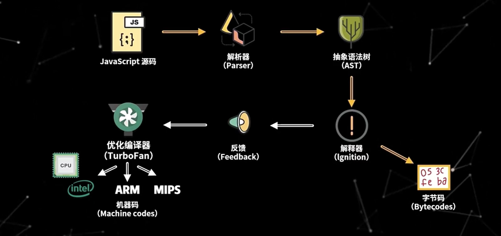

在这个过程中，`V8` 同时使用了 `Parser`（解析器）、`Ignition`（解释器） 和 `TurboFan`（编译器） 来执行 `JS` 代码

#### `Parser` 生成抽象语法树

在 `Chrome` 中开始下载 `Javascript` 文件后，`Parser` 就会**开始并行在单独的线程上解析代码**。这意味着解析可以在下载完成后仅几毫秒内完成，并生成 `AST`。

> TIPS：解析过程中，对于不是立即执行的函数，只进行预解析（Pre Parser）只有当函数调用时才对函数进行全量解析。


此外，`AST` 还广泛应用于各类项目中，比如 `Babel`、`ESLint`，那么 `AST` 的生成过程是怎么样的呢？

1. **词法分析**（lexical analysis）：主要是将字符流（`char stream`） 转换成标记流（`token stream`），字符流就是我们一行一行的代码，`token` 是指语法上不能再分的、最小的单个字符或者字符串。

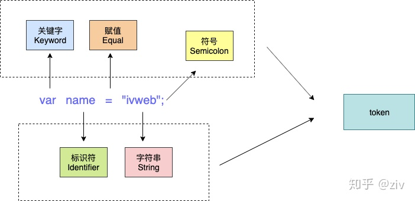

```js
var name = 'ivweb'[
  //转成token后为

  ({
    type: 'Keyword',
    value: 'var'
  },
  {
    type: 'Identifier',
    value: 'name'
  },
  {
    type: 'Punctuator',
    value: '='
  },
  {
    type: 'String',
    value: '"ivweb"'
  },
  {
    type: 'Punctuator',
    value: ';'
  })
]
```

从上面可以看出，`var name = "ivweb";` 这样一段代码，会有关键字 `"var"`、标识符 `"name"`、赋值运算符 `"="`、字符串 `"ivweb"`、分隔符 `";"`，共 `5` 个 `token`。

2. **语法分析**：将前面生成的 `token` 流根据语法规则，形成一个有元素层级嵌套的语法规则树，这个树就是 `AST`。在此过程中，如果源代码不符合语法规则，则会终止，并抛出“语法错误”。

#### 解释器(Ignition)如何将 `AST` 翻译为字节码并执行？

- 字节码是机器码的抽象，可以看作是小型的构建块，这些构建块组合到一起构成任何 `JavaScript` 功能。

- 字节码比机器码占用更小的内存，这也是为什么 `V8` 使用字节码的一个很重要的原因。

- 字节码不能够直接在处理器上运行，需要通过解释器将其转换为机器码后才能执行。

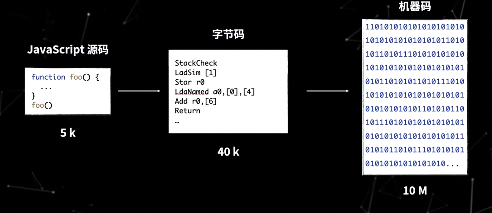

举个例子 🌰：

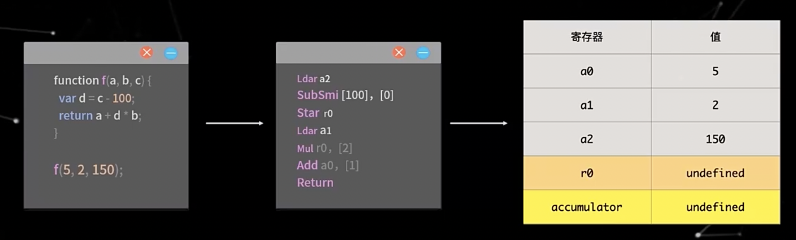

#### 执行代码及优化

##### 內联算法

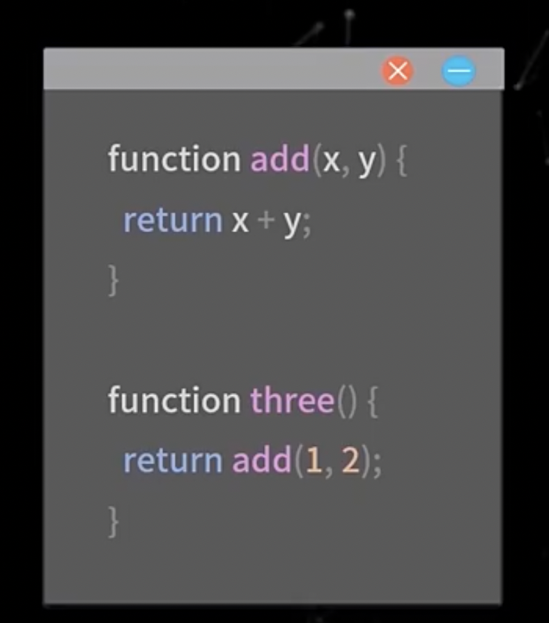

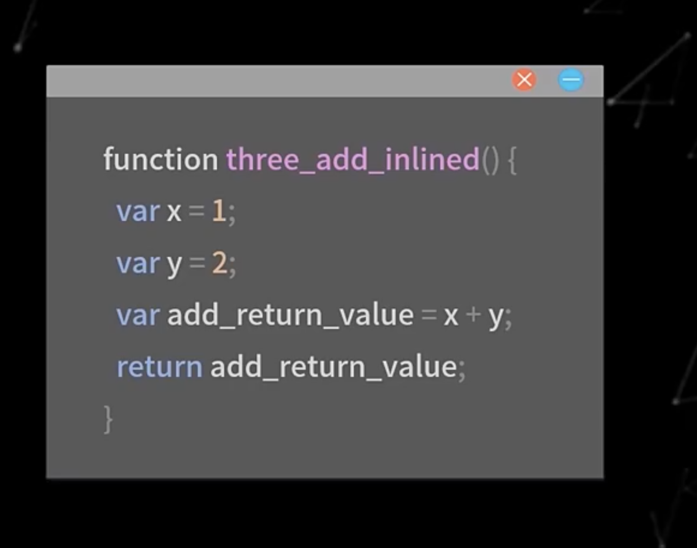

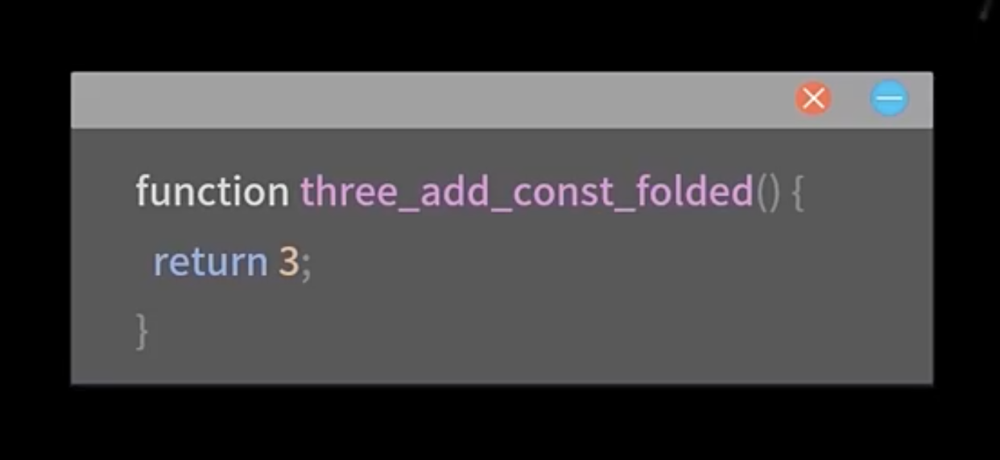

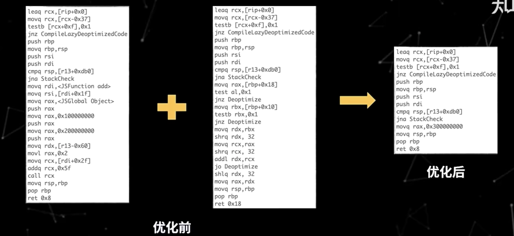

通过內联可以降低复杂度、消除冗余代码、合并常量，內联技术通常也是逃逸分析的基础。

##### 逃逸分析

> 分析对象的生命周期是否仅限于当前函数


逃逸分析的好处是，直接将变量加载到寄存器上，不再需要从内存中访问对象属性，还减少了内存占用。

#### JIT 编译

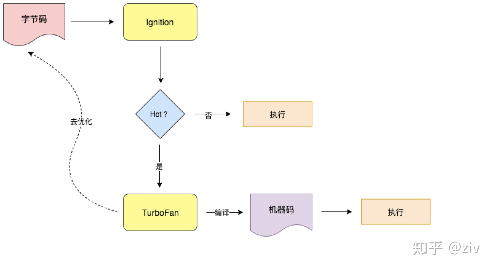

`Ignition` 执行上一步生成的字节码，并记录代码运行的次数等信息，如果同一段代码执行了很多次，就会被标记为 `“HotSpot”`（热点代码）。

然后把这段代码发送给编译器 `TurboFan`，然后 `TurboFan` 把它编译为更高效的机器码储存起来，等到下次再执行到这段代码时，就会用现在的机器码替换原来的字节码进行执行，这样大大提升了代码的执行效率。

另外，当 `TurboFan` 判断一段代码不再为热点代码的时候，会执行去优化的过程，把优化的机器码丢掉，然后执行过程回到 `Ignition`。

#### 那么变量提升呢?

下面是 `JavaScript` 处理声明语句的过程：

1. 一旦 `V8` 引擎进入一个执行具体代码的执行上下文（函数），它就对代码进行词法分析或者分词。这意味着代码将被分割成像`foo = 10`这样的原子符号（atomic token）。

2. 在对当前的整个作用域分析完成后，引擎将 `token` 解析翻译成一个`AST`（抽象语法树）。
   引擎每次遇到声明语句，就会把声明传到作用域（scope）中创建一个绑定。每次声明都会为变量分配内存。只是分配内存，并不会修改源代码将变量声明语句提升。正如你所知道的，在`JS`中分配内存意味着将变量默认设为`undefined`。

3. 在这之后，引擎每一次遇到赋值或者取值，都会通过作用域（scope）查找绑定。如果在当前作用域中没有查找到就接着向上级作用域查找直到找到为止。

4. 接着引擎生成 `CPU` 可以执行的机器码。
   最后，代码执行完毕。

所以变量提升不过是执行上下文的小把戏。在执行任何语句之前，解释器就要从创建执行上下文后已经存在的作用域（scope）中找到变量的值。

#### 总结

那么结合上面对于 `V8` 引擎的介绍，我们在编程中应注意：

- **类型**。对于函数，`JavaScript` 是一种动态类型语言，`JavaScriptCore` 和 `V8` 都使用隐藏类和内嵌缓存来提高性能，为了保证缓存命中率，**一个函数应该使用较少的数据类型**；对于数组，应尽量存放相同类型的数据，这样就可以通过偏移位置来访问。
- **数据表示**。简单类型数据（如整型）直接保存在句柄中，可以减少寻址时间和内存占用，如果可以使用整数表示的，尽量不要用浮点类型。
- **内存**。虽然 `JavaScript` 语言会自己进行垃圾回收，但我们也应尽量做到及时回收不用的内存，对不再使用的对象设置为 `null` 或使用 `delete` 方法来删除(使用 `delete` 方法删除会触发隐藏类新建，需要更多的额外操作)。
- **优化回滚**。在执行多次之后，不要出现修改对象类型的语句，尽量不要触发优化回滚，否则会大幅度降低代码的性能。
- **新机制**。使用 `JavaScript` 引擎或者渲染引擎提供的新机制和新接口提高性能。

知识拓展：[认识 V8 引擎](https://zhuanlan.zhihu.com/p/27628685)

### V8 引擎的垃圾回收

#### JavaScript 的内存管理

不管什么程序语言，内存生命周期基本是一致的：

1. 分配你所需要的内存
2. 使用分配到的内存（读、写）
3. 不需要时将其释放归还

与其他需要手动管理内存的语言不通，在 `JavaScript` 中，当我们创建变量（对象，字符串等）的时候，系统会自动给对象分配对应的内存。

```js
const age = 28 // 给数值变量分配内存
const str = 'chu' // 给字符串分配内存

const o = {
  a: 1,
  b: null
} // 给对象及其包含的值分配内存

// 给数组及其包含的值分配内存（就像对象一样）
const a = [1, null, 'chu']

function f(a) {
  return a + 2
} // 给函数（可调用的对象）分配内存

// 函数表达式也能分配一个对象
someElement.addEventListener(
  'click',
  function () {
    someElement.style.backgroundColor = 'blue'
  },
  false
)
```

**当系统发现这些变量不再被使用的时候，会自动释放（垃圾回收）这些变量的内存，开发者不用过多的关心内存问题。**

#### 为什么需要垃圾回收

在 `JavaScript` 中，数据类型分为两类，简单类型和引用类型，对于简单类型，内存是保存在栈（stack）空间中，复杂数据类型，内存是保存在堆（heap）空间中。

- **基本类型**：这些类型在内存中分别占有固定大小的空间，他们的值保存在栈空间，我们通过按值来访问的
- **引用类型**：引用类型，值大小不固定，栈内存中存放地址指向堆内存中的对象。是按引用访问的。

> 对于栈的内存空间，只保存简单数据类型的内存，由操作系统自动分配和自动释放。而堆空间中的内存，由于大小不固定，系统无法无法进行自动释放，这个时候就需要 `JS` 引擎来手动的释放这些内存。

#### V8 内存限制

在 `Chrome `中，`v8` 被限制了内存的使用（64 位约 `1.4G/1464MB` ， 32 位约 `0.7G/732MB`），为什么要限制呢？

1. 表层原因是，`V8` 最初为浏览器而设计，不太可能遇到用大量内存的场景
2. 深层原因是，`V8` 的垃圾回收机制的限制（如果**清理大量的内存垃圾是很耗时间，这样会引起 `JavaScript` 线程暂停执行的时间**，那么性能和应用直线下降）

#### V8 垃圾回收算法

> TIPS: `64` 位新生代的空间为 `64MB`,老生代为 `1400MB` > `32` 位新生代的空间为 `32MB`,老生代为 `700MB`
> 最新版的 `node(v14)`的内存为 `2 GB`

在 `JavaScript` 中，其实绝大多数的对象存活周期都很短，大部分在经过一次的垃圾回收之后，内存就会被释放掉，而少部分的对象存活周期将会很长，一直是活跃的对象，不需要被回收。为了提高回收效率，`V8` 将堆分为两类新生代和老生代，新生代中存放的是生存时间短的对象，老生代中存放的生存时间久的对象。

##### 新生代垃圾回收器 - Scavenge

在 `JavaScript` 中，任何对象的声明分配到的内存，将会先被放置在新生代中，而因为大部分对象在内存中存活的周期很短，所以需要一个效率非常高的算法。在新生代中，主要使用 `Scavenge` 算法进行垃圾回收，`Scavenge` 算法是一个典型的**牺牲空间换取时间**的复制算法，在占用空间不大的场景上非常适用。

`Scavenge` 算法将新生代堆分为两部分，分别叫 `from-space` 和 `to-space`，工作方式也很简单，就是将 `from-space` 中存活的活动对象复制到 `to-space` 中，并将这些对象的内存有序的排列起来，然后将 `from-space` 中的非活动对象的内存进行释放，完成之后，将 `from space` 和 `to space` 进行互换，这样可以使得新生代中的这两块区域可以重复利用。

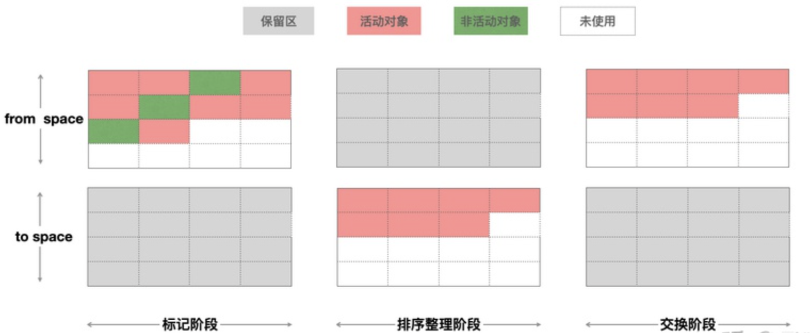

简单的描述就是：

1. 标记活动对象和非活动对象
2. 复制 `from space` 的活动对象到 `to space` 并对其进行排序
3. 释放 `from space` 中的非活动对象的内存
4. 将 `from space` 和 `to space` 角色互换

那么，垃圾回收器是怎么知道哪些对象是活动对象和非活动对象的呢？

有一个概念叫对象的可达性，表示从初始的根对象（window，global）的指针开始，这个根指针对象被称为根集（root set），从这个根集向下搜索其子节点，被搜索到的子节点说明该节点的引用对象可达，并为其留下标记，然后递归这个搜索的过程，直到所有子节点都被遍历结束，那么没有被标记的对象节点，说明该对象没有被任何地方引用，可以证明这是一个需要被释放内存的对象，可以被垃圾回收器回收。

新生代中的对象什么时候变成老生代的对象呢？

在新生代中，还进一步进行了细分，分为 `nursery` 子代和 `intermediate` 子代两个区域，一个对象第一次分配内存时会被分配到新生代中的 `nursery` 子代，如果进过下一次垃圾回收这个对象还存在新生代中，这时候我们移动到 `intermediate` 子代，再经过下一次垃圾回收，如果这个对象还在新生代中，副垃圾回收器会将该对象移动到老生代中，这个移动的过程被称为晋升。

##### 老生代垃圾回收 - Mark-Sweep & Mark-Compact

新生代空间中的对象满足一定条件后，晋升到老生代空间中，在老生代空间中的对象都已经至少经历过一次或者多次的回收所以它们的存活概率会更大，如果这个时候再使用 `scavenge` 算法的话，会出现两个问题：

- `scavenge` 为复制算法，重复复制活动对象会使得效率低下
- `scavenge` 是牺牲空间来换取时间效率的算法，而老生代支持的容量交大，会出现空间资源浪费问题

所以在老生代空间中采用了 `Mark-Sweep`（标记清除） 和 `Mark-Compact`（标记整理） 算法。

###### Mark-Sweep

`Mark-Sweep` 处理时分为两阶段，标记阶段和清理阶段，看起来与 `Scavenge` 类似，不同的是，`Scavenge` 算法是复制活动对象，而由于在老生代中活动对象占大多数，所以 `Mark-Sweep` 在标记了活动对象和非活动对象之后，直接把非活动对象清除。

- 标记阶段：对老生代进行第一次扫描，标记活动对象
- 清理阶段：对老生代进行第二次扫描，清除未被标记的对象，即清理非活动对象


看似一切 `perfect`，但是还遗留一个问题，被清除的对象遍布于各内存地址，产生很多内存碎片。

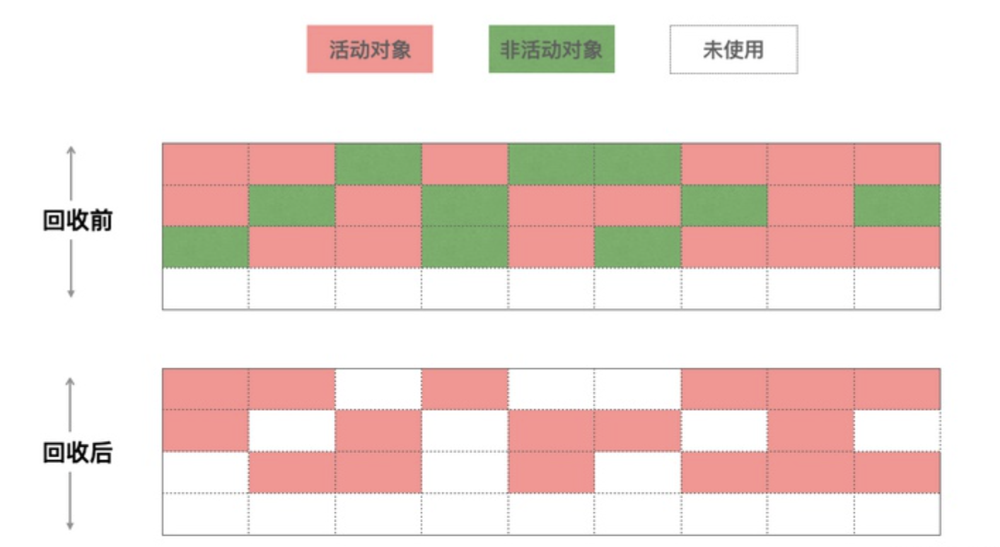

###### Mark-Compact

由于 `Mark-Sweep` 完成之后，老生代的内存中产生了很多内存碎片，若不清理这些内存碎片，如果出现需要分配一个大对象的时候，这时所有的碎片空间都完全无法完成分配，就会提前触发垃圾回收，而这次回收其实不是必要的。

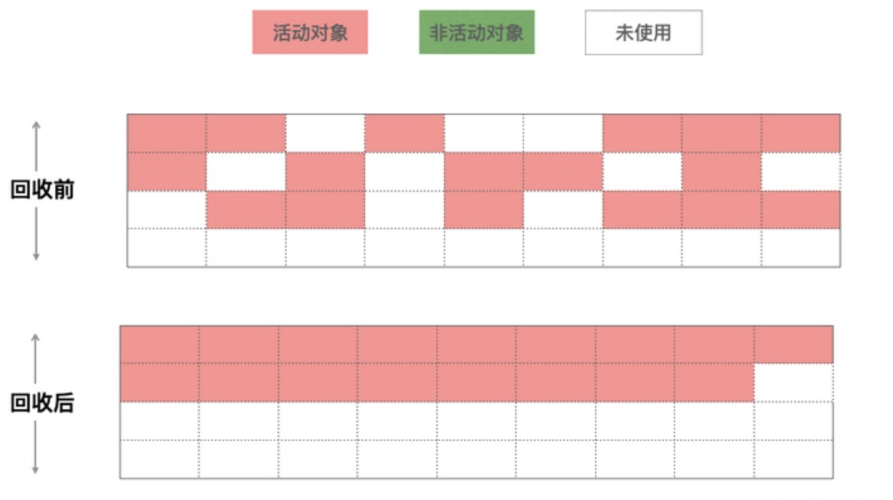

为了解决内存碎片问题，`Mark-Compact` 被提出，它是在是在 `Mark-Sweep` 的基础上演进而来的，相比 `Mark-Sweep`，`Mark-Compact` 添加了活动对象整理阶段，将所有的活动对象往一端移动，移动完成后，直接清理掉边界外的内存。


###### 全停顿 Stop-The-World

由于垃圾回收是在 `JS` 引擎中进行的，而 `Mark-Compact` 算法在执行过程中需要移动对象，而当活动对象较多的时候，它的执行速度不可能很快，为了避免 `JavaScript` 应用逻辑和垃圾回收器的内存资源竞争导致的不一致性问题，垃圾回收器会将 JavaScript 应用暂停，这个过程，被称为全停顿（stop-the-world）。

在新生代中，由于空间小、存活对象较少、`Scavenge` 算法执行效率较快，所以全停顿的影响并不大。而老生代中就不一样，如果老生代中的活动对象较多，垃圾回收器就会暂停主线程较长的时间，使得页面变得卡顿。

##### 优化 Orinoco

`orinoco` 为 `V8` 的垃圾回收器的项目代号，为了提升用户体验，解决全停顿问题，它利用了**增量标记**、**懒性清理**、**并发**、**并行**来降低主线程挂起的时间。

###### 增量标记 - Incremental marking

为了降低全堆垃圾回收的停顿时间，增量标记将原本的标记全堆对象拆分为一个一个任务，让其穿插在 `JavaScript` 应用逻辑之间执行，它允许堆的标记时的 `5~10ms` 的停顿。增量标记在堆的大小达到一定的阈值时启用，启用之后每当一定量的内存分配后，脚本的执行就会停顿并进行一次增量标记。

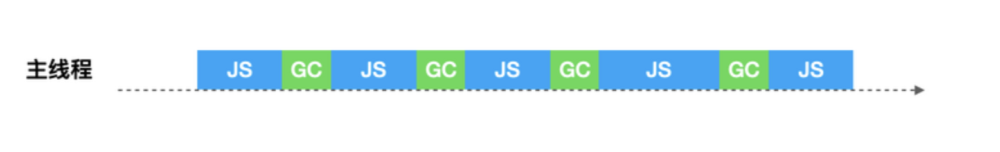

###### 懒性清理 - Lazy sweeping

增量标记只是对活动对象和非活动对象进行标记，惰性清理用来真正的清理释放内存。当增量标记完成后，假如当前的可用内存足以让我们快速的执行代码，其实我们是没必要立即清理内存的，可以将清理的过程延迟一下，让 `JavaScript` 逻辑代码先执行，也无需一次性清理完所有非活动对象内存，垃圾回收器会按需逐一进行清理，直到所有的页都清理完毕。

增量标记与惰性清理的出现，使得主线程的最大停顿时间减少了 `80%`，让用户与浏览器交互过程变得流畅了许多，从实现机制上，由于每个小的增量标价之间执行了 `JavaScript` 代码，堆中的对象指针可能发生了变化，需要使用写屏障技术来记录这些引用关系的变化，所以也暴露出来增量标记的缺点：

1. 并没有减少主线程的总暂停的时间，甚至会略微增加
2. 由于写屏障（Write-barrier）机制的成本，增量标记可能会降低应用程序的吞吐量

###### 并发 - Concurrent

并发式 `GC` 允许在在垃圾回收的同时不需要将主线程挂起，两者可以同时进行，只有在个别时候需要短暂停下来让垃圾回收器做一些特殊的操作。但是这种方式也要面对增量回收的问题，就是在垃圾回收过程中，由于 `JavaScript` 代码在执行，堆中的对象的引用关系随时可能会变化，所以也要进行写屏障操作。


###### 并行 - Parallel

并行式 `GC` 允许主线程和辅助线程同时执行同样的 `GC` 工作，这样可以让辅助线程来分担主线程的 `GC` 工作，使得垃圾回收所耗费的时间等于总时间除以参与的线程数量（加上一些同步开销）。

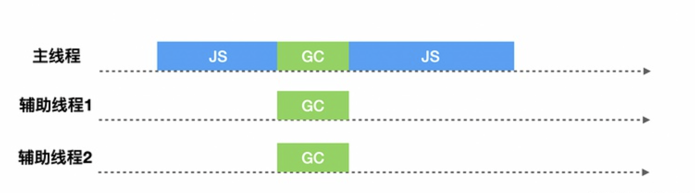

##### V8 当前垃圾回收机制

`2011` 年，`V8` 应用了增量标记机制。直至 `2018` 年，`Chrome64` 和 `Node.js V10` 启动并发标记（Concurrent），同时在并发的基础上添加并行（Parallel）技术，使得垃圾回收时间大幅度缩短。

###### 副垃圾回收器

V8 在新生代垃圾回收中，使用并行（parallel）机制，在整理排序阶段，也就是将活动对象从 `from-to` 复制到 `space-to` 的时候，启用多个辅助线程，并行的进行整理。由于多个线程竞争一个新生代的堆的内存资源，可能出现有某个活动对象被多个线程进行复制操作的问题，为了解决这个问题，`V8` 在第一个线程对活动对象进行复制并且复制完成后，都必须去维护复制这个活动对象后的指针转发地址，以便于其他协助线程可以找到该活动对象后可以判断该活动对象是否已被复制。

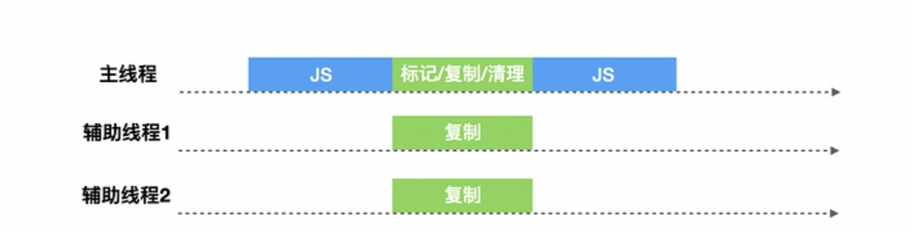

###### 主垃圾回收器

V8 在老生代垃圾回收中，如果堆中的内存大小超过某个阈值之后，会启用并发（Concurrent）标记任务。每个辅助线程都会去追踪每个标记到的对象的指针以及对这个对象的引用，而在 `JavaScript` 代码执行时候，并发标记也在后台的辅助进程中进行，当堆中的某个对象指针被 `JavaScript` 代码修改的时候，写入屏障（write barriers）技术会在辅助线程在进行并发标记的时候进行追踪

当并发标记完成或者动态分配的内存到达极限的时候，主线程会执行最终的快速标记步骤，这个时候主线程会挂起，主线程会再一次的扫描根集以确保所有的对象都完成了标记，由于辅助线程已经标记过活动对象，主线程的本次扫描只是进行 `check` 操作，确认完成之后，某些辅助线程会进行清理内存操作，某些辅助进程会进行内存整理操作，由于都是并发的，并不会影响主线程 `JavaScript` 代码的执行。


来源：[深入理解谷歌最强 V8 垃圾回收机制](https://zhuanlan.zhihu.com/p/259579683)

拓展：[Java 和 JavaScript 为什么都需要 VM，由 VM 的 GC 来操作内存？](https://www.zhihu.com/question/449995754)

<!-- [V8引擎的内存管理](https://mp.weixin.qq.com/s/vvZy6rBb8RyTaiBKo5ryHg) -->

### JS 中的內存泄露

尽管 `JS` 为我们自动处理内存的分配、回收问题，但是在某些特定的场景下，`JS` 的垃圾回收算法并不能帮我们去除已经不再使用的内存。这种【由于疏忽或错误造成程序未能释放已经不再使用的内存】的现象，被称作内存泄露。

可能产生内存泄露的场景有不少，包括**全局变量**，`DOM` 事件，定时器等等。

下面是一段存在内存泄露的示例代码：

```jsx
class Page1 extends React.Component {
  events = []

  componentDidMount() {
    window.addEventListener('scroll', this.handleScroll.bind(this))
  }

  render() {
    return (
      <div>
        <div>
          <Link to={'/page2'}>前往Page2</Link>
        </div>
        <p>page1</p>
        ....
      </div>
    )
  }

  handleScroll(e) {
    this.events.push(e)
  }
}
```

当我们点击按钮跳转到 `Page2` 后，在 `page2` 不停进行滚动操作，我们会发现内存占用不断的上涨：

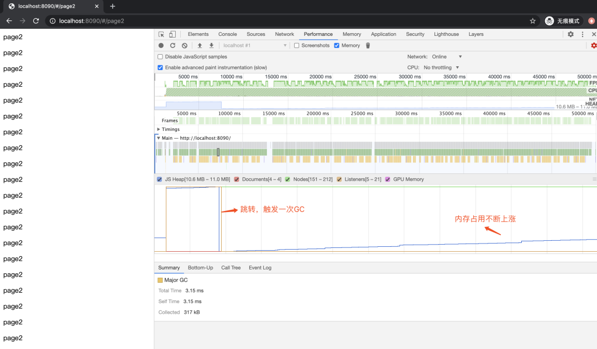

产生这个内存泄露的原因是：我们在 `Page1` 被 `unMount` 的时候，尽管 `Page1` 被销毁了，但是 `Page1` 的滚动回调函数通过 `window.eventListener` 依然可“触达”，所以不会被垃圾回收。

进入 `Page2` 后，滚动事件的逻辑依然生效，内部的变量无法被 `GC`。如果用户在 `Page2` 进行长时间滑动等操作，页面会逐渐变得卡顿。

上述的例子，在我们开发的过程中，并不少见。不仅仅是事件绑定，也有可能是定时上报逻辑等等。如何解决呢？记得在 `unMount` 的时候，进行相应的取消操作即可。

在平时的项目开发中，内存泄露还有很多其他的场景。浏览器页面还好，毕竟一直开着某个页面的用户不算太多，刷新就好。而 `Node.js` 发生内存泄露的后果就比较严重了，可能服务就直接崩溃了。

#### JS 中的弱引用

前面我们讲到了 `JS` 的垃圾回收机制，如果我们持有对一个对象的引用，那么这个对象就不会被垃圾回收。这里的引用，指的是强引用。在计算机程序设计中，还有一个弱引用的概念：一个对象若只被弱引用所引用，则被认为是不可访问（或弱可访问）的，并因此可能在任何时刻被回收。在 `JS` 中，`WeakMap` 和 `WeakSet` 给我们提供了弱引用的能力。

##### WeakMap

`Map` 对象保存键值对，并且能够记住键的原始插入顺序。任何值(对象或者原始值) 都可以作为一个键或一个值。

```js
const m = new Map()
let obj = { a: 1 }
m.set(obj, 'a')
obj = null // 將obj置為null並不會使 { a: 1 } 被垃圾回收，因為還有map引用了 { a: 1 }
```

`WeakMap` 是一组键/值对的集合，其中的键是弱引用的。其键必须是对象，而值可以是任意的。`WeakMap` 是对对象的弱引用

```js
const wm = new WeakMap()
let obj = { b: 2 }
wm.set(obj, '2')
obj = null // 將 obj 置為 null 後，儘管 wm 依然引用了{ b: 2 }，但是由於是弱引用，{ b: 2 } 會在某一時刻被 GC。
```

**正由于这样的弱引用，`WeakMap` 的 `key` 是不可枚举的 (没有方法能给出所有的 `key`)。如果 `key` 是可枚举的话，其列表将会受垃圾回收机制的影响，从而得到不确定的结果。**

`WeakSet` 可以视为 `WeakMap` 中所有值都是布尔值的一个特例，这里就不再赘述了。

> `JavaScript` 的 `WeakMap` 并不是真正意义上的弱引用：实际上，只要键仍然存活，它就强引用其内容。`WeakMap` 仅在键被垃圾回收之后，才弱引用它的内容。这种关系更准确地称为 [ephemeron](https://en.wikipedia.org/wiki/Ephemeron) 。

##### WeakRef

`WeakRef` 是一个更高级的 `API`，它提供了真正的弱引用。我们直接借助上文的内存泄露的例子来看一看 `WeakRef` 的效果：

```jsx
import React from 'react'
import { Link } from 'react-router-dom'

// 使用 WeakRef 將回調函數“包裹”起來，形成對回調函數的弱引用。
function addWeakListener(listener) {
  const weakRef = new WeakRef(listener)
  const wrapper = e => {
    if (weakRef.deref()) {
      return weakRef.deref()(e)
    }
  }
  window.addEventListener('scroll', wrapper)
}

class Page1 extends React.Component {
  events = []

  componentDidMount() {
    addWeakListener(this.handleScroll.bind(this))
  }

  componentWillUnmount() {
    console.log(this.events)
  }

  render() {
    return (
      <div>
        <div>
          <Link to={'/page2'}>前往Page2</Link>
        </div>
        <p>page1</p>
        ....
      </div>
    )
  }

  handleScroll(e) {
    this.events.push(e)
  }
}

export default Page1
```

我们再来看看点击按钮跳转到 `page2` 后的内存表现：

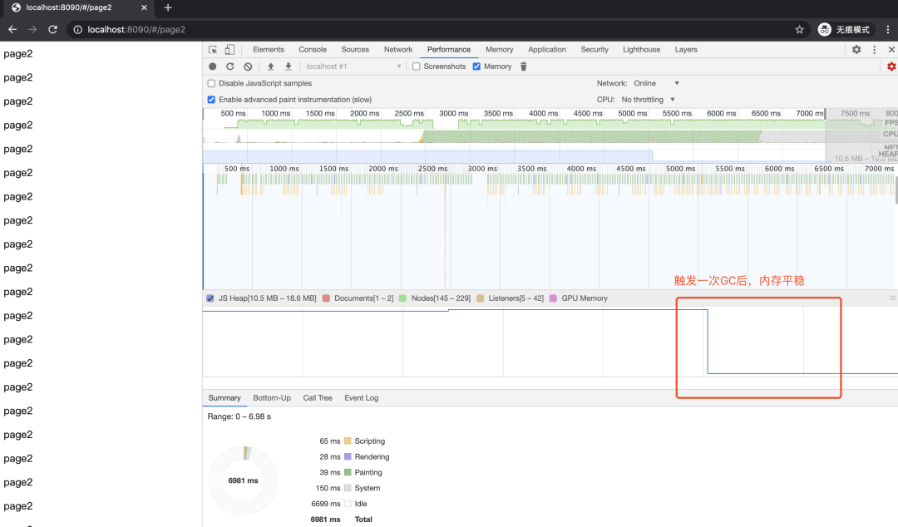

可以很直观的看到，在跳转到 `page2` 后，持续滚动一段时间后，内存平稳。这是因为随着 `page1` 被 `unMount`，真正的滚动回调函数（ `Page1` 的 `handleScroll` 函数）被 `GC` 掉了。其内部的变量也最终被 `GC`。

但其实，这里还有一个问题，虽然我们通过 `weakRef.deref()` 拿不到 `handleScroll` 滚动回调函数了（已被 GC），但是我们的包裹函数 `wrapper` 依然会执行。因为我们没有执行 `removeEventListener`。理想情况是：我们希望滚动监听函数也被取消掉。可以借助 `FinalizationRegistry` 来实现这个功能。看下面的示例代码：

```js
// FinalizationRegistry 構造函數接受一個回調函數作為參數，返回一個示例。我們把實例註冊到某個對象上，當該對象被 GC 時，回調函數會觸發。
const gListenersRegistry = new FinalizationRegistry(({ window, wrapper }) => {
  console.log('GC happen!!')
  window.removeEventListener('scroll', wrapper)
})

function addWeakListener(listener) {
  const weakRef = new WeakRef(listener)
  const wrapper = e => {
    console.log('scroll')
    if (weakRef.deref()) {
      return weakRef.deref()(e)
    }
  }
  // 新增這行代碼，當 listener 被 GC 時，會觸發回調函數。回調函數傳參由我們自己控制。
  gListenersRegistry.register(listener, { window, wrapper })
  window.addEventListener('scroll', wrapper)
}
```

> `WeakRef` 和 `FinalizationRegistry` 属于高级 `Api`，在 `Chrome v84` 和 `Node.js 13.0.0` 后开始支持。一般情况下不建议使用。因为容易用错，导致更多的问题。

#### 关于 JS 闭包是否真的会造成内存泄漏？

内存泄露是指你「用不到」（访问不到）的变量，依然占居着内存空间，不能被再次利用起来。闭包里面的变量就是我们需要的变量，不能说是内存泄露。

跟闭包和内存泄露有关系的地方是，使用闭包的同时比较容易形成循环引用，如果闭包的作用域链中保存着一些 `DOM` 节点，这时候就有可能造成内存泄露。但这本身并非闭包的问题，也并非 `JavaScript` 的问题。

在 `IE` 浏览器中，由于 `BOM` 和 `DOM` 中的对象是使用 `C++` 以 `COM` 对象的方式实现的，而 `COM` 对象的垃圾收集机制采用的是引用计数策略。在基于引用计数策略的垃圾回收机制中，如果两个对象之间形成了循环引用，那么这两个对象都无法被回收，但循环引用造成的内存泄露在本质上也不是闭包造成的。

老浏览器（主要是 `IE6`）由于垃圾回收有问题导致很容易出现内存泄漏。**但是那是浏览器实现的 `bug`**

**循环引用对现代浏览器也不是问题了**

### `Babel` 的编译过程？

### `JavaScript` 中的数组在内存中是如何存储的？

#### 什么是数组

> 数据结构中定义的数组是定长的、数据类型一致的存储结构。

看完数据结构中的定义，再来看下具体语言中对数组的实现：`C、C++、Java、Scala` 等语言中数组的实现，是通过在内存中划分一串连续的、固定长度的空间，来实现存放一组有限个相同数据类型的数据结构。这里面也涉及到了几个重要的概念：**连续**、**固定长度**、**相同数据类型**，与数据结构中的定义是类似的。

1. **连续**

   连续空间存储是数组的特点。各元素在内存中是相邻的，是一种线性的存储结构。

2. **固定长度**

   因为数组的空间是连续的，这就意味着在内存中会有一整块空间来存放数组，如果不是固定长度，那么内存中位于数组之后的区域会没办法分配，内存不知道数组还要不要继续存放，要使用多长的空间。长度固定，就界定了数组使用内存的界限，数组之外的空间可以分配给别人使用。

3. **相同数据类型**

   因为数组的长度是固定的，如果不是相同数据类型，一会存一个 `int` ，一会存一个 `String` ，两种不同长度的数据类型，不能保证各自存放几个，这样有悖固定长度的规定，所以也要是相同的数据类型。

那我们再来看 `JavaScript` 中的数组。

#### JavaScript 中的数组

> `JS` 的数组不是基础的数据结构（数组）实现的，而是在基础上面做了一些封装。

- `JS` 数组中不止可以存放上面的三种数据类型，它可以存放数组、对象、函数、`Number`、`Undefined`、`Null`、`String`、`Boolean` 等等。

- `JS` 的数组可以表现的像栈一样，为数组提供了 `push()`和 `pop()`方法。也可以表现的像队列一样，使用 `shift()`和 `push()`方法，可以像使用队列一样使用数组。

#### 从 V8 源码上看数组的实现

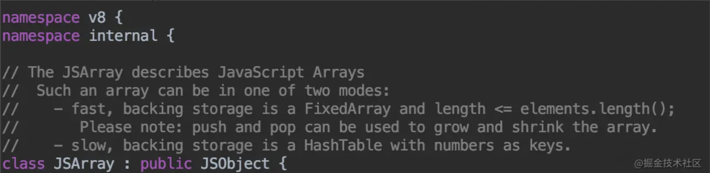

从注释上可以看出，`JS` 数组有两种表现形式，`fast` 和 `slow`

- **fast** ：

快速的后备存储结构是 `FixedArray` ，并且 `数组长度 <= elements.length()`

> `FixedArray` 是 `V8` 实现的一个类似于数组的类，它表示一段固定长度的连续的内存。

- **slow** ：

缓慢的后备存储结构是一个以数字为键的 `HashTable` 。

> `HashTable`，维基百科中解释的很好：

> 散列表（Hash table，也叫哈希表），是根据键（Key）而直接访问在内存存储位置的数据结构。也就是说，它通过计算一个关于键值的函数，将所需查询的数据映射到表中一个位置来访问记录，这加快了查找速度。这个映射函数称做散列函数，存放记录的数组称做散列表。

##### 快数组（Fast Elements）

> TIPS: JS 数组中的数据类型不一样的话，不一定不是快数组

快数组是一种线性的存储方式。

**新创建的空数组，默认的存储方式是快数组，快数组长度是可变的**，可以根据元素的增加和删除来动态调整存储空间大小，内部是通过扩容和收缩机制实现，那来看下源码中是怎么扩容和收缩的。

1. 扩容

```js
new_capacity = old_capacity / 2 + old_capacity + 16
```

也就是，扩容后的新容量 = 旧容量的 `1.5` 倍 + `16`

扩容后会将数组拷贝到新的内存空间中

2. 收缩

收缩数组的判断是：如果`容量 >= length 的 2 倍 + 16`，则进行收缩容量调整，否则用 `holes` 对象（什么事 `holes` 对象？下面来解释）填充未被初始化的位置。

```c
int elements_to_trim = length + 1 == old_length ? (capacity -length) / 2 : capacity -length
```

这个 `elements_to_trim` 就是需要收缩的大小，需要根据 `length + 1` 和 `old_length` 进行判断，是将空出的空间全部收缩掉还是只收缩二分之一

3. `holes`（空洞）对象

`holes`（空洞）对象指的是数组中分配了空间，但是没有存放元素的位置。

对于 `holes`，快数组中有个专门的模式，在 `Fast Elements` 模式中有一个扩展，是 `Fast Holey Elements` 模式。
`Fast Holey Elements` 模式适合于数组中的 `holes`（空洞）情况，即只有某些索引存有数据，而其他的索引都没有赋值的情况。

那什么时候会是 `Fast Holey Elements` 模式呢？

当数组中有空洞，没有赋值的数组索引将会存储一个特殊的值，这样在访问这些位置时就可以得到 `undefined`。这种情况下就会是 `Fast Holey Elements` 模式。
`Fast Holey Elements` 模式与 `Fast Elements` 模式一样，会动态分配连续的存储空间，分配空间的大小由最大的索引值决定。

**新建数组时，如果没有设置容量**，`V8` 会默认使用 `Fast Elements` 模式实现。比如 `let a = new Array(1,2,3);`，这种就不存在空洞，就是以 `Fast Elements` 模式实现

如果要对数组设置容量，但并没有进行内部元素的初始化，例如 `let a = new Array(10);`，这样的话数组内部就存在了空洞，就会以 `Fast Holey Elements` 模式实现。

##### 慢数组（Dictionary Elements）

慢数组是一种哈希表的内存形式。不用开辟大块连续的存储空间，节省了内存，但是由于需要维护这样一个 `HashTable`，其效率会比快数组低。

那既然有快数组和慢数组，总不能存储结构一成不变吧，也该有具体情况下的快慢数组转换，下面来看一下什么情况下会发生转换

##### 快数组慢数组之间的转换

**快 -> 慢**

- `新容量 >= 3 * 扩容后的容量 * 2` ，会转变为慢数组。

- 当加入的 `index- 当前 capacity >= kMaxGap（1024` 时（也就是至少有了 `1024` 个空洞），会转变为慢数组。

也就是说，当对数组赋值时使用远超`当前数组的容量+ 1024` 时（这样出现了大于等于 `1024` 个空洞，这时候要对数组分配大量空间则将可能造成存储空间的浪费，为了空间的优化，会转化为慢数组。

```js
let a = [1, 2]
a[1030] = 1
```

数组中只有三个元素，但是却在 `1030` 的位置存放了一个值，那么中间会有多于 `1024` 个空洞，这时就会变为慢数组

**慢 -> 快**

处于哈希表实现的数组，在每次空间增长时， `V8` 的启发式算法会检查其空间占用量， 若其空洞元素减少到一定程度，则会将其转化为快数组模式。

当慢数组的元素可存放在快数组中且长度在 `smi` 之间且仅节省了 `50%` 的空间,则会转变为快数组

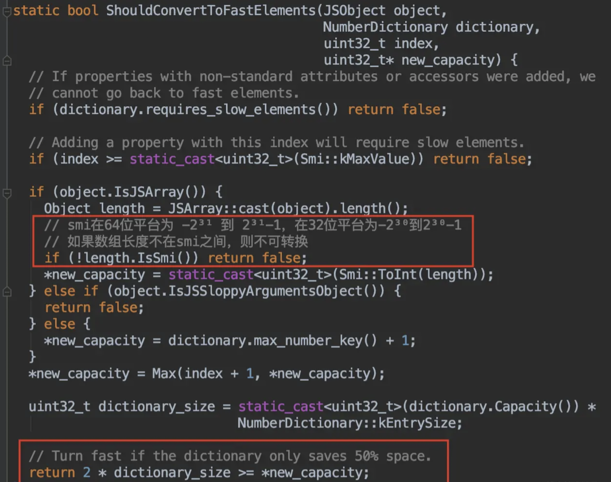

```js
let a = [1, 2]
a[1030] = 1
for (let i = 200; i < 1030; i++) {
  a[i] = i
}
```

在 `1030` 的位置上面添加一个值，会造成多于 `1024` 个空洞，数组会使用为 `Dictionary` 模式来实现。

那么我们现在往这个数组中再添加几个值来填补空洞，往 `200-1029` 这些位置上赋值，使慢数组不再比快数组节省 `50%` 的空间，数组变成了快数组的 `Fast Holey Elements` 模式。

##### 各有优劣

快数组就是以空间换时间的方式，申请了大块连续内存，提高效率。 慢数组以时间换空间，不必申请连续的空间，节省了内存，但需要付出效率变差的代价。

#### 扩展：ArrayBuffer

`JS` 在 `ES6` 也推出了可以按照需要分配连续内存的数组，这就是 `ArrayBuffer`。

`ArrayBuffer` 会从内存中申请设定的二进制大小的空间，但是并不能直接操作它，需要通过 `ArrayBuffer` 构建一个视图，通过视图来操作这个内存。

```js
var bf = new ArrayBuffer(1024)
```

这行代码就申请了 `1kb` 的内存区域。但是并不能对 `arrayBuffer` 直接操作，需要将它赋给一个视图来操作内存。

```js
var b = new Int32Array(bf)
```

这行代码创建了有符号的 `32` 位的整数数组，每个数占 `4` 字节，长度也就是 `1024 / 4 = 256` 个。

来源：[探究 JS V8 引擎下的“数组”底层实现](https://juejin.cn/post/6844903943638794248)

###

### 浏览器和 `Node` 中的事件循环机制有什么区别？

#### 浏览器

#### Node

### `ES6 Modules` 相对于 `CommonJS` 的优势是什么？

### 什么是沙箱？浏览器的沙箱有什么作用？

### 发布 / 订阅模式和观察者模式的区别是什么？

### 装饰器模式一般会在什么场合使用？

### 什么是函数式编程？什么是响应式编程？什么是函数响应式编程？

## 语法

## 框架

## 工程

## 网络

## 性能

## 插件

## 系统

## 后端

<!-- https://www.bilibili.com/video/BV18M4y1u78g?p=1s -->
